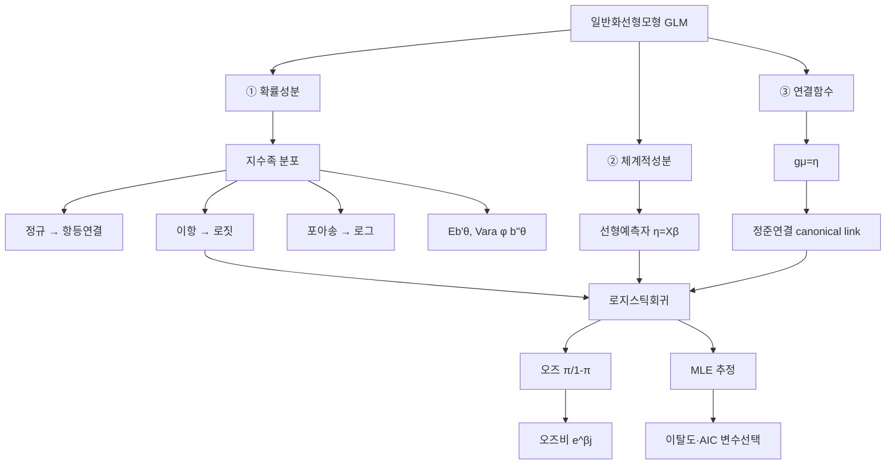

# 11. 회귀모형: 일반화선형모형Ⅰ(1)

## 🔗 선수 지식 (Prerequisites)
- [ ] **필수**: [3강. 중회귀모형(1)](3강.md) — 선형예측자 $\mathbf{X}\boldsymbol\beta$, 최소제곱 적합, 정규선형모형의 가정(정규성·등분산) 이해 완료?
- [ ] **필수**: 정규분포·이항분포·포아송분포의 기댓값과 분산
- [ ] **권장**: 최대가능도추정(MLE)과 가능도함수 `→← AI를위한수학의응용`
- [ ] **권장**: [9강. 변수선택·공선성](9강.md) — AIC를 이용한 모형선택
- **관련 단원**: [3강. 중회귀모형(1)](3강.md) `→` [11강. 일반화선형모형Ⅰ(1)] `→` [12강. 일반화선형모형Ⅰ(2)](12강.md)

---

## 학습 목표
1. 일반화선형모형의 구성성분(확률성분·체계적성분·연결함수)을 이해한다.
2. 지수족(exponential family) 분포의 형태와 평균·분산 구조를 이해한다.
3. 로지스틱회귀모형을 일반화선형모형의 세 가지 구성성분으로 제시할 수 있다.
4. 변수선택을 통하여 주어진 자료에 적합한 로지스틱회귀모형을 선택한다.
5. R의 `glm()` 함수를 이용하여 로지스틱회귀모형을 적합·해석할 수 있다.

---

## 🧠 메타인지 체크 (학습 전/후 자기 평가)

### 학습 전 자기 평가
| 소주제 | 자신감 (1-5) |
| :--- | :--- |
| GLM의 세 구성성분 (확률·체계적·연결함수) | |
| 지수족 분포의 표준형과 평균·분산 | |
| 로지스틱회귀와 로짓·오즈비 해석 | |
| 이탈도(deviance)·AIC를 이용한 변수선택 | |

### 학습 후 교정 (학습 완료 후 작성)
| 소주제 | 학습 전 | 학습 후 | 실제 정답률 | 과신/과소 여부 |
| :--- | :--- | :--- | :--- | :--- |
| GLM 구성성분 | | | | |
| 지수족 분포 | | | | |
| 로지스틱회귀·오즈비 | | | | |
| 이탈도·변수선택 | | | | |

> **활용법**: 학습 전 1분 → 자신감 기입, 학습 후 1분 → 나머지 기입. "과신" 영역이 실제 취약점.

---

## 📝 요약 (Summary)
1. 🔴 **일반화선형모형(GLM)**: 반응변수가 정규분포가 아닌 경우(이항·개수·비대칭 연속형 등)에도 적용할 수 있도록 선형모형을 확장한 모형으로, **확률성분 + 체계적성분 + 연결함수** 세 요소로 정의된다.
2. 🔴 **세 구성성분**: ① **확률성분**(반응변수 $Y_i$ 가 따르는 지수족 분포), ② **체계적성분**(선형예측자 $\eta_i=\mathbf{x}_i^\top\boldsymbol\beta$), ③ **연결함수**($g(\mu_i)=\eta_i$ 로 평균과 선형예측자를 연결).
3. 🔴 **지수족(exponential family)**: 분포를 $f(y;\theta,\phi)=\exp\!\big\{\frac{y\theta-b(\theta)}{a(\phi)}+c(y,\phi)\big\}$ 표준형으로 쓸 수 있는 분포족. 정규·이항·포아송·감마가 모두 포함되며, $E(Y)=b'(\theta)$, $\text{Var}(Y)=a(\phi)b''(\theta)$.
4. 🔴 **로지스틱회귀모형**: 반응변수가 이분형($Y\sim\text{Bernoulli}(\pi)$)일 때의 GLM. 연결함수로 **로짓(logit)** $g(\pi)=\log\frac{\pi}{1-\pi}$ 를 사용하여 $\log\frac{\pi_i}{1-\pi_i}=\mathbf{x}_i^\top\boldsymbol\beta$.
5. 🟡 **오즈와 오즈비**: 오즈 $\frac{\pi}{1-\pi}$ 는 성공/실패의 비. 설명변수 1단위 증가 시 오즈가 $e^{\beta_j}$ 배가 되며, 이 $e^{\beta_j}$ 가 **오즈비(odds ratio)**로 계수 해석의 핵심이다.
6. 🟡 **추정과 변수선택**: 회귀계수는 **최대가능도추정(MLE)**으로 구하며, 모형 비교는 **이탈도(deviance)**·**가능도비 검정**·**AIC**로 수행한다.

---

## 📐 핵심 수식 (Key Formulas)

| 수식명 | 수식 | 의미 |
| :--- | :--- | :--- |
| **선형예측자** | $\eta_i=\beta_0+\beta_1 x_{i1}+\cdots+\beta_k x_{ik}=\mathbf{x}_i^\top\boldsymbol\beta$ | 체계적성분(설명변수의 선형결합) |
| **연결함수** | $g(\mu_i)=\eta_i,\quad \mu_i=g^{-1}(\eta_i)$ | 평균 $\mu_i=E(Y_i)$ 와 $\eta_i$ 연결 |
| **지수족 표준형** | $f(y;\theta,\phi)=\exp\!\Big\{\dfrac{y\theta-b(\theta)}{a(\phi)}+c(y,\phi)\Big\}$ | 자연모수 $\theta$, 산포모수 $\phi$ |
| **지수족 평균** | $E(Y)=b'(\theta)=\mu$ | $b(\theta)$ 의 1계 도함수 |
| **지수족 분산** | $\text{Var}(Y)=a(\phi)\,b''(\theta)$ | 분산함수 $V(\mu)=b''(\theta)$ |
| **로짓 연결함수** | $g(\pi)=\log\dfrac{\pi}{1-\pi}=\eta$ | 이분형 반응의 표준(정규) 연결함수 |
| **로지스틱(역함수)** | $\pi=\dfrac{e^{\eta}}{1+e^{\eta}}=\dfrac{1}{1+e^{-\eta}}$ | $\eta$ 를 확률 $(0,1)$ 로 사상 |
| **오즈(odds)** | $\dfrac{\pi}{1-\pi}=e^{\eta}=e^{\mathbf{x}^\top\boldsymbol\beta}$ | 성공/실패 비 |
| **오즈비(odds ratio)** | $\text{OR}_j=e^{\beta_j}$ | $x_j$ 1단위 증가 시 오즈의 배수 |
| **이탈도(deviance)** | $D=-2\big[\ell(\hat{\boldsymbol\beta})-\ell_{\text{sat}}\big]$ | 적합모형 vs 포화모형 로그가능도 차 $\times(-2)$ |
| **가능도비 검정** | $G^2=D_{\text{축소}}-D_{\text{전체}}\sim\chi^2_{(q)}$ | 중첩모형 비교(추가된 모수 수 $q$) |
| **AIC** | $\text{AIC}=-2\ell(\hat{\boldsymbol\beta})+2p$ | 적합도와 모형복잡도의 균형 |

### 주요 정리/정의

**일반화선형모형의 세 구성성분**
$$
\underbrace{Y_i\ \sim\ \text{지수족 분포}}_{\text{① 확률성분}},\qquad
\underbrace{\eta_i=\mathbf{x}_i^\top\boldsymbol\beta}_{\text{② 체계적성분}},\qquad
\underbrace{g(\mu_i)=\eta_i}_{\text{③ 연결함수}}
$$
> **직관적 해석**: 정규선형모형은 "① $Y\sim N(\mu,\sigma^2)$, ② $\eta=\mathbf{x}^\top\boldsymbol\beta$, ③ $g(\mu)=\mu$(항등연결)"인 GLM의 특수한 경우다. GLM은 ①의 분포와 ③의 연결함수만 바꾸면 이항·개수·양의 연속형 반응으로 자유롭게 확장된다. 핵심은 **선형구조($\eta=\mathbf{x}^\top\boldsymbol\beta$)는 그대로 두되, 평균을 적절히 변환($g$)하여 선형예측자에 연결**한다는 점이다.
> **AI 적용**: 로지스틱회귀는 이진 분류기의 출발점이며, GLM의 로짓 연결은 신경망 출력층의 **시그모이드(sigmoid)** 활성화와 정확히 동일하다. 소프트맥스는 다항 로짓의 일반화다.

**지수족의 평균·분산 (정리)**
$$
E(Y)=b'(\theta)=\mu,\qquad \text{Var}(Y)=a(\phi)\,b''(\theta)
$$
> **직관적 해석**: 누율생성함수 역할을 하는 $b(\theta)$ 한 함수로 평균($b'$)과 분산($b''$)이 모두 결정된다. 특히 분산이 평균의 함수 $V(\mu)=b''(\theta)$ 로 묶이므로, 정규분포(분산이 평균과 무관)와 달리 이항·포아송에서는 분산이 평균에 따라 자동으로 변한다.
> **AI 적용**: 분산함수 $V(\mu)$ 는 GLM 추정의 가중치를 결정하며, 이는 가중최소제곱(IRLS) 알고리즘의 반복 가중치로 직접 들어간다.

**로지스틱회귀모형의 GLM 표현**
$$
\text{① } Y_i\sim\text{Bernoulli}(\pi_i),\quad
\text{② } \eta_i=\mathbf{x}_i^\top\boldsymbol\beta,\quad
\text{③ } g(\pi_i)=\log\frac{\pi_i}{1-\pi_i}=\eta_i
$$
> **직관적 해석**: 확률 $\pi\in(0,1)$ 을 그대로 선형모형의 좌변에 두면 적합값이 $[0,1]$ 을 벗어날 수 있다. 로짓변환 $\log\frac{\pi}{1-\pi}$ 은 $(0,1)$ 을 $(-\infty,\infty)$ 로 펴주어 선형예측자와 무리 없이 연결한다.
> **AI 적용**: 베르누이 분포의 자연모수 $\theta=\log\frac{\pi}{1-\pi}$ 자체가 로짓이므로, 로짓은 베르누이의 **정준연결(canonical link)**이다. 이 때문에 로지스틱회귀의 추정이 수치적으로 안정적이다.

---

## 📊 개념 시각화 (Visual Guide)

### 개념 관계도


### 핵심 도식 (분포 ↔ 연결함수 대응)
| 반응변수 유형 | 확률성분(분포) | 정준연결함수 $g(\mu)$ | 적용 예시 / AI |
| :--- | :--- | :--- | :--- |
| 연속형(대칭) | 정규 $N(\mu,\sigma^2)$ | 항등 $\mu$ | 일반 선형회귀 / 선형 출력층 |
| 이분형 | 베르누이/이항 | 로짓 $\log\frac{\mu}{1-\mu}$ | 성공·실패, 합격·불합격 / 이진 분류 |
| 개수형 | 포아송 | 로그 $\log\mu$ | 사고건수, 빈도 / 카운트 예측 |
| 양의 연속형(비대칭) | 감마 | 역수 $1/\mu$ (또는 로그) | 보험 청구액, 수명 / 회귀 |

---

## ✏️ 심화 학습 (Study Subject)

### 1. 가상 시나리오: "어떤 개념을, 언제 사용해야 할까?"
- **상황**: 어떤 치료법의 성공 여부($Y=1$ 성공, $Y=0$ 실패)를 환자의 나이($x_1$)와 투여용량($x_2$)으로 예측하려 한다. 선형회귀 $\pi=\beta_0+\beta_1 x_1+\beta_2 x_2$ 를 적합했더니 예측 확률이 $1.3$ 이나 $-0.2$ 같은 값이 나온다.
- **문제**: 확률은 반드시 $[0,1]$ 에 있어야 하는데, 선형모형은 이를 보장하지 못한다. 어떻게 모형을 세워야 적합값이 항상 유효 확률이 되고, 계수도 해석 가능할까?
- **해결**: 반응변수를 베르누이로 두고(① 확률성분), 선형예측자 $\eta=\beta_0+\beta_1 x_1+\beta_2 x_2$(② 체계적성분)에 로짓 연결함수(③)를 적용한다.
$$
\log\frac{\pi}{1-\pi}=\eta\ \Longrightarrow\ \pi=\frac{1}{1+e^{-\eta}}\in(0,1)
$$
역함수가 시그모이드라 적합값이 자동으로 $(0,1)$ 에 갇힌다. 계수는 오즈비로 해석한다: 나이가 1세 증가하면 성공 오즈가 $e^{\beta_1}$ 배가 된다. 만약 $\hat\beta_1=0.7$ 이면 $e^{0.7}\approx2.0$ 이므로 나이 1세당 성공 오즈 2배.
- **AI 학습 포인트**: "로짓 연결함수의 역함수가 시그모이드와 같다는 사실이, 로지스틱회귀와 단층 신경망(퍼셉트론+시그모이드)이 본질적으로 같은 모형임을 어떻게 설명하는지 알려줘. 또 다중 클래스로 확장하면 왜 소프트맥스가 되는지 연결해서 설명해줘."

### 2. 관점별 비교 및 오개념 분석
- **핵심 비교**:
  - **선형확률모형 vs 로지스틱회귀**: 전자는 $\pi=\mathbf{x}^\top\boldsymbol\beta$(항등연결)로 적합값이 $[0,1]$ 을 벗어날 수 있고 오차의 등분산 가정도 깨진다. 후자는 로짓연결로 항상 유효 확률을 보장.
  - **확률(probability) vs 오즈(odds) vs 로짓(logit)**: $\pi\in(0,1)$ → 오즈 $\frac{\pi}{1-\pi}\in(0,\infty)$ → 로짓 $\log\frac{\pi}{1-\pi}\in(-\infty,\infty)$. 뒤로 갈수록 정의역이 넓어져 선형모형에 적합.
  - **회귀계수 $\beta_j$ vs 오즈비 $e^{\beta_j}$**: $\beta_j$ 는 로짓(로그오즈)의 변화량, $e^{\beta_j}$ 는 오즈의 배수. $\beta_j>0\Leftrightarrow\text{OR}>1$(성공 확률 증가).
- **오개념 분석**:
    - **오개념 1**: "로지스틱회귀의 계수 $\beta_j$ 는 $x_j$ 1단위 증가 시 성공 **확률**의 증가량이다."
    - **분석**: 틀렸다. $\beta_j$ 는 **로그오즈(로짓)**의 변화량이다. 확률의 변화는 비선형이라 $x$ 의 현재 수준에 따라 다르다. 일정한 것은 오즈비 $e^{\beta_j}$ 이지 확률 차가 아니다.
    - **오개념 2**: "GLM은 반응변수를 변환($g(Y)$)한 뒤 선형회귀를 하는 것이다."
    - **분석**: 아니다. GLM은 반응변수 $Y$ 자체가 아니라 그 **평균** $\mu=E(Y)$ 를 변환한다($g(\mu)=\eta$). $g(Y)$ 를 변환하는 것(예: $\log Y$ 회귀)과는 오차구조·분산 처리가 전혀 다르다.
    - **오개념 3**: "로지스틱회귀 계수는 최소제곱법으로 구한다."
    - **분석**: 아니다. 정규분포 가정이 없으므로 최소제곱이 아니라 **최대가능도추정(MLE)**으로 구하며, 수치적으로는 반복재가중최소제곱(IRLS)을 사용한다.
- **AI 학습 포인트**: "GLM에서 '평균 $\mu$ 를 변환'하는 것과 '반응변수 $Y$ 를 직접 변환($\log Y$)'하는 것의 차이를, 분산구조와 Jensen 부등식 관점에서 설명해줘. 왜 GLM 방식이 더 일관된 추론을 주는지도 알려줘."

---

## ❓ 연습 문제 및 해설

> **블룸 인지 수준 범례**: [기억] 정의·나열 → [이해] 설명·비교 → [적용] 계산·구현 → [분석] 구별·디버그 → [평가] 판단·비평 → [창조] 설계·제안

### 📝 문제

**1. ⭐ [기억] 📌 일반화선형모형(GLM)의 세 가지 구성성분으로 옳게 짝지어진 것은?(#prob-1)**
   > ① 확률성분 · 체계적성분 · 연결함수
   > ② 평균 · 분산 · 공분산
   > ③ 절편 · 기울기 · 오차
   > ④ 정규성 · 등분산성 · 독립성

<br>

**2. ⭐ [기억] 📌 반응변수가 이분형(성공/실패)일 때 일반적으로 사용하는 GLM은?(#prob-2)**
   > ① 포아송회귀
   > ② 로지스틱회귀
   > ③ 감마회귀
   > ④ 정규선형회귀

<br>

**3. ⭐⭐ [이해] 📌 로지스틱회귀에서 사용하는 로짓(logit) 연결함수로 옳은 것은?(#prob-3)**
   > ① $g(\pi)=\pi$
   > ② $g(\pi)=\log\pi$
   > ③ $g(\pi)=\log\dfrac{\pi}{1-\pi}$
   > ④ $g(\pi)=\dfrac{1}{\pi}$

<br>

**4. ⭐⭐ [이해] 📌 일반화선형모형에 대한 설명으로 옳은 것을 모두 고르면?(#prob-4)**
   > <보기>
   >
   > 가. 정규선형모형은 항등연결을 쓰는 GLM의 특수한 경우이다.
   > 나. 연결함수는 반응변수의 평균 $\mu$ 와 선형예측자 $\eta$ 를 연결한다.
   > 다. GLM의 회귀계수는 일반적으로 최대가능도법으로 추정한다.

   > ① 가, 나
   > ② 나, 다
   > ③ 가, 다
   > ④ 가, 나, 다

<br>

**5. ⭐⭐ [이해] 📌 지수족 표준형 $f(y;\theta,\phi)=\exp\{\frac{y\theta-b(\theta)}{a(\phi)}+c(y,\phi)\}$ 에서 반응변수의 평균 $E(Y)$ 로 옳은 것은?(#prob-5)**
   > ① $a(\phi)$
   > ② $b(\theta)$
   > ③ $b'(\theta)$
   > ④ $b''(\theta)$

<br>

**6. ⭐⭐ [적용] 📌 로지스틱회귀에서 $\hat\beta_1=\log 3$ 으로 추정되었다. 설명변수 $x_1$ 이 1단위 증가할 때 성공 오즈(odds)의 변화로 옳은 것은?(#prob-6)**
   > ① 3만큼 증가
   > ② 3배가 됨
   > ③ $\log 3$ 배가 됨
   > ④ 변화 없음

<br>

**7. ⭐⭐ [적용] 📌 로지스틱회귀의 선형예측자가 $\eta=0$ 일 때 성공확률 $\pi=\dfrac{1}{1+e^{-\eta}}$ 의 값은?(#prob-7)**
   > ① $0$
   > ② $0.25$
   > ③ $0.5$
   > ④ $1$

<br>

**8. ⭐⭐⭐ [적용] 📌 두 중첩(nested) 로지스틱모형을 비교한다. 축소모형의 이탈도 $D_R=120.4$, 전체모형의 이탈도 $D_F=110.0$ 이고 추가된 모수는 2개다. 가능도비 통계량 $G^2$ 과 그 분포로 옳은 것은?(#prob-8)**
   > ① $G^2=10.4,\ \chi^2_{(2)}$
   > ② $G^2=10.4,\ \chi^2_{(1)}$
   > ③ $G^2=230.4,\ \chi^2_{(2)}$
   > ④ $G^2=10.4,\ F_{(2,\,n-3)}$

<br>

**9. ⭐⭐⭐ [분석] 📌 어떤 분석가가 이분형 반응 $Y$ 에 정규선형모형 $\pi=\beta_0+\beta_1 x$ 를 적합했더니 일부 적합값이 $1$ 을 초과했다. 이에 대한 설명으로 가장 적절한 것은?(#prob-9)**
   > ① 표본이 작아서 생긴 우연이며 모형은 타당하다.
   > ② 항등연결로는 적합값이 $[0,1]$ 을 벗어날 수 있으므로 로짓연결(로지스틱회귀)을 써야 한다.
   > ③ $\beta_1$ 을 음수로 바꾸면 해결된다.
   > ④ $R^2$ 만 높으면 적합값 범위는 문제되지 않는다.

<br>

**10. ⭐⭐⭐ [평가/창조] 📌 로지스틱회귀모형을 일반화선형모형의 세 구성성분으로 제시하고, 로짓이 베르누이 분포의 정준연결(canonical link)임을 지수족 표준형으로부터 보이시오.(#prob-10)**

---

### 🔑 정답 및 해설 (먼저 풀어본 후 펼치기)

<details>
<summary>정답 보기 (클릭)</summary>

1. ①
2. ②
3. ③
4. ④
5. ③
6. ②
7. ③
8. ①
9. ②
10. 풀이형 정답 (해설 참조)

</details>

<details>
<summary>해설 보기 (클릭)</summary>

<a id="prob-1"></a>
**1. ⭐ [기억] GLM의 세 구성성분**
> **정답: ① 확률성분 · 체계적성분 · 연결함수**
> **해설**: GLM은 반응변수의 분포(확률성분), 설명변수의 선형결합 $\eta=\mathbf{x}^\top\boldsymbol\beta$(체계적성분), 평균과 선형예측자를 잇는 연결함수 $g(\mu)=\eta$ 세 요소로 정의된다. ④는 정규선형모형의 오차 가정으로 GLM의 구성성분이 아니다.

<a id="prob-2"></a>
**2. ⭐ [기억] 이분형 반응의 GLM**
> **정답: ② 로지스틱회귀**
> **해설**: 성공/실패 같은 이분형 반응은 베르누이/이항분포(확률성분)에 로짓 연결을 결합한 로지스틱회귀가 표준이다. 포아송은 개수형, 감마는 양의 비대칭 연속형에 쓴다.

<a id="prob-3"></a>
**3. ⭐⭐ [이해] 로짓 연결함수**
> **정답: ③ $g(\pi)=\log\dfrac{\pi}{1-\pi}$**
> **해설**: 로짓은 오즈 $\frac{\pi}{1-\pi}$ 에 로그를 취한 값으로 $(0,1)$ 을 $(-\infty,\infty)$ 로 사상한다. ②는 포아송의 로그연결, ④는 감마의 역수연결.

<a id="prob-4"></a>
**4. ⭐⭐ [이해] GLM의 성질**
> **정답: ④ 가, 나, 다**
> **해설**: 정규선형모형은 정규분포+항등연결인 GLM의 특수례(가), 연결함수는 $g(\mu)=\eta$ 로 평균과 선형예측자를 연결(나), 정규성이 없으므로 MLE로 추정(다). 모두 옳다.

<a id="prob-5"></a>
**5. ⭐⭐ [이해] 지수족의 평균**
> **정답: ③ $b'(\theta)$**
> **해설**: 지수족에서 $E(Y)=b'(\theta)=\mu$, $\text{Var}(Y)=a(\phi)b''(\theta)$. $b(\theta)$ 의 1계 도함수가 평균, 2계 도함수가 분산함수다.

<a id="prob-6"></a>
**6. ⭐⭐ [적용] 오즈비 해석**
> **정답: ② 3배가 됨**
> **해설**: $x_1$ 이 1 증가하면 오즈는 $e^{\beta_1}$ 배가 된다. $\hat\beta_1=\log 3$ 이므로 $e^{\log 3}=3$, 즉 오즈가 3배. "$\log 3$ 만큼 증가"하는 것은 오즈가 아니라 **로그오즈(로짓)**이다(③ 함정).

<a id="prob-7"></a>
**7. ⭐⭐ [적용] 시그모이드 값**
> **정답: ③ $0.5$**
> **해설**: $\pi=\dfrac{1}{1+e^{-0}}=\dfrac{1}{1+1}=0.5$. 선형예측자가 0이면 오즈가 $e^0=1$ 이라 성공·실패가 동등(확률 0.5)이다.

<a id="prob-8"></a>
**8. ⭐⭐⭐ [적용] 가능도비 검정**
> **정답: ① $G^2=10.4,\ \chi^2_{(2)}$**
> **해설**: 가능도비(이탈도 차) 통계량은 $G^2=D_R-D_F=120.4-110.0=10.4$. 자유도는 두 모형의 모수 차(추가된 모수 수)인 2이므로 $\chi^2_{(2)}$ 을 따른다. $\chi^2_{0.05,2}=5.99<10.4$ 이므로 추가 변수는 유의하다.

<a id="prob-9"></a>
**9. ⭐⭐⭐ [분석] 적합값 범위 위반**
> **정답: ② 항등연결로는 $[0,1]$ 을 벗어날 수 있으므로 로짓연결을 써야 한다**
> **해설**: 확률을 선형예측자에 직접 두면(선형확률모형) 적합값이 $[0,1]$ 을 벗어나고 오차의 등분산도 깨진다. 로짓 연결의 역함수가 시그모이드라 적합값이 항상 $(0,1)$ 에 갇히는 로지스틱회귀가 올바른 해결책이다. 표본 크기(①)나 부호(③), $R^2$(④)의 문제가 아니다.

<a id="prob-10"></a>
**10. ⭐⭐⭐ [평가/창조] 로지스틱회귀의 GLM 표현과 정준연결 증명**
> **정답·해설**:
> 1) **세 구성성분**:
>    - ① 확률성분: $Y_i\sim\text{Bernoulli}(\pi_i)$, 즉 $P(Y_i=y)=\pi_i^{y}(1-\pi_i)^{1-y}$.
>    - ② 체계적성분: $\eta_i=\mathbf{x}_i^\top\boldsymbol\beta$.
>    - ③ 연결함수: $g(\pi_i)=\log\dfrac{\pi_i}{1-\pi_i}=\eta_i$.
> 2) **베르누이를 지수족 표준형으로 변형**:
> $$
> P(Y=y)=\pi^{y}(1-\pi)^{1-y}=\exp\{y\log\pi+(1-y)\log(1-\pi)\}
> $$
> $$
> =\exp\Big\{y\,\underbrace{\log\tfrac{\pi}{1-\pi}}_{=\,\theta}+\log(1-\pi)\Big\}.
> $$
> 3) **자연모수 식별**: 표준형 $\exp\{\frac{y\theta-b(\theta)}{a(\phi)}+c(y,\phi)\}$ 와 비교하면 자연모수가
> $$\theta=\log\frac{\pi}{1-\pi}$$
> 임을 알 수 있다($a(\phi)=1$, $b(\theta)=\log(1+e^\theta)=-\log(1-\pi)$, $c=0$).
> 4) **정준연결의 정의**: 정준연결은 "연결함수가 자연모수와 같아지는($\eta=\theta$) 연결"이다. 로짓 $g(\pi)=\log\frac{\pi}{1-\pi}$ 이 곧 자연모수 $\theta$ 이므로, **로짓은 베르누이 분포의 정준연결**이다. $\blacksquare$
> 5) (검산) $b'(\theta)=\dfrac{e^\theta}{1+e^\theta}=\pi=E(Y)$, $b''(\theta)=\pi(1-\pi)=\text{Var}(Y)$ 로 평균·분산 공식과 일치한다.

</details>

---

## ✅ O/X 확인문제 (총 20문)

**1.** 일반화선형모형은 확률성분·체계적성분·연결함수의 세 요소로 정의된다. (#ox-1) **(O / X)**
**2.** 정규선형모형은 항등연결을 사용하는 GLM의 특수한 경우이다. (#ox-2) **(O / X)**
**3.** 연결함수는 반응변수 $Y$ 자체가 아니라 그 평균 $\mu=E(Y)$ 를 선형예측자에 연결한다. (#ox-3) **(O / X)**
**4.** 체계적성분은 설명변수들의 선형결합 $\eta=\mathbf{x}^\top\boldsymbol\beta$ 이다. (#ox-4) **(O / X)**
**5.** 정규·이항·포아송·감마분포는 모두 지수족에 속한다. (#ox-5) **(O / X)**
**6.** 지수족 표준형에서 $E(Y)=b''(\theta)$ 이다. (#ox-6) **(O / X)**
**7.** 지수족에서 $\text{Var}(Y)=a(\phi)\,b''(\theta)$ 이다. (#ox-7) **(O / X)**
**8.** 로지스틱회귀의 확률성분은 베르누이(또는 이항)분포이다. (#ox-8) **(O / X)**
**9.** 로짓 연결함수는 $g(\pi)=\log\dfrac{\pi}{1-\pi}$ 이다. (#ox-9) **(O / X)**
**10.** 로짓의 역함수는 시그모이드 $\pi=\dfrac{1}{1+e^{-\eta}}$ 이다. (#ox-10) **(O / X)**
**11.** 오즈(odds)는 $\dfrac{\pi}{1-\pi}$ 로 정의된다. (#ox-11) **(O / X)**
**12.** 로지스틱회귀 계수 $\beta_j$ 는 $x_j$ 1단위 증가 시 성공 **확률**의 증가량이다. (#ox-12) **(O / X)**
**13.** $x_j$ 1단위 증가 시 오즈는 $e^{\beta_j}$ 배가 되며, $e^{\beta_j}$ 를 오즈비라 한다. (#ox-13) **(O / X)**
**14.** $\beta_j>0$ 이면 오즈비 $e^{\beta_j}>1$ 이고 성공확률이 증가한다. (#ox-14) **(O / X)**
**15.** 로지스틱회귀의 계수는 최소제곱법으로 추정한다. (#ox-15) **(O / X)**
**16.** GLM의 회귀계수는 일반적으로 최대가능도추정(MLE)으로 구한다. (#ox-16) **(O / X)**
**17.** 로짓은 베르누이 분포의 정준연결(canonical link)이다. (#ox-17) **(O / X)**
**18.** 두 중첩모형의 가능도비 통계량 $G^2$ 은 이탈도의 차로 계산되며 근사적으로 $\chi^2$ 분포를 따른다. (#ox-18) **(O / X)**
**19.** AIC는 적합도와 모형복잡도(모수 수)를 함께 고려하여 모형을 비교한다. (#ox-19) **(O / X)**
**20.** 선형예측자 $\eta=0$ 일 때 로지스틱 성공확률은 $0.5$ 이다. (#ox-20) **(O / X)**

<details>
<summary>O/X 정답 및 해설 보기 (클릭)</summary>

> <a id="ox-1"></a> **1. O** — 확률성분·체계적성분·연결함수가 GLM의 정의.
> <a id="ox-2"></a> **2. O** — 정규분포 + 항등연결 $g(\mu)=\mu$ 인 GLM.
> <a id="ox-3"></a> **3. O** — GLM은 평균 $\mu$ 를 변환($g(\mu)=\eta$). $Y$ 직접 변환과 다름.
> <a id="ox-4"></a> **4. O** — 선형예측자 $\eta=\mathbf{x}^\top\boldsymbol\beta$ 가 체계적성분.
> <a id="ox-5"></a> **5. O** — 네 분포 모두 지수족 표준형으로 표현 가능.
> <a id="ox-6"></a> **6. X** — $E(Y)=b'(\theta)$(1계 도함수). $b''(\theta)$ 는 분산함수.
> <a id="ox-7"></a> **7. O** — $\text{Var}(Y)=a(\phi)b''(\theta)$.
> <a id="ox-8"></a> **8. O** — 이분형 반응 → 베르누이/이항.
> <a id="ox-9"></a> **9. O** — 로짓의 정의.
> <a id="ox-10"></a> **10. O** — 로짓의 역함수가 시그모이드.
> <a id="ox-11"></a> **11. O** — 오즈는 성공/실패 비.
> <a id="ox-12"></a> **12. X** — $\beta_j$ 는 **로그오즈(로짓)**의 변화량. 확률 변화는 비선형.
> <a id="ox-13"></a> **13. O** — 오즈비 $\text{OR}=e^{\beta_j}$.
> <a id="ox-14"></a> **14. O** — $\beta_j>0\Rightarrow e^{\beta_j}>1\Rightarrow$ 성공확률 증가.
> <a id="ox-15"></a> **15. X** — 최소제곱이 아니라 MLE(수치적으로 IRLS).
> <a id="ox-16"></a> **16. O** — GLM은 MLE로 추정.
> <a id="ox-17"></a> **17. O** — 베르누이 자연모수 $\theta=\log\frac{\pi}{1-\pi}$ 가 곧 로짓.
> <a id="ox-18"></a> **18. O** — $G^2=D_R-D_F\sim\chi^2_{(q)}$ ($q$=모수 차).
> <a id="ox-19"></a> **19. O** — $\text{AIC}=-2\ell+2p$, 복잡도에 벌점.
> <a id="ox-20"></a> **20. O** — $\pi=1/(1+e^{0})=0.5$.

</details>

---

## 🧪 자유 회상 연습 (Free Recall)

> **방법**: 위의 노트를 모두 덮고, 타이머 3분 설정 후 이번 단원에서 배운 내용을 기억나는 대로 자유롭게 적으세요.
> 정확한 문장이 아니어도 됩니다. 키워드, 수식, 관계 등 떠오르는 것을 모두 적습니다.

**자유 회상 작성란:**

```
[여기에 기억나는 내용을 자유롭게 작성]


```

> **회상 후 점검**: 노트를 다시 펼쳐 빠뜨린 내용을 확인하세요. 빠뜨린 부분이 실제 취약점입니다.
> - 회상 못한 핵심 개념: [                ]
> - 회상 못한 수식: [                ]

---

## 💻 코드로 확인하기 (Code Verification)

```python
import numpy as np
import statsmodels.api as sm

# 가상 이분형 데이터: 용량(x)이 클수록 성공확률↑ (참 모형 logit = -3 + 0.8x)
np.random.seed(11)
n = 200
x = np.random.uniform(0, 10, n)
eta_true = -3 + 0.8 * x
pi_true  = 1 / (1 + np.exp(-eta_true))          # 시그모이드
y = np.random.binomial(1, pi_true)              # 베르누이 반응

# 로지스틱회귀 = GLM(family=Binomial, link=logit)
X = sm.add_constant(x)                           # 절편 포함 선형예측자
model = sm.GLM(y, X, family=sm.families.Binomial()).fit()
print(model.summary().tables[1])

b0, b1 = model.params
print(f"\n추정 로짓:  logit(pi) = {b0:.3f} + {b1:.3f} x")
print(f"오즈비 e^b1 = {np.exp(b1):.3f}  (x 1단위 증가 시 성공 오즈 배수)")

# eta=0 이 되는 x (성공확률 0.5 지점)
print(f"pi=0.5 지점 x = {-b0/b1:.2f}")

# 이탈도와 AIC
print(f"잔차이탈도(deviance) = {model.deviance:.2f},  AIC = {model.aic:.2f}")
```

> **실행 결과 (예상)**
> ```
>                  coef    std err          z      P>|z|
> const         -2.9xx      0.4xx     -6.xx      0.000
> x1             0.8xx      0.0xx      7.xx      0.000
>
> 추정 로짓:  logit(pi) = -2.9xx + 0.8xx x
> 오즈비 e^b1 = 2.2xx  (x 1단위 증가 시 성공 오즈 배수)
> pi=0.5 지점 x = 3.6x
> 잔차이탈도(deviance) = 1xx.xx,  AIC = 1xx.xx
> ```
> **수학적 해석**: 추정 계수가 참값($\beta_0=-3,\beta_1=0.8$)에 가깝게 복원되고, 오즈비 $e^{\hat\beta_1}\approx2.2$ 는 용량 1단위 증가 시 성공 오즈가 약 2.2배가 됨을 뜻한다. `family=Binomial()`·logit 연결을 지정한 것이 곧 로지스틱회귀를 GLM 세 구성성분으로 명시한 것이며, deviance·AIC가 변수선택의 기준으로 출력된다.

---

## 🤖 AI 연결고리 (Math → AI Application)

| 수학 개념 | AI/ML 적용 분야 | 구체적 사례 |
| :--- | :--- | :--- |
| 로짓 연결 / 시그모이드 | 이진 분류 | 로지스틱회귀, 신경망 출력층 활성화 |
| 다항 로짓 일반화 | 다중 클래스 분류 | 소프트맥스 회귀, 분류 신경망 |
| 최대가능도추정(MLE) | 모델 학습 목적함수 | 교차엔트로피 손실 = 음의 로그가능도 |
| 지수족·정준연결 | 확률적 모델링 | 지수족 기반 변분추론, GLM 계열 모델 |
| 오즈비 $e^{\beta_j}$ | 모델 해석가능성 | 특성 영향도 해석, 신용평가 점수 |
| 이탈도 / AIC | 모형선택·정규화 | 변수선택, 모델 복잡도 제어 |

---

## 📖 심화 학습 예시 답안

#### 1. 로짓 연결함수가 "확률을 펴주는" 내부 원리
로짓은 닫힌구간 $(0,1)$ 의 확률을 실수 전체 $(-\infty,\infty)$ 로 사상하여 선형모형과 연결한다.

1. **1단계 — 확률 → 오즈**: $\pi\in(0,1)$ 을 $\frac{\pi}{1-\pi}\in(0,\infty)$ 로 보낸다. 하한 0의 제약은 사라지지만 여전히 양수 제약이 남는다.
2. **2단계 — 오즈 → 로짓**: 로그를 취해 $\log\frac{\pi}{1-\pi}\in(-\infty,\infty)$. 이제 어떤 실수든 가능하므로 $\eta=\mathbf{x}^\top\boldsymbol\beta$ 와 무리 없이 등치할 수 있다.
3. **3단계 — 역사상(시그모이드)**: $\pi=\frac{1}{1+e^{-\eta}}$ 는 $\eta$ 가 아무리 커지거나 작아져도 결과를 $(0,1)$ 에 가둔다. 따라서 적합값은 항상 유효 확률.
4. **정준성**: 베르누이의 자연모수 $\theta$ 자체가 로짓이므로 로짓은 정준연결이고, 이때 추정의 충분통계량 구조가 단순해져 IRLS가 안정적으로 수렴한다.

#### 2. 선형회귀 vs 로지스틱회귀 비교표

| 구분 | 선형회귀 (정규 GLM) | 로지스틱회귀 (베르누이 GLM) | 비고 |
| :--- | :--- | :--- | :--- |
| **확률성분** | $Y\sim N(\mu,\sigma^2)$ | $Y\sim\text{Bernoulli}(\pi)$ | 분포가 다름 |
| **연결함수** | 항등 $g(\mu)=\mu$ | 로짓 $g(\pi)=\log\frac{\pi}{1-\pi}$ | |
| **적합값 범위** | $(-\infty,\infty)$ | $(0,1)$ 보장 | 확률 제약 충족 |
| **추정법** | 최소제곱(=MLE) | 최대가능도(IRLS) | 정규성 유무 |
| **계수 해석** | $\mu$ 의 변화량 | 로그오즈 변화 / 오즈비 $e^{\beta}$ | |
| **AI 활용** | 회귀 예측 | 이진 분류 / 신경망 출력층 | |

#### 3. 로지스틱회귀 적합 코드 작성법 (Best Practice)

- **Bad Practice (나쁜 예시)**
  ```python
  # 이분형 반응에 일반 선형회귀(OLS) → 적합값이 [0,1] 벗어남, 등분산 가정 위배
  import statsmodels.api as sm
  ols = sm.OLS(y, sm.add_constant(x)).fit()
  pred = ols.predict()         # 1.3, -0.2 같은 비확률 값 발생 가능
  ```
- **Good Practice (좋은 예시)**
  ```python
  import statsmodels.api as sm
  X = sm.add_constant(x)
  glm = sm.GLM(y, X, family=sm.families.Binomial()).fit()  # logit 연결(기본)
  proba = glm.predict()                                     # 항상 (0,1)
  odds_ratio = np.exp(glm.params)                           # 계수 → 오즈비 해석
  # 변수선택은 deviance/AIC로:  glm.aic, glm.deviance
  ```
- **설명**: 이분형 반응은 분포(베르누이)와 연결함수(로짓)를 명시해야 적합값이 유효 확률이 되고 추론(표준오차·검정)도 타당해진다. `family=Binomial()` 지정 한 줄이 곧 GLM 세 구성성분을 코드로 선언하는 것이며, 계수는 `np.exp()` 로 오즈비 해석, 모형비교는 AIC/이탈도로 한다.

---

## 📚 핵심 용어집 (Glossary)

| 용어 (한) | 용어 (영) | 수식 표현 | 정의 |
| :--- | :--- | :--- | :--- |
| **일반화선형모형** | Generalized Linear Model | $g(\mu)=\mathbf{x}^\top\boldsymbol\beta$ | 선형모형을 비정규 반응으로 확장한 모형 |
| **확률성분** | Random Component | $Y\sim$ 지수족 | 반응변수가 따르는 분포 |
| **체계적성분** | Systematic Component | $\eta=\mathbf{x}^\top\boldsymbol\beta$ | 설명변수의 선형결합(선형예측자) `→← 3강` |
| **연결함수** | Link Function | $g(\mu)=\eta$ | 평균과 선형예측자를 연결 |
| **지수족** | Exponential Family | $\exp\{\frac{y\theta-b(\theta)}{a(\phi)}+c\}$ | 표준형으로 쓸 수 있는 분포족 |
| **자연모수** | Natural (Canonical) Parameter | $\theta$ | 지수족 표준형의 모수 |
| **정준연결** | Canonical Link | $g(\mu)=\theta$ | 연결함수가 자연모수와 같은 연결 |
| **로짓** | Logit | $\log\dfrac{\pi}{1-\pi}$ | 오즈의 로그, 베르누이 정준연결 |
| **로지스틱회귀** | Logistic Regression | $\log\frac{\pi}{1-\pi}=\mathbf{x}^\top\boldsymbol\beta$ | 이분형 반응의 GLM |
| **오즈** | Odds | $\dfrac{\pi}{1-\pi}$ | 성공/실패의 비 |
| **오즈비** | Odds Ratio | $e^{\beta_j}$ | $x_j$ 1단위 증가 시 오즈 배수 |
| **이탈도** | Deviance | $-2[\ell(\hat{\boldsymbol\beta})-\ell_{\text{sat}}]$ | 적합도 부족 측도 |
| **최대가능도추정** | MLE | $\hat{\boldsymbol\beta}=\arg\max\ell(\boldsymbol\beta)$ | GLM 계수 추정법 `→← AI를위한수학의응용` |
| **AIC** | Akaike Information Criterion | $-2\ell+2p$ | 적합도·복잡도 균형 모형선택 기준 `→← 9강` |

---

## 🤖 AI 학습 파트너를 위한 추가 자료

### 1. 개념 이해를 위한 심층 질문 프롬프트
> **프롬프트 예시**: "일반화선형모형의 세 구성성분(확률성분·체계적성분·연결함수)을, 정규선형회귀가 그 특수한 경우임을 강조하며 초등학생도 이해할 비유로 설명해줘. 그리고 연결함수가 없었다면(즉 확률을 직접 선형모형에 넣었다면) 어떤 문제가 생기는지 역사적·수학적 배경과 함께 알려줘."

### 2. 문제 해결 능력 강화를 위한 시나리오 프롬프트
> **프롬프트 예시**: "당신은 데이터 사이언티스트입니다. 고객 이탈(이분형) 예측에서 **(a) 선형확률모형, (b) 로지스틱회귀, (c) 프로빗회귀** 중 무엇을 선택할지, 적합값 범위·계수 해석(오즈비)·추정 안정성 관점에서 각각의 장단점을 비교하고 최종 선택의 기술적 이유를 설명해줘."

### 3. 수식 풀이 검증 프롬프트
> **프롬프트 예시**: "다음 유도를 검증해줘. 베르누이 $P(Y=y)=\pi^y(1-\pi)^{1-y}$ 를 지수족 표준형으로 변형하면
> $$P(Y=y)=\exp\Big\{y\log\tfrac{\pi}{1-\pi}+\log(1-\pi)\Big\}$$
> 1. 자연모수가 $\theta=\log\frac{\pi}{1-\pi}$, $b(\theta)=\log(1+e^\theta)$ 임을 확인해줘.
> 2. $b'(\theta)=\pi=E(Y)$, $b''(\theta)=\pi(1-\pi)=\text{Var}(Y)$ 가 성립하는지 단계별로 검증해줘."

---

## 🔄 복습 체크 (Spaced Repetition)
- [ ] 1일 후 복습 (날짜: 2026-05-30)
- [ ] 3일 후 복습 (날짜: 2026-06-01)
- [ ] 7일 후 복습 (날짜: 2026-06-05)
- [ ] 14일 후 복습 (날짜: 2026-06-12)
- [ ] 30일 후 복습 (날짜: 2026-06-28)

### 복습 시 자가 평가
| 회차 | 날짜 | 이해도 (1-5) | 취약 부분 메모 |
| :--- | :--- | :--- | :--- |
| 1차 | | | |
| 2차 | | | |
| 3차 | | | |

---

## 📚 참고 자료 (References)

- 교재: 한국방송통신대학교 『R을 이용한 회귀모형』 11장 — 일반화선형모형Ⅰ(1)
- 강의: 회귀모형 11강 (1. 일반화선형모형의 구성요소 / 2. 이항자료에 대한 GLM의 설정과 분석)
- McCullagh & Nelder, *Generalized Linear Models* (2nd ed.) — GLM의 표준 텍스트
- Agresti, *Categorical Data Analysis* — 로지스틱회귀·오즈비 해석의 고전
- Dobson & Barnett, *An Introduction to Generalized Linear Models* — 지수족·정준연결 입문
- [3강. 중회귀모형(1)](3강.md) — 선형예측자의 출발점 / [12강. 일반화선형모형Ⅰ(2)](12강.md) — 적합·진단으로 연결
