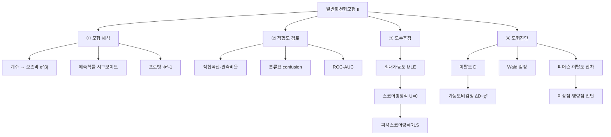

# 12. 회귀모형: 일반화선형모형Ⅰ(2)

## 🔗 선수 지식 (Prerequisites)
- [ ] **필수**: [11강. 일반화선형모형Ⅰ(1)](11강.md) — GLM 세 구성성분, 지수족, 로지스틱회귀·로짓·오즈비, 이탈도·AIC 이해 완료?
- [ ] **필수**: 최대가능도추정(MLE)과 로그가능도함수, 뉴턴-랩슨/스코어 방정식
- [ ] **권장**: [3강. 중회귀모형(1)](3강.md) — 잔차의 정의, 적합도 진단의 기본 아이디어
- [ ] **권장**: 카이제곱분포·정규분포의 누적분포함수(CDF)
- **관련 단원**: [11강. 일반화선형모형Ⅰ(1)](11강.md) `→` [12강. 일반화선형모형Ⅰ(2)] `→` [13강. 일반화선형모형Ⅱ](13강.md)

---

## 학습 목표
1. 적합된 로지스틱 회귀모형을 해석할 수 있다.
2. 로지스틱회귀모형의 적합도에 대한 시각적 검토 방법을 제시할 수 있다.
3. 이항자료에 프로빗모형을 적합시킬 수 있다.
4. 일반화선형모형의 모수추정법에 대해 설명할 수 있다.
5. 이탈도를 설명하고 모형의 비교와 유의성 검정에 적용할 수 있다.
6. 일반화선형모형의 잔차분석 결과를 해석할 수 있다.
7. R을 이용하여 학습한 내용을 구현하고 분석결과를 해석할 수 있다.

---

## 🧠 메타인지 체크 (학습 전/후 자기 평가)

### 학습 전 자기 평가
| 소주제 | 자신감 (1-5) |
| :--- | :--- |
| 적합된 로지스틱회귀 계수·오즈비 해석 | |
| 적합도 시각적 검토 (적합곡선·분류표·ROC) | |
| 프로빗모형과 로짓/프로빗 비교 | |
| GLM 모수추정 (MLE·스코어·IRLS) | |
| 이탈도를 이용한 모형비교·유의성검정 | |
| 잔차분석 (피어슨·이탈도 잔차) | |

### 학습 후 교정 (학습 완료 후 작성)
| 소주제 | 학습 전 | 학습 후 | 실제 정답률 | 과신/과소 여부 |
| :--- | :--- | :--- | :--- | :--- |
| 로지스틱 계수·오즈비 해석 | | | | |
| 적합도 시각적 검토 | | | | |
| 프로빗모형 | | | | |
| GLM 모수추정 | | | | |
| 이탈도·모형비교 | | | | |
| 잔차분석 | | | | |

> **활용법**: 학습 전 1분 → 자신감 기입, 학습 후 1분 → 나머지 기입. "과신" 영역이 실제 취약점.

---

## 📝 요약 (Summary)
1. 🔴 **로지스틱회귀계수 해석**: 계수 $\beta_j$ 는 **로그오즈(로짓)의 변화량**, $e^{\beta_j}$ 는 **오즈비**로 $x_j$ 1단위 증가 시 성공 오즈의 배수다. 확률의 변화는 비선형이라 $x$ 수준에 따라 다르며, $\hat\pi=\frac{1}{1+e^{-\mathbf{x}^\top\hat{\boldsymbol\beta}}}$ 로 예측확률을 구한다.
2. 🔴 **적합도 시각적 검토**: 적합된 로지스틱 곡선(설명변수 vs 예측확률), 관측비율과 예측확률의 대조, **분류표(confusion table)**, **ROC 곡선·AUC**, Hosmer-Lemeshow류 그룹별 관측/기대 비교 등으로 모형의 적합 정도를 눈으로 점검한다.
3. 🟡 **프로빗모형(probit)**: 연결함수로 표준정규 누적분포함수의 역함수 $g(\pi)=\Phi^{-1}(\pi)$ 를 사용하는 이항자료 GLM. 로짓과 형태가 매우 유사하나 꼬리가 더 얇고 계수 척도가 다르다($\beta_{\text{logit}}\approx1.6\,\beta_{\text{probit}}$).
4. 🔴 **GLM 모수추정**: 정규성이 없으므로 **최대가능도추정(MLE)**을 사용한다. 로그가능도를 미분한 **스코어 방정식** $U(\boldsymbol\beta)=\partial\ell/\partial\boldsymbol\beta=\mathbf{0}$ 의 해를 **뉴턴-랩슨/피셔 스코어링 = 반복재가중최소제곱(IRLS)**으로 수치적으로 구한다.
5. 🔴 **이탈도(deviance)**: $D=-2[\ell(\hat{\boldsymbol\beta})-\ell_{\text{sat}}]$ 로 적합모형과 포화모형의 로그가능도 차. 정규선형모형의 잔차제곱합(SSE)에 대응하는 **적합부족 측도**다. 중첩모형 비교는 이탈도 차 $\Delta D=D_{\text{축소}}-D_{\text{전체}}\sim\chi^2_{(q)}$ (가능도비 검정), 개별 계수는 **Wald 검정**으로 유의성을 본다.
6. 🟡 **잔차분석**: **피어슨 잔차** $r_i^P=\frac{y_i-\hat\mu_i}{\sqrt{V(\hat\mu_i)}}$ 와 **이탈도 잔차** $r_i^D=\text{sign}(y_i-\hat\mu_i)\sqrt{d_i}$ 로 적합의 국소적 결함·이상점·영향점을 진단한다. $\sum (r_i^P)^2=$ 피어슨 통계량 $X^2$, $\sum (r_i^D)^2=D$.

---

## 📐 핵심 수식 (Key Formulas)

| 수식명 | 수식 | 의미 |
| :--- | :--- | :--- |
| **예측확률** | $\hat\pi_i=\dfrac{1}{1+e^{-\mathbf{x}_i^\top\hat{\boldsymbol\beta}}}$ | 적합 로짓을 시그모이드로 역변환 |
| **오즈비 해석** | $\text{OR}_j=e^{\hat\beta_j}$ | $x_j$ 1단위↑ 시 오즈 배수 |
| **확률의 한계효과** | $\dfrac{\partial\pi}{\partial x_j}=\beta_j\,\pi(1-\pi)$ | 확률 변화는 $\pi$ 수준에 의존(비선형) |
| **프로빗 연결** | $\Phi^{-1}(\pi)=\mathbf{x}^\top\boldsymbol\beta,\ \pi=\Phi(\mathbf{x}^\top\boldsymbol\beta)$ | 표준정규 CDF의 역함수 |
| **로그가능도(베르누이)** | $\ell(\boldsymbol\beta)=\sum_i\{y_i\log\pi_i+(1-y_i)\log(1-\pi_i)\}$ | MLE의 목적함수 |
| **스코어 방정식** | $U(\boldsymbol\beta)=\mathbf{X}^\top(\mathbf{y}-\boldsymbol\mu)=\mathbf{0}$ | (정준연결 시) 추정방정식 |
| **피셔 스코어링/IRLS** | $\boldsymbol\beta^{(t+1)}=(\mathbf{X}^\top\mathbf{W}\mathbf{X})^{-1}\mathbf{X}^\top\mathbf{W}\mathbf{z}$ | 반복 가중최소제곱 갱신 |
| **이탈도** | $D=-2[\ell(\hat{\boldsymbol\beta})-\ell_{\text{sat}}]$ | 적합부족 측도(↔SSE) |
| **이탈도 차(가능도비)** | $\Delta D=D_R-D_F\sim\chi^2_{(q)}$ | 중첩모형 비교, $q=$모수 차 |
| **Wald 검정** | $z_j=\dfrac{\hat\beta_j}{\text{se}(\hat\beta_j)}\sim N(0,1)$ | 개별 계수 유의성 |
| **피어슨 잔차** | $r_i^P=\dfrac{y_i-\hat\mu_i}{\sqrt{V(\hat\mu_i)}}$ | 표준화 잔차, $\sum(r_i^P)^2=X^2$ |
| **이탈도 잔차** | $r_i^D=\text{sign}(y_i-\hat\mu_i)\sqrt{d_i}$ | $\sum(r_i^D)^2=D$ |

### 주요 정리/정의

**스코어 방정식과 IRLS (GLM 추정의 핵심)**
$$
U(\boldsymbol\beta)=\frac{\partial\ell}{\partial\boldsymbol\beta}=\sum_{i}\frac{(y_i-\mu_i)}{a(\phi)V(\mu_i)}\frac{\partial\mu_i}{\partial\eta_i}\mathbf{x}_i=\mathbf{0}
$$
정준연결에서는 위 식이 $\mathbf{X}^\top(\mathbf{y}-\boldsymbol\mu)=\mathbf{0}$ 로 단순화된다. 비선형이라 닫힌 해가 없어 피셔 스코어링으로 반복한다:
$$
\boldsymbol\beta^{(t+1)}=\boldsymbol\beta^{(t)}+\mathcal{I}(\boldsymbol\beta^{(t)})^{-1}U(\boldsymbol\beta^{(t)})=(\mathbf{X}^\top\mathbf{W}\mathbf{X})^{-1}\mathbf{X}^\top\mathbf{W}\mathbf{z},\quad z_i=\eta_i+\frac{(y_i-\mu_i)}{}\frac{\partial\eta_i}{\partial\mu_i}
$$
> **직관적 해석**: GLM 추정은 "작업반응변수 $z$ 를 만들고 가중치 $\mathbf{W}$ 로 가중회귀를 반복"하는 것이다. 가중치 $w_i$ 는 분산이 작은(정보가 많은) 관측에 큰 비중을 준다. 정준연결이면 "관측합 = 기댓값합"($\mathbf{X}^\top\mathbf{y}=\mathbf{X}^\top\hat{\boldsymbol\mu}$)이라는 적률조건으로 추정이 깔끔해진다.
> **AI 적용**: 로지스틱회귀의 MLE는 곧 교차엔트로피 손실의 최소화이며, 경사하강법(SGD)이 IRLS의 1차 근사 버전이다. 딥러닝의 분류 학습이 정확히 이 목적함수를 최적화한다.

**이탈도와 가능도비 검정 (정리)**
$$
D=-2[\ell(\hat{\boldsymbol\beta})-\ell_{\text{sat}}],\qquad
\Delta D = D_{\text{축소}}-D_{\text{전체}}\ \overset{H_0}{\sim}\ \chi^2_{(q)}
$$
> **직관적 해석**: 포화모형(각 관측마다 모수 1개, 완벽 적합)을 기준점으로 두고, 우리 모형이 거기서 얼마나 벗어났는지가 이탈도다. 정규선형모형의 SSE와 같은 역할을 하며, 두 중첩모형의 이탈도 차이는 "추가한 변수들이 가능도를 유의하게 높였는가"를 카이제곱으로 검정한다.
> **AI 적용**: 이탈도/AIC는 모델 선택·정규화의 정보이론적 기준이며, 이탈도 차 검정은 특성(feature)군의 통계적 유의성 판단에 쓰인다.

**프로빗 vs 로짓 (정리)**
$$
\text{로짓: }\pi=\frac{1}{1+e^{-\eta}},\qquad \text{프로빗: }\pi=\Phi(\eta)
$$
> **직관적 해석**: 둘 다 $\eta\in(-\infty,\infty)$ 를 $(0,1)$ 로 단조 사상하는 S자 곡선이다. 잠재변수 $y^*=\mathbf{x}^\top\boldsymbol\beta+\varepsilon$ 가 임계값을 넘으면 $Y=1$ 이라 볼 때, 오차 $\varepsilon$ 이 **로지스틱분포면 로짓, 정규분포면 프로빗**이 된다. 중앙부는 거의 일치하고 꼬리에서만 차이 난다.
> **AI 적용**: 프로빗은 경제학(이산선택모형)에서 선호되고, 로짓은 ML에서 표준이다(시그모이드·소프트맥스와 직결). 계수 척도가 약 1.6배 차이 나므로 두 모형 계수를 직접 비교하면 안 된다.

---

## 📊 개념 시각화 (Visual Guide)

### 개념 관계도


### 핵심 도식 (이항 GLM 연결함수 비교)
| 모형 | 연결함수 $g(\pi)$ | 역함수 $\pi$ | 오차 잠재분포 | AI/활용 |
| :--- | :--- | :--- | :--- | :--- |
| 로짓(로지스틱) | $\log\frac{\pi}{1-\pi}$ | $\frac{1}{1+e^{-\eta}}$ | 로지스틱분포 | 이진분류 표준, 오즈비 해석 |
| 프로빗 | $\Phi^{-1}(\pi)$ | $\Phi(\eta)$ | 표준정규분포 | 이산선택모형(경제학) |
| 보로그-로그 | $\log[-\log(1-\pi)]$ | $1-e^{-e^\eta}$ | 검벨(극단값) | 비대칭 반응, 생존자료 |

### 진단 통계량 ↔ 선형모형 대응
| 선형모형 | 일반화선형모형 | 역할 |
| :--- | :--- | :--- |
| 잔차제곱합 SSE | 이탈도 $D$ | 적합부족 측도 |
| $F$ 검정(부분 $F$) | 이탈도 차 $\Delta D\sim\chi^2$ | 중첩모형 비교 |
| $t$ 검정 | Wald $z$ 검정 | 개별 계수 유의성 |
| 표준화잔차 | 피어슨/이탈도 잔차 | 국소 적합 진단 |
| 최소제곱(OLS) | 최대가능도(IRLS) | 추정 |

---

## ✏️ 심화 학습 (Study Subject)

### 1. 가상 시나리오: "어떤 개념을, 언제 사용해야 할까?"
- **상황**: 신용평가 모형에서 로지스틱회귀로 부도확률을 적합했다. 절편 $\hat\beta_0=-2.0$, 소득(백만원) 계수 $\hat\beta_1=-0.3$, 연체횟수 계수 $\hat\beta_2=0.8$ 을 얻었다. 경영진은 "연체가 1회 늘면 부도확률이 0.8 올라가는 거냐"고 묻는다.
- **문제**: 계수를 확률 증가량으로 오해하고 있다. 올바른 해석과, 모형이 잘 적합되었는지 시각적으로 어떻게 보일 것인가?
- **해결**: 계수는 **로그오즈 변화량**이다. 연체 1회 증가 시 부도 **오즈**가 $e^{0.8}\approx2.23$ 배가 된다(확률이 아니라 오즈!). 소득 100만원 증가 시 오즈는 $e^{-0.3}\approx0.74$ 배(약 26% 감소). 확률의 변화는 한계효과 $\frac{\partial\pi}{\partial x_j}=\beta_j\pi(1-\pi)$ 로 현재 위험 수준에 따라 다르다($\pi=0.5$ 근방에서 최대). 적합도는 ① 예측확률 vs 실제 부도율을 위험구간별로 묶어 대조하고, ② 분류표로 정·오분류를 보고, ③ ROC·AUC로 판별력을 본다(AUC가 1에 가까울수록 우수).
- **AI 학습 포인트**: "로지스틱회귀의 한계효과 $\beta_j\pi(1-\pi)$ 가 왜 $\pi=0.5$ 에서 최대가 되는지, 그리고 이것이 신경망에서 시그모이드 그래디언트 소실(vanishing gradient) 문제와 어떻게 연결되는지 설명해줘."

### 2. 관점별 비교 및 오개념 분석
- **핵심 비교**:
  - **로짓 vs 프로빗**: 형태는 거의 같은 S자 곡선. 로짓은 오차가 로지스틱분포(꼬리 두꺼움), 프로빗은 정규분포(꼬리 얇음)일 때 유도된다. 계수는 $\beta_{\text{logit}}\approx1.6\,\beta_{\text{probit}}$ 로 척도만 다르고 적합·예측은 사실상 동일.
  - **이탈도 차 검정 vs Wald 검정**: 전자는 두 중첩모형의 가능도 차로 변수군을 검정(우월), 후자는 개별 계수의 $\hat\beta/\text{se}$ 로 검정(간편하나 분리·큰계수에서 불안정).
  - **피어슨 잔차 vs 이탈도 잔차**: 둘 다 표준화 잔차지만, 합이 각각 피어슨 통계량 $X^2$ 과 이탈도 $D$ 가 된다. 이탈도 잔차가 일반적으로 정규근사가 더 좋다.
- **오개념 분석**:
    - **오개념 1**: "로지스틱회귀 계수 $\beta_j$ 가 양수면 $x_j$ 가 1 늘 때 성공확률이 $\beta_j$ 만큼 증가한다."
    - **분석**: 틀렸다. $\beta_j$ 는 **로그오즈**의 변화량. 확률 변화는 비선형($\frac{\partial\pi}{\partial x}=\beta\pi(1-\pi)$)이라 위치에 따라 다르다. 일정한 것은 오즈비 $e^{\beta_j}$.
    - **오개념 2**: "이탈도 $D$ 의 값 자체가 작으면 무조건 모형이 좋다 / $D$ 를 카이제곱으로 적합도 검정할 수 있다."
    - **분석**: 이항(0/1) 개별자료에서는 $D$ 의 카이제곱 근사가 성립하지 않아 절대적 적합도 검정에 쓰면 안 된다. $D$ 는 주로 **중첩모형 비교(차이)**에 쓰며, 절대적합도는 Hosmer-Lemeshow·잔차·ROC로 본다.
    - **오개념 3**: "로짓과 프로빗 계수를 직접 비교할 수 있다."
    - **분석**: 아니다. 오차분포의 분산 척도가 달라($\pi^2/3$ vs $1$) 계수 척도가 약 1.6배 차이 난다. 비교하려면 한계효과나 예측확률로 환산해야 한다.
- **AI 학습 포인트**: "이항 개별자료에서 이탈도가 절대적합도 검정으로 부적절한 이유를, 점근분포가 성립하지 않는 조건(셀 기대도수)과 함께 설명해줘. Hosmer-Lemeshow 검정이 이 문제를 어떻게 우회하는지도."

---

## ❓ 연습 문제 및 해설

> **블룸 인지 수준 범례**: [기억] 정의·나열 → [이해] 설명·비교 → [적용] 계산·구현 → [분석] 구별·디버그 → [평가] 판단·비평 → [창조] 설계·제안
> 본 강의에는 교재 연습문제가 없어 아래 10문항은 모두 📌 AI 추가 생성 문제입니다.

### 📝 문제

**1. ⭐ [기억] 📌 이항자료에 대한 프로빗(probit)모형의 연결함수로 옳은 것은?(#prob-1)**
   > ① $g(\pi)=\log\dfrac{\pi}{1-\pi}$
   > ② $g(\pi)=\Phi^{-1}(\pi)$
   > ③ $g(\pi)=\log\pi$
   > ④ $g(\pi)=\log[-\log(1-\pi)]$

<br>

**2. ⭐ [기억] 📌 일반화선형모형의 회귀계수 추정에 일반적으로 사용하는 방법은?(#prob-2)**
   > ① 최소제곱법(OLS)
   > ② 적률법(MM)
   > ③ 최대가능도법(MLE)
   > ④ 능형회귀(ridge)

<br>

**3. ⭐⭐ [이해] 📌 적합된 로지스틱회귀에서 $\hat\beta_1=0.8$ 일 때, $x_1$ 의 1단위 증가에 대한 해석으로 옳은 것은?(#prob-3)**
   > ① 성공확률이 0.8 증가한다
   > ② 성공 오즈가 $e^{0.8}\approx2.23$ 배가 된다
   > ③ 성공 오즈가 0.8배가 된다
   > ④ 로그오즈가 $e^{0.8}$ 만큼 증가한다

<br>

**4. ⭐⭐ [이해] 📌 GLM의 모수추정과 진단에 대한 설명으로 옳은 것을 모두 고르면?(#prob-4)**
   > <보기>
   >
   > 가. 스코어 방정식 $U(\boldsymbol\beta)=\partial\ell/\partial\boldsymbol\beta=\mathbf{0}$ 의 해가 MLE이다.
   > 나. 피셔 스코어링은 반복재가중최소제곱(IRLS)으로 구현된다.
   > 다. 정준연결에서는 스코어 방정식이 $\mathbf{X}^\top(\mathbf{y}-\boldsymbol\mu)=\mathbf{0}$ 으로 단순화된다.

   > ① 가, 나
   > ② 나, 다
   > ③ 가, 다
   > ④ 가, 나, 다

<br>

**5. ⭐⭐ [이해] 📌 이탈도(deviance) $D$ 에 대한 설명으로 옳지 않은 것은?(#prob-5)**
   > ① $D=-2[\ell(\hat{\boldsymbol\beta})-\ell_{\text{sat}}]$ 로 정의된다.
   > ② 정규선형모형의 잔차제곱합(SSE)에 대응하는 적합부족 측도이다.
   > ③ 값이 클수록 적합이 좋음을 의미한다.
   > ④ 중첩모형 비교 시 이탈도 차는 근사적으로 $\chi^2$ 분포를 따른다.

<br>

**6. ⭐⭐ [적용] 📌 로지스틱회귀에서 적합값이 $\hat\eta=\hat\beta_0+\hat\beta_1 x=1.0986$ 일 때 예측 성공확률 $\hat\pi$ 는? (단 $e^{1.0986}\approx3$)(#prob-6)**
   > ① $0.25$
   > ② $0.5$
   > ③ $0.75$
   > ④ $0.9$

<br>

**7. ⭐⭐ [적용] 📌 두 중첩 로지스틱모형에서 축소모형 이탈도 $D_R=88.0$, 전체모형 이탈도 $D_F=80.0$, 추가 모수 3개다. 가능도비(이탈도 차) 검정의 통계량과 분포로 옳은 것은? (단 $\chi^2_{0.05,3}=7.81$)(#prob-7)**
   > ① $\Delta D=8.0,\ \chi^2_{(3)}$ → 유의(추가변수 필요)
   > ② $\Delta D=8.0,\ \chi^2_{(3)}$ → 유의하지 않음
   > ③ $\Delta D=168.0,\ \chi^2_{(3)}$ → 유의
   > ④ $\Delta D=8.0,\ F_{(3,\,n-4)}$ → 유의

<br>

**8. ⭐⭐⭐ [분석] 📌 로지스틱회귀의 잔차분석에 대한 설명으로 옳은 것은?(#prob-8)**
   > ① 피어슨 잔차의 제곱합은 이탈도 $D$ 와 같다.
   > ② 이탈도 잔차의 제곱합은 피어슨 통계량 $X^2$ 과 같다.
   > ③ 피어슨 잔차는 $r_i^P=\dfrac{y_i-\hat\mu_i}{\sqrt{V(\hat\mu_i)}}$ 로 정의된다.
   > ④ GLM에서는 잔차가 항상 정규분포를 따르므로 잔차도가 직선이어야 한다.

<br>

**9. ⭐⭐⭐ [평가] 📌 로짓모형과 프로빗모형을 같은 이항자료에 적합했다. 결과 해석으로 가장 적절한 것은?(#prob-9)**
   > ① 두 모형의 회귀계수는 동일하게 나온다.
   > ② 예측확률은 중앙부에서 거의 같고 꼬리에서만 약간 다르며, 계수 척도는 약 1.6배 차이 난다.
   > ③ 프로빗은 적합값이 $[0,1]$ 을 벗어날 수 있어 부적절하다.
   > ④ 로짓은 MLE, 프로빗은 OLS로 추정한다.

<br>

**10. ⭐⭐⭐ [평가/창조] 📌 정준연결 로지스틱회귀의 로그가능도로부터 스코어 방정식 $\mathbf{X}^\top(\mathbf{y}-\boldsymbol\pi)=\mathbf{0}$ 을 유도하고, 이 식이 IRLS로 풀리는 이유와 이탈도가 모형진단에서 갖는 역할을 설명하시오.(#prob-10)**

---

### 🔑 정답 및 해설 (먼저 풀어본 후 펼치기)

<details>
<summary>정답 보기 (클릭)</summary>

1. ②
2. ③
3. ②
4. ④
5. ③
6. ③
7. ①
8. ③
9. ②
10. 풀이형 정답 (해설 참조)

</details>

<details>
<summary>해설 보기 (클릭)</summary>

<a id="prob-1"></a>
**1. ⭐ [기억] 프로빗 연결함수**
> **정답: ② $g(\pi)=\Phi^{-1}(\pi)$**
> **해설**: 프로빗은 표준정규 누적분포함수 $\Phi$ 의 역함수를 연결함수로 쓴다. ①은 로짓, ③은 포아송의 로그연결, ④는 보로그-로그(complementary log-log) 연결이다.

<a id="prob-2"></a>
**2. ⭐ [기억] GLM의 추정법**
> **정답: ③ 최대가능도법(MLE)**
> **해설**: GLM은 정규성 가정이 없어 OLS가 아니라 MLE로 계수를 추정하며, 수치적으로 피셔 스코어링(=IRLS)으로 푼다.

<a id="prob-3"></a>
**3. ⭐⭐ [이해] 계수의 오즈비 해석**
> **정답: ② 성공 오즈가 $e^{0.8}\approx2.23$ 배가 된다**
> **해설**: 계수는 로그오즈의 변화량이므로 오즈는 $e^{\hat\beta_1}=e^{0.8}\approx2.23$ 배. ①은 확률을 직접 더하는 오개념, ③은 $e^{0.8}$ 가 아닌 0.8을 배수로 본 오류, ④는 로그오즈가 0.8(=$\hat\beta_1$)만큼 증가하는 것이지 $e^{0.8}$ 만큼이 아니다.

<a id="prob-4"></a>
**4. ⭐⭐ [이해] GLM 추정 메커니즘**
> **정답: ④ 가, 나, 다**
> **해설**: 스코어 방정식의 해가 MLE(가), 피셔 스코어링은 작업반응변수에 대한 가중회귀를 반복하는 IRLS로 구현(나), 정준연결에서는 추정방정식이 "관측합=기댓값합" $\mathbf{X}^\top(\mathbf{y}-\boldsymbol\mu)=\mathbf{0}$ 으로 단순화(다). 모두 옳다.

<a id="prob-5"></a>
**5. ⭐⭐ [이해] 이탈도의 성질**
> **정답: ③ 값이 클수록 적합이 좋음을 의미한다 (옳지 않음)**
> **해설**: 이탈도는 SSE처럼 **작을수록** 적합이 좋다(포화모형에서 0). ①②④는 모두 맞는 설명이다. 따라서 옳지 않은 것은 ③.

<a id="prob-6"></a>
**6. ⭐⭐ [적용] 예측확률 계산**
> **정답: ③ $0.75$**
> **해설**: $\hat\pi=\dfrac{1}{1+e^{-\hat\eta}}=\dfrac{1}{1+e^{-1.0986}}=\dfrac{1}{1+1/3}=\dfrac{1}{4/3}=0.75$. 오즈가 $e^{1.0986}=3$ 이므로 $\pi=\frac{3}{1+3}=0.75$ 로도 빠르게 계산된다.

<a id="prob-7"></a>
**7. ⭐⭐⭐ [적용] 이탈도 차 가능도비 검정**
> **정답: ① $\Delta D=8.0,\ \chi^2_{(3)}$ → 유의(추가변수 필요)**
> **해설**: $\Delta D=D_R-D_F=88.0-80.0=8.0$, 자유도는 모수 차 3이므로 $\chi^2_{(3)}$. 임계값 $\chi^2_{0.05,3}=7.81<8.0$ 이므로 $H_0$(추가변수 계수=0)을 기각 → 추가변수가 유의하다. 분포는 $F$ 가 아니라 $\chi^2$(②④ 오답), 통계량은 차이지 합이 아니다(③ 오답).

<a id="prob-8"></a>
**8. ⭐⭐⭐ [분석] 잔차분석**
> **정답: ③ 피어슨 잔차는 $r_i^P=\dfrac{y_i-\hat\mu_i}{\sqrt{V(\hat\mu_i)}}$ 로 정의된다**
> **해설**: 피어슨 잔차의 제곱합은 **피어슨 통계량 $X^2$**(①은 반대로 서술해 오답), 이탈도 잔차의 제곱합은 **이탈도 $D$**(②도 반대). GLM의 잔차는 일반적으로 정규분포를 따르지 않아 잔차도가 반드시 직선이어야 하는 것도 아니다(④ 오답). 따라서 ③만 옳다.

<a id="prob-9"></a>
**9. ⭐⭐⭐ [평가] 로짓 vs 프로빗**
> **정답: ② 예측확률은 중앙부에서 거의 같고 꼬리에서만 약간 다르며, 계수 척도는 약 1.6배 차이 난다**
> **해설**: 두 모형 모두 S자 곡선으로 중앙부 적합은 거의 일치하나 꼬리에서 차이 난다. 오차분포 분산 차이로 $\beta_{\text{logit}}\approx1.6\beta_{\text{probit}}$ 라 계수를 직접 비교하면 안 된다(①). 프로빗도 $\Phi$ 가 $(0,1)$ 을 보장(③ 오답), 둘 다 MLE로 추정한다(④ 오답).

<a id="prob-10"></a>
**10. ⭐⭐⭐ [평가/창조] 스코어 방정식 유도와 진단에서의 이탈도**
> **정답·해설**:
> 1) **로그가능도**: $Y_i\sim\text{Bernoulli}(\pi_i)$, $\text{logit}(\pi_i)=\eta_i=\mathbf{x}_i^\top\boldsymbol\beta$ 일 때
> $$\ell(\boldsymbol\beta)=\sum_i\big[y_i\log\pi_i+(1-y_i)\log(1-\pi_i)\big]=\sum_i\big[y_i\eta_i-\log(1+e^{\eta_i})\big].$$
> 2) **미분(체인룰)**: $\dfrac{\partial\ell}{\partial\beta_j}=\sum_i\Big(y_i-\dfrac{e^{\eta_i}}{1+e^{\eta_i}}\Big)x_{ij}=\sum_i(y_i-\pi_i)x_{ij}.$ 즉 $\pi_i=\frac{e^{\eta_i}}{1+e^{\eta_i}}$ 가 곧 평균이라 $\frac{\partial\pi}{\partial\eta}$ 와 분산함수가 상쇄되어 깔끔해진다.
> 3) **스코어 방정식**: 벡터로 모으면
> $$U(\boldsymbol\beta)=\mathbf{X}^\top(\mathbf{y}-\boldsymbol\pi)=\mathbf{0}.$$
> 이는 "관측 성공합 = 적합 기대성공합"이라는 적률조건이며, 정준연결의 특징이다.
> 4) **IRLS로 푸는 이유**: $\boldsymbol\pi$ 가 $\boldsymbol\beta$ 의 비선형 함수라 닫힌 해가 없다. 피셔정보 $\mathcal{I}=\mathbf{X}^\top\mathbf{W}\mathbf{X}$ ($w_i=\pi_i(1-\pi_i)$)를 쓰는 뉴턴-랩슨/피셔 스코어링은
> $$\boldsymbol\beta^{(t+1)}=(\mathbf{X}^\top\mathbf{W}\mathbf{X})^{-1}\mathbf{X}^\top\mathbf{W}\mathbf{z},\quad z_i=\eta_i+\frac{y_i-\pi_i}{\pi_i(1-\pi_i)}$$
> 형태의 가중최소제곱을 반복하는 것과 동치다(작업반응 $z$, 가중치 $W$ 매 반복 갱신).
> 5) **이탈도의 진단 역할**: $D=-2[\ell(\hat{\boldsymbol\beta})-\ell_{\text{sat}}]$ 는 SSE에 대응하는 적합부족 측도로, ① 중첩모형 비교($\Delta D\sim\chi^2_{(q)}$, 가능도비검정)와 ② 이탈도 잔차 $r_i^D=\text{sign}(y_i-\hat\mu_i)\sqrt{d_i}$ ($\sum (r_i^D)^2=D$)를 통한 국소 적합·이상점 진단에 쓰인다. 단, 0/1 개별자료에서는 $D$ 의 카이제곱 근사가 성립하지 않아 절대적합도 검정에는 부적절하다. $\blacksquare$

</details>

---

## ✅ O/X 확인문제 (총 20문)

**1.** 적합된 로지스틱회귀의 계수 $\beta_j$ 는 로그오즈(로짓)의 변화량이다. (#ox-1) **(O / X)**
**2.** $e^{\beta_j}$ 는 $x_j$ 1단위 증가 시 성공 확률의 증가량이다. (#ox-2) **(O / X)**
**3.** 로지스틱회귀에서 확률의 한계효과는 $\frac{\partial\pi}{\partial x_j}=\beta_j\pi(1-\pi)$ 로 $x$ 수준에 의존한다. (#ox-3) **(O / X)**
**4.** 확률의 한계효과는 $\pi=0.5$ 근방에서 가장 크다. (#ox-4) **(O / X)**
**5.** 프로빗모형의 연결함수는 표준정규 CDF의 역함수 $\Phi^{-1}(\pi)$ 이다. (#ox-5) **(O / X)**
**6.** 로짓과 프로빗의 회귀계수는 척도가 같아 직접 비교할 수 있다. (#ox-6) **(O / X)**
**7.** 로짓과 프로빗은 예측확률이 중앙부에서 거의 일치하고 꼬리에서만 차이 난다. (#ox-7) **(O / X)**
**8.** GLM의 회귀계수는 최대가능도법으로 추정한다. (#ox-8) **(O / X)**
**9.** 스코어 방정식은 로그가능도를 모수로 미분하여 0으로 둔 식이다. (#ox-9) **(O / X)**
**10.** 정준연결에서 스코어 방정식은 $\mathbf{X}^\top(\mathbf{y}-\boldsymbol\mu)=\mathbf{0}$ 으로 단순화된다. (#ox-10) **(O / X)**
**11.** 피셔 스코어링은 반복재가중최소제곱(IRLS)으로 구현된다. (#ox-11) **(O / X)**
**12.** 이탈도 $D$ 는 정규선형모형의 잔차제곱합(SSE)에 대응하는 적합부족 측도이다. (#ox-12) **(O / X)**
**13.** 이탈도는 값이 클수록 적합이 좋다. (#ox-13) **(O / X)**
**14.** 두 중첩모형의 이탈도 차 $\Delta D=D_R-D_F$ 는 근사적으로 $\chi^2_{(q)}$ 를 따른다($q$=모수 차). (#ox-14) **(O / X)**
**15.** Wald 검정은 개별 계수의 유의성을 $\hat\beta_j/\text{se}(\hat\beta_j)$ 로 검정한다. (#ox-15) **(O / X)**
**16.** 피어슨 잔차의 제곱합은 피어슨 통계량 $X^2$ 과 같다. (#ox-16) **(O / X)**
**17.** 이탈도 잔차의 제곱합은 이탈도 $D$ 와 같다. (#ox-17) **(O / X)**
**18.** ROC 곡선의 AUC가 1에 가까울수록 모형의 판별력이 좋다. (#ox-18) **(O / X)**
**19.** 0/1 개별자료에서 이탈도는 카이제곱 근사가 성립하여 절대적합도 검정에 바로 쓸 수 있다. (#ox-19) **(O / X)**
**20.** 분류표(confusion table)는 예측확률을 절단값으로 이분화하여 정·오분류를 정리한 표이다. (#ox-20) **(O / X)**

<details>
<summary>O/X 정답 및 해설 보기 (클릭)</summary>

> <a id="ox-1"></a> **1. O** — 계수는 로그오즈(로짓)의 변화량.
> <a id="ox-2"></a> **2. X** — $e^{\beta_j}$ 는 오즈의 **배수(오즈비)**이지 확률 증가량이 아니다.
> <a id="ox-3"></a> **3. O** — 한계효과 $\beta_j\pi(1-\pi)$ 는 비선형으로 $x$ 수준에 의존.
> <a id="ox-4"></a> **4. O** — $\pi(1-\pi)$ 가 $\pi=0.5$ 에서 최대(=0.25).
> <a id="ox-5"></a> **5. O** — 프로빗 연결은 $\Phi^{-1}$.
> <a id="ox-6"></a> **6. X** — 척도가 약 1.6배 달라 직접 비교 불가.
> <a id="ox-7"></a> **7. O** — 두 S자 곡선은 중앙부 일치, 꼬리에서만 차이.
> <a id="ox-8"></a> **8. O** — GLM은 MLE로 추정.
> <a id="ox-9"></a> **9. O** — $U(\boldsymbol\beta)=\partial\ell/\partial\boldsymbol\beta=\mathbf{0}$.
> <a id="ox-10"></a> **10. O** — 정준연결의 적률조건 "관측합=기댓값합".
> <a id="ox-11"></a> **11. O** — 피셔 스코어링 = IRLS(작업반응 가중회귀 반복).
> <a id="ox-12"></a> **12. O** — 이탈도는 SSE에 대응.
> <a id="ox-13"></a> **13. X** — 이탈도는 **작을수록** 적합이 좋다(포화모형에서 0).
> <a id="ox-14"></a> **14. O** — 가능도비(이탈도 차) 검정.
> <a id="ox-15"></a> **15. O** — Wald $z=\hat\beta/\text{se}$.
> <a id="ox-16"></a> **16. O** — $\sum(r_i^P)^2=X^2$.
> <a id="ox-17"></a> **17. O** — $\sum(r_i^D)^2=D$.
> <a id="ox-18"></a> **18. O** — AUC↑ → 판별력↑(0.5는 무작위 수준).
> <a id="ox-19"></a> **19. X** — 0/1 개별자료에서는 카이제곱 근사가 깨져 절대적합도 검정에 부적절. 모형비교(차)에 사용.
> <a id="ox-20"></a> **20. O** — 절단값으로 이분화한 정·오분류 표.

</details>

---

## 🧪 자유 회상 연습 (Free Recall)

> **방법**: 위의 노트를 모두 덮고, 타이머 3분 설정 후 이번 단원에서 배운 내용을 기억나는 대로 자유롭게 적으세요.
> 정확한 문장이 아니어도 됩니다. 키워드, 수식, 관계 등 떠오르는 것을 모두 적습니다.

**자유 회상 작성란:**

```
[여기에 기억나는 내용을 자유롭게 작성]


```

> **회상 후 점검**: 노트를 다시 펼쳐 빠뜨린 내용을 확인하세요. 빠뜨린 부분이 실제 취약점입니다.
> - 회상 못한 핵심 개념: [                ]
> - 회상 못한 수식: [                ]

---

## 💻 코드로 확인하기 (Code Verification)

```python
import numpy as np
import statsmodels.api as sm

# 가상 이분형 데이터 (참 모형 logit = -3 + 0.8x)
np.random.seed(12)
n = 300
x = np.random.uniform(0, 10, n)
pi_true = 1 / (1 + np.exp(-(-3 + 0.8 * x)))
y = np.random.binomial(1, pi_true)
X = sm.add_constant(x)

# (1) 로짓모형 (로지스틱회귀)
logit = sm.GLM(y, X, family=sm.families.Binomial()).fit()
# (2) 프로빗모형
probit = sm.GLM(y, X, family=sm.families.Binomial(sm.families.links.Probit())).fit()

print("로짓 계수 :", np.round(logit.params, 3),  " deviance =", round(logit.deviance, 1))
print("프로빗계수:", np.round(probit.params, 3), " deviance =", round(probit.deviance, 1))
print("계수 비율(로짓/프로빗) ≈", np.round(logit.params / probit.params, 2), "(≈1.6 기대)")

# 오즈비 해석
print("오즈비 e^b1 =", round(np.exp(logit.params[1]), 3))

# (3) 이탈도 차 가능도비 검정: 절편만 모형 vs 전체 모형
null = sm.GLM(y, np.ones((n, 1)), family=sm.families.Binomial()).fit()
dD = null.deviance - logit.deviance          # 이탈도 차
from scipy.stats import chi2
print(f"ΔD = {dD:.2f},  df=1,  p = {chi2.sf(dD, 1):.2e}")

# (4) 잔차분석: 피어슨/이탈도 잔차의 제곱합 = X^2 / D 확인
rp = logit.resid_pearson
rd = logit.resid_deviance
print("Σ(피어슨잔차)^2 =", round((rp**2).sum(), 2), "= 피어슨 X^2")
print("Σ(이탈도잔차)^2 =", round((rd**2).sum(), 2), "= deviance", round(logit.deviance, 2))

# (5) 분류표 (절단값 0.5)
pred = (logit.predict() >= 0.5).astype(int)
tab = np.array([[np.sum((pred==0)&(y==0)), np.sum((pred==1)&(y==0))],
                [np.sum((pred==0)&(y==1)), np.sum((pred==1)&(y==1))]])
print("분류표[행=실제0/1, 열=예측0/1]:\n", tab, " 정확도 =", round((y==pred).mean(), 3))
```

> **실행 결과 (예상)**
> ```
> 로짓 계수 : [-2.9xx  0.8xx]   deviance = 2xx.x
> 프로빗계수: [-1.7xx  0.4xx]   deviance = 2xx.x
> 계수 비율(로짓/프로빗) ≈ [1.6x 1.6x]  (≈1.6 기대)
> 오즈비 e^b1 = 2.2xx
> ΔD = 1xx.xx,  df=1,  p = x.xxe-xx
> Σ(피어슨잔차)^2 = 2xx.xx = 피어슨 X^2
> Σ(이탈도잔차)^2 = 2xx.xx = deviance 2xx.xx
> 분류표[행=실제0/1, 열=예측0/1]:
>  [[1xx  xx]
>   [ xx 1xx]]   정확도 = 0.8xx
> ```
> **수학적 해석**: 로짓·프로빗 계수의 비가 약 1.6으로 나와 두 모형이 척도만 다른 동일한 적합임을 확인한다. 오즈비 $e^{\hat\beta_1}\approx2.2$ 는 $x$ 1단위 증가 시 성공 오즈 약 2.2배. 절편만 모형 대비 이탈도가 크게 감소($\Delta D$)하고 $p$ 가 매우 작아 $x$ 가 유의함을 보인다. 피어슨/이탈도 잔차의 제곱합이 각각 $X^2$·$D$ 와 일치함을 코드로 검증했고, 분류표는 적합도의 시각적·요약적 검토 수단이다.

---

## 🤖 AI 연결고리 (Math → AI Application)

| 수학 개념 | AI/ML 적용 분야 | 구체적 사례 |
| :--- | :--- | :--- |
| 로그가능도 MLE | 분류 모델 학습 손실 | 교차엔트로피 = 음의 로그가능도 |
| 스코어 방정식·IRLS | 최적화 알고리즘 | 뉴턴법, 경사하강(SGD)의 모태 |
| 한계효과 $\beta\pi(1-\pi)$ | 그래디언트 거동 | 시그모이드 그래디언트 소실 분석 |
| 프로빗 $\Phi$ | 확률적 활성화/이산선택 | 프로빗 회귀, 베이지안 프로빗 |
| 이탈도 / 가능도비 | 모형선택·특성검정 | feature group 유의성, 정규화 |
| ROC·AUC / 분류표 | 분류 성능 평가 | 임계값 튜닝, 불균형 자료 평가 |
| 피어슨·이탈도 잔차 | 모델 진단 | 이상점·영향점 탐지, 적합 점검 |

---

## 📖 심화 학습 예시 답안

#### 1. IRLS(반복재가중최소제곱)가 GLM을 푸는 내부 원리
GLM의 MLE는 닫힌 해가 없지만, "가중 선형회귀를 반복"하면 수렴한다.

1. **1단계 — 작업반응 만들기**: 현재 추정 $\boldsymbol\beta^{(t)}$ 로 $\eta_i,\mu_i$ 를 계산하고, 1차 테일러 전개로 선형화한 작업반응 $z_i=\eta_i+(y_i-\mu_i)\frac{\partial\eta_i}{\partial\mu_i}$ 를 만든다.
2. **2단계 — 가중치 부여**: 분산이 작은(정보 많은) 관측에 큰 가중치 $w_i$ 를 준다(로지스틱은 $w_i=\pi_i(1-\pi_i)$).
3. **3단계 — 가중회귀**: $\boldsymbol\beta^{(t+1)}=(\mathbf{X}^\top\mathbf{W}\mathbf{X})^{-1}\mathbf{X}^\top\mathbf{W}\mathbf{z}$ 로 갱신.
4. **4단계 — 반복·수렴**: $\boldsymbol\beta$ 변화가 작아질 때까지 1~3 반복. 정준연결이면 관측 헤시안과 피셔정보가 일치해 뉴턴-랩슨=피셔 스코어링이 되어 안정적으로 수렴한다.

#### 2. 로짓 vs 프로빗 비교표

| 구분 | 로짓(로지스틱) | 프로빗 | 비고 |
| :--- | :--- | :--- | :--- |
| **연결함수** | $\log\frac{\pi}{1-\pi}$ | $\Phi^{-1}(\pi)$ | 둘 다 S자 |
| **역함수** | $\frac{1}{1+e^{-\eta}}$ | $\Phi(\eta)$ | $(0,1)$ 보장 |
| **잠재오차분포** | 로지스틱(분산 $\pi^2/3$) | 정규(분산 1) | 꼬리 두께 차이 |
| **계수 척도** | 프로빗의 약 1.6배 | 기준 | 직접 비교 금지 |
| **계수 해석** | 오즈비 $e^\beta$ (직관적) | 잠재변수 표준편차 단위 | 로짓이 해석 유리 |
| **AI 활용** | 이진분류 표준, 시그모이드 | 이산선택, 베이지안 | |

#### 3. 적합·진단 코드 작성법 (Best Practice)

- **Bad Practice (나쁜 예시)**
  ```python
  # 계수를 확률 증가량처럼 해석하고, 이탈도 절대값만 보고 적합 판단
  print("x가 1 늘면 성공확률이", logit.params[1], "증가")   # 오개념!
  if logit.deviance < 300: print("적합 좋음")              # 근거 빈약
  ```
- **Good Practice (좋은 예시)**
  ```python
  import numpy as np
  print("오즈비:", np.exp(logit.params[1]))                # 계수→오즈비 해석
  # 모형비교는 이탈도 차(가능도비)로
  from scipy.stats import chi2
  dD = reduced.deviance - full.deviance
  print("p =", chi2.sf(dD, df=full.df_model - reduced.df_model))
  # 진단은 잔차/ROC로
  print(logit.resid_deviance.max())                        # 이상점 점검
  ```
- **설명**: 계수는 반드시 오즈비/한계효과로 해석하고, 모형의 우열은 이탈도 절대값이 아니라 **이탈도 차(가능도비)나 AIC**로 비교하며, 적합도는 잔차·분류표·ROC로 시각·정량 검토해야 타당한 결론에 이른다.

---

## 📚 핵심 용어집 (Glossary)

| 용어 (한) | 용어 (영) | 수식 표현 | 정의 |
| :--- | :--- | :--- | :--- |
| **예측확률** | Predicted Probability | $\hat\pi=\frac{1}{1+e^{-\mathbf{x}^\top\hat{\boldsymbol\beta}}}$ | 적합 로짓의 시그모이드 역변환 `→← 11강` |
| **오즈비** | Odds Ratio | $e^{\beta_j}$ | $x_j$ 1단위↑ 시 오즈 배수 `→← 11강` |
| **한계효과** | Marginal Effect | $\beta_j\pi(1-\pi)$ | 확률의 순간변화율(비선형) |
| **프로빗모형** | Probit Model | $\Phi^{-1}(\pi)=\mathbf{x}^\top\boldsymbol\beta$ | 정규 CDF 역함수 연결 이항 GLM |
| **최대가능도추정** | MLE | $\hat{\boldsymbol\beta}=\arg\max\ell$ | GLM 계수 추정법 `→← 11강` |
| **스코어 방정식** | Score Equation | $U(\boldsymbol\beta)=\partial\ell/\partial\boldsymbol\beta=\mathbf{0}$ | MLE의 1계 조건 |
| **피셔 스코어링/IRLS** | Fisher Scoring / IRLS | $(\mathbf{X}^\top\mathbf{W}\mathbf{X})^{-1}\mathbf{X}^\top\mathbf{W}\mathbf{z}$ | 반복재가중최소제곱 추정 |
| **이탈도** | Deviance | $-2[\ell(\hat{\boldsymbol\beta})-\ell_{\text{sat}}]$ | 적합부족 측도(↔SSE) `→← 11강` |
| **가능도비 검정** | Likelihood Ratio Test | $\Delta D\sim\chi^2_{(q)}$ | 중첩모형 비교 |
| **Wald 검정** | Wald Test | $z=\hat\beta_j/\text{se}(\hat\beta_j)$ | 개별 계수 유의성 |
| **피어슨 잔차** | Pearson Residual | $\frac{y_i-\hat\mu_i}{\sqrt{V(\hat\mu_i)}}$ | $\sum r^2=X^2$ |
| **이탈도 잔차** | Deviance Residual | $\text{sign}(y_i-\hat\mu_i)\sqrt{d_i}$ | $\sum r^2=D$ |
| **ROC/AUC** | ROC Curve / AUC | — | 분류 판별력의 시각·정량 지표 |
| **분류표** | Confusion Table | — | 절단값 이분화 정·오분류 표 |

---

## 🤖 AI 학습 파트너를 위한 추가 자료

### 1. 개념 이해를 위한 심층 질문 프롬프트
> **프롬프트 예시**: "로지스틱회귀의 회귀계수, 오즈비, 한계효과 세 가지가 각각 무엇을 측정하는지 신용평가 예시로 구분해서 설명해줘. 특히 '계수가 일정하다 ≠ 확률 변화가 일정하다'를 그래프 형태로 떠올릴 수 있게 직관적으로 알려줘."

### 2. 문제 해결 능력 강화를 위한 시나리오 프롬프트
> **프롬프트 예시**: "당신은 데이터 사이언티스트입니다. 이탈 예측 모형에서 후보 변수군(결제이력 3개)을 추가할지 결정해야 합니다. **이탈도 차(가능도비) 검정 vs AIC vs 개별 Wald 검정** 중 무엇으로 판단할지, 각 방법의 장단점(분리 문제, 다중성, 표본크기)을 비교하고 최종 권고를 기술적으로 설명해줘."

### 3. 수식 풀이 검증 프롬프트
> **프롬프트 예시**: "다음 유도를 검증해줘. 로지스틱 로그가능도 $\ell=\sum_i[y_i\eta_i-\log(1+e^{\eta_i})]$ 를 $\beta_j$ 로 미분하면
> $$\frac{\partial\ell}{\partial\beta_j}=\sum_i(y_i-\pi_i)x_{ij}$$
> 1. 체인룰 각 단계가 옳은지, $\pi_i=\frac{e^{\eta_i}}{1+e^{\eta_i}}$ 가 어떻게 나오는지 확인해줘.
> 2. 이로부터 스코어 방정식 $\mathbf{X}^\top(\mathbf{y}-\boldsymbol\pi)=\mathbf{0}$ 과 IRLS 갱신식이 어떻게 도출되는지 단계별로 검증해줘."

---

## 🔄 복습 체크 (Spaced Repetition)
- [ ] 1일 후 복습 (날짜: 2026-05-30)
- [ ] 3일 후 복습 (날짜: 2026-06-01)
- [ ] 7일 후 복습 (날짜: 2026-06-05)
- [ ] 14일 후 복습 (날짜: 2026-06-12)
- [ ] 30일 후 복습 (날짜: 2026-06-28)

### 복습 시 자가 평가
| 회차 | 날짜 | 이해도 (1-5) | 취약 부분 메모 |
| :--- | :--- | :--- | :--- |
| 1차 | | | |
| 2차 | | | |
| 3차 | | | |

---

## 📚 참고 자료 (References)

- 교재: 한국방송통신대학교 『R을 이용한 회귀모형』 12장 — 일반화선형모형Ⅰ(2)
- 강의: 회귀모형 12강 (1. 이항자료 GLM의 설정·분석 / 2. 모수추정 / 3. 모형진단)
- Agresti, *Categorical Data Analysis* — 로지스틱·프로빗, 이탈도, 잔차분석의 고전
- McCullagh & Nelder, *Generalized Linear Models* (2nd ed.) — IRLS·이탈도의 표준 텍스트
- Hosmer, Lemeshow & Sturdivant, *Applied Logistic Regression* — 적합도 검토(HL 검정)·진단
- [11강. 일반화선형모형Ⅰ(1)](11강.md) — GLM 구성성분·로지스틱 출발점 / [13강. 일반화선형모형Ⅱ](13강.md) — 개수자료(포아송)로 확장
