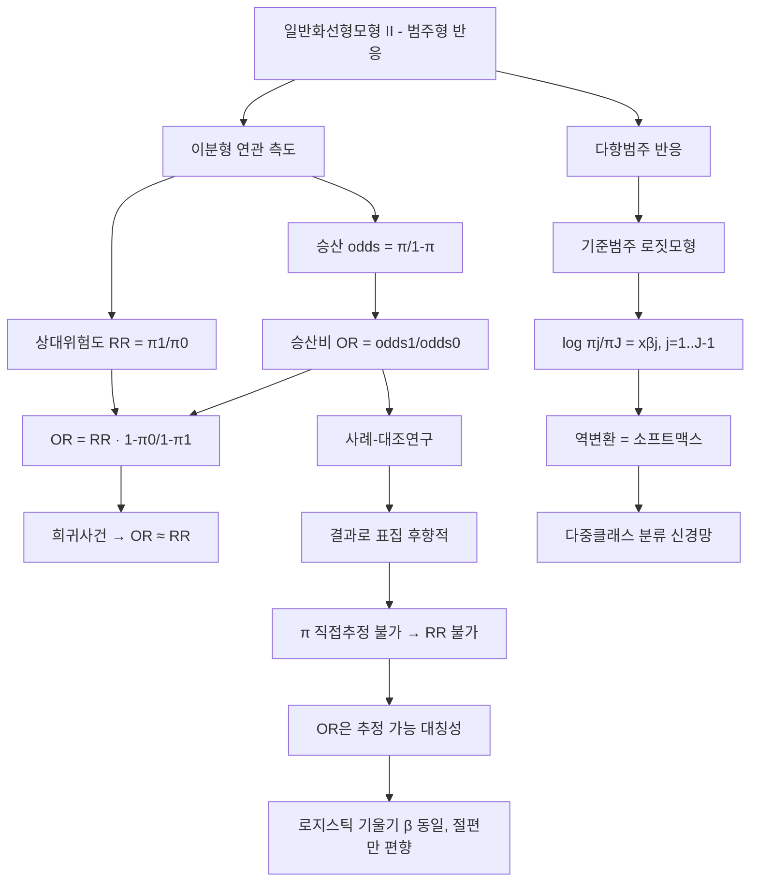

# 13. 회귀모형: 일반화선형모형Ⅱ(1)

## 🔗 선수 지식 (Prerequisites)
- [ ] **필수**: [11강. 일반화선형모형Ⅰ(1)](11강.md) — 로지스틱회귀의 GLM 표현, 로짓·오즈·오즈비 해석 이해 완료?
- [ ] **필수**: [12강. 일반화선형모형Ⅰ(2)](12강.md) — 로지스틱회귀의 적합·추론(MLE, 이탈도, 신뢰구간)
- [ ] **권장**: 조건부확률과 베이즈정리 $P(A\mid B)=\dfrac{P(B\mid A)P(A)}{P(B)}$ `→← AI를위한수학의응용`
- [ ] **권장**: $2\times2$ 분할표(contingency table)와 행/열 주변확률
- **관련 단원**: [11강. 일반화선형모형Ⅰ(1)](11강.md) `→` [12강. 일반화선형모형Ⅰ(2)](12강.md) `→` [13강. 일반화선형모형Ⅱ(1)] `→` [14강. 일반화선형모형Ⅱ(2)](14강.md)

---

## 학습 목표
1. 승산(odds) 및 승산비(odds ratio)의 정의와 승산비의 성질에 대해 요약할 수 있다.
2. 상대위험도(relative risk)의 정의를 이해하고 승산비와의 관계를 설명할 수 있다.
3. 사례-대조연구자료의 확률 특성을 이해하고 로지스틱회귀모형을 적용하여 결과를 올바르게 해석할 수 있다.
4. 기준범주 로짓모형을 이해하고 다항범주자료에 모형을 올바르게 설정할 수 있다.
5. 기준범주 로짓모형의 적합결과를 설명하고 해석할 수 있다.
6. R을 이용하여 공부한 모형들을 적합하고 필요한 분석결과들을 제시할 수 있다.

---

## 🧠 메타인지 체크 (학습 전/후 자기 평가)

### 학습 전 자기 평가
| 소주제 | 자신감 (1-5) |
| :--- | :--- |
| 승산·승산비의 정의와 성질 | |
| 상대위험도와 승산비의 관계 (희귀사건 근사) | |
| 사례-대조연구에서 로지스틱회귀가 성립하는 이유 | |
| 기준범주 로짓모형의 설정과 해석 | |

### 학습 후 교정 (학습 완료 후 작성)
| 소주제 | 학습 전 | 학습 후 | 실제 정답률 | 과신/과소 여부 |
| :--- | :--- | :--- | :--- | :--- |
| 승산·승산비 | | | | |
| 상대위험도·OR 관계 | | | | |
| 사례-대조연구 | | | | |
| 기준범주 로짓모형 | | | | |

> **활용법**: 학습 전 1분 → 자신감 기입, 학습 후 1분 → 나머지 기입. "과신" 영역이 실제 취약점.

---

## 📝 요약 (Summary)
1. 🔴 **승산(odds)**: 사건이 일어날 확률과 일어나지 않을 확률의 비 $\dfrac{\pi}{1-\pi}$. $\pi\in(0,1)$ 을 $(0,\infty)$ 로 펴며, 로짓은 승산의 로그 $\log\frac{\pi}{1-\pi}$ 이다.
2. 🔴 **승산비(odds ratio, OR)**: 두 집단(노출/비노출)의 승산의 비 $\dfrac{\text{odds}_1}{\text{odds}_0}$. 로지스틱회귀에서 설명변수 1단위 증가 시 $e^{\beta}$ 이며, 계수 해석의 핵심이다.
3. 🟡 **승산비의 성질**: ① 항상 양수, ② $1$ 이면 연관 없음, ③ 행·열을 바꾸어도(질병↔노출 관점 교환) 값이 불변, ④ 분할표의 대각곱/비대각곱 $\dfrac{n_{11}n_{22}}{n_{12}n_{21}}$ 으로 계산.
4. 🔴 **상대위험도(relative risk, RR)**: 두 집단의 발생확률(위험)의 비 $\dfrac{\pi_1}{\pi_0}$. 직관적이지만 표본설계에 따라 추정 불가능한 경우가 있다.
5. 🔴 **OR과 RR의 관계**: $\text{OR}=\text{RR}\cdot\dfrac{1-\pi_0}{1-\pi_1}$. 질병이 **희귀(rare)**하여 $\pi_0,\pi_1\approx0$ 이면 $\text{OR}\approx\text{RR}$ (희귀사건 가정, rare disease assumption).
6. 🔴 **사례-대조연구(case-control study)**: 결과(질병 유무)를 기준으로 표집한 후향적 설계. 발생확률 $\pi$ 를 직접 추정할 수 없어 RR은 못 구하지만, **OR은 추정 가능**하며 로지스틱회귀의 **기울기 계수 $\beta_j$ 는 전향적 연구와 동일**(절편만 표집비율로 편향)하다.
7. 🟡 **기준범주 로짓모형(baseline-category logit model)**: 순서 없는 명목형 다항반응($J$개 범주)에 대해, 한 기준범주 대비 각 범주의 로짓을 동시에 모형화하는 다항로짓모형. $\log\dfrac{\pi_j}{\pi_J}=\mathbf{x}^\top\boldsymbol\beta_j$ ($j=1,\dots,J-1$).

---

## 📐 핵심 수식 (Key Formulas)

| 수식명 | 수식 | 의미 |
| :--- | :--- | :--- |
| **승산(odds)** | $\text{odds}=\dfrac{\pi}{1-\pi}$ | 성공/실패 확률의 비 |
| **로짓** | $\log\dfrac{\pi}{1-\pi}=\eta$ | 승산의 로그(선형예측자) |
| **승산비(OR)** | $\text{OR}=\dfrac{\pi_1/(1-\pi_1)}{\pi_0/(1-\pi_0)}$ | 노출/비노출 승산의 비 |
| **OR (분할표)** | $\widehat{\text{OR}}=\dfrac{n_{11}n_{22}}{n_{12}n_{21}}$ | 대각곱 / 비대각곱 |
| **로지스틱 계수의 OR** | $\text{OR}_j=e^{\beta_j}$ | $x_j$ 1단위 증가 시 승산 배수 |
| **상대위험도(RR)** | $\text{RR}=\dfrac{\pi_1}{\pi_0}$ | 노출/비노출 발생확률의 비 |
| **OR–RR 관계** | $\text{OR}=\text{RR}\cdot\dfrac{1-\pi_0}{1-\pi_1}$ | 희귀사건이면 $\approx\text{RR}$ |
| **로그OR 표준오차** | $\text{SE}(\log\widehat{\text{OR}})=\sqrt{\tfrac{1}{n_{11}}+\tfrac{1}{n_{12}}+\tfrac{1}{n_{21}}+\tfrac{1}{n_{22}}}$ | OR의 신뢰구간(우드의 공식) |
| **기준범주 로짓** | $\log\dfrac{\pi_j}{\pi_J}=\beta_{0j}+\mathbf{x}^\top\boldsymbol\beta_j,\ j=1,\dots,J-1$ | 기준범주 $J$ 대비 로짓 |
| **다항 확률(역변환)** | $\pi_j=\dfrac{e^{\beta_{0j}+\mathbf{x}^\top\boldsymbol\beta_j}}{1+\sum_{k=1}^{J-1}e^{\beta_{0k}+\mathbf{x}^\top\boldsymbol\beta_k}}$ | 소프트맥스 형태 |
| **기준범주 확률** | $\pi_J=\dfrac{1}{1+\sum_{k=1}^{J-1}e^{\beta_{0k}+\mathbf{x}^\top\boldsymbol\beta_k}}$ | 분모의 $1$ 항 |
| **임의 두 범주 로짓** | $\log\dfrac{\pi_a}{\pi_b}=(\mathbf{x}^\top\boldsymbol\beta_a-\mathbf{x}^\top\boldsymbol\beta_b)$ | 기준범주 차로 유도 |

### 주요 정리/정의

**승산비는 표집방향에 불변 (대칭성)**
$$
\text{OR}_{\text{질병}|노출}=\frac{P(D\mid E)/P(\bar D\mid E)}{P(D\mid\bar E)/P(\bar D\mid\bar E)}
=\frac{P(E\mid D)/P(\bar E\mid D)}{P(E\mid\bar D)/P(\bar E\mid\bar D)}=\text{OR}_{\text{노출}|질병}
$$
> **직관적 해석**: "노출되면 질병 승산이 몇 배?"와 "질병에 걸렸으면 노출 승산이 몇 배?"의 답이 **같다**. 베이즈정리로 보면 두 표현 모두 결합확률의 대각곱/비대각곱 $\frac{P_{11}P_{00}}{P_{10}P_{01}}$ 으로 환원되기 때문이다. 이 대칭성 덕분에 **결과로 표집하는 사례-대조연구**에서도 OR을 추정할 수 있다.
> **AI 적용**: 이 불변성은 클래스 불균형(class imbalance) 데이터에서 양성/음성 표집비율을 바꿔도 로지스틱회귀의 **기울기**가 유지되고 **절편만** 보정하면 된다는 사실의 통계적 근거다(prior correction).

**OR과 RR의 관계 (희귀사건 근사)**
$$
\text{OR}=\frac{\pi_1/(1-\pi_1)}{\pi_0/(1-\pi_0)}=\text{RR}\cdot\frac{1-\pi_0}{1-\pi_1}
\;\xrightarrow[\ \pi_0,\pi_1\to0\ ]{}\;\text{RR}
$$
> **직관적 해석**: 분모의 보정항 $\frac{1-\pi_0}{1-\pi_1}$ 은 두 집단의 "실패확률 비"다. 사건이 드물면 $1-\pi\approx1$ 이라 이 항이 $1$ 에 가까워져 OR이 RR을 잘 근사한다. 반대로 흔한 사건(예: $\pi=0.4$)에서는 OR이 RR을 **과장**한다(1보다 멀어짐).
> **AI 적용**: 사기탐지·질병진단처럼 양성률이 매우 낮은 분류문제에서 로지스틱 OR을 위험비처럼 해석해도 무방한 이유이며, 흔한 사건에서는 OR을 RR로 오역하지 않도록 주의해야 한다.

**기준범주 로짓모형 (정의)**
$$
\log\frac{\pi_j(\mathbf{x})}{\pi_J(\mathbf{x})}=\beta_{0j}+\beta_{1j}x_1+\cdots+\beta_{kj}x_k,
\qquad j=1,2,\dots,J-1
$$
> **직관적 해석**: $J$개 명목범주를 한꺼번에 다루기 위해, 마지막 범주 $J$ 를 **기준(baseline)**으로 고정하고 "범주 $j$ 대 기준 $J$"의 이항 로지스틱을 $J-1$ 개 동시에 세운 것이다. 각 범주마다 **고유의 계수벡터 $\boldsymbol\beta_j$** 를 가지므로, 설명변수가 범주별로 다른 방향·크기의 영향을 줄 수 있다.
> **AI 적용**: 분모에 모든 범주 지수합을 둔 역변환이 곧 **소프트맥스(softmax)**이며, 기준범주 로짓모형은 다중클래스 분류 신경망 출력층의 통계적 원형이다.

---

## 📊 개념 시각화 (Visual Guide)

### 개념 관계도


### 핵심 도식 (연구설계 ↔ 추정 가능 측도)
| 연구설계 | 표집 기준 | 추정 가능 | 비고 / AI |
| :--- | :--- | :--- | :--- |
| 코호트(전향적) | 노출 여부로 표집 → 결과 관찰 | RR, OR 모두 | 발생확률 $\pi$ 직접 추정 가능 |
| 단면(cross-sectional) | 무작위 표집 후 양변 측정 | RR, OR 모두 | 유병률 기반 |
| 사례-대조(후향적) | **결과(질병)로 표집** → 노출 회고 | **OR만** | $\pi$ 불가, OR 불변성 활용 / 불균형 표집 |
| 다항범주 반응 | — | 각 로짓의 OR | 기준범주 로짓 → 소프트맥스 |

---

## ✏️ 심화 학습 (Study Subject)

### 1. 가상 시나리오: "어떤 개념을, 언제 사용해야 할까?"
- **상황**: 희귀암(연간 발생률 약 0.01%)과 특정 화학물질 노출의 연관을 연구한다. 코호트로 수십만 명을 추적하면 환자가 거의 안 나와 비효율적이다. 그래서 이미 암에 걸린 사례군 200명과 건강한 대조군 200명을 모아 과거 노출 이력을 비교했다.
- **문제**: 이 후향적 자료에서는 "노출자의 암 발생확률 $\pi_1$"을 추정할 수 없다(질병으로 표집했으므로). 그렇다면 노출의 효과를 어떻게 정량화하고, 로지스틱회귀를 적용해도 되는가?
- **해결**: 상대위험도 $\text{RR}=\pi_1/\pi_0$ 는 $\pi$ 가 추정 불가능하므로 구할 수 없다. 그러나 승산비는 **표집방향에 불변**하므로 분할표의 대각곱/비대각곱으로 추정 가능하다:
$$
\widehat{\text{OR}}=\frac{n_{11}n_{22}}{n_{12}n_{21}}.
$$
로지스틱회귀를 적합하면 절편 $\beta_0$ 은 사례:대조 표집비율 때문에 편향되지만, **노출 계수 $\beta_1$ 은 전향적 연구의 값과 동일**하다(우도에서 표집상수가 절편에만 흡수). 따라서 $e^{\hat\beta_1}$ 을 OR로 해석하고, 암이 희귀하므로 $\text{OR}\approx\text{RR}$ 로 위험비처럼 읽을 수 있다.
- **AI 학습 포인트**: "사례-대조연구에서 로지스틱회귀의 기울기는 보존되고 절편만 표집비율로 편향되는 사실을, 우도함수의 분해와 베이즈정리로 유도해줘. 이것이 머신러닝의 클래스 불균형 보정(prior correction)과 어떻게 같은 원리인지 연결해서 설명해줘."

### 2. 관점별 비교 및 오개념 분석
- **핵심 비교**:
  - **승산비(OR) vs 상대위험도(RR)**: OR은 승산(odds)의 비, RR은 위험(risk=확률)의 비. 희귀사건이면 $\text{OR}\approx\text{RR}$ 이지만 흔한 사건이면 OR이 RR보다 1에서 더 멀다.
  - **코호트 vs 사례-대조**: 전자는 노출로 표집해 $\pi$·RR·OR 모두 추정. 후자는 결과로 표집해 $\pi$·RR은 불가, OR만 추정(불변성).
  - **이항 로지스틱 vs 기준범주 로짓**: 전자는 $J=2$, 로짓 1개. 후자는 $J\ge3$ 명목범주, 로짓 $J-1$개를 동시에($\boldsymbol\beta_j$ 가 범주별로 다름).
- **오개념 분석**:
    - **오개념 1**: "승산비(OR)는 곧 상대위험도(RR)다."
    - **분석**: 일반적으로 다르다. $\text{OR}=\text{RR}\cdot\frac{1-\pi_0}{1-\pi_1}$ 이므로 둘이 같으려면 $\pi$ 가 0에 가까운 희귀사건이어야 한다. $\pi_0=0.5,\pi_1=0.8$ 이면 $\text{RR}=1.6$ 이지만 $\text{OR}=\frac{0.8/0.2}{0.5/0.5}=4$ 로 크게 다르다.
    - **오개념 2**: "사례-대조연구에서도 질병 발생확률 $\pi$ 와 상대위험도를 추정할 수 있다."
    - **분석**: 불가능하다. 사례:대조 비율을 연구자가 임의로(예: 1:1) 정했으므로 표본의 질병비율은 모집단 유병률과 무관하다. 절대위험 $\pi$ 와 RR은 못 구하고, 표집에 불변인 OR만 추정한다.
    - **오개념 3**: "기준범주 로짓모형은 각 범주에 대해 따로따로 이항 로지스틱을 돌린 것과 완전히 같다."
    - **분석**: 정확히 같지는 않다. 기준범주 로짓모형은 **모든 범주를 하나의 다항우도로 동시에** 추정하여 확률들이 $\sum_j\pi_j=1$ 을 만족하도록 제약한다. 범주별 분리 적합은 이 제약을 무시해 효율이 떨어지고 확률 합이 1을 보장하지 못한다.
- **AI 학습 포인트**: "기준범주 로짓모형의 역변환이 소프트맥스와 동일함을 보이고, 다중클래스 분류에서 '각 클래스 vs 기준'을 동시에 추정하는 것과 One-vs-Rest를 따로 학습하는 것의 차이를 확률 정규화 관점에서 설명해줘."

---

## ❓ 연습 문제 및 해설

> **블룸 인지 수준 범례**: [기억] 정의·나열 → [이해] 설명·비교 → [적용] 계산·구현 → [분석] 구별·디버그 → [평가] 판단·비평 → [창조] 설계·제안
>
> ※ 본 강의에는 교재 연습문제가 제공되지 않아 AI가 학습목표 전체를 커버하도록 10문항을 출제함(📌).

### 📝 문제

**1. ⭐ [기억] 📌 사건의 성공확률이 $\pi$ 일 때 승산(odds)의 정의로 옳은 것은?(#prob-1)**
   > ① $\pi$
   > ② $1-\pi$
   > ③ $\dfrac{\pi}{1-\pi}$
   > ④ $\log\dfrac{\pi}{1-\pi}$

<br>

**2. ⭐ [기억] 📌 승산비(odds ratio)의 성질로 옳지 않은 것은?(#prob-2)**
   > ① 항상 0 이상의 값을 가진다.
   > ② 값이 1이면 두 변수 사이에 연관이 없다.
   > ③ 질병과 노출의 관점을 바꾸어도 값이 변하지 않는다.
   > ④ 음수가 되면 음의 연관을 의미한다.

<br>

**3. ⭐⭐ [적용] 📌 다음 $2\times2$ 분할표에서 승산비 $\widehat{\text{OR}}$ 은?(#prob-3)**
   > <보기>
   >
   > | | 질병 O | 질병 X |
   > | :--- | :---: | :---: |
   > | 노출 O | 40 | 60 |
   > | 노출 X | 20 | 180 |

   > ① 3
   > ② 4
   > ③ 6
   > ④ 12

<br>

**4. ⭐⭐ [이해] 📌 승산비(OR)와 상대위험도(RR)의 관계 $\text{OR}=\text{RR}\cdot\dfrac{1-\pi_0}{1-\pi_1}$ 에 대한 설명으로 옳은 것을 모두 고르면?(#prob-4)**
   > <보기>
   >
   > 가. 질병이 희귀하여 $\pi_0,\pi_1$ 이 0에 가까우면 $\text{OR}\approx\text{RR}$ 이다.
   > 나. 흔한 사건에서는 OR이 RR보다 1에서 더 멀어진다.
   > 다. 항상 $\text{OR}=\text{RR}$ 이다.

   > ① 가, 나
   > ② 나, 다
   > ③ 가, 다
   > ④ 가, 나, 다

<br>

**5. ⭐⭐ [적용] 📌 비노출군의 발생확률 $\pi_0=0.5$, 노출군 $\pi_1=0.8$ 일 때, 상대위험도(RR)와 승산비(OR)를 옳게 짝지은 것은?(#prob-5)**
   > ① RR = 1.6, OR = 4
   > ② RR = 4, OR = 1.6
   > ③ RR = 1.6, OR = 1.6
   > ④ RR = 0.625, OR = 0.25

<br>

**6. ⭐⭐ [이해] 📌 사례-대조연구(case-control study)의 특성으로 옳은 것은?(#prob-6)**
   > ① 노출 여부로 표집한 뒤 결과를 추적하는 전향적 설계다.
   > ② 질병 발생확률 $\pi$ 와 상대위험도를 직접 추정할 수 있다.
   > ③ 결과(질병 유무)로 표집하며, 추정 가능한 연관측도는 승산비(OR)다.
   > ④ 흔한 질병 연구에 가장 적합하고 희귀질병에는 비효율적이다.

<br>

**7. ⭐⭐⭐ [분석] 📌 사례-대조자료에 로지스틱회귀를 적합할 때, 전향적(코호트) 연구와 비교한 계수 해석으로 옳은 것은?(#prob-7)**
   > ① 절편과 기울기 모두 전향적 연구와 동일하다.
   > ② 기울기 계수 $\beta_j$ 는 동일하나, 절편 $\beta_0$ 만 표집비율로 편향된다.
   > ③ 기울기 계수 $\beta_j$ 가 편향되어 OR로 해석할 수 없다.
   > ④ 어떤 계수도 의미를 가지지 못한다.

<br>

**8. ⭐⭐ [이해] 📌 반응변수가 순서 없는 명목형 3개 범주(A, B, C)일 때, C를 기준범주로 한 기준범주 로짓모형에서 세워지는 로짓의 개수는?(#prob-8)**
   > ① 1개
   > ② 2개
   > ③ 3개
   > ④ 6개

<br>

**9. ⭐⭐⭐ [적용] 📌 기준범주($J$) 로짓모형 $\log\dfrac{\pi_j}{\pi_J}=\eta_j$ 에서 임의의 두 범주 $a,b$ 사이의 로짓 $\log\dfrac{\pi_a}{\pi_b}$ 으로 옳은 것은?(#prob-9)**
   > ① $\eta_a+\eta_b$
   > ② $\eta_a-\eta_b$
   > ③ $\eta_a\cdot\eta_b$
   > ④ $\eta_J$

<br>

**10. ⭐⭐⭐ [평가/창조] 📌 ① OR과 RR의 관계식 $\text{OR}=\text{RR}\cdot\dfrac{1-\pi_0}{1-\pi_1}$ 을 정의로부터 유도하고, ② 희귀사건 가정에서 $\text{OR}\approx\text{RR}$ 이 되는 이유를 설명하시오. 또한 ③ 기준범주 로짓모형의 확률 $\pi_j$ 가 소프트맥스 형태가 됨을 보이시오.(#prob-10)**

---

### 🔑 정답 및 해설 (먼저 풀어본 후 펼치기)

<details>
<summary>정답 보기 (클릭)</summary>

1. ③
2. ④
3. ③
4. ①
5. ①
6. ③
7. ②
8. ②
9. ②
10. 풀이형 정답 (해설 참조)

</details>

<details>
<summary>해설 보기 (클릭)</summary>

<a id="prob-1"></a>
**1. ⭐ [기억] 승산의 정의**
> **정답: ③ $\dfrac{\pi}{1-\pi}$**
> **해설**: 승산은 성공확률 대 실패확률의 비다. ④는 로짓(승산의 로그), ①②는 확률 자체로 비가 아니다.

<a id="prob-2"></a>
**2. ⭐ [기억] 승산비의 성질**
> **정답: ④ 음수가 되면 음의 연관을 의미한다(틀림)**
> **해설**: 승산비는 두 양수 승산의 비이므로 **항상 양수**이며 음수가 될 수 없다. 음의 연관은 $0<\text{OR}<1$ 로 나타난다. ①②③은 모두 OR의 올바른 성질(양수, 1이면 무연관, 표집방향 불변).

<a id="prob-3"></a>
**3. ⭐⭐ [적용] 분할표에서 OR 계산**
> **정답: ③ 6**
> **해설**: $\widehat{\text{OR}}=\dfrac{n_{11}n_{22}}{n_{12}n_{21}}=\dfrac{40\times180}{60\times20}=\dfrac{7200}{1200}=6$. 대각곱을 비대각곱으로 나눈다. (참고로 RR $=\frac{40/100}{20/200}=\frac{0.4}{0.1}=4$ 로 OR과 다름 — 사건이 드물지 않기 때문.)

<a id="prob-4"></a>
**4. ⭐⭐ [이해] OR–RR 관계**
> **정답: ① 가, 나**
> **해설**: 보정항 $\frac{1-\pi_0}{1-\pi_1}$ 때문에 일반적으로 $\text{OR}\ne\text{RR}$(다 틀림). 희귀사건이면 $1-\pi\approx1$ 이라 $\text{OR}\approx\text{RR}$(가 옳음), 흔한 사건이면 OR이 RR보다 1에서 더 멀어진다(나 옳음).

<a id="prob-5"></a>
**5. ⭐⭐ [적용] RR·OR 계산**
> **정답: ① RR = 1.6, OR = 4**
> **해설**: $\text{RR}=\frac{\pi_1}{\pi_0}=\frac{0.8}{0.5}=1.6$. 승산은 노출군 $\frac{0.8}{0.2}=4$, 비노출군 $\frac{0.5}{0.5}=1$ 이므로 $\text{OR}=\frac{4}{1}=4$. 흔한 사건이라 OR(4)이 RR(1.6)을 크게 과장한다 — OR을 RR로 오역하면 안 됨을 보여주는 예.

<a id="prob-6"></a>
**6. ⭐⭐ [이해] 사례-대조연구의 특성**
> **정답: ③ 결과로 표집하며 추정 가능한 측도는 OR**
> **해설**: 사례-대조연구는 질병 유무(결과)로 표집하는 **후향적** 설계다(①은 코호트). 표본의 질병비율을 연구자가 정하므로 $\pi$·RR은 추정 불가(②틀림), OR만 추정 가능. **희귀질병** 연구에 효율적이다(④ 반대).

<a id="prob-7"></a>
**7. ⭐⭐⭐ [분석] 사례-대조 로지스틱 계수**
> **정답: ② 기울기 $\beta_j$ 동일, 절편 $\beta_0$ 만 편향**
> **해설**: 사례-대조 표집은 우도에서 표집상수가 절편으로만 흡수되어, 노출효과를 나타내는 기울기 $\beta_j$ 는 전향적 연구와 동일하게 추정된다. 따라서 $e^{\hat\beta_j}$ 는 여전히 타당한 OR이며, 절편만 표집비율로 편향된다. 이것이 사례-대조연구에 로지스틱회귀를 쓸 수 있는 이론적 근거다.

<a id="prob-8"></a>
**8. ⭐⭐ [이해] 기준범주 로짓의 개수**
> **정답: ② 2개**
> **해설**: $J$개 범주에서 기준범주 1개를 빼고 $J-1$ 개의 로짓을 세운다. $J=3$ 이므로 $\log\frac{\pi_A}{\pi_C}$, $\log\frac{\pi_B}{\pi_C}$ 의 **2개**.

<a id="prob-9"></a>
**9. ⭐⭐⭐ [적용] 임의 두 범주의 로짓**
> **정답: ② $\eta_a-\eta_b$**
> **해설**: $\log\frac{\pi_a}{\pi_b}=\log\frac{\pi_a}{\pi_J}-\log\frac{\pi_b}{\pi_J}=\eta_a-\eta_b$. 즉 기준범주 로짓의 차로 임의 두 범주의 비교가 자동으로 결정된다(기준범주 선택과 무관하게 상대비교는 일관).

<a id="prob-10"></a>
**10. ⭐⭐⭐ [평가/창조] OR–RR 유도와 소프트맥스**
> **정답·해설**:
> **① OR–RR 관계 유도**:
> $$
> \text{OR}=\frac{\pi_1/(1-\pi_1)}{\pi_0/(1-\pi_0)}=\frac{\pi_1}{\pi_0}\cdot\frac{1-\pi_0}{1-\pi_1}=\text{RR}\cdot\frac{1-\pi_0}{1-\pi_1}.
> $$
> 정의에서 곧바로 따라온다.
> **② 희귀사건 근사**: $\pi_0,\pi_1\to0$ 이면 $1-\pi_0\to1,\ 1-\pi_1\to1$ 이므로 보정항 $\frac{1-\pi_0}{1-\pi_1}\to1$, 따라서 $\text{OR}\to\text{RR}$. 사건이 드물수록 실패확률이 둘 다 1에 가까워 비가 상쇄되기 때문이다.
> **③ 소프트맥스 유도**: 기준범주 로짓 $\log\frac{\pi_j}{\pi_J}=\eta_j$ 에서 $\pi_j=\pi_J e^{\eta_j}$ ($j=1,\dots,J-1$, 단 $\eta_J\equiv0$). 확률 합이 1이므로
> $$
> \sum_{j=1}^{J}\pi_j=\pi_J\Big(1+\sum_{k=1}^{J-1}e^{\eta_k}\Big)=1
> \;\Rightarrow\; \pi_J=\frac{1}{1+\sum_{k=1}^{J-1}e^{\eta_k}}.
> $$
> 이를 대입하면
> $$
> \pi_j=\frac{e^{\eta_j}}{1+\sum_{k=1}^{J-1}e^{\eta_k}}=\frac{e^{\eta_j}}{\sum_{k=1}^{J}e^{\eta_k}}\quad(\eta_J=0),
> $$
> 즉 **소프트맥스** 형태다. $\blacksquare$

</details>

---

## ✅ O/X 확인문제 (총 20문)

**1.** 승산(odds)은 $\dfrac{\pi}{1-\pi}$ 로 정의되며 $(0,\infty)$ 의 값을 가진다. (#ox-1) **(O / X)**
**2.** 로짓은 승산에 로그를 취한 값 $\log\dfrac{\pi}{1-\pi}$ 이다. (#ox-2) **(O / X)**
**3.** 승산비(OR)는 음수가 될 수 있다. (#ox-3) **(O / X)**
**4.** 승산비가 1이면 두 변수 사이에 연관이 없다. (#ox-4) **(O / X)**
**5.** 승산비는 질병→노출, 노출→질병 어느 방향으로 보아도 값이 같다(대칭성). (#ox-5) **(O / X)**
**6.** $2\times2$ 분할표에서 $\widehat{\text{OR}}=\dfrac{n_{11}n_{22}}{n_{12}n_{21}}$ (대각곱/비대각곱)이다. (#ox-6) **(O / X)**
**7.** 상대위험도(RR)는 두 집단의 승산의 비다. (#ox-7) **(O / X)**
**8.** OR과 RR은 항상 같은 값을 가진다. (#ox-8) **(O / X)**
**9.** $\text{OR}=\text{RR}\cdot\dfrac{1-\pi_0}{1-\pi_1}$ 이 성립한다. (#ox-9) **(O / X)**
**10.** 질병이 희귀하면 $\text{OR}\approx\text{RR}$ 로 근사할 수 있다. (#ox-10) **(O / X)**
**11.** 흔한 사건에서는 OR이 RR보다 1에서 더 멀어진다. (#ox-11) **(O / X)**
**12.** 사례-대조연구는 결과(질병 유무)를 기준으로 표집하는 후향적 설계다. (#ox-12) **(O / X)**
**13.** 사례-대조연구에서는 질병 발생확률 $\pi$ 를 직접 추정할 수 있다. (#ox-13) **(O / X)**
**14.** 사례-대조자료에서도 승산비(OR)는 추정할 수 있다. (#ox-14) **(O / X)**
**15.** 사례-대조 로지스틱회귀에서 기울기 $\beta_j$ 는 전향적 연구와 동일하고 절편만 편향된다. (#ox-15) **(O / X)**
**16.** 사례-대조연구는 희귀질병 연구에 효율적이다. (#ox-16) **(O / X)**
**17.** 기준범주 로짓모형은 $J$개 명목범주에 대해 $J$개의 로짓을 세운다. (#ox-17) **(O / X)**
**18.** 기준범주 로짓모형에서 각 범주는 고유의 계수벡터 $\boldsymbol\beta_j$ 를 가진다. (#ox-18) **(O / X)**
**19.** 기준범주 로짓모형의 확률 역변환은 소프트맥스 형태가 된다. (#ox-19) **(O / X)**
**20.** 임의의 두 범주 로짓 $\log\dfrac{\pi_a}{\pi_b}$ 은 기준범주 로짓의 차 $\eta_a-\eta_b$ 로 구해진다. (#ox-20) **(O / X)**

<details>
<summary>O/X 정답 및 해설 보기 (클릭)</summary>

> <a id="ox-1"></a> **1. O** — 승산은 확률 $(0,1)$ 을 $(0,\infty)$ 로 사상.
> <a id="ox-2"></a> **2. O** — 로짓 = 승산의 로그.
> <a id="ox-3"></a> **3. X** — OR은 두 양수 승산의 비라 **항상 양수**.
> <a id="ox-4"></a> **4. O** — $\text{OR}=1$ ⇔ 무연관.
> <a id="ox-5"></a> **5. O** — 결합확률의 대각곱/비대각곱으로 환원되어 방향 불변.
> <a id="ox-6"></a> **6. O** — 표본 OR의 표준 추정식.
> <a id="ox-7"></a> **7. X** — RR은 승산이 아니라 **발생확률(위험)**의 비 $\pi_1/\pi_0$.
> <a id="ox-8"></a> **8. X** — 일반적으로 다르며, 희귀사건일 때만 근사적으로 같음.
> <a id="ox-9"></a> **9. O** — 정의에서 유도되는 관계식.
> <a id="ox-10"></a> **10. O** — $1-\pi\approx1$ 이라 보정항이 1에 수렴.
> <a id="ox-11"></a> **11. O** — 보정항이 1에서 멀어져 OR이 RR을 과장.
> <a id="ox-12"></a> **12. O** — 결과로 표집하는 후향적 설계.
> <a id="ox-13"></a> **13. X** — 결과로 표집했으므로 $\pi$·RR 추정 불가.
> <a id="ox-14"></a> **14. O** — OR의 표집방향 불변성 덕분에 추정 가능.
> <a id="ox-15"></a> **15. O** — 표집상수가 절편에만 흡수, 기울기는 보존.
> <a id="ox-16"></a> **16. O** — 적은 사례군으로도 OR 추정 가능해 효율적.
> <a id="ox-17"></a> **17. X** — 기준범주 1개를 빼고 $J-1$ 개의 로짓을 세움.
> <a id="ox-18"></a> **18. O** — 범주마다 다른 영향을 허용($\boldsymbol\beta_j$).
> <a id="ox-19"></a> **19. O** — 분모에 모든 범주 지수합 → 소프트맥스.
> <a id="ox-20"></a> **20. O** — $\log\frac{\pi_a}{\pi_b}=\eta_a-\eta_b$.

</details>

---

## 🧪 자유 회상 연습 (Free Recall)

> **방법**: 위의 노트를 모두 덮고, 타이머 3분 설정 후 이번 단원에서 배운 내용을 기억나는 대로 자유롭게 적으세요.
> 정확한 문장이 아니어도 됩니다. 키워드, 수식, 관계 등 떠오르는 것을 모두 적습니다.

**자유 회상 작성란:**

```
[여기에 기억나는 내용을 자유롭게 작성]


```

> **회상 후 점검**: 노트를 다시 펼쳐 빠뜨린 내용을 확인하세요. 빠뜨린 부분이 실제 취약점입니다.
> - 회상 못한 핵심 개념: [                ]
> - 회상 못한 수식: [                ]

---

## 💻 코드로 확인하기 (Code Verification)

```python
import numpy as np
import pandas as pd
import statsmodels.api as sm
import statsmodels.formula.api as smf

# --- (1) 2x2 분할표에서 OR과 RR 비교 ---
#            질병O  질병X
# 노출O       40     60
# 노출X       20    180
n11, n12, n21, n22 = 40, 60, 20, 180
OR = (n11 * n22) / (n12 * n21)                 # 대각곱/비대각곱
pi1 = n11 / (n11 + n12)                         # 노출군 발생확률
pi0 = n21 / (n21 + n22)                         # 비노출군 발생확률
RR = pi1 / pi0
print(f"OR = {OR:.3f},  RR = {RR:.3f}")
print(f"검산 OR = RR*(1-pi0)/(1-pi1) = {RR*(1-pi0)/(1-pi1):.3f}")

# 로그OR의 95% 신뢰구간 (우드의 공식)
se = np.sqrt(1/n11 + 1/n12 + 1/n21 + 1/n22)
lo, hi = np.exp(np.log(OR) - 1.96*se), np.exp(np.log(OR) + 1.96*se)
print(f"OR 95% CI = ({lo:.2f}, {hi:.2f})")

# --- (2) 기준범주 로짓모형 (다항 로지스틱) ---
np.random.seed(13)
n = 600
x = np.random.normal(0, 1, n)
# 참 모형: 범주 0(기준) 대비 1, 2의 선형예측자
eta1 = -0.5 + 1.2 * x
eta2 =  0.3 - 0.8 * x
denom = 1 + np.exp(eta1) + np.exp(eta2)
P = np.column_stack([1/denom, np.exp(eta1)/denom, np.exp(eta2)/denom])  # 소프트맥스
y = np.array([np.random.choice(3, p=p) for p in P])

df = pd.DataFrame({"y": y, "x": x})
mlogit = smf.mnlogit("y ~ x", data=df).fit(disp=False)  # 기준범주 = 0
print(mlogit.summary())
print("\n계수(범주1, 범주2의 기준0 대비 로짓):\n", mlogit.params)
```

> **실행 결과 (예상)**
> ```
> OR = 6.000,  RR = 4.000
> 검산 OR = RR*(1-pi0)/(1-pi1) = 6.000
> OR 95% CI = (3.27, 11.01)
>
> 계수(범주1, 범주2의 기준0 대비 로짓):
>            1          2
> Intercept -0.4x      0.3x
> x          1.1x     -0.8x
> ```
> **수학적 해석**: ① OR(6)과 RR(4)이 다르고 관계식 $\text{OR}=\text{RR}\cdot\frac{1-\pi_0}{1-\pi_1}$ 으로 정확히 일치 — 사건이 드물지 않아 OR이 RR을 과장함을 확인. ② `mnlogit`은 기준범주(0) 대비 두 로짓을 동시에 적합하며, 추정 계수가 참값($\beta_{x,1}=1.2,\ \beta_{x,2}=-0.8$)을 잘 복원한다. 같은 $x$ 가 범주1에는 양(+), 범주2에는 음(−)의 영향을 주는 명목범주 모형의 특징이 드러난다.

---

## 🤖 AI 연결고리 (Math → AI Application)

| 수학 개념 | AI/ML 적용 분야 | 구체적 사례 |
| :--- | :--- | :--- |
| 승산비 $e^{\beta}$ | 모델 해석가능성 | 신용평가·의료진단 위험요인 효과 정량화 |
| OR의 표집방향 불변성 | 클래스 불균형 보정 | 불균형 데이터 학습 후 절편(prior) 보정 |
| OR ≈ RR (희귀사건) | 희귀 이벤트 모델링 | 사기탐지·이상탐지에서 위험비 해석 |
| 사례-대조 설계 | 데이터 수집 전략 | 양성 표본 과대표집(oversampling) |
| 기준범주 로짓 | 다중클래스 분류 | 소프트맥스 회귀, 분류 신경망 출력층 |
| 다항 정규화(softmax) | 확률적 분류 | 교차엔트로피 손실 최소화 |

---

## 📖 심화 학습 예시 답안

#### 1. 왜 사례-대조연구에서 로지스틱 기울기가 보존되는가 (내부 동작 원리)
표집(selection)을 나타내는 지시변수 $S=1$(표본에 포함)을 두면, 사례-대조는 $Y$ 값에 따라 포함확률이 다르다($P(S=1\mid Y=1)=\rho_1$, $P(S=1\mid Y=0)=\rho_0$).

1. **베이즈정리 적용**: 표본 내 조건부확률은
$$
P(Y=1\mid \mathbf{x},S=1)=\frac{\rho_1 P(Y=1\mid\mathbf{x})}{\rho_1 P(Y=1\mid\mathbf{x})+\rho_0 P(Y=0\mid\mathbf{x})}.
$$
2. **로짓을 취하면**:
$$
\log\frac{P(Y=1\mid\mathbf{x},S=1)}{P(Y=0\mid\mathbf{x},S=1)}
=\log\frac{\rho_1}{\rho_0}+\underbrace{\Big(\beta_0+\mathbf{x}^\top\boldsymbol\beta\Big)}_{\text{모집단 로짓}}.
$$
3. **결론**: 표집상수 $\log\frac{\rho_1}{\rho_0}$ 가 **절편에만** 더해진다. 따라서 절편은 $\beta_0+\log\frac{\rho_1}{\rho_0}$ 로 편향되지만 **기울기 $\boldsymbol\beta$ 는 그대로** 보존된다. 그러므로 $e^{\hat\beta_j}$ 는 모집단 OR의 타당한 추정치다.
4. **AI 함의**: 동일 원리로, 양성 표본을 과대표집해 학습한 분류기는 절편(또는 사후확률)만 보정하면 원래 분포에서의 확률을 회복한다(prior correction / logit shift).

#### 2. 승산비(OR) vs 상대위험도(RR) 비교표

| 구분 | 승산비 (OR) | 상대위험도 (RR) | 비고 |
| :--- | :--- | :--- | :--- |
| **정의** | $\dfrac{\pi_1/(1-\pi_1)}{\pi_0/(1-\pi_0)}$ | $\dfrac{\pi_1}{\pi_0}$ | OR=승산비, RR=위험비 |
| **값의 범위** | $(0,\infty)$, 무연관=1 | $(0,\infty)$, 무연관=1 | 둘 다 1 기준 |
| **추정 가능 설계** | 코호트·단면·**사례-대조** | 코호트·단면 (사례-대조 불가) | OR이 더 범용 |
| **해석 직관성** | 다소 낮음(승산의 비) | 높음(위험이 몇 배) | RR이 직관적 |
| **AI 활용** | 로지스틱 계수 $e^{\beta}$, 불균형 보정 | 희귀사건 위험 해석 | OR≈RR(희귀) |

#### 3. 다항 로지스틱(기준범주 로짓) 적합 코드 작성법 (Best Practice)

- **Bad Practice (나쁜 예시)**
  ```python
  # 명목 3범주를 범주별로 따로 이항 로지스틱 → 확률 합 ≠ 1, 효율 저하
  m1 = smf.logit("I(y==1) ~ x", data=df).fit()  # 1 vs 나머지
  m2 = smf.logit("I(y==2) ~ x", data=df).fit()  # 2 vs 나머지
  # 세 확률을 따로 예측하면 sum != 1 이 되어 정규화가 깨짐
  ```
- **Good Practice (좋은 예시)**
  ```python
  # 하나의 다항우도로 동시 추정 → 확률 합 = 1 보장(소프트맥스)
  mlogit = smf.mnlogit("y ~ x", data=df).fit(disp=False)  # 기준범주 자동(0)
  proba = mlogit.predict(df)        # 각 행의 확률 합 = 1
  OR_by_cat = np.exp(mlogit.params) # 기준범주 대비 범주별 OR
  ```
- **설명**: 명목 다항반응은 모든 범주를 **하나의 다항분포 우도**로 동시에 추정해야 $\sum_j\pi_j=1$ 제약이 지켜지고 추정 효율이 높다. `mnlogit`은 기준범주 대비 $J-1$ 개 로짓을 함께 적합하며, 계수에 `np.exp()` 를 취하면 기준범주 대비 OR로 해석된다.

---

## 📚 핵심 용어집 (Glossary)

| 용어 (한) | 용어 (영) | 수식 표현 | 정의 |
| :--- | :--- | :--- | :--- |
| **승산** | Odds | $\dfrac{\pi}{1-\pi}$ | 성공/실패 확률의 비 `→← 11강` |
| **승산비** | Odds Ratio (OR) | $\dfrac{\text{odds}_1}{\text{odds}_0}=e^{\beta}$ | 두 집단 승산의 비 `→← 11강` |
| **상대위험도** | Relative Risk (RR) | $\dfrac{\pi_1}{\pi_0}$ | 두 집단 발생확률(위험)의 비 |
| **위험(절대위험)** | Risk | $\pi=P(Y=1)$ | 사건 발생확률 |
| **사례-대조연구** | Case-Control Study | — | 결과로 표집하는 후향적 설계 |
| **코호트연구** | Cohort Study | — | 노출로 표집하는 전향적 설계 |
| **희귀사건 가정** | Rare Disease Assumption | $\pi\to0\Rightarrow\text{OR}\approx\text{RR}$ | OR로 RR을 근사하는 조건 |
| **분할표** | Contingency Table | $\{n_{ij}\}$ | 범주 교차빈도표 |
| **기준범주 로짓모형** | Baseline-Category Logit Model | $\log\frac{\pi_j}{\pi_J}=\mathbf{x}^\top\boldsymbol\beta_j$ | 명목 다항반응 로짓모형 |
| **다항로짓모형** | Multinomial Logit Model | — | 다범주 반응의 로지스틱 일반화 |
| **소프트맥스** | Softmax | $\dfrac{e^{\eta_j}}{\sum_k e^{\eta_k}}$ | 다항 확률 정규화 함수 `→← AI를위한수학의응용` |
| **기준범주** | Baseline (Reference) Category | $\pi_J$ | 비교의 기준이 되는 범주 |

---

## 🤖 AI 학습 파트너를 위한 추가 자료

### 1. 개념 이해를 위한 심층 질문 프롬프트
> **프롬프트 예시**: "승산비(OR)와 상대위험도(RR)의 차이를 초등학생도 이해할 비유로 설명해줘. 그리고 '왜 사례-대조연구에서는 RR을 못 구하고 OR만 구할 수 있는지'를 표집 방향과 베이즈정리로 풀어서 설명해줘. OR이 RR을 과장하는 흔한 사건의 구체적 수치 예시도 들어줘."

### 2. 문제 해결 능력 강화를 위한 시나리오 프롬프트
> **프롬프트 예시**: "당신은 역학자입니다. 연 발생률 0.01%인 희귀질환과 어떤 노출의 연관을 연구할 때 **(a) 코호트연구, (b) 사례-대조연구** 중 무엇을 선택할지, 표본 효율·추정 가능한 측도(RR/OR)·비용 관점에서 비교하고 최종 선택의 이유를 설명해줘. 선택한 설계에서 로지스틱회귀 계수를 어떻게 해석할지도 알려줘."

### 3. 수식 풀이 검증 프롬프트
> **프롬프트 예시**: "다음 유도를 검증해줘. 기준범주 로짓 $\log\frac{\pi_j}{\pi_J}=\eta_j$ ($j=1,\dots,J-1$, $\eta_J=0$)에서 확률 합 제약 $\sum_j\pi_j=1$ 을 쓰면
> $$\pi_j=\frac{e^{\eta_j}}{\sum_{k=1}^{J}e^{\eta_k}}$$
> 1. 이 소프트맥스 유도가 단계별로 옳은지 확인해줘.
> 2. 임의 두 범주 로짓이 $\log\frac{\pi_a}{\pi_b}=\eta_a-\eta_b$ 로 기준범주 선택과 무관하게 일관됨을 보여줘."

---

## 🔄 복습 체크 (Spaced Repetition)
- [ ] 1일 후 복습 (날짜: 2026-05-30)
- [ ] 3일 후 복습 (날짜: 2026-06-01)
- [ ] 7일 후 복습 (날짜: 2026-06-05)
- [ ] 14일 후 복습 (날짜: 2026-06-12)
- [ ] 30일 후 복습 (날짜: 2026-06-28)

### 복습 시 자가 평가
| 회차 | 날짜 | 이해도 (1-5) | 취약 부분 메모 |
| :--- | :--- | :--- | :--- |
| 1차 | | | |
| 2차 | | | |
| 3차 | | | |

---

## 📚 참고 자료 (References)

- 교재: 한국방송통신대학교 『R을 이용한 회귀모형』 13장 — 일반화선형모형Ⅱ(1)
- 강의: 회귀모형 13강 (1. 승산비와 상대위험도 그리고 사례-대조 연구 / 2. 다항로짓모형: 기준범주 로짓모형)
- Agresti, *Categorical Data Analysis* — 승산비·상대위험도·사례-대조연구·다항로짓의 표준 텍스트
- Hosmer, Lemeshow & Sturdivant, *Applied Logistic Regression* — 사례-대조 로지스틱 해석
- [11강. 일반화선형모형Ⅰ(1)](11강.md) — 로짓·승산·승산비의 출발점 / [14강. 일반화선형모형Ⅱ(2)](14강.md) — 순서형 로짓·포아송회귀로 연결
