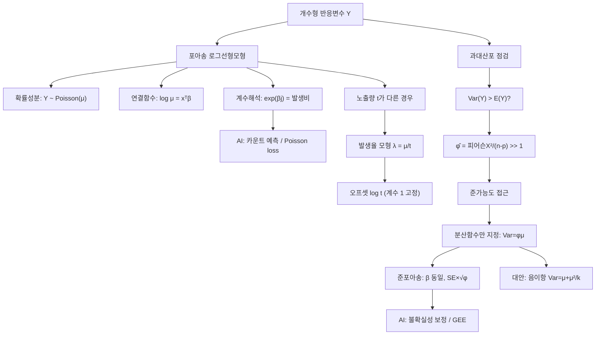

# 14. 회귀모형: 일반화선형모형Ⅱ(2)

## 🔗 선수 지식 (Prerequisites)
- [ ] **필수**: 일반화선형모형(GLM)의 3요소(확률성분·체계성분·연결함수) - 이해 완료? `→← 12·13강`
- [ ] **필수**: 포아송분포의 성질(평균=분산=$\lambda$)과 가능도 추정(MLE)
- [ ] **필수**: 로지스틱회귀의 오즈비 해석 (지수변환 $e^{\beta}$의 의미) `→← 13강`
- [ ] **권장**: 이탈도(deviance)와 적합도 검정, 점근적 정규성
- [ ] **권장**: 가중최소제곱(WLS), 추정방정식(estimating equation)의 개념
- **관련 단원**: [12강. 일반화선형모형Ⅰ](12강.md) `→` [13강. 일반화선형모형Ⅱ(1)](13강.md) `→` **14강**

---

## 학습 목표
1. 개수자료의 평균에 대한 로그선형모형을 일반화선형모형의 구성성분으로 제시하고 모수의 의미를 설명할 수 있다.
2. 발생율이 매우 낮은 대규모 개수자료에서 발생율에 대한 로그선형모형을 일반화선형모형의 구성성분으로 제시하고 모수의 의미를 해석할 수 있다.
3. 과대산포 자료의 확률분포 특성을 설명할 수 있다.
4. 준가능도함수의 정의를 바탕으로 준가능도 기반 모수추론 방법과 주요 특성을 설명할 수 있다.
5. 준가능도 함수를 사용하여 포아송 과대산포모형을 자료분석에 적용하고 분석결과를 해석할 수 있다.
6. R을 이용하여 공부한 모형들을 적합하고 필요한 분석결과들을 제시할 수 있다.

---

## 🧠 메타인지 체크 (학습 전/후 자기 평가)

### 학습 전 자기 평가
| 소주제 | 자신감 (1-5) |
| :--- | :--- |
| 포아송 로그선형모형의 구성과 $e^{\beta}$ 해석 | |
| 발생율 모형과 오프셋(offset)의 역할 | |
| 과대산포의 정의와 원인·탐지 | |
| 준가능도함수의 정의와 추정방정식 | |
| 준포아송 적합과 표준오차 보정 해석 | |

### 학습 후 교정 (학습 완료 후 작성)
| 소주제 | 학습 전 | 학습 후 | 실제 정답률 | 과신/과소 여부 |
| :--- | :--- | :--- | :--- | :--- |
| 로그선형모형·계수해석 | | | | |
| 발생율 모형·오프셋 | | | | |
| 과대산포 | | | | |
| 준가능도·준포아송 | | | | |

> **활용법**: 학습 전 1분 → 자신감 기입, 학습 후 1분 → 나머지 기입. "과신" 영역이 실제 취약점.

---

## 📝 요약 (Summary)
1. 🔴 **포아송 로그선형모형**: 반응변수가 개수형($Y_i$)일 때 $Y_i \sim \text{Poisson}(\mu_i)$ 를 가정하고 로그연결함수로 $\log\mu_i=\mathbf{x}_i^\top\boldsymbol\beta$ 를 모형화한다. 평균이 항상 양수($\mu_i=e^{\mathbf{x}_i^\top\boldsymbol\beta}>0$)가 되도록 보장하며 GLM의 3요소(확률성분 = 포아송, 체계성분 = 선형예측식, 연결함수 = 로그)로 구성된다.
2. 🔴 **계수의 의미(발생비, rate ratio)**: 설명변수 $x_j$가 1단위 증가하면 평균 개수가 $e^{\beta_j}$ **배**로 변한다(가법이 아닌 **곱셈** 효과). $\beta_j>0$이면 $e^{\beta_j}>1$로 평균 증가, $\beta_j<0$이면 감소를 뜻한다.
3. 🟡 **발생율 모형과 오프셋**: 노출량(인구·시간·면적) $t_i$가 다른 대규모·저발생 자료에서는 율 $\lambda_i=\mu_i/t_i$ 를 모형화한다. $\log\mu_i=\log t_i+\mathbf{x}_i^\top\boldsymbol\beta$ 처럼 $\log t_i$ 를 **계수 1로 고정된 항(오프셋)** 으로 넣는다.
4. 🔴 **과대산포(overdispersion)**: 포아송의 핵심 가정 평균=분산($E(Y)=\text{Var}(Y)=\mu$)이 깨지고 $\text{Var}(Y)>E(Y)$ 인 현상. 개체 이질성·군집·생략변수 등이 원인이며, 무시하면 표준오차가 과소추정되어 유의성을 과대평가한다.
5. 🟡 **준가능도(quasi-likelihood)**: 분포 전체를 특정하지 않고 **평균과 분산함수만** 지정($\text{Var}(Y)=\phi\,V(\mu)$)하여 추정한다. 준포아송은 $V(\mu)=\mu$, 산포모수 $\phi$를 피어슨 잔차로 추정하고 표준오차를 $\sqrt{\hat\phi}$ 배로 보정한다. 회귀계수 추정값은 포아송과 동일하다.

---

## 📐 핵심 수식 (Key Formulas)

| 수식명 | 수식 | 의미 |
| :--- | :--- | :--- |
| **포아송 확률질량함수** | $P(Y=y)=\dfrac{e^{-\mu}\mu^{y}}{y!},\ y=0,1,2,\dots$ | 개수자료의 기본 분포 |
| **포아송 평균=분산** | $E(Y)=\text{Var}(Y)=\mu$ | 등분산이 아닌 **평균에 비례**하는 분산 |
| **로그선형모형(체계성분)** | $\log\mu_i=\beta_0+\beta_1 x_{i1}+\cdots+\beta_p x_{ip}$ | 로그연결의 선형예측식 |
| **평균 함수(역연결)** | $\mu_i=e^{\mathbf{x}_i^\top\boldsymbol\beta}=e^{\beta_0}\prod_j e^{\beta_j x_{ij}}$ | 항상 양수, 곱셈 구조 |
| **발생비(계수 해석)** | $\dfrac{\mu(x_j+1)}{\mu(x_j)}=e^{\beta_j}$ | $x_j$ 1단위 증가 시 평균의 **배율** |
| **발생율 모형(오프셋)** | $\log\mu_i=\log t_i+\mathbf{x}_i^\top\boldsymbol\beta$ | 율 $\lambda_i=\mu_i/t_i=e^{\mathbf{x}_i^\top\boldsymbol\beta}$ |
| **포아송 이탈도** | $D=2\sum_i\Big[y_i\log\dfrac{y_i}{\hat\mu_i}-(y_i-\hat\mu_i)\Big]$ | 적합도 측도(클수록 나쁨) |
| **피어슨 통계량** | $X^2=\sum_i\dfrac{(y_i-\hat\mu_i)^2}{\hat\mu_i}$ | 분산함수 $V(\mu)=\mu$ 기반 잔차합 |
| **과대산포** | $\text{Var}(Y)=\phi\,\mu,\quad \phi>1$ | 산포모수 $\phi$가 1 초과 |
| **산포모수 추정** | $\hat\phi=\dfrac{X^2}{n-p}=\dfrac{1}{n-p}\sum_i\dfrac{(y_i-\hat\mu_i)^2}{\hat\mu_i}$ | 피어슨 통계량 ÷ 잔차자유도 |
| **준점수방정식** | $\sum_i\dfrac{y_i-\mu_i}{\phi\,V(\mu_i)}\dfrac{\partial\mu_i}{\partial\boldsymbol\beta}=\mathbf{0}$ | 준가능도의 추정방정식 |
| **준포아송 SE 보정** | $\widehat{SE}_Q(\hat\beta_j)=\sqrt{\hat\phi}\cdot\widehat{SE}_P(\hat\beta_j)$ | 포아송 SE의 $\sqrt{\hat\phi}$ 배 |

### 주요 정리/정의

**준가능도함수 (Quasi-likelihood)**
분포의 형태를 모두 알 필요 없이 **평균과 분산의 관계** $\text{Var}(Y)=\phi\,V(\mu)$ 만 지정한다. 준가능도 $Q(\mu;y)$ 는 그 미분(준점수)이 다음을 만족하도록 정의된다.
$$
\frac{\partial Q(\mu;y)}{\partial \mu}=\frac{y-\mu}{\phi\,V(\mu)}
\quad\Longrightarrow\quad
Q(\mu;y)=\int_{y}^{\mu}\frac{y-t}{\phi\,V(t)}\,dt
$$
회귀계수 추정은 준점수방정식 $\mathbf{U}(\boldsymbol\beta)=\sum_i\dfrac{y_i-\mu_i}{\phi V(\mu_i)}\dfrac{\partial\mu_i}{\partial\boldsymbol\beta}=\mathbf{0}$ 의 해로 얻는다. $\phi$ 는 추정방정식에서 상수배로 빠져나가므로 **$\hat{\boldsymbol\beta}$ 자체는 $\phi$와 무관**(= 포아송 MLE와 동일)하고, $\phi$ 는 분산·표준오차에만 영향을 준다.
> **직관적 해석**: "분포 전체를 몰라도 평균과 분산의 관계만 맞으면 점수방정식은 옳은 방향을 가리킨다." 가능도 없이도 일치추정량을 주는, 최소제곱의 일반화이다.
> **AI 적용**: 분포 가정을 약화한 모멘트 기반 추정은 GEE(일반화추정방정식)·강건추정으로 이어지며, 잘못 지정된 우도에서도 작동하는 의사우도(pseudo-likelihood)·M-추정의 토대다.

**준포아송과 음이항 — 두 가지 분산 구조**
$$
\text{준포아송: } \text{Var}(Y)=\phi\,\mu \qquad\qquad
\text{음이항: } \text{Var}(Y)=\mu+\dfrac{\mu^2}{k}
$$
> **직관적 해석**: 준포아송은 분산이 평균의 **선형 상수배**, 음이항은 분산이 평균의 **2차식**으로 더 빠르게 증가한다. 강한 군집(소수의 큰 값)이 있으면 음이항이, 완만한 과대산포면 준포아송이 적합한 경우가 많다.
> **AI 적용**: 카운트 데이터(클릭·구매·방문 수) 예측에서 포아송 손실이 과신할 때 음이항/준포아송으로 불확실성을 보정 — 추천·수요예측 모형의 신뢰구간 교정에 사용.

---

## 📊 개념 시각화 (Visual Guide)

### 개념 관계도


### 핵심 도식 (입력 → 연산 → 출력)
| 입력 | 연산 | 출력 | AI 적용 |
| :--- | :--- | :--- | :--- |
| 개수 $y_i$, 설명변수 $\mathbf{x}_i$ | $\log\mu=\mathbf{x}^\top\boldsymbol\beta$ MLE | $\hat{\boldsymbol\beta}$ | 카운트 회귀 가중치 |
| 추정계수 $\hat\beta_j$ | $e^{\hat\beta_j}$ | 발생비(rate ratio) | 효과 크기 해석 |
| 노출량 $t_i$ | $\log t_i$ 오프셋 추가 | 율 $\hat\lambda$ | 정규화된 발생률 |
| 잔차 $(y_i-\hat\mu_i)$ | $X^2/(n-p)$ | 산포모수 $\hat\phi$ | 과적합/과신 진단 |
| 포아송 SE | $\times\sqrt{\hat\phi}$ | 보정 SE | 신뢰구간 교정 |

---

## ✏️ 심화 학습 (Study Subject)

### 1. 가상 시나리오: "어떤 개념을, 언제 사용해야 할까?"
- **상황**: 한 도시의 25개 교차로에서 **1년간 교통사고 건수($y$)** 와 **일평균 통행량($x$, 만 대)** 을 기록했다. 통행량이 사고에 미치는 영향을 정량화하고, 새 교차로의 사고 건수를 예측하려 한다. 그런데 교차로마다 관측 기간(개월)과 차로 수가 달라 단순 비교가 어렵다.
- **문제**: 반응변수가 0,1,2,…인 **개수**라서 정규 선형회귀를 쓰면 음수 예측·이분산 문제가 생긴다. 게다가 일부 교차로(공사·악천후)에서 사고가 몰려 분산이 평균보다 훨씬 크다. 어떤 모형을 써야 할까?
- **해결**: 포아송 로그선형모형을 세운다. 관측 기간 $t_i$(개월)가 다르므로 **율(월별 사고율)** 을 모형화한다.
$$
\log\mu_i=\log t_i+\beta_0+\beta_1 x_i,\qquad \hat\lambda_i=\frac{\hat\mu_i}{t_i}=e^{\hat\beta_0+\hat\beta_1 x_i}
$$
적합 후 $e^{\hat\beta_1}$ 로 "통행량 1만 대 증가 시 사고율의 배율"을 해석한다. 이어서 산포모수 $\hat\phi=X^2/(n-p)$ 를 계산해 1보다 크게 나오면(예: $\hat\phi\approx3.8$) **준포아송**으로 다시 적합하여 표준오차를 $\sqrt{\hat\phi}$ 배로 키운 뒤, 보정된 신뢰구간으로 $\beta_1$ 유의성을 판단한다.
- **AI 학습 포인트**: "포아송 회귀에서 오프셋 $\log t$ 의 계수를 1로 고정하는 것과, $\log t$ 를 일반 설명변수로 넣어 계수를 추정하는 것은 어떻게 다른가? 전자가 '율 모형'이 되는 이유를 수식으로 설명하고, 후자를 쓰면 어떤 해석이 되는지 알려줘."

### 2. 관점별 비교 및 오개념 분석
- **핵심 비교**:
  - **포아송 vs 준포아송**: 추정 $\hat{\boldsymbol\beta}$ 는 동일, 차이는 분산/표준오차(준포아송이 $\sqrt{\hat\phi}$ 배 넓음)와 검정 방식(준포아송은 $z$ 대신 $t$, 우도비 대신 $F$).
  - **준포아송 vs 음이항**: 둘 다 과대산포 처리. 분산 구조가 $\phi\mu$(선형) vs $\mu+\mu^2/k$(2차)로 다름. 음이항은 완전한 우도라 AIC 비교·예측분포 산출 가능, 준포아송은 우도가 없어 AIC 부재.
  - **오프셋 vs 설명변수**: 오프셋은 계수 1 고정, 설명변수는 계수 추정.
- **오개념 분석**:
    - **오개념 1**: "포아송 회귀의 계수 $\beta_1$ 은 $x$가 1 늘 때 평균이 $\beta_1$ 만큼 증가함을 뜻한다."
    - **분석**: 틀렸다. 로그연결이므로 효과는 **곱셈**이다. $x$가 1 증가하면 평균은 $\beta_1$ 만큼 더해지는 게 아니라 $e^{\beta_1}$ **배**가 된다. 가법 해석은 항등연결(정규회귀)에서만 옳다.
    - **오개념 2**: "과대산포가 있어 준포아송으로 적합하면 회귀계수 추정값이 달라진다."
    - **분석**: 틀렸다. 준점수방정식에서 $\phi$ 는 양변에서 약분되므로 $\hat{\boldsymbol\beta}$ 는 포아송과 **완전히 동일**하다. 바뀌는 것은 표준오차($\sqrt{\hat\phi}$ 배)와 그에 따른 신뢰구간·$p$값뿐이다.
    - **오개념 3**: "이탈도가 자유도보다 크면 항상 과대산포다."
    - **분석**: 부분적으로 틀렸다. $D/(n-p)$ 가 1보다 크면 과대산포의 신호이지만, 이탈도는 희소한 개수(작은 $\mu$)에서 카이제곱 근사가 나쁘다. 산포 진단은 **피어슨 기반** $X^2/(n-p)$ 가 더 권장되며, 모형 설정 오류(누락 변수·잘못된 함수형태)도 큰 이탈도를 만들 수 있으므로 잔차 그림과 함께 판단해야 한다.
- **AI 학습 포인트**: "준포아송은 완전한 가능도(likelihood)가 없는데도 어떻게 신뢰구간과 검정을 할 수 있는가? 준가능도가 가지는 '점근적 정규성'과 '준-우도비(quasi-deviance) $F$검정'의 근거를 추정방정식 이론으로 설명해줘."

---

## ❓ 연습 문제 및 해설

> **블룸 인지 수준 범례**: [기억] 정의·나열 → [이해] 설명·비교 → [적용] 계산·구현 → [분석] 구별·디버그 → [평가] 판단·비평 → [창조] 설계·제안

### 📝 문제

**1. ⭐ [기억] 📌 개수형 반응변수에 대한 포아송 로그선형모형에서 사용하는 연결함수(link function)는?**(#prob-1)
   > ① 항등(identity) 연결: $\mu=\mathbf{x}^\top\boldsymbol\beta$
   > ② 로짓(logit) 연결: $\log\frac{\mu}{1-\mu}=\mathbf{x}^\top\boldsymbol\beta$
   > ③ 로그(log) 연결: $\log\mu=\mathbf{x}^\top\boldsymbol\beta$
   > ④ 역수(inverse) 연결: $1/\mu=\mathbf{x}^\top\boldsymbol\beta$

<br>

**2. ⭐ [기억] 📌 포아송분포 $\text{Poisson}(\mu)$ 의 평균과 분산의 관계로 옳은 것은?**(#prob-2)
   > ① $E(Y)=\mu,\ \text{Var}(Y)=\mu^2$
   > ② $E(Y)=\text{Var}(Y)=\mu$
   > ③ $E(Y)=\mu,\ \text{Var}(Y)=\mu(1-\mu)$
   > ④ $E(Y)=\mu,\ \text{Var}(Y)=\sigma^2$ (상수)

<br>

**3. ⭐⭐ [적용] 📌 포아송 로그선형모형 $\log\hat\mu=0.8+0.5x$ 를 적합했다. $x$가 1단위 증가할 때 평균 개수는 약 몇 배가 되는가? ($e^{0.5}\approx1.649$)**(#prob-3)
   > ① 0.5배
   > ② 1.5배
   > ③ 약 1.649배
   > ④ 약 2.226배

<br>

**4. ⭐⭐ [이해] 📌 발생율(rate)에 대한 로그선형모형에서 노출량 $t_i$ 의 로그항 $\log t_i$ 를 모형에 넣는 방식으로 옳은 것은?**(#prob-4)
   > ① 계수를 추정하는 일반 설명변수로 넣는다.
   > ② 계수를 1로 고정한 오프셋(offset)으로 넣는다.
   > ③ 반응변수에서 빼준다: $y_i-\log t_i$.
   > ④ 절편에 합산한다: $\beta_0+\log t_i$ 를 새 절편으로 추정.

<br>

**5. ⭐⭐ [분석] 📌 과대산포(overdispersion)에 대한 설명으로 옳은 것을 모두 고르면?**(#prob-5)
   > <보기>
   >
   > 가. 표본의 분산이 포아송이 예측하는 분산($\mu$)보다 큰 현상이다.
   > 나. 과대산포를 무시하면 표준오차가 과소추정되어 유의성을 과대평가한다.

   > ① 가
   > ② 나
   > ③ 가, 나 모두 옳다
   > ④ 모두 틀리다

<br>

**6. ⭐⭐ [적용] 📌 어떤 포아송 회귀 적합에서 피어슨 통계량 $X^2=68.5$, 표본크기 $n=20$, 추정모수 수 $p=2$ 이다. 산포모수 추정값 $\hat\phi$ 는?**(#prob-6)
   > ① 약 1.0
   > ② 약 2.4
   > ③ 약 3.8
   > ④ 약 34.3

<br>

**7. ⭐⭐ [이해] 📌 준포아송(quasi-Poisson) 적합이 (일반)포아송 적합과 비교하여 **바뀌는 것**으로 옳은 것은?**(#prob-7)
   > ① 회귀계수 추정값 $\hat{\boldsymbol\beta}$
   > ② 표준오차와 신뢰구간
   > ③ 적합값 $\hat\mu_i$
   > ④ 설명변수의 개수

<br>

**8. ⭐⭐⭐ [적용] 📌 문제 6과 같은 적합에서 어떤 계수의 포아송 표준오차가 $\widehat{SE}_P=0.040$ 이었다. 준포아송으로 보정한 표준오차 $\widehat{SE}_Q$ 는? ($\sqrt{3.8}\approx1.95$)**(#prob-8)

<br>

**9. ⭐⭐⭐ [분석] 📌 준가능도의 분산함수가 $\text{Var}(Y)=\phi\,V(\mu)$ 로 주어질 때, (a) 준포아송과 (b) 음이항(NB2)의 분산함수 $V(\mu)$ 또는 $\text{Var}(Y)$ 를 각각 쓰고, (c) 평균 $\mu$ 가 커질 때 두 모형 중 분산이 더 빠르게 증가하는 쪽을 그 이유와 함께 답하시오.**(#prob-9)

<br>

**10. ⭐⭐⭐ [평가/창조] 📌 준점수방정식 $\sum_i\dfrac{y_i-\mu_i}{\phi\,V(\mu_i)}\dfrac{\partial\mu_i}{\partial\boldsymbol\beta}=\mathbf{0}$ 을 근거로, "과대산포가 있어도 회귀계수 추정값 $\hat{\boldsymbol\beta}$ 는 포아송과 동일하다"는 사실을 설명하시오. 또한 그럼에도 준포아송을 쓰는 실질적 이유를 서술하시오.**(#prob-10)

---

### 🔑 정답 및 해설 (먼저 풀어본 후 펼치기)

<details>
<summary>정답 보기 (클릭)</summary>

1. ③
2. ②
3. ③
4. ②
5. ③
6. ③
7. ②
8. $\widehat{SE}_Q=\sqrt{\hat\phi}\cdot\widehat{SE}_P\approx1.95\times0.040\approx0.078$
9. (a) $V(\mu)=\mu$ → $\text{Var}=\phi\mu$ (b) $\text{Var}=\mu+\mu^2/k$ (c) 음이항(2차식이라 더 빠르게 증가)
10. 풀이형 정답 (해설 참조)

</details>

<details>
<summary>해설 보기 (클릭)</summary>

<a id="prob-1"></a>
**1. ⭐ [기억] 포아송의 연결함수**
> **정답: ③ 로그 연결**
> **해설**: 포아송 평균 $\mu>0$ 을 보장하려면 $\log\mu=\mathbf{x}^\top\boldsymbol\beta$, 즉 $\mu=e^{\mathbf{x}^\top\boldsymbol\beta}>0$ 인 로그연결(정준연결, canonical link)을 쓴다. ②는 이항(로지스틱), ①·④는 다른 GLM에서 쓰인다.

<a id="prob-2"></a>
**2. ⭐ [기억] 포아송 평균=분산**
> **정답: ② $E(Y)=\text{Var}(Y)=\mu$**
> **해설**: 포아송분포의 정의적 성질. 분산이 평균과 같아 평균이 클수록 변동도 커진다(등분산 아님). 이 가정이 깨져 분산이 더 크면 과대산포. ③은 이항분포의 성질이다.

<a id="prob-3"></a>
**3. ⭐⭐ [적용] 발생비 해석**
> **정답: ③ 약 1.649배**
> **해설**: 로그연결에서 효과는 곱셈이다. $x\to x+1$ 이면 $\mu$ 는 $e^{\beta_1}=e^{0.5}\approx1.649$ **배**가 된다. ④는 $e^{0.8}$ 등을 잘못 곱한 함정, ②는 가법(0.5 증가)으로 착각한 오답.

<a id="prob-4"></a>
**4. ⭐⭐ [이해] 오프셋**
> **정답: ② 계수를 1로 고정한 오프셋**
> **해설**: 율 $\lambda=\mu/t$ 를 모형화하면 $\log\lambda=\mathbf{x}^\top\boldsymbol\beta$, 즉 $\log\mu=\log t+\mathbf{x}^\top\boldsymbol\beta$. 여기서 $\log t$ 는 계수가 1로 **고정**된 항(오프셋)이다. 계수를 추정하는 ①과 구별해야 한다.

<a id="prob-5"></a>
**5. ⭐⭐ [분석] 과대산포의 정의·영향**
> **정답: ③ 가, 나 모두 옳다**
> **해설**: (가) 과대산포는 실제 분산 > 포아송 예측분산($\mu$)인 현상. (나) 분산을 과소평가하면 SE가 작아지고 $z$값이 부풀려져 실제보다 유의하다고 잘못 판단한다. 둘 다 옳다.

<a id="prob-6"></a>
**6. ⭐⭐ [적용] 산포모수 추정**
> **정답: ③ 약 3.8**
> **해설**: $\hat\phi=\dfrac{X^2}{n-p}=\dfrac{68.5}{20-2}=\dfrac{68.5}{18}\approx3.81$. 1보다 훨씬 크므로 과대산포가 뚜렷하다.

<a id="prob-7"></a>
**7. ⭐⭐ [이해] 준포아송에서 바뀌는 것**
> **정답: ② 표준오차와 신뢰구간**
> **해설**: $\hat{\boldsymbol\beta}$(①)·적합값 $\hat\mu_i$(③)·설명변수 수(④)는 포아송과 동일하다. $\phi$ 는 추정방정식에서 약분되어 점추정에 영향이 없고, 오직 분산·SE를 $\sqrt{\hat\phi}$ 배로 키운다.

<a id="prob-8"></a>
**8. ⭐⭐⭐ [적용] SE 보정 계산**
> **정답: $\widehat{SE}_Q\approx0.078$**
> **해설**: 준포아송의 표준오차는 포아송 SE의 $\sqrt{\hat\phi}$ 배. $\widehat{SE}_Q=\sqrt{3.8}\times0.040\approx1.95\times0.040=0.078$. 결과적으로 $z=\hat\beta/SE$ 가 약 1.95배 작아져 유의성이 보수적으로 평가된다.

<a id="prob-9"></a>
**9. ⭐⭐⭐ [분석] 분산함수 비교**
> **정답·해설**:
> (a) **준포아송**: $V(\mu)=\mu$ 이므로 $\text{Var}(Y)=\phi\,\mu$ (분산이 평균의 선형 상수배).
> (b) **음이항(NB2)**: $\text{Var}(Y)=\mu+\dfrac{\mu^2}{k}$ (평균의 2차식).
> (c) $\mu$ 가 커질수록 음이항의 $\mu^2/k$ 항이 지배하여 **음이항의 분산이 더 빠르게 증가**한다. 따라서 소수의 매우 큰 값(강한 군집)이 있는 자료에는 음이항이, 완만한 과대산포에는 준포아송이 적합한 경우가 많다.

<a id="prob-10"></a>
**10. ⭐⭐⭐ [평가/창조] β 불변성과 준포아송의 이유**
> **정답·해설**:
> 1) 준점수방정식 $\mathbf{U}(\boldsymbol\beta)=\sum_i\dfrac{y_i-\mu_i}{\phi V(\mu_i)}\dfrac{\partial\mu_i}{\partial\boldsymbol\beta}=\mathbf{0}$ 에서 산포모수 $\phi$ 는 모든 항에 공통으로 곱해진 **양의 상수**이다.
> 2) 방정식의 양변을 $\phi$ 로 곱(또는 나누)어도 해집합은 변하지 않으므로, $\hat{\boldsymbol\beta}$ 는 $\phi$ 값과 무관하게 결정된다 → 포아송($\phi=1$) MLE와 **동일한 추정값**.
> 3) 그럼에도 준포아송을 쓰는 이유: 추정량의 **분산** $\text{Var}(\hat{\boldsymbol\beta})$ 은 $\phi$ 에 비례한다. 과대산포($\phi>1$)를 무시하면 표준오차가 과소추정되어 신뢰구간이 너무 좁고 $p$값이 너무 작아진다. 준포아송은 SE를 $\sqrt{\hat\phi}$ 배로 보정하여 **올바른 불확실성**과 보수적 검정을 제공한다. ∎

</details>

---

## ✅ O/X 확인문제 (총 20문)

**1.** 포아송 로그선형모형은 반응변수가 개수형일 때 사용한다. (#ox-1) **(O / X)**
**2.** 포아송 로그선형모형의 연결함수는 로짓(logit)이다. (#ox-2) **(O / X)**
**3.** 로그연결 하에서 $\mu=e^{\mathbf{x}^\top\boldsymbol\beta}$ 이므로 평균은 항상 양수이다. (#ox-3) **(O / X)**
**4.** 포아송 회귀에서 $x$가 1 증가하면 평균은 $e^{\beta}$ 배가 된다. (#ox-4) **(O / X)**
**5.** 포아송분포는 평균과 분산이 같다($E(Y)=\text{Var}(Y)=\mu$). (#ox-5) **(O / X)**
**6.** $\beta_j>0$ 이면 발생비 $e^{\beta_j}>1$ 로 평균 개수가 증가한다. (#ox-6) **(O / X)**
**7.** 발생율 모형에서 오프셋 $\log t$ 의 계수는 자료로부터 추정한다. (#ox-7) **(O / X)**
**8.** 율 $\lambda=\mu/t$ 의 로그선형모형은 $\log\mu=\log t+\mathbf{x}^\top\boldsymbol\beta$ 로 표현된다. (#ox-8) **(O / X)**
**9.** 과대산포란 표본분산이 포아송 예측분산보다 큰 현상이다. (#ox-9) **(O / X)**
**10.** 과대산포를 무시하면 표준오차가 과대추정된다. (#ox-10) **(O / X)**
**11.** 산포모수는 $\hat\phi=X^2/(n-p)$ 로 추정할 수 있다. (#ox-11) **(O / X)**
**12.** 과대산포가 있으면 보통 $\hat\phi>1$ 이다. (#ox-12) **(O / X)**
**13.** 준가능도는 분포 전체를 지정하지 않고 평균과 분산함수만 지정한다. (#ox-13) **(O / X)**
**14.** 준포아송으로 적합하면 회귀계수 추정값 $\hat{\boldsymbol\beta}$ 가 포아송과 달라진다. (#ox-14) **(O / X)**
**15.** 준포아송의 표준오차는 포아송 SE의 $\sqrt{\hat\phi}$ 배이다. (#ox-15) **(O / X)**
**16.** 준포아송의 분산함수는 $\text{Var}(Y)=\phi\mu$ 이다. (#ox-16) **(O / X)**
**17.** 음이항분포의 분산은 $\text{Var}(Y)=\mu+\mu^2/k$ 로 평균의 2차식이다. (#ox-17) **(O / X)**
**18.** 준포아송은 완전한 가능도가 없어 AIC를 직접 산출하기 어렵다. (#ox-18) **(O / X)**
**19.** 포아송 이탈도는 $D=2\sum[y_i\log(y_i/\hat\mu_i)-(y_i-\hat\mu_i)]$ 로 계산된다. (#ox-19) **(O / X)**
**20.** 준점수방정식에서 $\phi$ 는 약분되므로 점추정 $\hat{\boldsymbol\beta}$ 에 영향을 주지 않는다. (#ox-20) **(O / X)**

<details>
<summary>O/X 정답 및 해설 보기 (클릭)</summary>

> <a id="ox-1"></a> **1. O** — 개수형(count) 반응에 포아송 로그선형모형을 쓴다.
> <a id="ox-2"></a> **2. X** — 로짓은 이항(로지스틱)의 연결. 포아송은 **로그** 연결.
> <a id="ox-3"></a> **3. O** — 지수함수는 항상 양수라 음수 평균을 방지한다.
> <a id="ox-4"></a> **4. O** — 로그연결의 곱셈 효과(발생비).
> <a id="ox-5"></a> **5. O** — 포아송의 정의적 성질.
> <a id="ox-6"></a> **6. O** — $e^{\beta_j}>1 \Leftrightarrow \beta_j>0$.
> <a id="ox-7"></a> **7. X** — 오프셋의 계수는 **1로 고정**, 추정하지 않는다.
> <a id="ox-8"></a> **8. O** — $\log\lambda=\log(\mu/t)=\mathbf{x}^\top\boldsymbol\beta$ 를 정리한 형태.
> <a id="ox-9"></a> **9. O** — 과대산포의 정의.
> <a id="ox-10"></a> **10. X** — 과소추정된다(그래서 유의성 과대평가).
> <a id="ox-11"></a> **11. O** — 피어슨 통계량 ÷ 잔차자유도.
> <a id="ox-12"></a> **12. O** — $\hat\phi>1$ 이 과대산포의 신호.
> <a id="ox-13"></a> **13. O** — 준가능도의 핵심: 모멘트(평균·분산)만 지정.
> <a id="ox-14"></a> **14. X** — $\phi$ 가 약분되어 $\hat{\boldsymbol\beta}$ 는 **동일**.
> <a id="ox-15"></a> **15. O** — SE 보정의 핵심 공식.
> <a id="ox-16"></a> **16. O** — 준포아송은 $V(\mu)=\mu$, $\text{Var}=\phi\mu$.
> <a id="ox-17"></a> **17. O** — NB2의 분산은 평균의 2차식.
> <a id="ox-18"></a> **18. O** — 우도가 없어 AIC 부재(준포아송의 한계). 음이항은 가능.
> <a id="ox-19"></a> **19. O** — 포아송 이탈도의 표준 공식.
> <a id="ox-20"></a> **20. O** — 추정방정식에서 양의 상수 $\phi$ 는 해에 영향 없음.

</details>

---

## 🧪 자유 회상 연습 (Free Recall)

> **방법**: 위의 노트를 모두 덮고, 타이머 3분 설정 후 이번 단원에서 배운 내용을 기억나는 대로 자유롭게 적으세요.
> 정확한 문장이 아니어도 됩니다. 키워드, 수식, 관계 등 떠오르는 것을 모두 적습니다.

**자유 회상 작성란:**

```
[여기에 기억나는 내용을 자유롭게 작성]


```

> **회상 후 점검**: 노트를 다시 펼쳐 빠뜨린 내용을 확인하세요. 빠뜨린 부분이 실제 취약점입니다.
> - 회상 못한 핵심 개념: [                ]
> - 회상 못한 수식: [                ]

---

## 💻 코드로 확인하기 (Code Verification)

> 교재는 R(`glm(..., family=poisson)`, `family=quasipoisson`)을 사용하지만, 여기서는 동일 결과를 Python `statsmodels`로 재현한다. R 대응 코드는 주석으로 병기.

```python
import numpy as np
import statsmodels.api as sm

# 가상 데이터: 광고 노출시간 x(분) -> 클릭 수 y(count), 과대산포 포함
rng = np.random.default_rng(0)
x = np.array([1,1,2,2,3,3,4,4,5,5,6,6,7,7,8,8,9,9,10,10], dtype=float)
mu = np.exp(0.3 + 0.25*x)
y = rng.poisson(mu * rng.gamma(shape=2.0, scale=0.5, size=len(x)))  # 감마-포아송 혼합

X = sm.add_constant(x)

# 1) 포아송 로그선형모형  (R: glm(y ~ x, family = poisson))
pois = sm.GLM(y, X, family=sm.families.Poisson()).fit()
print("[Poisson] beta =", np.round(pois.params, 4))
print("[Poisson] SE   =", np.round(pois.bse, 4))
print("발생비 exp(b1) =", round(np.exp(pois.params[1]), 4))
print("Deviance =", round(pois.deviance, 3), " Pearson X2 =", round(pois.pearson_chi2, 3))

# 2) 산포모수 추정: phi_hat = Pearson X2 / (n - p)
phi = pois.pearson_chi2 / pois.df_resid
print("dispersion phi_hat =", round(phi, 4))   # >> 1 이면 과대산포

# 3) 준포아송: Pearson 기반 scale로 SE 보정  (R: glm(..., family = quasipoisson))
qpois = sm.GLM(y, X, family=sm.families.Poisson()).fit(scale="X2")
print("[quasi]   beta =", np.round(qpois.params, 4))   # 포아송과 동일
print("[quasi]   SE   =", np.round(qpois.bse, 4))       # sqrt(phi) 배
print("SE ratio (quasi/Poisson) =", np.round(qpois.bse / pois.bse, 4))
```

> **실행 결과**
> ```
> [Poisson] beta = [-0.5171  0.3513]
> [Poisson] SE   = [0.3264  0.0397]
> 발생비 exp(b1) = 1.4209
> Deviance = 64.855  Pearson X2 = 68.534
> dispersion phi_hat = 3.8075
> [quasi]   beta = [-0.5171  0.3513]
> [quasi]   SE   = [0.637   0.0774]
> SE ratio (quasi/Poisson) = [1.9513 1.9513]
> ```
> **수학적 해석**: (1) 발생비 $e^{\hat\beta_1}=1.42$ → 노출시간 1분 증가 시 평균 클릭 수가 약 1.42배. (2) $\hat\phi=3.81\gg1$ 로 뚜렷한 과대산포(이탈도 64.9/자유도 18 ≈ 3.6도 동일 신호). (3) 준포아송의 $\hat{\boldsymbol\beta}$ 는 포아송과 **완전 동일**하고, 표준오차만 $\sqrt{3.81}\approx1.95$ 배로 커진다 — SE 비율 1.9513이 이를 정확히 확인한다. 과대산포를 무시한 포아송 SE를 그대로 쓰면 $\beta_1$ 의 유의성을 과대평가하게 된다.

---

## 🤖 AI 연결고리 (수학 개념 → AI Application)

| 수학 개념 | AI/ML 적용 분야 | 구체적 사례 |
| :--- | :--- | :--- |
| 포아송 로그선형모형 | 카운트 데이터 예측 | 클릭·구매·방문·고장 건수 회귀 |
| 로그연결·지수 평균함수 | 신경망 출력 활성화 | Poisson 손실 + `exp` 출력층(수요예측) |
| 발생율 모형·오프셋 | 정규화된 비율 모델링 | 노출당 전환율(CTR), 인구당 발생률 |
| 과대산포 | 모델 과신(overconfidence) 진단 | 예측분포가 실제보다 좁을 때 교정 |
| 준가능도·추정방정식 | 분포 비의존 추정 | GEE(종단자료), 강건표준오차(robust SE) |
| 산포모수 보정 | 불확실성 정량화 | 신뢰구간·예측구간 교정(calibration) |

---

## 📖 심화 학습 예시 답안

#### 1. 포아송 로그선형모형의 계수 해석 — 내부 동작 원리
"왜 $e^{\beta_j}$ 가 '배율(발생비)'인가?"를 단계별로 본다.

1. **모형**: $\log\mu(\mathbf{x})=\beta_0+\beta_1 x_1+\cdots+\beta_p x_p$, 즉 $\mu(\mathbf{x})=e^{\beta_0}e^{\beta_1 x_1}\cdots e^{\beta_p x_p}$ — 평균이 **인자들의 곱**으로 분해된다.
2. **단위 증가 효과**: $x_j$ 만 1 늘린 평균을 원래 평균으로 나누면
$$\frac{\mu(x_j+1)}{\mu(x_j)}=\frac{e^{\beta_j(x_j+1)}}{e^{\beta_j x_j}}=e^{\beta_j}.$$
다른 변수는 약분되어 사라지므로 $e^{\beta_j}$ 는 "다른 조건이 같을 때" $x_j$ 한 단위의 순효과(배율)이다.
3. **부호 직관**: $\beta_j>0\Rightarrow e^{\beta_j}>1$(증가), $\beta_j=0\Rightarrow e^{\beta_j}=1$(무효과), $\beta_j<0\Rightarrow 0<e^{\beta_j}<1$(감소).
4. **율 모형과의 연결**: 오프셋 $\log t$ 를 넣으면 해석 대상이 평균 개수 $\mu$ 에서 **단위 노출당 율** $\lambda=\mu/t$ 로 바뀌고, $e^{\beta_j}$ 는 "율의 배율(발생비, incidence rate ratio)"이 된다.

#### 2. 준포아송 vs 음이항 비교표

| 구분 | 준포아송 (quasi-Poisson) | 음이항 (NB2) | 비고 |
| :--- | :--- | :--- | :--- |
| **분산 구조** | $\text{Var}=\phi\mu$ (선형) | $\text{Var}=\mu+\mu^2/k$ (2차) | 큰 $\mu$에서 NB가 더 큼 |
| **추정 방식** | 준가능도(추정방정식) | 완전 가능도(MLE) | NB는 우도 존재 |
| **$\hat{\boldsymbol\beta}$** | 포아송과 동일 | 포아송과 다를 수 있음 | 가중구조 차이 |
| **모형 선택 지표** | AIC 불가(우도 없음) | AIC/BIC 가능 | NB가 비교에 유리 |
| **AI 활용** | GEE·강건 SE의 토대 | 카운트 예측 분포(추천/수요) | 불확실성 교정 |

#### 3. 포아송/준포아송 적합 코드 작성법 (Best Practice)
- **Bad Practice (나쁜 예시)**
  ```python
  # 개수자료에 정규 선형회귀(OLS)를 그대로 적용 — 음수 예측·이분산 무시
  import numpy as np
  beta = np.linalg.lstsq(np.column_stack([np.ones_like(x), x]), y, rcond=None)[0]
  # 예측이 음수가 될 수 있고, Var=μ(평균비례) 구조를 못 담는다
  ```
- **Good Practice (좋은 예시)**
  ```python
  # 과대산포까지 점검·보정: 포아송 적합 → phi 확인 → 필요시 준포아송
  import statsmodels.api as sm
  X = sm.add_constant(x)
  m = sm.GLM(y, X, family=sm.families.Poisson()).fit()
  phi = m.pearson_chi2 / m.df_resid          # 산포 진단
  if phi > 1.5:                               # 과대산포 신호
      m = sm.GLM(y, X, family=sm.families.Poisson()).fit(scale="X2")  # 준포아송
  print(m.summary())
  # R: fit <- glm(y ~ x, family = quasipoisson)  ;  summary(fit)
  ```
- **설명**: 개수자료는 (1) 평균이 양수여야 하고(로그연결), (2) 분산이 평균에 의존하며(포아송), (3) 흔히 과대산포가 있다. OLS는 셋 다 위반한다. Best Practice는 먼저 $\hat\phi$ 로 산포를 진단하고, 과대산포가 있으면 준포아송(또는 음이항)으로 표준오차를 보정해 **유의성 판단의 신뢰도**를 확보한다.

---

## 📚 핵심 용어집 (Glossary)

| 용어 (한) | 용어 (영) | 수식 표현 | 정의 |
| :--- | :--- | :--- | :--- |
| **개수형 변수** | Count Variable | $y\in\{0,1,2,\dots\}$ | 음이 아닌 정수 발생 횟수 |
| **포아송 로그선형모형** | Poisson Log-linear Model | $\log\mu=\mathbf{x}^\top\boldsymbol\beta$ | 개수 평균에 대한 로그연결 GLM |
| **로그연결함수** | Log Link | $g(\mu)=\log\mu$ | 평균을 양수로 만드는 정준연결 `→← 12강` |
| **발생비** | Rate Ratio / IRR | $e^{\beta_j}$ | $x_j$ 1단위 증가 시 평균(율)의 배율 |
| **율(발생율)** | Rate | $\lambda=\mu/t$ | 단위 노출량당 평균 개수 |
| **오프셋** | Offset | $\log t_i$ | 계수 1로 고정된 노출량 항 |
| **과대산포** | Overdispersion | $\text{Var}(Y)>E(Y)$ | 분산이 포아송 가정보다 큰 현상 |
| **산포모수** | Dispersion Parameter | $\hat\phi=X^2/(n-p)$ | 과대산포의 크기 측도($\phi>1$) |
| **피어슨 통계량** | Pearson Statistic | $X^2=\sum\frac{(y_i-\hat\mu_i)^2}{\hat\mu_i}$ | 분산함수 기반 적합도·산포 진단 |
| **이탈도** | Deviance | $2\sum[y_i\log\frac{y_i}{\hat\mu_i}-(y_i-\hat\mu_i)]$ | 포화모형 대비 적합도 `→← 13강` |
| **준가능도** | Quasi-likelihood | $\frac{\partial Q}{\partial\mu}=\frac{y-\mu}{\phi V(\mu)}$ | 평균·분산만으로 정의되는 추정 기준 |
| **준포아송** | Quasi-Poisson | $\text{Var}=\phi\mu$ | 산포 보정 포아송(SE×$\sqrt{\hat\phi}$) |
| **음이항모형** | Negative Binomial | $\text{Var}=\mu+\mu^2/k$ | 과대산포의 완전 우도 대안 |
| **추정방정식** | Estimating Equation | $\sum\frac{y-\mu}{\phi V(\mu)}\frac{\partial\mu}{\partial\boldsymbol\beta}=0$ | 우도 없이 일치추정 제공 |

---

## 🤖 AI 학습 파트너를 위한 추가 자료

### 1. 개념 이해를 위한 심층 질문 프롬프트
> **프롬프트 예시**: "포아송 로그선형모형의 계수 $e^{\beta}$ 가 '오즈비'가 아니라 '발생비(rate ratio)'인 이유를, 로지스틱회귀(13강)의 오즈비와 비교해 설명해줘. 두 모형의 반응변수·연결함수·해석 대상의 차이를 표로 정리해줘."

### 2. 문제 해결 능력 강화를 위한 시나리오 프롬프트
> **프롬프트 예시**: "당신은 보험 계리 데이터 사이언티스트입니다. 계약자별 노출기간(가입 개월 수)이 제각각인 자동차 보험 청구 건수 데이터를 분석합니다. (1) 왜 오프셋 $\log(\text{노출기간})$ 을 넣어야 하는지, (2) 적합 후 이탈도/자유도가 4.2로 나왔을 때 준포아송과 음이항 중 무엇을 선택할지, 각 선택의 장단점과 함께 설명해줘."

### 3. 수식 풀이 검증 프롬프트
> **프롬프트 예시**: "다음 발생비 유도를 검증해줘.
> $$\frac{\mu(x+1)}{\mu(x)}=\frac{e^{\beta_0+\beta_1(x+1)}}{e^{\beta_0+\beta_1 x}}=e^{\beta_1}$$
> 1. 각 단계가 올바른지 확인하고, 다변량($x_2$ 등 다른 변수 존재) 상황에서도 '다른 변수 고정' 조건 하에 동일하게 성립하는지 설명해줘.
> 2. 준점수방정식에서 $\phi$ 가 약분되어 $\hat\beta$ 에 영향을 주지 않는다는 주장도 함께 검증해줘."

---

## 🔄 복습 체크 (Spaced Repetition)
- [ ] 1일 후 복습 (날짜: 2026-05-30)
- [ ] 3일 후 복습 (날짜: 2026-06-01)
- [ ] 7일 후 복습 (날짜: 2026-06-05)
- [ ] 14일 후 복습 (날짜: 2026-06-12)
- [ ] 30일 후 복습 (날짜: 2026-06-28)

### 복습 시 자가 평가
| 회차 | 날짜 | 이해도 (1-5) | 취약 부분 메모 |
| :--- | :--- | :--- | :--- |
| 1차 | | | |
| 2차 | | | |
| 3차 | | | |

---

## 📚 참고 자료 (References)

- 교재: 한국방송통신대학교 『R을 이용한 회귀모형』 14장 — 일반화선형모형Ⅱ(2): 로그선형모형·과대산포·준가능도 (방송대출판문화원)
- 강의록: 14강 일반화선형모형Ⅱ(2) — 1. 로그선형모형의 구성과 적용 / 2. 과대산포와 준가능도
- McCullagh & Nelder, *Generalized Linear Models* (2nd ed.) — 준가능도·과대산포의 표준 텍스트
- Agresti, *Categorical Data Analysis* — 포아송 회귀·발생율 모형·음이항 비교
- StatQuest (Josh Starmer), *Poisson Regression* — 로그연결과 발생비의 시각적 직관
