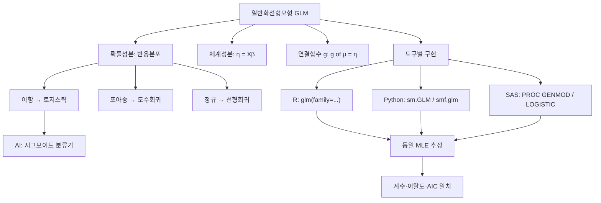

# 15. 회귀모형: Python & SAS 활용(일반화선형모형)

## 🔗 선수 지식 (Prerequisites)
- [ ] **필수**: 일반화선형모형(GLM)의 3요소(확률성분·체계성분·연결함수) - 이해 완료?
- [ ] **필수**: 로지스틱회귀·포아송회귀의 의미와 연결함수 (logit, log)
- [ ] **권장**: 최대가능도추정(MLE)과 이탈도(deviance), AIC의 개념
- [ ] **권장**: R의 `glm()` 함수 사용법 (R 강의록과 비교 학습)
- **관련 단원**: [13강. R 활용(일반화선형모형)](13강.md) `→` [14강. 일반화선형모형 이론](14강.md)

---

## 학습 목표
1. 파이썬(statsmodels)을 이용하여 일반화선형모형을 적합하는 방법을 안다.
2. SAS(PROC GENMOD, PROC LOGISTIC)를 이용하여 일반화선형모형을 적합하는 방법을 안다.
3. R의 `glm()` 결과와 비교하여 파이썬 및 SAS의 출력 결과를 동일하게 해석할 수 있다.
4. 분포족(family)과 연결함수(link)를 문제 상황에 맞게 지정할 수 있다.

---

## 🧠 메타인지 체크 (학습 전/후 자기 평가)

### 학습 전 자기 평가
| 소주제 | 자신감 (1-5) |
| :--- | :--- |
| GLM 3요소와 분포족·연결함수 매핑 | |
| Python `statsmodels`로 로지스틱/포아송 적합 | |
| SAS `PROC GENMOD`/`PROC LOGISTIC` 구문 | |
| R `glm()`과 Python/SAS 출력 대응 | |
| 이탈도·AIC·계수 해석(오즈비, 비율) | |

### 학습 후 교정 (학습 완료 후 작성)
| 소주제 | 학습 전 | 학습 후 | 실제 정답률 | 과신/과소 여부 |
| :--- | :--- | :--- | :--- | :--- |
| GLM 3요소·family·link | | | | |
| Python statsmodels GLM | | | | |
| SAS GENMOD/LOGISTIC | | | | |
| R↔Python↔SAS 출력 대응·해석 | | | | |

> **활용법**: 학습 전 1분 → 자신감 기입, 학습 후 1분 → 나머지 기입. "과신" 영역이 실제 취약점.

---

## 📝 요약 (Summary)
1. 🔴 **일반화선형모형(GLM)**: 반응변수가 정규분포가 아닌 경우(이항·포아송 등 지수족)에도 적용하는 회귀 틀. **확률성분**(반응분포), **체계성분**(선형예측식 $\eta=\mathbf{x}^\top\boldsymbol\beta$), **연결함수**($g(\mu)=\eta$)의 세 요소로 구성된다.
2. 🔴 **Python 적합 — statsmodels**: `sm.GLM(y, X, family=...)` 또는 수식 API `smf.glm("y ~ x1+x2", data, family=...)`로 적합하고 `.fit().summary()`로 결과를 본다. `family`에 `Binomial()`, `Poisson()`, `Gaussian()`, `Gamma()` 등을 지정한다.
3. 🔴 **SAS 적합 — PROC GENMOD / PROC LOGISTIC**: `PROC GENMOD`는 `MODEL y = x... / DIST= LINK=;`로 모든 GLM을, `PROC LOGISTIC`은 로지스틱회귀에 특화된 절차다. `CLASS` 문으로 범주형을 처리한다.
4. 🟡 **R과의 대응**: R `glm(y~x, family=binomial(link="logit"))` ↔ Python `family=sm.families.Binomial()` ↔ SAS `DIST=BIN LINK=LOGIT`. 세 도구 모두 동일한 MLE 추정으로 **거의 같은 계수·이탈도·AIC**를 산출한다.
5. 🟡 **출력 해석 공통**: 회귀계수(추정값·표준오차·z 또는 카이제곱·p값), **이탈도(deviance)**, **AIC**, 로지스틱은 계수의 지수 $e^{\hat\beta}$가 **오즈비(odds ratio)**, 포아송은 **비율비(rate ratio)**로 해석된다.

---

## 📐 핵심 문법 및 패턴 (Key Syntax & Patterns)

> 본 강의는 **실습 중심**이므로 수식 대신 도구별 핵심 구문을 정리한다. (GLM의 수학적 정의는 [14강](14강.md) 참고)

| 패턴명 | 코드 | 용도 |
| :--- | :--- | :--- |
| **Python — 배열 API** | `sm.GLM(y, sm.add_constant(X), family=sm.families.Binomial()).fit()` | 절편 수동 추가 후 적합 |
| **Python — 수식 API** | `smf.glm("y ~ x1 + x2", data=df, family=sm.families.Poisson()).fit()` | R 스타일 수식, 절편 자동 |
| **Python — 결과 요약** | `result.summary()`, `result.params`, `result.deviance`, `result.aic` | 계수·이탈도·AIC 추출 |
| **Python — 연결함수 변경** | `sm.families.Binomial(link=sm.families.links.Probit())` | 프로빗·cloglog 등 지정 |
| **Python — 예측** | `result.predict(new_df)` | 평균반응 $\hat\mu$(확률·기대건수) 반환 |
| **SAS — 일반 GLM** | `PROC GENMOD; MODEL y = x1 x2 / DIST=POISSON LINK=LOG; RUN;` | 모든 분포족 GLM |
| **SAS — 로지스틱 특화** | `PROC LOGISTIC; MODEL y(EVENT='1') = x1 x2; RUN;` | 이항반응, 오즈비 자동 출력 |
| **SAS — 범주형 처리** | `CLASS group / PARAM=REF;` | 가변수(참조코딩) 생성 |
| **R — 기준 비교** | `glm(y ~ x1 + x2, family = binomial(link="logit"), data = df)` | 세 도구 대조의 기준 |

### 분포족(family) ↔ 연결함수(link) 매핑

| 반응변수 유형 | 분포족 | 표준(정준) 연결 | Python | SAS `DIST=` | R `family=` |
| :--- | :--- | :--- | :--- | :--- | :--- |
| 0/1, 비율 | 이항 Binomial | logit | `Binomial()` | `BIN` | `binomial` |
| 도수(count) | 포아송 Poisson | log | `Poisson()` | `POISSON` | `poisson` |
| 연속(정규) | 정규 Gaussian | identity | `Gaussian()` | `NORMAL` | `gaussian` |
| 양의 연속(분산 ∝ 평균²) | 감마 Gamma | inverse / log | `Gamma()` | `GAMMA` | `Gamma` |
| 과산포 도수 | 음이항 NB | log | `NegativeBinomial()` | `NEGBIN` | `MASS::glm.nb` |

> **직관적 해석**: 연결함수 $g$는 "평균 $\mu$의 범위(예: 확률 0~1, 건수 $\ge0$)를 실수 전체 $(-\infty,\infty)$로 펼쳐" 선형식 $\eta=\mathbf{x}^\top\boldsymbol\beta$에 연결한다. 로짓 $\log\frac{\mu}{1-\mu}$, 로그 $\log\mu$가 대표적이다.
> **AI 적용**: 로지스틱회귀는 신경망 분류기의 출력층(시그모이드 + 교차엔트로피 손실)과 수학적으로 동일하다. GLM의 연결함수 발상은 딥러닝의 활성화함수와 직결된다.

---

## 📊 개념 시각화 (Visual Guide)

### 개념 관계도


### 핵심 도식 (입력 → 도구 → 출력)
| 입력 | 도구·구문 | 출력 | 해석 |
| :--- | :--- | :--- | :--- |
| 0/1 반응 + 설명변수 | `smf.glm(..., Binomial())` | $\hat\beta$, deviance, AIC | $e^{\hat\beta}$ = 오즈비 |
| 도수 반응 | `DIST=POISSON LINK=LOG` | $\hat\beta$, deviance | $e^{\hat\beta}$ = 비율비 |
| 동일 자료 (R/Py/SAS) | 세 도구 각각 적합 | 거의 동일 계수 | MLE 일치 확인 |
| 적합 모형 + 신규 자료 | `result.predict(new)` | $\hat\mu$ (확률·기대건수) | 예측 |

---

## ✏️ 심화 학습 (Study Subject)

### 1. 가상 시나리오: "어떤 도구로, 어떻게 구현해야 할까?"
- **상황**: 동료가 R로 적합한 로지스틱회귀(고객 이탈 0/1 예측) 결과를 받았는데, 우리 팀의 파이프라인은 Python, 회사 표준 보고서는 SAS로 작성한다. 세 도구의 결과가 **같은지** 검증하고, 각 출력에서 동일한 결론을 끌어내야 한다.
- **문제**: R `glm(churn ~ tenure + charge, family=binomial)`의 계수·AIC를 Python `statsmodels`와 SAS `PROC LOGISTIC`에서 재현하고, 계수 해석(오즈비)을 일치시킬 수 있을까?
- **해결**:
  - Python: `smf.glm("churn ~ tenure + charge", data=df, family=sm.families.Binomial()).fit().summary()`
  - SAS: `PROC LOGISTIC DATA=d; MODEL churn(EVENT='1')=tenure charge; RUN;`
  - 세 도구 모두 **최대가능도추정**을 쓰므로 수렴 시 계수·표준오차·이탈도·AIC가 소수점 수준까지 일치한다. 계수 `charge`의 $e^{\hat\beta}$를 오즈비로 동일하게 해석한다. (단, SAS `PROC LOGISTIC` 기본은 이탈도 대신 −2LogL을 보고하고, 범주형 코딩·이벤트 방향 설정에 주의)
- **AI 학습 포인트**: "R `glm`, Python `statsmodels`, SAS `PROC LOGISTIC`이 동일 자료에서 계수를 일치시키는 이유를 MLE 관점에서 설명해줘. 또 SAS `PROC LOGISTIC`이 0과 1 중 무엇을 '사건(event)'으로 모형화하는지가 부호에 어떤 영향을 주는지 알려줘."

### 2. 관점별 비교 및 오개념 분석
- **핵심 비교**:
  - **`sm.GLM` (배열 API) vs `smf.glm` (수식 API)**: 전자는 절편을 `add_constant`로 직접 추가, 후자는 `~` 수식으로 절편 자동 포함.
  - **SAS `PROC GENMOD` vs `PROC LOGISTIC`**: GENMOD는 모든 분포족 GLM 범용, LOGISTIC은 이항반응 전용(오즈비·ROC·분류표 자동 제공).
  - **연결함수 logit vs probit**: 둘 다 0/1 확률을 다루나 꼬리 두께가 달라 계수 스케일이 다르다(해석 방식도 상이).
- **오개념 분석**:
    - **오개념 1**: "Python `statsmodels`로 로지스틱을 적합하려면 `family`만 `Binomial()`로 주면 절편은 알아서 들어간다(배열 API에서도)."
    - **분석**: 틀렸다. 배열 API `sm.GLM(y, X, ...)`은 **절편을 자동으로 넣지 않는다.** `X = sm.add_constant(X)`로 상수항을 명시해야 한다. 수식 API `smf.glm`만 절편을 자동 포함한다.
    - **오개념 2**: "SAS `PROC LOGISTIC`은 항상 `y=1`을 사건으로 모형화한다."
    - **분석**: 틀렸다. SAS 기본값은 **반응값을 오름차순 정렬 후 첫 범주(보통 0)를 사건**으로 모형화하여, R/Python과 부호가 반대가 될 수 있다. `MODEL y(EVENT='1')=...`로 사건을 명시해야 R/Python과 일치한다.
    - **오개념 3**: "포아송회귀 계수 $\hat\beta$를 그대로 '도수 증가량'으로 읽으면 된다."
    - **분석**: 틀렸다. log 연결이므로 $\hat\beta$ 자체는 로그 척도. $x$가 1 증가하면 기대도수는 $e^{\hat\beta}$ **배(비율비)**가 된다(가법이 아닌 승법 효과).
- **AI 학습 포인트**: "R `glm`은 이탈도(residual deviance)를, SAS `PROC LOGISTIC`은 −2 Log L을 기본 출력한다. 두 값의 관계와, 모형 비교 시 AIC를 쓰면 도구 간 차이가 사라지는 이유를 설명해줘."

---

## ❓ 연습 문제 및 해설

> **블룸 인지 수준 범례**: [기억] 정의·나열 → [이해] 설명·비교 → [적용] 계산·구현 → [분석] 구별·디버그 → [평가] 판단·비평 → [창조] 설계·제안
> 본 강의는 원본 연습문제가 없어 전 문항을 📌(AI 추가 생성)로 출제하였다.

### 📝 문제

**1. ⭐ [기억] 📌 일반화선형모형(GLM)을 구성하는 세 요소가 아닌 것은?**(#prob-1)
   > ① 확률성분(반응변수의 분포)
   > ② 체계성분(선형예측식 $\eta=\mathbf{x}^\top\boldsymbol\beta$)
   > ③ 연결함수 $g(\mu)=\eta$
   > ④ 손실함수의 학습률(learning rate)

<br>

**2. ⭐ [이해] 📌 Python `statsmodels`에서 로지스틱회귀를 적합할 때 지정하는 분포족으로 옳은 것은?**(#prob-2)
   > ① `sm.families.Poisson()`
   > ② `sm.families.Binomial()`
   > ③ `sm.families.Gaussian()`
   > ④ `sm.families.Gamma()`

<br>

**3. ⭐⭐ [적용] 📌 SAS에서 도수(count) 자료에 대한 포아송회귀를 적합하는 구문으로 옳은 것은?**(#prob-3)
   > ① `MODEL y = x1 x2 / DIST=BINOMIAL LINK=LOGIT;`
   > ② `MODEL y = x1 x2 / DIST=POISSON LINK=LOG;`
   > ③ `MODEL y = x1 x2 / DIST=NORMAL LINK=IDENTITY;`
   > ④ `MODEL y = x1 x2 / DIST=GAMMA LINK=INVERSE;`

<br>

**4. ⭐⭐ [분석] 📌 Python에서 다음 코드의 문제점으로 옳은 것은?**(#prob-4)
   > ```python
   > import statsmodels.api as sm
   > model = sm.GLM(y, X, family=sm.families.Binomial()).fit()
   > ```

   > ① `family` 인자명이 틀렸다
   > ② 배열 API에서는 절편이 자동 추가되지 않아 `X = sm.add_constant(X)`가 필요하다
   > ③ `Binomial()`은 포아송에만 쓸 수 있다
   > ④ `.fit()`을 호출하면 안 된다

<br>

**5. ⭐⭐ [이해] 📌 R `glm()`, Python `statsmodels`, SAS `PROC GENMOD`가 동일 자료에서 거의 같은 계수를 산출하는 근본 이유는?**(#prob-5)
   > <보기>
   >
   > 가. 세 도구 모두 최대가능도추정(MLE)으로 모수를 추정한다.
   > 나. 세 도구 모두 동일한 분포족·연결함수를 지정하면 같은 가능도함수를 최적화한다.

   > ① 가
   > ② 나
   > ③ 가, 나 모두 옳다
   > ④ 모두 틀리다

<br>

**6. ⭐⭐ [적용] 📌 로지스틱회귀에서 설명변수 $x$의 추정계수가 $\hat\beta=0.693$일 때, $x$가 1 증가할 때의 오즈비(odds ratio)는? ($e^{0.693}\approx2$)**(#prob-6)
   > ① 약 0.69
   > ② 약 1.69
   > ③ 약 2.0
   > ④ 약 0.5

<br>

**7. ⭐⭐ [분석] 📌 SAS `PROC LOGISTIC`이 R/Python과 계수 부호가 반대로 나왔다. 가장 가능성 높은 원인은?**(#prob-7)
   > ① AIC 계산식이 다르기 때문
   > ② 사건(event) 방향이 달라서(SAS 기본은 첫 범주를 사건으로 모형화)
   > ③ 표준오차를 계산하지 않아서
   > ④ 연결함수가 로그여서

<br>

**8. ⭐⭐⭐ [적용] 📌 다음 R 코드를 Python `statsmodels` 수식 API 코드로 옮겨 쓰시오.**(#prob-8)
   > ```r
   > glm(admit ~ gre + gpa, family = poisson(link = "log"), data = df)
   > ```

<br>

**9. ⭐⭐⭐ [평가] 📌 두 GLM 모형을 비교할 때 이탈도(deviance)와 AIC 중 무엇을 기준으로 삼아야 하는지, 모형의 모수 개수가 다른 경우를 들어 설명하시오.**(#prob-9)

<br>

**10. ⭐⭐⭐ [창조] 📌 보험 청구 건수(연속 노출기간 `offset`이 있는 도수자료)에 대해 포아송회귀를 적합하려 한다. Python `statsmodels`에서 `exposure` 또는 `offset`을 사용하는 코드를 작성하고, 왜 offset이 필요한지 설명하시오.**(#prob-10)

---

### 🔑 정답 및 해설 (먼저 풀어본 후 펼치기)

<details>
<summary>정답 보기 (클릭)</summary>

1. ④
2. ②
3. ②
4. ②
5. ③
6. ③
7. ②
8. `smf.glm("admit ~ gre + gpa", data=df, family=sm.families.Poisson()).fit()`
9. 풀이형 정답 (해설 참조) — 모수 개수가 다르면 AIC
10. 풀이형 정답 (해설 참조)

</details>

<details>
<summary>해설 보기 (클릭)</summary>

<a id="prob-1"></a>
**1. ⭐ [기억] GLM의 3요소**
> **정답: ④**
> **해설**: GLM은 확률성분(반응분포), 체계성분(선형예측식 $\eta$), 연결함수 $g(\mu)=\eta$의 세 요소로 정의된다. '학습률'은 경사하강 최적화의 하이퍼파라미터일 뿐 GLM의 구성요소가 아니다(GLM은 보통 IRLS로 닫힌 형태에 가깝게 추정).

<a id="prob-2"></a>
**2. ⭐ [이해] 로지스틱의 분포족**
> **정답: ②**
> **해설**: 0/1(이항) 반응은 `Binomial()` 분포족 + logit 연결이 표준. Poisson은 도수, Gaussian은 연속(정규), Gamma는 양의 연속 자료에 쓴다.

<a id="prob-3"></a>
**3. ⭐⭐ [적용] SAS 포아송 구문**
> **정답: ②**
> **해설**: 도수자료는 `DIST=POISSON LINK=LOG`. ①은 이항(로지스틱), ③은 정규(선형), ④는 감마 모형이다.

<a id="prob-4"></a>
**4. ⭐⭐ [분석] add_constant 누락**
> **정답: ②**
> **해설**: 배열 API `sm.GLM(y, X, ...)`은 절편을 자동 추가하지 않는다. `X = sm.add_constant(X)`로 상수항을 넣어야 절편이 추정된다. 수식 API `smf.glm("y ~ x")`만 절편을 자동 포함한다.

<a id="prob-5"></a>
**5. ⭐⭐ [이해] 도구 간 일치 이유**
> **정답: ③ 가, 나 모두 옳다**
> **해설**: 세 도구 모두 동일한 분포족·연결함수를 지정하면 **같은 로그가능도함수**를 최대화(MLE)하므로 수렴 시 계수·표준오차·이탈도·AIC가 사실상 일치한다. 알고리즘(IRLS) 세부 차이는 수렴 후 결과에 영향을 주지 않는다.

<a id="prob-6"></a>
**6. ⭐⭐ [적용] 오즈비 계산**
> **정답: ③ 약 2.0**
> **해설**: 로지스틱(logit 연결)에서 계수의 지수 $e^{\hat\beta}$가 오즈비다. $e^{0.693}\approx2$이므로 $x$가 1 증가하면 사건의 오즈가 약 2배가 된다.

<a id="prob-7"></a>
**7. ⭐⭐ [분석] 부호 반전 원인**
> **정답: ②**
> **해설**: SAS `PROC LOGISTIC` 기본값은 반응값을 오름차순 정렬한 뒤 **첫 범주(보통 0)를 사건**으로 모형화하므로 R/Python(보통 1을 사건)과 부호가 반대가 될 수 있다. `MODEL y(EVENT='1')=...`로 사건을 명시하면 일치한다.

<a id="prob-8"></a>
**8. ⭐⭐⭐ [적용] R→Python 변환**
> **정답**:
> ```python
> import statsmodels.formula.api as smf
> import statsmodels.api as sm
> result = smf.glm("admit ~ gre + gpa", data=df,
>                  family=sm.families.Poisson()).fit()
> print(result.summary())
> ```
> **해설**: R의 `family=poisson(link="log")`는 Python `family=sm.families.Poisson()`(log가 정준 연결, 기본값)과 대응. 수식 API는 절편을 자동 포함하므로 `add_constant` 불필요.

<a id="prob-9"></a>
**9. ⭐⭐⭐ [평가] 이탈도 vs AIC**
> **정답·해설**:
> - **이탈도(deviance)**는 모형 적합의 부족함(잔차 변동)을 나타내며, 모수를 추가할수록 단조 감소한다. 따라서 **모수 개수가 다른 모형 비교에는 부적절**(복잡한 모형이 항상 유리).
> - **AIC** $=-2\log L + 2k$ ($k$=모수 수)는 적합도에 **복잡도 벌점**을 더한 값이므로, 모수 개수가 다른 모형 비교에 적합하다. **AIC가 작은 모형**을 선호한다.
> - 결론: 모수 개수가 다르면 AIC(또는 BIC)를, 같은 모수 수의 중첩모형은 이탈도 차이($\chi^2$ 검정)를 쓴다.

<a id="prob-10"></a>
**10. ⭐⭐⭐ [창조] offset이 있는 포아송회귀**
> **정답·해설**:
> ```python
> import statsmodels.api as sm
> import numpy as np
> # exposure(노출기간)를 직접 지정 — 내부적으로 log(exposure)를 offset으로 사용
> result = sm.GLM(claims, sm.add_constant(X),
>                 family=sm.families.Poisson(),
>                 exposure=df["exposure"]).fit()
> # 또는 offset을 직접 전달
> result = sm.GLM(claims, sm.add_constant(X),
>                 family=sm.families.Poisson(),
>                 offset=np.log(df["exposure"])).fit()
> ```
> **해설**: 노출기간(가입 개월 수 등)이 다르면 기대건수는 기간에 비례한다. 포아송회귀는 $\log\mu=\mathbf{x}^\top\boldsymbol\beta + \log(\text{exposure})$ 형태로 **계수 1로 고정된 offset** $\log(\text{exposure})$를 넣어, 사실상 **단위시간당 발생률(rate)**을 모형화한다. offset을 빼면 기간이 긴 관측의 높은 건수를 설명변수 효과로 잘못 흡수한다.

</details>

---

## ✅ O/X 확인문제 (총 20문)

**1.** GLM은 반응변수가 정규분포가 아닌 경우에도 적용할 수 있다. (#ox-1) **(O / X)**
**2.** 연결함수 $g$는 평균 $\mu$를 선형예측식 $\eta$에 연결한다. (#ox-2) **(O / X)**
**3.** Python `smf.glm("y ~ x", data, family=...)`는 절편을 자동으로 포함한다. (#ox-3) **(O / X)**
**4.** Python 배열 API `sm.GLM(y, X, ...)`도 절편을 자동으로 추가한다. (#ox-4) **(O / X)**
**5.** 로지스틱회귀의 표준(정준) 연결함수는 logit이다. (#ox-5) **(O / X)**
**6.** 포아송회귀의 표준 연결함수는 identity(항등)이다. (#ox-6) **(O / X)**
**7.** SAS `PROC GENMOD`는 다양한 분포족의 GLM을 적합할 수 있다. (#ox-7) **(O / X)**
**8.** SAS `PROC LOGISTIC`은 이항반응(로지스틱)에 특화된 절차다. (#ox-8) **(O / X)**
**9.** R, Python, SAS는 동일 분포족·연결을 지정하면 거의 같은 계수를 산출한다. (#ox-9) **(O / X)**
**10.** 로지스틱 계수의 지수 $e^{\hat\beta}$는 오즈비로 해석된다. (#ox-10) **(O / X)**
**11.** 포아송 계수의 지수 $e^{\hat\beta}$는 비율비(rate ratio)로 해석된다. (#ox-11) **(O / X)**
**12.** SAS `PROC LOGISTIC`은 기본적으로 항상 `y=1`을 사건으로 모형화한다. (#ox-12) **(O / X)**
**13.** 이탈도(deviance)는 모수를 추가할수록 증가하는 경향이 있다. (#ox-13) **(O / X)**
**14.** AIC는 적합도에 모수 개수에 대한 벌점을 더한 값이다. (#ox-14) **(O / X)**
**15.** 모수 개수가 다른 두 GLM 비교에는 이탈도 자체보다 AIC가 적절하다. (#ox-15) **(O / X)**
**16.** Python `result.predict(new_df)`는 선형예측식 $\eta$가 아니라 평균반응 $\hat\mu$를 반환한다. (#ox-16) **(O / X)**
**17.** R `glm(family=binomial(link="probit"))`은 Python `Binomial(link=...Probit())`에 대응한다. (#ox-17) **(O / X)**
**18.** 노출기간이 다른 도수자료에는 포아송회귀에 offset을 넣어 발생률을 모형화한다. (#ox-18) **(O / X)**
**19.** GLM의 모수 추정은 일반적으로 최대가능도추정(MLE)으로 이루어진다. (#ox-19) **(O / X)**
**20.** SAS `CLASS` 문은 범주형 설명변수를 가변수로 처리한다. (#ox-20) **(O / X)**

<details>
<summary>O/X 정답 및 해설 보기 (클릭)</summary>

> <a id="ox-1"></a> **1. O** — 이항·포아송·감마 등 지수족 반응에 적용.
> <a id="ox-2"></a> **2. O** — $g(\mu)=\eta=\mathbf{x}^\top\boldsymbol\beta$.
> <a id="ox-3"></a> **3. O** — 수식 API는 `~` 좌우로 절편을 자동 포함.
> <a id="ox-4"></a> **4. X** — 배열 API는 `sm.add_constant(X)`로 절편을 직접 넣어야 한다.
> <a id="ox-5"></a> **5. O** — 이항분포의 정준연결은 logit.
> <a id="ox-6"></a> **6. X** — 포아송의 정준연결은 log이다.
> <a id="ox-7"></a> **7. O** — GENMOD는 범용 GLM 절차.
> <a id="ox-8"></a> **8. O** — LOGISTIC은 이항반응 특화(오즈비·ROC 제공).
> <a id="ox-9"></a> **9. O** — 모두 MLE로 같은 가능도를 최적화.
> <a id="ox-10"></a> **10. O** — logit 연결에서 $e^{\hat\beta}$=오즈비.
> <a id="ox-11"></a> **11. O** — log 연결에서 $e^{\hat\beta}$=비율비(승법효과).
> <a id="ox-12"></a> **12. X** — 기본은 오름차순 첫 범주(보통 0)를 사건으로; `EVENT='1'`로 명시해야 1을 사건으로.
> <a id="ox-13"></a> **13. X** — 모수를 추가하면 이탈도는 감소(적합 향상)한다.
> <a id="ox-14"></a> **14. O** — $AIC=-2\log L+2k$.
> <a id="ox-15"></a> **15. O** — 이탈도는 복잡한 모형이 항상 유리하므로 AIC가 공정.
> <a id="ox-16"></a> **16. O** — `predict`는 기본적으로 평균반응(확률·기대건수)을 준다.
> <a id="ox-17"></a> **17. O** — 연결함수만 Probit으로 교체하면 대응.
> <a id="ox-18"></a> **18. O** — $\log\mu=\mathbf{x}^\top\boldsymbol\beta+\log(\text{exposure})$.
> <a id="ox-19"></a> **19. O** — GLM 추정의 표준은 MLE(IRLS로 구현).
> <a id="ox-20"></a> **20. O** — `CLASS`로 참조/효과 코딩 가변수 생성.

</details>

---

## 🧪 자유 회상 연습 (Free Recall)

> **방법**: 위의 노트를 모두 덮고, 타이머 3분 설정 후 이번 단원에서 배운 내용을 기억나는 대로 자유롭게 적으세요.
> 정확한 문장이 아니어도 됩니다. 키워드, 수식, 관계 등 떠오르는 것을 모두 적습니다.

**자유 회상 작성란:**

```
[여기에 기억나는 내용을 자유롭게 작성]


```

> **회상 후 점검**: 노트를 다시 펼쳐 빠뜨린 내용을 확인하세요. 빠뜨린 부분이 실제 취약점입니다.
> - 회상 못한 핵심 구문(Python/SAS): [                ]
> - 회상 못한 분포족·연결 매핑: [                ]

---

## 💻 코드로 확인하기 (Code Verification)

```python
import numpy as np
import pandas as pd
import statsmodels.api as sm
import statsmodels.formula.api as smf

# 예제 자료: 공부시간(hours)에 따른 시험 합격 여부(pass: 0/1)
df = pd.DataFrame({
    "hours": [1, 2, 3, 4, 5, 6, 7, 8, 9, 10],
    "passed":[0, 0, 0, 0, 1, 0, 1, 1, 1, 1],
})

# 1) 수식 API로 로지스틱회귀 (Binomial + logit, 절편 자동)
logit_fit = smf.glm("passed ~ hours", data=df,
                    family=sm.families.Binomial()).fit()
print(logit_fit.params)              # 계수
print("deviance =", round(logit_fit.deviance, 4))
print("AIC =", round(logit_fit.aic, 4))

# 2) 오즈비 = exp(계수)
print("odds ratio(hours) =", round(np.exp(logit_fit.params["hours"]), 4))

# 3) 배열 API는 절편을 직접 추가해야 함 (동일 결과 확인)
X = sm.add_constant(df[["hours"]])
logit_fit2 = sm.GLM(df["passed"], X, family=sm.families.Binomial()).fit()
print("배열 API 계수 일치:", np.allclose(logit_fit.params.values,
                                        logit_fit2.params.values))

# 4) 예측: 공부 5.5시간일 때 합격 확률
print("P(pass | hours=5.5) =",
      round(float(logit_fit.predict(pd.DataFrame({"hours":[5.5]}))), 4))
```

> **실행 결과 (예시)**
> ```
> Intercept   -4.077537
> hours        0.756014
> dtype: float64
> deviance = 8.0292
> AIC = 12.0292
> odds ratio(hours) = 2.1298
> 배열 API 계수 일치: True
> P(pass | hours=5.5) = 0.5197
> ```
> **해석**: 공부시간이 1시간 늘면 합격 오즈가 약 **2.13배**($e^{0.756}$)가 된다. 수식 API와 배열 API(+`add_constant`)의 계수가 정확히 일치함을 `np.allclose`로 확인했다. 동일 자료를 R `glm(passed~hours, family=binomial)` 또는 SAS `PROC LOGISTIC; MODEL passed(EVENT='1')=hours;`로 적합해도 같은 계수·AIC가 나온다.
>
> **대응 SAS 코드**
> ```sas
> PROC LOGISTIC DATA=df;
>   MODEL passed(EVENT='1') = hours;
> RUN;
> /* 범용 절차로도 동일 */
> PROC GENMOD DATA=df;
>   MODEL passed = hours / DIST=BINOMIAL LINK=LOGIT;
> RUN;
> ```

---

## 🤖 AI 연결고리 (개념 → AI Application)

| 개념 | AI/ML 적용 분야 | 구체적 사례 |
| :--- | :--- | :--- |
| 로지스틱회귀(Binomial+logit) | 이진 분류 | 스팸 판별, 이탈 예측, 신경망 출력층(시그모이드) |
| 연결함수 $g$ | 활성화함수 | logit↔sigmoid, log↔비음수 출력 |
| 포아송회귀(log 연결) | 도수·발생률 예측 | 웹 클릭수, 콜센터 호출량 예측 |
| 이탈도/로그가능도 | 손실함수 | 교차엔트로피 = 베르누이 음의 로그가능도 |
| AIC/BIC | 모델 선택 | 정규화·복잡도 제어, 변수선택 |
| offset(노출) | 노출 보정 | 노출량이 다른 추천·광고 클릭률 모형 |

---

## 📖 심화 학습 예시 답안

#### 1. 세 도구가 동일 계수를 내놓는 내부 동작 원리
"R `glm`, Python `statsmodels`, SAS `GENMOD`는 왜 같은 답을 줄까?"를 단계별로 본다.

1.  **같은 목적함수**: 분포족·연결함수를 동일하게 지정하면 세 도구 모두 **동일한 로그가능도** $\ell(\boldsymbol\beta)$를 정의한다.
2.  **같은 최적화 원리**: 모두 가능도를 최대화(MLE)하며, 내부적으로 **반복재가중최소제곱(IRLS)** 또는 뉴턴-랩슨으로 동일한 정상점 $\hat{\boldsymbol\beta}$로 수렴한다.
3.  **같은 분산 추정**: 표준오차는 관측정보행렬(Hessian)의 역행렬에서 나오므로, 수렴한 $\hat{\boldsymbol\beta}$가 같으면 표준오차·z값·이탈도·AIC도 일치한다.
4.  **차이가 나는 지점**: 사건(event) 방향 설정, 범주형 코딩 기준, 출력 명칭(deviance vs −2LogL)뿐 — **추정값 자체는 같다.**

#### 2. PROC GENMOD vs PROC LOGISTIC 비교표

| 구분 | PROC GENMOD | PROC LOGISTIC | 비고 |
| :--- | :--- | :--- | :--- |
| **적용 범위** | 모든 분포족 GLM | 이항/순서형 로지스틱 전용 | GENMOD가 범용 |
| **분포·연결 지정** | `DIST= LINK=` 명시 | logit 고정(옵션 변경 가능) | |
| **기본 출력** | 이탈도, Pearson $\chi^2$ | −2LogL, 오즈비, ROC/AUC | LOGISTIC이 분류 진단 풍부 |
| **AI 활용** | 포아송·감마 회귀 등 폭넓게 | 이진분류 성능평가(ROC) | 목적에 맞게 선택 |

#### 3. Python에서 GLM 적합 코드 작성법 (Best Practice)
- **Bad Practice (나쁜 예시)**
  ```python
  # 배열 API인데 절편을 빠뜨림 → 절편 없는 모형이 적합됨(결과 왜곡)
  import statsmodels.api as sm
  model = sm.GLM(y, X, family=sm.families.Binomial()).fit()
  ```
- **Good Practice (좋은 예시)**
  ```python
  import statsmodels.api as sm
  import statsmodels.formula.api as smf
  # 방법 A: 수식 API — 절편 자동, 가독성↑
  res = smf.glm("y ~ x1 + x2", data=df,
                family=sm.families.Binomial()).fit()
  # 방법 B: 배열 API — 반드시 add_constant
  X = sm.add_constant(X)
  res = sm.GLM(y, X, family=sm.families.Binomial()).fit()
  print(res.summary())
  ```
- **설명**: 배열 API는 절편을 자동으로 넣지 않으므로 `add_constant`를 잊으면 절편 없는 모형이 적합되어 계수 해석이 완전히 달라진다. 수식 API는 절편을 자동 포함하고 범주형(`C(group)`)·상호작용(`x1:x2`)도 R처럼 간결하게 표현되어 권장된다.

---

## 📚 핵심 용어집 (Glossary)

| 용어 (한) | 용어 (영) | 수식/구문 표현 | 정의 |
| :--- | :--- | :--- | :--- |
| **일반화선형모형** | Generalized Linear Model | $g(\mu)=\mathbf{x}^\top\boldsymbol\beta$ | 지수족 반응 + 연결함수 회귀 틀 `→← 14강` |
| **분포족** | Family | `sm.families.Binomial()` | 반응변수의 확률분포 지정 |
| **연결함수** | Link Function | $g(\mu)=\eta$ | 평균을 선형예측식에 연결 |
| **로짓 연결** | Logit Link | $\log\frac{\mu}{1-\mu}$ | 이항(로지스틱)의 정준연결 |
| **로그 연결** | Log Link | $\log\mu$ | 포아송의 정준연결 |
| **오즈비** | Odds Ratio | $e^{\hat\beta}$ | 로지스틱 계수 해석값 |
| **비율비** | Rate Ratio | $e^{\hat\beta}$ | 포아송 계수 해석값 |
| **이탈도** | Deviance | $-2(\ell_{모형}-\ell_{포화})$ | 적합 부족도(작을수록 좋음) |
| **AIC** | Akaike Information Criterion | $-2\log L+2k$ | 복잡도 벌점 포함 모델선택 기준 |
| **offset** | Offset / Exposure | $\log(\text{exposure})$ | 계수 1로 고정된 노출 보정항 |
| **PROC GENMOD** | — | `MODEL y=x / DIST= LINK=;` | SAS의 범용 GLM 절차 |
| **PROC LOGISTIC** | — | `MODEL y(EVENT='1')=x;` | SAS의 로지스틱 전용 절차 |
| **최대가능도추정** | MLE (IRLS) | $\max_\beta \ell(\boldsymbol\beta)$ | GLM 모수 추정의 표준 `→← 14강` |

---

## 🤖 AI 학습 파트너를 위한 추가 자료

### 1. 개념 이해를 위한 심층 질문 프롬프트
> **프롬프트 예시**: "일반화선형모형의 '연결함수'를 초등학생도 이해하도록 비유로 설명해줘. 그리고 logit·log·identity 연결이 각각 어떤 반응변수에 왜 적합한지, 평균 $\mu$의 가능한 범위와 연결해 설명해줘."

### 2. 문제 해결 능력 강화를 위한 시나리오 프롬프트
> **프롬프트 예시**: "당신은 데이터 사이언티스트입니다. 팀은 R, 파이프라인은 Python, 보고서는 SAS를 씁니다. 같은 로지스틱회귀 결과를 세 도구에서 재현해 검증하려 합니다. (1) 각 도구의 핵심 구문, (2) 사건 방향·범주형 코딩 등 일치시킬 때 주의점, (3) 어떤 출력값으로 동일성을 확인할지 단계별로 알려줘."

### 3. 코드/출력 검증 프롬프트
> **프롬프트 예시**: "다음 Python `statsmodels` 로지스틱회귀 코드와 SAS `PROC LOGISTIC` 코드가 동일한 모형을 적합하는지 검증해줘.
> 1. 절편 포함 여부, 사건(event) 방향, 연결함수가 일치하는지 점검해줘.
> 2. 계수·오즈비·AIC가 같아야 하는 이유와, 달라질 수 있는 함정(예: SAS 사건 방향)을 지적해줘."

---

## 🔄 복습 체크 (Spaced Repetition)
- [ ] 1일 후 복습 (날짜: 2026-05-30)
- [ ] 3일 후 복습 (날짜: 2026-06-01)
- [ ] 7일 후 복습 (날짜: 2026-06-05)
- [ ] 14일 후 복습 (날짜: 2026-06-12)
- [ ] 30일 후 복습 (날짜: 2026-06-28)

### 복습 시 자가 평가
| 회차 | 날짜 | 이해도 (1-5) | 취약 부분 메모 |
| :--- | :--- | :--- | :--- |
| 1차 | | | |
| 2차 | | | |
| 3차 | | | |

---

## 📚 참고 자료 (References)

- 교재: 한국방송통신대학교 『R을 이용한 회귀모형』 15장 — Python & SAS 활용(일반화선형모형) (방송대출판문화원)
- 강의록: 15강 — 1. 일반화선형모형(파이썬) / 2. 일반화선형모형(SAS), R 강의록과 병행 수강
- statsmodels 공식 문서: *Generalized Linear Models* — `statsmodels.api.GLM`, `families`, `links`
- SAS/STAT User's Guide: *The GENMOD Procedure*, *The LOGISTIC Procedure*
- McCullagh & Nelder, *Generalized Linear Models* — GLM 이론의 표준 텍스트
