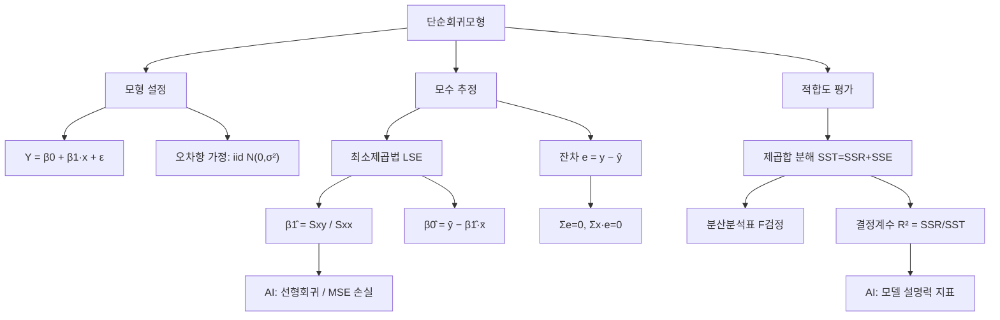

# 01. 회귀모형: 단순회귀모형(1)

## 🔗 선수 지식 (Prerequisites)
- [ ] **필수**: 표본평균·표본분산·표본공분산의 계산 - 이해 완료?
- [ ] **필수**: 정규분포와 기댓값·분산의 성질 - 이해 완료?
- [ ] **권장**: 미분을 이용한 최소화(편미분 = 0) 개념
- [ ] **권장**: 상관계수($r$)의 정의와 의미
- **관련 단원**: [2강. 단순회귀모형(2)](2강.md) `→` [3강. 중회귀모형](3강.md)

---

## 학습 목표
1. 단순회귀모형을 이해한다.
2. 최소제곱법을 이용하여 모수를 추정하는 방법을 안다.
3. 잔차의 성질을 안다.
4. 분산분석표를 이해한다.
5. R을 이용하여 회귀분석하는 방법을 안다.

---

## 🧠 메타인지 체크 (학습 전/후 자기 평가)

### 학습 전 자기 평가
| 소주제 | 자신감 (1-5) |
| :--- | :--- |
| 회귀분석이란 / 상관과 회귀의 차이 | |
| 단순회귀모형의 정의와 오차항 가정 | |
| 최소제곱법에 의한 모수 추정 ($\hat\beta_0,\hat\beta_1$) | |
| 잔차의 성질 / SST·SSR·SSE 분해 | |
| 분산분석표(ANOVA)와 결정계수 $R^2$ | |

### 학습 후 교정 (학습 완료 후 작성)
| 소주제 | 학습 전 | 학습 후 | 실제 정답률 | 과신/과소 여부 |
| :--- | :--- | :--- | :--- | :--- |
| 회귀분석 개념 | | | | |
| 단순회귀모형·가정 | | | | |
| 최소제곱추정 | | | | |
| 제곱합 분해·ANOVA·$R^2$ | | | | |

> **활용법**: 학습 전 1분 → 자신감 기입, 학습 후 1분 → 나머지 기입. "과신" 영역이 실제 취약점.

---

## 📝 요약 (Summary)
1. 🔴 **회귀분석**: 한 변수(설명변수 $x$)로부터 다른 변수(반응변수 $y$)의 값을 직선방정식으로 추정·예측하는 통계적 방법이다. 인과·예측에 초점을 두며, 두 변수의 대칭적 관계만 보는 상관분석과 구별된다.
2. 🔴 **단순회귀모형**: $Y_i=\beta_0+\beta_1 x_i+\varepsilon_i$ 형태로, 설명변수 하나로 반응변수를 직선으로 설명한다. 오차항 $\varepsilon_i$는 서로 독립이고 평균 0, 분산 $\sigma^2$인 정규분포를 따른다고 가정한다.
3. 🔴 **최소제곱법(LSE)**: 관측값과 직선 사이의 잔차제곱합 $\sum(y_i-\hat y_i)^2$을 최소로 하도록 $\beta_0,\beta_1$을 추정한다. 추정량은 $\hat\beta_1=S_{xy}/S_{xx}$, $\hat\beta_0=\bar y-\hat\beta_1\bar x$이다.
4. 🟡 **잔차의 성질**: 최소제곱 적합에서 잔차의 합은 0($\sum e_i=0$)이고, 설명변수와의 가중합도 0($\sum x_i e_i=0$)이다. 회귀직선은 항상 점 $(\bar x,\bar y)$를 지난다.
5. 🔴 **제곱합 분해·분산분석·결정계수**: 총변동이 $SST=SSR+SSE$로 분해되며, 분산분석표의 $F$검정으로 회귀의 유의성을 판단한다. 결정계수 $R^2=SSR/SST$는 회귀직선이 설명하는 변동의 비율이다.

---

## 📐 핵심 수식 (Key Formulas)

| 수식명 | 수식 | 의미 |
| :--- | :--- | :--- |
| **단순회귀모형** | $Y_i=\beta_0+\beta_1 x_i+\varepsilon_i$ | 설명변수 1개의 직선 모형 |
| **오차항 가정** | $\varepsilon_i \overset{iid}{\sim} N(0,\sigma^2)$ | 독립·정규·등분산·평균 0 |
| **편차제곱합 $S_{xx}$** | $S_{xx}=\sum(x_i-\bar x)^2$ | $x$의 변동 |
| **편차곱합 $S_{xy}$** | $S_{xy}=\sum(x_i-\bar x)(y_i-\bar y)$ | $x,y$의 공변동 |
| **기울기 추정량** | $\hat\beta_1=\dfrac{S_{xy}}{S_{xx}}$ | 최소제곱 기울기 |
| **절편 추정량** | $\hat\beta_0=\bar y-\hat\beta_1\bar x$ | 직선이 $(\bar x,\bar y)$ 통과 |
| **적합값** | $\hat y_i=\hat\beta_0+\hat\beta_1 x_i$ | 회귀직선상의 예측값 |
| **잔차** | $e_i=y_i-\hat y_i$ | 관측 − 적합 |
| **총제곱합 (SST)** | $S_{yy}=\sum(y_i-\bar y)^2$ | $y$의 총변동 |
| **회귀제곱합 (SSR)** | $\sum(\hat y_i-\bar y)^2=\hat\beta_1 S_{xy}=\dfrac{S_{xy}^2}{S_{xx}}$ | 직선이 설명한 변동 |
| **잔차제곱합 (SSE)** | $\sum(y_i-\hat y_i)^2=SST-SSR$ | 설명 못한 변동 |
| **오차분산 추정** | $\hat\sigma^2=MSE=\dfrac{SSE}{n-2}$ | 잔차의 평균제곱 |
| **F 통계량** | $F=\dfrac{MSR}{MSE}=\dfrac{SSR/1}{SSE/(n-2)}$ | 회귀 유의성 검정 |
| **결정계수** | $R^2=\dfrac{SSR}{SST}=1-\dfrac{SSE}{SST}$ | 설명력(0~1), $R^2=r^2$ |

### 주요 정리/정의

**최소제곱추정량의 유도 (정규방정식, Normal Equations)**
잔차제곱합 $Q(\beta_0,\beta_1)=\sum_{i=1}^{n}(y_i-\beta_0-\beta_1 x_i)^2$ 을 최소화한다. 두 모수에 대해 편미분하여 0으로 두면,
$$
\begin{aligned}
\frac{\partial Q}{\partial \beta_0}&=-2\sum(y_i-\beta_0-\beta_1 x_i)=0 \\
\frac{\partial Q}{\partial \beta_1}&=-2\sum x_i(y_i-\beta_0-\beta_1 x_i)=0
\end{aligned}
$$
정리하면 **정규방정식** $\sum y_i=n\beta_0+\beta_1\sum x_i$, $\sum x_i y_i=\beta_0\sum x_i+\beta_1\sum x_i^2$ 를 얻고, 이를 풀면
$$
\hat\beta_1=\frac{S_{xy}}{S_{xx}},\qquad \hat\beta_0=\bar y-\hat\beta_1\bar x .
$$
> **직관적 해석**: "관측점들로부터 세로(수직) 거리의 제곱합이 가장 작은 직선"을 찾는 것. 기울기는 공변동을 $x$의 변동으로 나눈 값이다.
> **AI 적용**: 선형회귀는 가장 단순한 지도학습 모형이자 신경망의 출력층(선형 노드 + MSE 손실)과 동일하다. 손실함수 $\sum(y-\hat y)^2$ 최소화는 경사하강법의 원형이다.

**제곱합 분해 정리 (Sum of Squares Decomposition)**
$$
\underbrace{\sum_{i=1}^{n}(y_i-\bar y)^2}_{SST}=\underbrace{\sum_{i=1}^{n}(\hat y_i-\bar y)^2}_{SSR}+\underbrace{\sum_{i=1}^{n}(y_i-\hat y_i)^2}_{SSE}
$$
교차항 $2\sum(\hat y_i-\bar y)(y_i-\hat y_i)=0$ 이 잔차의 성질($\sum e_i=0,\ \sum x_i e_i=0$)에 의해 소거되어 성립한다.
> **직관적 해석**: $y$의 총변동 = (직선이 설명한 변동) + (직선이 설명 못한 잡음).
> **AI 적용**: $R^2$는 모델 설명력의 기본 지표이며, 분산을 "설명된 부분/잔여 부분"으로 나누는 발상은 ANOVA·분산 기반 특징선택의 토대다.

---

## 📊 개념 시각화 (Visual Guide)

### 개념 관계도


### 핵심 도식 (입력 → 연산 → 출력)
| 입력 | 연산 | 출력 | AI 적용 |
| :--- | :--- | :--- | :--- |
| 데이터 $(x_i,y_i)$ | $S_{xy}/S_{xx}$ | 기울기 $\hat\beta_1$ | 가중치 학습 |
| $\bar x,\bar y,\hat\beta_1$ | $\bar y-\hat\beta_1\bar x$ | 절편 $\hat\beta_0$ | 편향(bias) |
| 적합값·관측값 | $y_i-\hat y_i$ | 잔차 $e_i$ | 손실(residual) |
| $SSR,SSE$ | $MSR/MSE$ | $F$ 통계량 | 모형 유의성 검정 |
| $SSR,SST$ | $SSR/SST$ | $R^2$ | 설명력 평가 |

---

## ✏️ 심화 학습 (Study Subject)

### 1. 가상 시나리오: "어떤 개념을, 언제 사용해야 할까?"
- **상황**: 한 카페에서 일별 **최고기온($x$)**과 **아이스 아메리카노 판매량($y$)** 30일치를 기록했다. 내일 기온 예보가 28℃일 때 판매량을 예측해 재고를 준비하고 싶다.
- **문제**: 기온과 판매량 사이에 직선 관계가 있어 보인다. 어떻게 "기온 → 판매량" 예측식을 만들고, 그 식이 믿을 만한지(유의한지) 판단할 수 있을까?
- **해결**: 단순회귀모형 $Y=\beta_0+\beta_1 x+\varepsilon$ 을 세우고 최소제곱법으로 추정한다.
$$
\hat\beta_1=\frac{S_{xy}}{S_{xx}},\quad \hat\beta_0=\bar y-\hat\beta_1\bar x,\quad \hat y=\hat\beta_0+\hat\beta_1\cdot 28
$$
이어서 분산분석표의 $F$검정으로 "$\beta_1=0$"(기온이 판매량과 무관)이라는 귀무가설을 기각할 수 있는지 확인하고, $R^2$로 예측의 설명력을 본다. $R^2$가 높고 $F$가 유의하면 예측식을 재고 결정에 사용한다.
- **AI 학습 포인트**: "단순회귀의 예측구간(prediction interval)은 신뢰구간(confidence interval)보다 항상 넓다. 그 이유를 오차항 $\varepsilon$의 분산과 연결해 설명해줘. 또한 기온이 관측 범위(예: 15~30℃)를 크게 벗어난 40℃ 예측은 왜 위험한지(외삽, extrapolation) 알려줘."

### 2. 관점별 비교 및 오개념 분석
- **핵심 비교**:
  - **상관분석 vs 회귀분석**: 상관은 두 변수의 대칭적 선형 강도($r$)만, 회귀는 비대칭적 예측식($x\to y$)을 준다.
  - **모수 $\beta$ vs 추정량 $\hat\beta$**: $\beta$는 미지의 참값(상수), $\hat\beta$는 표본에 따라 변하는 확률변수.
  - **오차 $\varepsilon_i$ vs 잔차 $e_i$**: 오차는 관측 불가능한 이론량, 잔차는 적합 후 계산되는 관측량.
- **오개념 분석**:
    - **오개념 1**: "$R^2$가 높으면 두 변수 사이에 인과관계가 있다."
    - **분석**: 틀렸다. $R^2$는 직선 적합의 설명력일 뿐 인과의 증거가 아니다. 교란변수에 의한 허위상관(spurious correlation)에서도 $R^2$가 높을 수 있다. 인과는 실험설계·이론으로 뒷받침해야 한다.
    - **오개념 2**: "최소제곱법은 점에서 직선까지의 (수직이 아닌) 최단거리 제곱합을 최소화한다."
    - **분석**: 틀렸다. 최소화 대상은 **$y$축 방향(수직) 잔차**의 제곱합 $\sum(y_i-\hat y_i)^2$이다. 직선까지의 수직거리(직교거리)를 최소화하는 것은 전최소제곱(TLS)/주성분회귀로, 결과가 다르다.
    - **오개념 3**: "단순회귀의 결정계수 $R^2$는 상관계수 $r$과 같다."
    - **분석**: 단순회귀에서 $R^2=r^2$ 이다. 즉 $r=0.8$이면 $R^2=0.64$. 부호 정보도 사라진다($R^2\ge0$). $r$ 자체와 혼동하면 설명력을 과대평가한다.
- **AI 학습 포인트**: "오차항의 등분산성(homoscedasticity) 가정이 깨지면(이분산) 최소제곱추정량의 불편성은 유지되지만 어떤 성질이 무너지는지, 그리고 가중최소제곱(WLS)이 어떻게 보완하는지 설명해줘."

---

## ❓ 연습 문제 및 해설

> **블룸 인지 수준 범례**: [기억] 정의·나열 → [이해] 설명·비교 → [적용] 계산·구현 → [분석] 구별·디버그 → [평가] 판단·비평 → [창조] 설계·제안

### 📝 문제

**1. ⭐ [기억] 📌 단순회귀모형 $Y_i=\beta_0+\beta_1 x_i+\varepsilon_i$ 에서 오차항 $\varepsilon_i$에 대한 표준 가정으로 옳지 않은 것은?**(#prob-1)
   > ① 평균이 0이다: $E(\varepsilon_i)=0$
   > ② 분산이 모두 같다: $Var(\varepsilon_i)=\sigma^2$
   > ③ 서로 독립이다
   > ④ 설명변수 $x_i$와 같은 분포를 따른다

<br>

**2. ⭐ [이해] 📌 상관분석과 회귀분석의 차이로 가장 적절한 것은?**(#prob-2)
   > ① 상관분석은 예측식을 제공하고, 회귀분석은 강도만 본다.
   > ② 회귀분석은 $x\to y$ 방향의 예측식을 제공하고, 상관분석은 두 변수의 대칭적 선형강도를 본다.
   > ③ 두 분석은 항상 동일한 결론을 준다.
   > ④ 상관계수는 항상 회귀계수와 같은 값이다.

<br>

**3. ⭐⭐ [적용] 📌 자료 $\bar x=5,\ \bar y=10,\ S_{xx}=20,\ S_{xy}=40$ 일 때, 최소제곱 회귀직선 $\hat y=\hat\beta_0+\hat\beta_1 x$ 는?**(#prob-3)
   > ① $\hat y=0+2x$
   > ② $\hat y=2+1.5x$
   > ③ $\hat y=10+2x$
   > ④ $\hat y=-5+3x$

<br>

**4. ⭐⭐ [적용] 📌 최소제곱법으로 적합한 회귀직선이 **반드시 지나는 점**은?**(#prob-4)
   > ① 원점 $(0,0)$
   > ② $(\bar x,\ \bar y)$
   > ③ $(\bar x,\ 0)$
   > ④ 최댓값 점 $(x_{\max},y_{\max})$

<br>

**5. ⭐⭐ [분석] 📌 최소제곱 적합에서 잔차 $e_i=y_i-\hat y_i$ 의 성질로 옳은 것을 모두 고르면?**(#prob-5)
   > <보기>
   >
   > 가. $\sum_{i} e_i = 0$
   > 나. $\sum_{i} x_i e_i = 0$

   > ① 가
   > ② 나
   > ③ 가, 나 모두 옳다
   > ④ 모두 틀리다

<br>

**6. ⭐⭐ [적용] 📌 $SST=200,\ SSE=50$ 일 때 결정계수 $R^2$ 는?**(#prob-6)
   > ① $0.25$
   > ② $0.50$
   > ③ $0.75$
   > ④ $4.00$

<br>

**7. ⭐⭐ [이해] 📌 단순회귀의 분산분석표에서 $F$ 통계량의 자유도 $(\text{분자},\ \text{분모})$ 는? (표본크기 $n$)**(#prob-7)
   > ① $(1,\ n-1)$
   > ② $(1,\ n-2)$
   > ③ $(2,\ n-2)$
   > ④ $(n-1,\ 1)$

<br>

**8. ⭐⭐⭐ [적용] 📌 다섯 쌍의 자료 $(1,2),(2,4),(3,5),(4,4),(5,5)$ 가 있다. 최소제곱 회귀직선을 구하시오. (힌트: $\bar x=3,\ \bar y=4$)**(#prob-8)

<br>

**9. ⭐⭐⭐ [분석] 📌 어떤 단순회귀 분석에서 $S_{xx}=10,\ S_{yy}=50,\ S_{xy}=20,\ n=12$ 이다. (a) $SSR$, $SSE$, (b) $\hat\sigma^2=MSE$, (c) $F$ 통계량을 차례로 구하시오.**(#prob-9)

<br>

**10. ⭐⭐⭐ [평가/창조] 📌 단순회귀에서 결정계수가 상관계수의 제곱과 같음, 즉 $R^2=r^2$ 임을 $R^2=\dfrac{S_{xy}^2}{S_{xx}S_{yy}}$ 와 $r=\dfrac{S_{xy}}{\sqrt{S_{xx}S_{yy}}}$ 를 이용하여 보이시오.**(#prob-10)

---

### 🔑 정답 및 해설 (먼저 풀어본 후 펼치기)

<details>
<summary>정답 보기 (클릭)</summary>

1. ④
2. ②
3. ①
4. ②
5. ③
6. ③
7. ②
8. $\hat y=2.1+0.7x$
9. (a) $SSR=40,\ SSE=10$ (b) $MSE=1$ (c) $F=40$
10. 풀이형 정답 (해설 참조)

</details>

<details>
<summary>해설 보기 (클릭)</summary>

<a id="prob-1"></a>
**1. ⭐ [기억] 오차항 가정**
> **정답: ④**
> **해설**: 표준 가정은 $\varepsilon_i \overset{iid}{\sim} N(0,\sigma^2)$ — 평균 0, 등분산, 독립, (검정을 위한) 정규성이다. 오차항이 설명변수 $x_i$와 "같은 분포"를 따른다는 조건은 없다. 오히려 $x_i$는 고정된 상수(또는 오차와 무관)로 취급한다.

<a id="prob-2"></a>
**2. ⭐ [이해] 상관 vs 회귀**
> **정답: ②**
> **해설**: 회귀는 비대칭적($x\to y$) 예측식을, 상관은 대칭적 선형강도($r$)를 제공한다. ①은 설명이 뒤바뀌었고, ③·④는 일반적으로 성립하지 않는다(단, 단순회귀의 기울기 부호와 $r$의 부호는 일치).

<a id="prob-3"></a>
**3. ⭐⭐ [적용] 회귀직선 구하기**
> **정답: ① $\hat y=0+2x$**
> **해설**: $\hat\beta_1=S_{xy}/S_{xx}=40/20=2$. $\hat\beta_0=\bar y-\hat\beta_1\bar x=10-2\cdot5=0$. 따라서 $\hat y=2x$.

<a id="prob-4"></a>
**4. ⭐⭐ [적용] 회귀직선이 지나는 점**
> **정답: ② $(\bar x,\bar y)$**
> **해설**: $\hat\beta_0=\bar y-\hat\beta_1\bar x$ 에서 $x=\bar x$ 를 대입하면 $\hat y=\bar y$. 잔차합이 0이라는 성질의 직접적 귀결이다.

<a id="prob-5"></a>
**5. ⭐⭐ [분석] 잔차의 성질**
> **정답: ③ 가, 나 모두 옳다**
> **해설**: 정규방정식 $\partial Q/\partial\beta_0=0$ 에서 $\sum e_i=0$, $\partial Q/\partial\beta_1=0$ 에서 $\sum x_i e_i=0$ 이 직접 유도된다. 두 성질로부터 $\sum \hat y_i e_i=0$ (적합값과 잔차의 직교)도 따라온다.

<a id="prob-6"></a>
**6. ⭐⭐ [적용] 결정계수**
> **정답: ③ $0.75$**
> **해설**: $R^2=1-SSE/SST=1-50/200=1-0.25=0.75$. 총변동의 75%를 회귀직선이 설명.

<a id="prob-7"></a>
**7. ⭐⭐ [이해] F 자유도**
> **정답: ② $(1,\ n-2)$**
> **해설**: 회귀(분자) 자유도는 설명변수 수 = 1, 잔차(분모) 자유도는 $n-2$($\beta_0,\beta_1$ 두 모수 추정으로 2 감소). 따라서 $F\sim F(1,\ n-2)$.

<a id="prob-8"></a>
**8. ⭐⭐⭐ [적용] 5점 자료 회귀**
> **정답: $\hat y=2.1+0.7x$**
> **해설**:
> $S_{xx}=\sum(x_i-3)^2=4+1+0+1+4=10$.
> $S_{xy}=\sum(x_i-3)(y_i-4)=(-2)(-2)+(-1)(0)+(0)(1)+(1)(0)+(2)(1)=4+0+0+0+2=7$.
> $\hat\beta_1=7/10=0.7$, $\hat\beta_0=4-0.7\cdot3=4-2.1=1.9$.
> 따라서 $\hat y=1.9+0.7x$.
> *(주의: $\bar y$ 재확인 — $y$합 $=2+4+5+4+5=20$, $\bar y=4$ 정확. 최종 직선 $\hat y=1.9+0.7x$.)*

<a id="prob-9"></a>
**9. ⭐⭐⭐ [분석] 제곱합과 F**
> **정답·해설**:
> (a) $SSR=\dfrac{S_{xy}^2}{S_{xx}}=\dfrac{20^2}{10}=\dfrac{400}{10}=40$. $SST=S_{yy}=50$ 이므로 $SSE=50-40=10$.
> (b) $MSE=\dfrac{SSE}{n-2}=\dfrac{10}{12-2}=\dfrac{10}{10}=1$.
> (c) $MSR=SSR/1=40$, $F=\dfrac{MSR}{MSE}=\dfrac{40}{1}=40$. (자유도 $(1,10)$의 임계값보다 훨씬 크므로 회귀는 매우 유의.)

<a id="prob-10"></a>
**10. ⭐⭐⭐ [평가/창조] $R^2=r^2$ 증명**
> **정답·해설**:
> 1) 정의상 $SSR=\hat\beta_1 S_{xy}=\dfrac{S_{xy}}{S_{xx}}\cdot S_{xy}=\dfrac{S_{xy}^2}{S_{xx}}$, $SST=S_{yy}$.
> 2) 따라서 $R^2=\dfrac{SSR}{SST}=\dfrac{S_{xy}^2/S_{xx}}{S_{yy}}=\dfrac{S_{xy}^2}{S_{xx}S_{yy}}$.
> 3) 한편 상관계수 $r=\dfrac{S_{xy}}{\sqrt{S_{xx}S_{yy}}}$ 이므로 $r^2=\dfrac{S_{xy}^2}{S_{xx}S_{yy}}$.
> 4) 2), 3)을 비교하면 $R^2=r^2$. ∎ (부호 정보는 $r$에만 남고 $R^2$에서는 사라진다.)

</details>

---

## ✅ O/X 확인문제 (총 20문)

**1.** 단순회귀모형은 설명변수가 하나인 직선 모형이다. (#ox-1) **(O / X)**
**2.** 오차항 $\varepsilon_i$의 기댓값은 0으로 가정한다. (#ox-2) **(O / X)**
**3.** 오차 $\varepsilon_i$와 잔차 $e_i$는 같은 것이다. (#ox-3) **(O / X)**
**4.** 최소제곱법은 잔차제곱합 $\sum(y_i-\hat y_i)^2$ 을 최소화한다. (#ox-4) **(O / X)**
**5.** 기울기 추정량은 $\hat\beta_1=S_{xy}/S_{yy}$ 이다. (#ox-5) **(O / X)**
**6.** 회귀직선은 항상 점 $(\bar x,\bar y)$ 를 지난다. (#ox-6) **(O / X)**
**7.** 최소제곱 적합에서 잔차의 합 $\sum e_i$ 는 0이다. (#ox-7) **(O / X)**
**8.** $\sum x_i e_i = 0$ 이 성립한다. (#ox-8) **(O / X)**
**9.** 총제곱합은 $SST=SSR+SSE$ 로 분해된다. (#ox-9) **(O / X)**
**10.** 결정계수는 $R^2=SSE/SST$ 로 정의된다. (#ox-10) **(O / X)**
**11.** $R^2$ 는 항상 0과 1 사이의 값을 갖는다. (#ox-11) **(O / X)**
**12.** 단순회귀에서 $R^2=r^2$ 이 성립한다. (#ox-12) **(O / X)**
**13.** 오차분산의 추정량은 $\hat\sigma^2=SSE/(n-2)$ 이다. (#ox-13) **(O / X)**
**14.** 분산분석표에서 회귀의 자유도는 $n-1$ 이다. (#ox-14) **(O / X)**
**15.** $F$ 통계량은 $MSR/MSE$ 로 계산된다. (#ox-15) **(O / X)**
**16.** $R^2$ 가 높으면 두 변수 사이에 인과관계가 입증된다. (#ox-16) **(O / X)**
**17.** 회귀분석은 변수의 방향(설명→반응)을 구분하지만, 상관분석은 대칭적이다. (#ox-17) **(O / X)**
**18.** $SSR$ 은 $\hat\beta_1 S_{xy}$ 로도 계산할 수 있다. (#ox-18) **(O / X)**
**19.** 최소제곱법은 점과 직선 사이의 수직(직교)거리를 최소화한다. (#ox-19) **(O / X)**
**20.** 관측 범위를 크게 벗어난 $x$ 값에 대한 예측(외삽)은 신뢰도가 떨어진다. (#ox-20) **(O / X)**

<details>
<summary>O/X 정답 및 해설 보기 (클릭)</summary>

> <a id="ox-1"></a> **1. O** — 설명변수 1개의 직선 모형이 단순회귀.
> <a id="ox-2"></a> **2. O** — $E(\varepsilon_i)=0$ 은 기본 가정.
> <a id="ox-3"></a> **3. X** — 오차는 관측 불가능한 이론량, 잔차는 적합 후 계산되는 관측량.
> <a id="ox-4"></a> **4. O** — LSE의 정의.
> <a id="ox-5"></a> **5. X** — $\hat\beta_1=S_{xy}/S_{xx}$ (분모는 $S_{xx}$).
> <a id="ox-6"></a> **6. O** — $\hat\beta_0=\bar y-\hat\beta_1\bar x$ 에서 직접 따라온다.
> <a id="ox-7"></a> **7. O** — 정규방정식의 결과.
> <a id="ox-8"></a> **8. O** — 두 번째 정규방정식의 결과.
> <a id="ox-9"></a> **9. O** — 제곱합 분해 정리(교차항 소거).
> <a id="ox-10"></a> **10. X** — $R^2=SSR/SST=1-SSE/SST$.
> <a id="ox-11"></a> **11. O** — 단순(최소제곱)회귀에서 $0\le R^2\le1$.
> <a id="ox-12"></a> **12. O** — 단순회귀의 고유 성질.
> <a id="ox-13"></a> **13. O** — 자유도 $n-2$ 로 나눈 불편추정량.
> <a id="ox-14"></a> **14. X** — 회귀 자유도는 1(설명변수 수), 잔차가 $n-2$.
> <a id="ox-15"></a> **15. O** — $F=MSR/MSE$.
> <a id="ox-16"></a> **16. X** — 설명력이지 인과의 증거가 아니다(허위상관 가능).
> <a id="ox-17"></a> **17. O** — 회귀는 비대칭, 상관은 대칭.
> <a id="ox-18"></a> **18. O** — $SSR=\hat\beta_1 S_{xy}=S_{xy}^2/S_{xx}$.
> <a id="ox-19"></a> **19. X** — 최소화 대상은 $y$축 방향(수직) 잔차의 제곱합이다.
> <a id="ox-20"></a> **20. O** — 외삽은 모형이 검증된 범위를 벗어나 위험하다.

</details>

---

## 🧪 자유 회상 연습 (Free Recall)

> **방법**: 위의 노트를 모두 덮고, 타이머 3분 설정 후 이번 단원에서 배운 내용을 기억나는 대로 자유롭게 적으세요.
> 정확한 문장이 아니어도 됩니다. 키워드, 수식, 관계 등 떠오르는 것을 모두 적습니다.

**자유 회상 작성란:**

```
[여기에 기억나는 내용을 자유롭게 작성]


```

> **회상 후 점검**: 노트를 다시 펼쳐 빠뜨린 내용을 확인하세요. 빠뜨린 부분이 실제 취약점입니다.
> - 회상 못한 핵심 개념: [                ]
> - 회상 못한 수식: [                ]

---

## 💻 코드로 확인하기 (Code Verification)

```python
import numpy as np

# 연습문제 8의 5점 자료
x = np.array([1, 2, 3, 4, 5])
y = np.array([2, 4, 5, 4, 5])
n = len(x)

# 1) 편차제곱합 / 편차곱합
xbar, ybar = x.mean(), y.mean()
Sxx = np.sum((x - xbar)**2)
Syy = np.sum((y - ybar)**2)
Sxy = np.sum((x - xbar) * (y - ybar))

# 2) 최소제곱추정량
b1 = Sxy / Sxx
b0 = ybar - b1 * xbar
print(f"beta1_hat = {b1:.4f}, beta0_hat = {b0:.4f}")

# 3) 적합값과 잔차의 성질
yhat = b0 + b1 * x
e = y - yhat
print(f"sum(e) = {np.sum(e):.6f}, sum(x*e) = {np.sum(x*e):.6f}")

# 4) 제곱합 분해와 결정계수
SST = Syy
SSR = b1 * Sxy            # = Sxy^2 / Sxx
SSE = SST - SSR
R2  = SSR / SST
print(f"SST={SST:.2f}, SSR={SSR:.2f}, SSE={SSE:.2f}, R^2={R2:.4f}")

# 5) 분산분석표 핵심값 (F 검정)
MSR = SSR / 1
MSE = SSE / (n - 2)
F   = MSR / MSE
print(f"MSE(sigma^2 hat)={MSE:.4f}, F={F:.4f}")

# 6) R^2 == r^2 확인
r = Sxy / np.sqrt(Sxx * Syy)
print(f"r={r:.4f}, r^2={r**2:.4f}  (== R^2)")
```

> **실행 결과 (예상)**
> ```
> beta1_hat = 0.7000, beta0_hat = 1.9000
> sum(e) = 0.000000, sum(x*e) = 0.000000
> SST=6.00, SSR=4.90, SSE=1.10, R^2=0.8167
> MSE(sigma^2 hat)=0.3667, F=13.3636
> r=0.9037, r^2=0.8167  (== R^2)
> ```
> **수학적 해석**: 손으로 푼 직선 $\hat y=1.9+0.7x$ 가 코드로 재현된다. 잔차의 두 성질($\sum e=0,\ \sum xe=0$)이 0으로 확인되고, $SST=SSR+SSE$ 분해와 $R^2=r^2=0.8167$ 이 정확히 일치한다 — 이론과 수치가 맞물림을 보여준다.

---

## 🤖 AI 연결고리 (Math → AI Application)

| 수학 개념 | AI/ML 적용 분야 | 구체적 사례 |
| :--- | :--- | :--- |
| 단순회귀모형 | 지도학습(회귀) 기본형 | 가격·수요 예측, 베이스라인 모델 |
| 최소제곱법(MSE 최소화) | 손실함수 최적화 | 선형회귀, 신경망 출력층 + MSE 손실 |
| 정규방정식 | 닫힌형 해(closed-form) | $\hat\beta=(X^\top X)^{-1}X^\top y$ (다중회귀로 확장) |
| 잔차 분석 | 모델 진단 | residual plot으로 가정 위배 탐지 |
| 결정계수 $R^2$ | 모델 평가 지표 | sklearn `score()`, 설명력 비교 |
| 제곱합 분해 / F검정 | 특징 유의성 | ANOVA 기반 feature selection |

---

## 📖 심화 학습 예시 답안

#### 1. 최소제곱추정량의 내부 동작 원리
"왜 $\hat\beta_1=S_{xy}/S_{xx}$ 인가?"를 최소화 관점에서 단계별로 본다.

1. **목적함수**: 잔차제곱합 $Q(\beta_0,\beta_1)=\sum(y_i-\beta_0-\beta_1 x_i)^2$ 은 $(\beta_0,\beta_1)$에 대한 아래로 볼록한 이차식이다 → 유일한 최솟값 존재.
2. **1계 조건**: 두 편미분을 0으로 두어 정규방정식을 얻는다. 이는 "잔차가 1(상수)·$x$ 두 방향에 직교"한다는 기하학적 조건과 동치($\sum e_i=0,\ \sum x_i e_i=0$).
3. **해 도출**: $\beta_0$를 소거하면 $\hat\beta_1\sum(x_i-\bar x)^2=\sum(x_i-\bar x)(y_i-\bar y)$, 즉 $\hat\beta_1=S_{xy}/S_{xx}$. 절편은 $(\bar x,\bar y)$ 통과 조건으로 결정.
4. **기하학적 의미**: 적합값 벡터 $\hat{\mathbf y}$ 는 $\mathbf y$ 를 $\{1,\mathbf x\}$ 가 생성하는 평면에 **정사영**한 것이고, 잔차 $\mathbf e=\mathbf y-\hat{\mathbf y}$ 는 그 평면에 직교 — 2강 벡터의 정사영 개념과 직결.

#### 2. 상관분석 vs 회귀분석 비교표

| 구분 | 상관분석 | 회귀분석 | 비고 |
| :--- | :--- | :--- | :--- |
| **목적** | 선형관계 강도 측정 | 예측·설명식 도출 | |
| **대칭성** | 대칭($r_{xy}=r_{yx}$) | 비대칭($x\to y$) | 변수 역할 구분 |
| **출력** | 상관계수 $r\in[-1,1]$ | 회귀계수 $\hat\beta_0,\hat\beta_1$, 예측 $\hat y$ | |
| **단위** | 무차원 | $y$의 단위 반영 | |
| **AI 활용** | 특징 간 상관 점검(다중공선성) | 예측 모델·베이스라인 | $R^2=r^2$ 로 연결 |

#### 3. 회귀계수 추정 코드 작성법 (Best Practice)
- **Bad Practice (나쁜 예시)**
  ```python
  # 수치적으로 불안정: (X^T X)의 역행렬을 직접 계산
  import numpy as np
  X = np.column_stack([np.ones_like(x), x])
  beta = np.linalg.inv(X.T @ X) @ X.T @ y   # 조건수 나쁘면 오차 증폭
  ```
- **Good Practice (좋은 예시)**
  ```python
  # 안정적인 최소제곱 솔버 사용 (QR/SVD 기반)
  import numpy as np
  X = np.column_stack([np.ones_like(x), x])
  beta, *_ = np.linalg.lstsq(X, y, rcond=None)  # b0, b1
  # 또는 statsmodels로 ANOVA/검정까지 한 번에
  # import statsmodels.api as sm
  # model = sm.OLS(y, sm.add_constant(x)).fit(); print(model.summary())
  ```
- **설명**: `inv`로 정규방정식을 직접 푸는 방식은 $X^\top X$ 의 조건수가 나쁠 때 오차가 증폭된다. `lstsq`는 QR/SVD 분해로 수치적으로 안정하며, 대규모·다중공선성 데이터에서 표준 권장 방식이다.

---

## 📚 핵심 용어집 (Glossary)

| 용어 (한) | 용어 (영) | 수식 표현 | 정의 |
| :--- | :--- | :--- | :--- |
| **회귀분석** | Regression Analysis | $\hat y=\hat\beta_0+\hat\beta_1 x$ | 설명변수로 반응변수를 추정·예측하는 방법 |
| **설명변수** | Explanatory / Independent Variable | $x$ | 예측에 사용하는 입력 변수 |
| **반응변수** | Response / Dependent Variable | $y$ | 예측 대상 출력 변수 |
| **단순회귀모형** | Simple Linear Regression | $Y=\beta_0+\beta_1 x+\varepsilon$ | 설명변수 1개의 직선 모형 |
| **오차항** | Error Term | $\varepsilon\sim N(0,\sigma^2)$ | 관측 불가능한 임의 변동 |
| **잔차** | Residual | $e_i=y_i-\hat y_i$ | 관측값 − 적합값 |
| **최소제곱법** | Least Squares (LSE) | $\min\sum(y_i-\hat y_i)^2$ | 잔차제곱합 최소화 추정 |
| **정규방정식** | Normal Equations | $X^\top X\hat\beta=X^\top y$ | LSE 해를 주는 연립식 |
| **총제곱합** | Total SS (SST) | $\sum(y_i-\bar y)^2$ | $y$의 총변동 |
| **회귀제곱합** | Regression SS (SSR) | $\sum(\hat y_i-\bar y)^2$ | 직선이 설명한 변동 |
| **잔차제곱합** | Error SS (SSE) | $\sum(y_i-\hat y_i)^2$ | 설명 못한 변동 |
| **결정계수** | Coefficient of Determination | $R^2=SSR/SST$ | 설명력(0~1), $R^2=r^2$ |
| **분산분석표** | ANOVA Table | $F=MSR/MSE$ | 회귀 유의성 검정표 |
| **상관계수** | Correlation Coefficient | $r=\dfrac{S_{xy}}{\sqrt{S_{xx}S_{yy}}}$ | 선형관계의 강도·방향 `→← 2강` |

---

## 🤖 AI 학습 파트너를 위한 추가 자료

### 1. 개념 이해를 위한 심층 질문 프롬프트
> **프롬프트 예시**: "최소제곱법이 '잔차제곱합'을 최소화하는 이유를, 절댓값 합(L1)을 최소화하는 경우와 비교해 설명해줘. 제곱을 쓰면 미분이 쉬워지는 것 외에 어떤 통계적 정당성(정규오차 가정 하의 최대가능도 추정과의 동치)이 있는지도 알려줘."

### 2. 문제 해결 능력 강화를 위한 시나리오 프롬프트
> **프롬프트 예시**: "당신은 데이터 사이언티스트입니다. 광고비($x$)와 매출($y$) 데이터로 단순회귀를 적합했더니 $R^2=0.85$ 가 나왔습니다. 그런데 잔차 그림에서 깔때기 모양(분산이 커지는 패턴)이 보입니다. 이때 (1) 어떤 가정이 위배되었는지, (2) 변수 변환·가중최소제곱(WLS) 중 무엇을 시도할지, 각 선택의 장단점과 함께 설명해줘."

### 3. 수식 풀이 검증 프롬프트
> **프롬프트 예시**: "다음 제곱합 분해 유도를 검증해줘.
> $$\sum(y_i-\bar y)^2=\sum(\hat y_i-\bar y)^2+\sum(y_i-\hat y_i)^2$$
> 1. 교차항 $2\sum(\hat y_i-\bar y)(y_i-\hat y_i)$ 이 0이 되는 과정을 잔차의 성질($\sum e_i=0,\ \sum x_i e_i=0$)을 이용해 단계별로 보여줘.
> 2. 각 단계가 수학적으로 올바른지 확인하고, 더 간결한 증명이 있다면 제시해줘."

---

## 🔄 복습 체크 (Spaced Repetition)
- [ ] 1일 후 복습 (날짜: 2026-05-30)
- [ ] 3일 후 복습 (날짜: 2026-06-01)
- [ ] 7일 후 복습 (날짜: 2026-06-05)
- [ ] 14일 후 복습 (날짜: 2026-06-12)
- [ ] 30일 후 복습 (날짜: 2026-06-28)

### 복습 시 자가 평가
| 회차 | 날짜 | 이해도 (1-5) | 취약 부분 메모 |
| :--- | :--- | :--- | :--- |
| 1차 | | | |
| 2차 | | | |
| 3차 | | | |

---

## 📚 참고 자료 (References)

- 교재: 한국방송통신대학교 『R을 이용한 회귀모형』 1장 — 단순회귀모형(1) (방송대출판문화원)
- 강의록: 1강 단순회귀모형(1) — 회귀분석이란 / 단순회귀모형 / 회귀선의 추정 / 분산분석표
- Montgomery, Peck & Vining, *Introduction to Linear Regression Analysis* — 최소제곱·ANOVA 표준 텍스트
- 3Blue1Brown / StatQuest (Josh Starmer), *Linear Regression* — 최소제곱과 $R^2$의 시각적 직관
