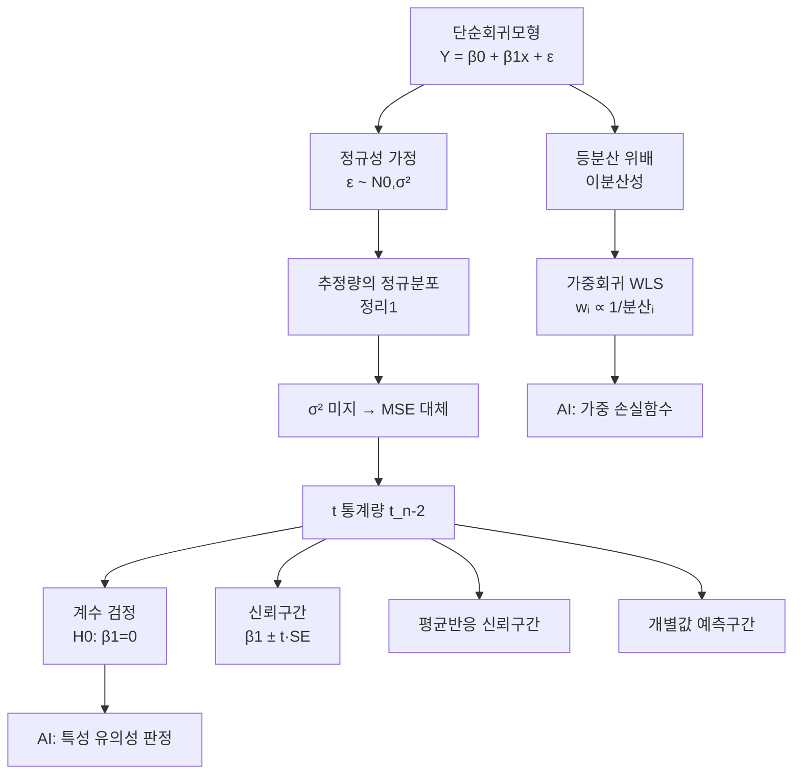

# 2강. 회귀모형: 단순회귀모형(2) — 추정·검정·가중회귀

## 🔗 선수 지식 (Prerequisites)
- [ ] **필수**: [1강 단순회귀모형(1)](1강.md) — 최소제곱법, 분산분석(ANOVA), 결정계수 $R^2$ 이해 완료?
- [ ] **필수**: 정규분포·$t$분포·$F$분포의 관계, 표본분포와 신뢰구간 개념
- [ ] **권장**: 기대값·분산의 선형 연산 ($E[aX+b]$, $\text{Var}(aX+b)$), 가설검정의 1·2종 오류
- **관련 단원**: [3강 중회귀모형](3강.md) `→←3강`, [1강 단순회귀모형(1)](1강.md) `→←1강`

---

## 학습 목표
1. 단순회귀모형을 이해한다.
2. 회귀계수의 신뢰구간 및 검정 방법을 이해한다.
3. 가중회귀를 이해한다.
4. R을 이용하여 회귀분석하는 방법을 안다.

---

## 🧠 메타인지 체크 (학습 전/후 자기 평가)

### 학습 전 자기 평가
| 소주제 | 자신감 (1-5) |
| :--- | :--- |
| 회귀계수 추정량의 분포와 표준오차 | |
| 회귀계수의 $t$-검정과 신뢰구간 | |
| 평균반응 vs 개별예측의 구간 차이 | |
| 가중최소제곱(WLS)의 필요성과 원리 | |

### 학습 후 교정 (학습 완료 후 작성)
| 소주제 | 학습 전 | 학습 후 | 실제 정답률 | 과신/과소 여부 |
| :--- | :--- | :--- | :--- | :--- |
| 회귀계수 추정량의 분포와 표준오차 | | | | |
| 회귀계수의 $t$-검정과 신뢰구간 | | | | |
| 평균반응 vs 개별예측의 구간 차이 | | | | |
| 가중최소제곱(WLS)의 필요성과 원리 | | | | |

> **활용법**: 학습 전 1분 → 자신감 기입, 학습 후 1분 → 나머지 기입. "과신" 영역이 실제 취약점.

---

## 📝 요약 (Summary)
1.  🔴 **추정량의 분포**: 오차가 $\varepsilon_i \sim N(0,\sigma^2)$로 독립이면, 최소제곱추정량은 정규분포를 따른다. 특히 $\hat\beta_1 \sim N\!\big(\beta_1,\ \sigma^2/S_{xx}\big)$이며, 미지의 $\sigma^2$를 $MSE$로 대체하면 표준화 통계량이 자유도 $n-2$의 $t$분포를 따른다.
2.  🔴 **회귀계수의 검정과 신뢰구간**: 기울기의 유의성은 $H_0:\beta_1=0$에 대한 $t$-검정으로 판단하며, 통계량은 $t=\hat\beta_1/SE(\hat\beta_1)$이다. 신뢰구간은 $\hat\beta_1 \pm t_{\alpha/2,\,n-2}\,SE(\hat\beta_1)$로 구한다. 단순회귀에서 이 $t$-검정은 분산분석의 $F$-검정과 동치이다($t^2=F$). `→←1강`
3.  🟡 **평균반응 추정 vs 개별값 예측**: 주어진 $x_0$에서 평균반응 $E(Y|x_0)$의 신뢰구간보다 새 관측값 $Y_0$의 예측구간이 항상 더 넓다. 예측구간에는 오차항 자체의 변동 $\sigma^2$가 추가로 더해지기 때문이다.
4.  🟡 **가중회귀(WLS)**: 오차분산이 일정하지 않은(이분산) 경우, 각 관측치에 분산의 역수에 비례하는 가중치 $w_i$를 주어 가중제곱합 $\sum w_i(y_i-\beta_0-\beta_1 x_i)^2$을 최소화한다. 이는 분산이 큰 관측치의 영향을 줄여 효율적(BLUE)인 추정을 가능하게 한다.
5.  🟢 **R 실습**: `lm()`으로 적합, `summary()`로 계수·표준오차·$t$값·$p$값 확인, `confint()`로 신뢰구간, `predict(..., interval=)`로 신뢰/예측구간, `lm(..., weights=)`로 가중회귀를 수행한다.

---

## 📐 핵심 수식 (Key Formulas)

| 수식명 | 수식 | 의미 |
| :--- | :--- | :--- |
| **기울기 추정량** 🔴 | $\hat\beta_1 = \dfrac{S_{xy}}{S_{xx}}$ | 편차곱의 합을 $x$ 편차제곱합으로 나눈 값 |
| **절편 추정량** 🔴 | $\hat\beta_0 = \bar y - \hat\beta_1 \bar x$ | 회귀직선이 점 $(\bar x,\bar y)$를 지남 |
| **오차분산 추정** 🔴 | $\hat\sigma^2 = MSE = \dfrac{SSE}{n-2}$ | 잔차제곱합을 자유도로 나눔 |
| **기울기 표준오차** 🔴 | $SE(\hat\beta_1) = \dfrac{\sqrt{MSE}}{\sqrt{S_{xx}}}$ | $\hat\beta_1$의 추정 표준편차 |
| **절편 표준오차** 🟡 | $SE(\hat\beta_0) = \sqrt{MSE\!\left(\dfrac{1}{n}+\dfrac{\bar x^2}{S_{xx}}\right)}$ | $\hat\beta_0$의 추정 표준편차 (이 $SE$로 $t=\hat\beta_0/SE(\hat\beta_0)\sim t_{n-2}$ 검정·신뢰구간 $\hat\beta_0\pm t_{\alpha/2,n-2}SE(\hat\beta_0)$ 를 기울기와 동일하게 수행) |
| **상관계수 유의성 검정** 🟡 | $t=\dfrac{r\sqrt{n-2}}{\sqrt{1-r^2}}\sim t_{n-2}$ | $H_0:\rho=0$ 검정이며, 단순회귀 기울기 $t$검정과 동치($\beta_1=0\Leftrightarrow\rho=0$, 동일 $t$값) |
| **기울기 검정통계량** 🔴 | $t=\dfrac{\hat\beta_1-\beta_1^{(0)}}{SE(\hat\beta_1)}\sim t_{n-2}$ | $H_0:\beta_1=\beta_1^{(0)}$ 검정 |
| **평균반응 SE** 🟡 | $SE(\hat\mu_0)=\sqrt{MSE\!\left(\dfrac{1}{n}+\dfrac{(x_0-\bar x)^2}{S_{xx}}\right)}$ | $E(Y|x_0)$ 추정의 표준오차 |
| **예측 SE** 🟡 | $SE(\hat Y_0)=\sqrt{MSE\!\left(1+\dfrac{1}{n}+\dfrac{(x_0-\bar x)^2}{S_{xx}}\right)}$ | 새 관측값 $Y_0$ 예측의 표준오차 |
| **WLS 기울기** 🟢 | $\hat\beta_1^{w}=\dfrac{\sum w_i(x_i-\bar x_w)(y_i-\bar y_w)}{\sum w_i(x_i-\bar x_w)^2}$ | 가중 가중평균 $\bar x_w=\frac{\sum w_i x_i}{\sum w_i}$ 사용 |

> 표기: $S_{xx}=\sum(x_i-\bar x)^2$, $S_{xy}=\sum(x_i-\bar x)(y_i-\bar y)$, $SSE=\sum(y_i-\hat y_i)^2$.

### 주요 정리/정의

**정리 1. 최소제곱추정량의 분포**
$$
\hat\beta_1 \sim N\!\left(\beta_1,\ \frac{\sigma^2}{S_{xx}}\right),\qquad
\hat\beta_0 \sim N\!\left(\beta_0,\ \sigma^2\!\left(\frac{1}{n}+\frac{\bar x^2}{S_{xx}}\right)\right)
$$
> **직관적 해석**: 추정량은 참값을 중심으로 정규분포한다. $x$값이 넓게 퍼질수록($S_{xx}$ 클수록) 기울기 추정의 분산이 작아진다 — 지렛대가 길수록 기울기를 안정적으로 잡는다.
> **AI 적용**: 선형회귀 계수의 신뢰구간·유의성 판단은 베이지안 선형회귀의 사후분포(posterior)와 직결되며, 특성(feature) 선택과 정규화(regularization) 강도 결정의 통계적 근거가 된다.

**정리 2. $\sigma^2$ 미지 시의 $t$ 통계량**
$$
\frac{\hat\beta_1-\beta_1}{\sqrt{MSE/S_{xx}}}\sim t_{n-2}
$$
> **직관적 해석**: 모분산 $\sigma^2$를 모를 때 표본에서 추정한 $MSE$로 대체하면, 표준정규 $Z$ 대신 꼬리가 두꺼운 $t_{n-2}$를 쓴다. 자유도 $n-2$는 두 개($\beta_0,\beta_1$)를 추정하느라 잃은 자유도를 반영한다.
> **AI 적용**: 소표본 A/B 테스트나 계수 유의성 자동 판정 파이프라인에서 $t$분포 기반 임계값을 사용한다.

**정리 3. 평균반응과 예측의 구간**
$$
\underbrace{\hat y_0 \pm t_{\alpha/2,n-2}\sqrt{MSE\!\left(\tfrac{1}{n}+\tfrac{(x_0-\bar x)^2}{S_{xx}}\right)}}_{\text{평균반응 신뢰구간}},\quad
\underbrace{\hat y_0 \pm t_{\alpha/2,n-2}\sqrt{MSE\!\left(1+\tfrac{1}{n}+\tfrac{(x_0-\bar x)^2}{S_{xx}}\right)}}_{\text{개별값 예측구간}}
$$
> **직관적 해석**: 두 구간의 유일한 차이는 근호 안의 "$1+$"이다. 평균을 맞히는 것보다 개별 한 점을 맞히는 것이 본질적으로 더 불확실하므로 예측구간이 더 넓다. 두 구간 모두 $x_0$가 $\bar x$에서 멀어질수록 넓어진다(나팔 모양).

---

## 📊 개념 시각화 (Visual Guide)

### 개념 관계도


### 핵심 도식
| 입력 | 연산 | 출력 | AI 적용 |
| :--- | :--- | :--- | :--- |
| 데이터 $(x_i,y_i)$ | 최소제곱법 | $\hat\beta_0,\hat\beta_1,MSE$ | 모델 파라미터 학습 |
| $\hat\beta_1, SE$ | $t=\hat\beta_1/SE$ | $p$값, 유의성 | 특성 중요도/선택 |
| $x_0$ | $\hat y_0\pm t\cdot SE$ | 신뢰/예측 구간 | 예측 불확실성 정량화 |
| 이분산 데이터, $w_i$ | 가중제곱합 최소화 | WLS 추정량 | 가중 손실(weighted loss) |

---

## ✏️ 심화 학습 (Study Subject)

### 1. 가상 시나리오: "어떤 구간을 보고해야 할까?"
- **상황**: 광고비($x$, 백만원)와 매출($y$, 백만원)의 단순회귀에서 다음 분기 광고비를 $x_0=10$으로 책정할 예정이다. *(참고: 아래 "코드로 확인하기" 절의 예제는 관측 범위 $x=1\sim10$ 바로 바깥인 $x_0=11$ 기준으로 두 구간을 계산하므로, 본 시나리오의 $x_0=10$과 값이 다르다. 어느 쪽이든 구간의 상대적 폭 관계는 동일하다.)* 경영진은 두 가지를 묻는다 — (A) "광고비 10일 때 *평균적으로* 매출이 얼마나 될까?", (B) "*다음 분기 한 번의* 매출이 얼마나 될까?"
- **문제**: 같은 점추정 $\hat y_0$이지만 두 질문에 붙일 구간은 다르다. 어느 구간이 더 넓고, 그 차이는 어디서 오는가?
- **해결**: (A)는 평균반응 $E(Y|x_0)$의 신뢰구간 — 근호 안 $\tfrac{1}{n}+\tfrac{(x_0-\bar x)^2}{S_{xx}}$. (B)는 개별값 예측구간 — 여기에 오차항 자체 분산 $\sigma^2$가 더해져 $1+\tfrac{1}{n}+\tfrac{(x_0-\bar x)^2}{S_{xx}}$. 따라서 (B)가 항상 더 넓다. 경영진이 "한 번의 실제 매출 범위"를 알고 싶다면 반드시 (B) 예측구간을 보고해야 과소추정 위험을 피한다.
- **AI 학습 포인트**: "회귀 예측에서 모델의 *인식론적(epistemic) 불확실성*과 *우연적(aleatoric) 불확실성*은 각각 평균반응 신뢰구간과 예측구간의 어느 항에 대응하는가?"

### 2. 관점별 비교 및 오개념 분석
- **핵심 비교**: '평균반응 신뢰구간 vs 개별값 예측구간', '$t$-검정 vs $F$-검정', 'OLS vs WLS'
- **오개념 분석**:
    - **오개념 1**: "$R^2$가 높으면 기울기 $\beta_1$이 통계적으로 유의하다."
    - **분석**: $R^2$(설명력)와 유의성($p$값)은 별개다. 표본이 매우 작으면 $R^2$가 높아도 $SE(\hat\beta_1)$가 커서 유의하지 않을 수 있고, 표본이 크면 $R^2$가 작아도 유의할 수 있다. 유의성은 $t=\hat\beta_1/SE(\hat\beta_1)$로 판단한다.
    - **오개념 2**: "예측구간을 좁히려면 $x_0$만 $\bar x$ 근처로 잡으면 된다."
    - **분석**: $(x_0-\bar x)^2/S_{xx}$ 항은 줄어들지만, 예측구간에는 항상 "$1$"(오차항 분산)이 남는다. 표본 수 $n$을 아무리 늘려도 예측구간 폭은 $t\sqrt{MSE}$ 수준 아래로 줄지 않는다. 반면 평균반응 신뢰구간은 $n\to\infty$에서 0으로 수렴한다.
    - **오개념 3**: "이분산이 있어도 OLS 추정량은 편향되므로 못 쓴다."
    - **분석**: OLS는 이분산 하에서도 **여전히 불편(unbiased)** 이다. 다만 더 이상 최소분산이 아니어서 **비효율적**이고, 표준오차가 잘못 계산되어 검정이 왜곡된다. WLS는 편향을 고치는 게 아니라 *효율*을 회복시킨다.
- **AI 학습 포인트**: "이분산 데이터에서 OLS의 표준오차 대신 White의 로버스트 표준오차(HC)를 쓰는 것과 WLS로 모델을 다시 적합하는 것은 각각 무엇을 고치는가?"

---

## ❓ 연습 문제 및 해설

> **블룸 인지 수준 범례**: [기억] 정의·나열 → [이해] 설명·비교 → [적용] 계산·구현 → [분석] 구별·디버그 → [평가] 판단·비평 → [창조] 설계·제안
>
> ※ 본 강의에는 원본 연습문제가 없어 AI가 학습 내용 전체를 커버하도록 10문항을 출제했습니다. 📌

### 📝 문제

**1. ⭐ 📌 [기억] 오차가 $\varepsilon_i\sim N(0,\sigma^2)$일 때 기울기 추정량 $\hat\beta_1$의 분산으로 옳은 것은?(#prob-1)**
   > ① $\sigma^2 S_{xx}$
   > ② $\sigma^2 / S_{xx}$
   > ③ $\sigma^2(1/n + \bar x^2/S_{xx})$
   > ④ $MSE/(n-2)$

<br>

**2. ⭐ 📌 [이해] $\sigma^2$를 모를 때 회귀계수 검정에 사용하는 분포와 자유도로 옳은 것은?(#prob-2)**
   > ① 표준정규분포 $N(0,1)$
   > ② 자유도 $n-1$의 $t$분포
   > ③ 자유도 $n-2$의 $t$분포
   > ④ 자유도 $(1, n-2)$의 $F$분포

<br>

**3. ⭐ 📌 [이해] 가중회귀(WLS)에 대한 설명으로 옳은 것은?(#prob-3)**
   > ① 오차의 평균이 0이 아닐 때 사용한다.
   > ② 분산이 큰 관측치에 더 큰 가중치를 준다.
   > ③ 가중치는 보통 오차분산의 역수에 비례하게 준다.
   > ④ WLS는 OLS의 편향을 제거하기 위한 방법이다.

<br>

**4. ⭐⭐ 📌 [적용] $n=12$, $S_{xx}=200$, $S_{xy}=160$, $SSE=90$일 때, $\hat\beta_1$과 $SE(\hat\beta_1)$로 옳은 것은?(#prob-4)**
   > ① $\hat\beta_1=0.8,\ SE=0.212$
   > ② $\hat\beta_1=0.8,\ SE=0.067$
   > ③ $\hat\beta_1=1.25,\ SE=0.212$
   > ④ $\hat\beta_1=0.8,\ SE=0.45$

<br>

**5. ⭐⭐ 📌 [분석] 평균반응 신뢰구간과 개별값 예측구간에 대한 <보기> 설명 중 옳은 것을 모두 고르면?(#prob-5)**
   > <보기>
   >
   > 가. 두 구간 모두 $x_0$가 $\bar x$에서 멀어질수록 넓어진다.
   > 나. 동일한 $x_0$에서 예측구간이 신뢰구간보다 항상 넓다.
   > 다. 표본 수 $n\to\infty$이면 예측구간의 폭은 0으로 수렴한다.

   > ① 가, 나
   > ② 가, 다
   > ③ 나, 다
   > ④ 가, 나, 다

<br>

**6. ⭐⭐ 📌 [적용] 단순회귀에서 기울기 검정 통계량이 $t=3$이었다. 분산분석표의 $F$값은?(#prob-6)**
   > ① $1.73$
   > ② $3$
   > ③ $6$
   > ④ $9$

<br>

**7. ⭐⭐ 📌 [적용] $\hat\beta_1=2.5$, $SE(\hat\beta_1)=0.5$, $n=22$, $t_{0.025,20}=2.086$일 때 $\beta_1$의 95% 신뢰구간은?(#prob-7)**
   > ① $(1.50,\ 3.50)$
   > ② $(1.46,\ 3.54)$
   > ③ $(2.00,\ 3.00)$
   > ④ $(1.04,\ 3.96)$

<br>

**8. ⭐⭐ 📌 [분석] R 출력에서 `x`의 `Pr(>|t|)`가 `0.0021`로 나왔다. 유의수준 5%에서의 올바른 해석은?(#prob-8)**
```r
Coefficients:
            Estimate Std. Error t value Pr(>|t|)
(Intercept)   1.8240     0.9123   1.999  0.06012 .
x             0.7350     0.2050   3.585  0.00210 **
```
   > ① 절편이 유의하므로 기울기도 유의하다.
   > ② 기울기 $\beta_1$이 0이라는 귀무가설을 기각, $x$는 유의한 설명변수다.
   > ③ $p=0.0021$은 기울기가 0일 확률이 0.0021이라는 뜻이다.
   > ④ 절편의 $p$가 0.06이므로 회귀모형 전체가 유의하지 않다.

<br>

**9. ⭐⭐⭐ 📌 [평가] 잔차를 적합값에 대해 그렸더니 부채꼴(나팔 모양)로 퍼졌다. 진단과 대응으로 가장 적절한 것은?(#prob-9)**
   > ① 자기상관 → 시계열 모형으로 전환
   > ② 비선형성 → 다항회귀로 전환
   > ③ 이분산성 → 가중회귀 또는 분산안정화 변환
   > ④ 정규성 위배 → 이상치 제거

<br>

**10. ⭐⭐⭐ 📌 [창조] 다음 R 코드의 빈칸 (가)~(다)를 채워, ① 95% 신뢰구간 출력, ② $x_0=10$에서 개별값 예측구간 산출, ③ 분산이 $x$에 비례할 때의 가중회귀를 완성하시오.(#prob-10)**
```r
fit <- lm(y ~ x, data = d)
(가)                                      # 회귀계수의 95% 신뢰구간
predict(fit, newdata = data.frame(x = 10),
        interval = (나) )                 # 개별값 예측구간
fitw <- lm(y ~ x, data = d, weights = (다) ) # Var(ε) ∝ x 인 경우의 가중회귀
```

---

### 🔑 정답 및 해설 (먼저 풀어본 후 펼치기)

<details>
<summary>정답 보기 (클릭)</summary>

1. ②
2. ③
3. ③
4. ①
5. ①
6. ④
7. ②
8. ②
9. ③
10. (가) `confint(fit)` (나) `"prediction"` (다) `1/x`

</details>

<details>
<summary>해설 보기 (클릭)</summary>

<a id="prob-1"></a>
**1. ⭐ [기억] 기울기 추정량의 분산**
> **정답: ② $\sigma^2/S_{xx}$**
> **해설**: 정리 1에 의해 $\hat\beta_1\sim N(\beta_1,\sigma^2/S_{xx})$. $x$의 산포($S_{xx}$)가 클수록 분산이 작아진다. ③은 절편 $\hat\beta_0$의 분산이고, ④는 단위가 맞지 않는다.

<a id="prob-2"></a>
**2. ⭐ [이해] 검정 분포와 자유도**
> **정답: ③ 자유도 $n-2$의 $t$분포**
> **해설**: $\sigma^2$를 $MSE$로 대체하면 $t=(\hat\beta_1-\beta_1)/\sqrt{MSE/S_{xx}}\sim t_{n-2}$. 단순회귀는 $\beta_0,\beta_1$ 두 모수를 추정하므로 자유도는 $n-2$다. $\sigma^2$를 알면 ①(표준정규)을 쓴다.

<a id="prob-3"></a>
**3. ⭐ [이해] 가중회귀의 원리**
> **정답: ③ 가중치는 보통 오차분산의 역수에 비례하게 준다**
> **해설**: WLS는 $w_i\propto 1/\text{Var}(\varepsilon_i)$로 두어 분산이 **작은**(신뢰도 높은) 관측치에 더 큰 가중치를 준다 → ②는 반대로 서술해 오답. 오차평균은 항상 0 가정이므로 ①은 무관, OLS는 이분산에서도 불편이므로 WLS는 편향 제거가 아니라 효율 회복이 목적 → ④ 오답.

<a id="prob-4"></a>
**4. ⭐⭐ [적용] 기울기와 표준오차 계산**
> **정답: ① $\hat\beta_1=0.8,\ SE=0.212$**
> **해설**: $\hat\beta_1=S_{xy}/S_{xx}=160/200=0.8$. $MSE=SSE/(n-2)=90/10=9$. $SE(\hat\beta_1)=\sqrt{MSE/S_{xx}}=\sqrt{9/200}=\sqrt{0.045}\approx0.2121$.

<a id="prob-5"></a>
**5. ⭐⭐ [분석] 신뢰구간 vs 예측구간**
> **정답: ① 가, 나**
> **해설**: 가 — 두 구간 모두 $(x_0-\bar x)^2/S_{xx}$ 항 때문에 $\bar x$에서 멀수록 넓어진다(참). 나 — 예측구간은 근호 안에 "$1+$"이 추가되어 항상 더 넓다(참). 다 — 평균반응 신뢰구간은 $n\to\infty$에서 0으로 수렴하지만, **예측구간**은 오차항 분산 $\sigma^2$ 때문에 0이 아니라 $t\sqrt{MSE}$ 수준으로 수렴한다(거짓).

<a id="prob-6"></a>
**6. ⭐⭐ [적용] $t$와 $F$의 관계**
> **정답: ④ $9$**
> **해설**: 단순회귀에서 기울기에 대한 $t$-검정과 모형의 $F$-검정은 동치이며 $F=t^2$. 따라서 $F=3^2=9$. `→←1강`

<a id="prob-7"></a>
**7. ⭐⭐ [적용] 신뢰구간 계산**
> **정답: ② $(1.46,\ 3.54)$**
> **해설**: $\hat\beta_1\pm t_{0.025,20}\,SE=2.5\pm 2.086\times0.5=2.5\pm1.043=(1.457,\ 3.543)$. 0을 포함하지 않으므로 5% 수준에서 유의하다.

<a id="prob-8"></a>
**8. ⭐⭐ [분석] R 출력 해석**
> **정답: ② 기울기 $\beta_1$이 0이라는 귀무가설을 기각, $x$는 유의한 설명변수다**
> **해설**: $x$ 행의 $p=0.0021<0.05$이므로 $H_0:\beta_1=0$을 기각 → $x$는 유의하다. ③은 흔한 오해 — $p$값은 "기울기가 0일 확률"이 아니라 "$H_0$가 참일 때 관측된 것 이상의 통계량이 나올 확률"이다. 절편의 유의성과 기울기의 유의성은 별개이므로 ①·④도 오답.

<a id="prob-9"></a>
**9. ⭐⭐⭐ [평가] 잔차도 진단**
> **정답: ③ 이분산성 → 가중회귀 또는 분산안정화 변환**
> **해설**: 적합값이 커질수록 잔차 산포가 커지는 부채꼴 패턴은 등분산 가정 위배(이분산성)의 전형적 신호다. 대응으로 (i) 분산구조를 추정해 가중치 $w_i\propto1/\hat\sigma_i^2$로 WLS, (ii) $\log y$, $\sqrt{y}$ 등 분산안정화 변환을 쓴다. 곡선형(U자)이면 비선형(②), 시간순 패턴이면 자기상관(①) 진단이 맞다.

<a id="prob-10"></a>
**10. ⭐⭐⭐ [창조] R 코드 완성**
> **정답: (가) `confint(fit)` (나) `"prediction"` (다) `1/x`**
> **해설**:
> - (가) `confint(fit)` 또는 `confint(fit, level=0.95)` — 기본 신뢰수준이 0.95이므로 인자 없이도 95% 구간을 출력한다.
> - (나) 개별 새 관측값의 구간은 `interval="prediction"`. 평균반응 구간은 `interval="confidence"`이며 더 좁다.
> - (다) $\text{Var}(\varepsilon_i)\propto x_i$이면 가중치는 분산의 역수 $w_i=1/x_i$. R에서 `weights=1/x`로 지정한다.

</details>

---

## ✅ O/X 확인문제 (연습문항 개수의 2배)

**1.** 오차에 정규성을 가정해야 회귀계수의 $t$-검정과 신뢰구간이 정당화된다.(#ox-1) **(O / X)**
**2.** $x$값들이 넓게 퍼져 있을수록(=$S_{xx}$가 클수록) 기울기 추정의 분산이 커진다.(#ox-2) **(O / X)**
**3.** 단순회귀에서 기울기 $t$-검정과 분산분석 $F$-검정의 결론은 항상 일치하며 $F=t^2$이다.(#ox-3) **(O / X)**
**4.** 동일한 $x_0$에서 개별값 예측구간은 평균반응 신뢰구간보다 항상 넓다.(#ox-4) **(O / X)**
**5.** 평균반응 신뢰구간과 예측구간 모두 $x_0$가 $\bar x$에 가까울수록 좁아진다.(#ox-5) **(O / X)**
**6.** 이분산이 존재하면 OLS 추정량은 편향(biased)된다.(#ox-6) **(O / X)**
**7.** 가중회귀에서 분산이 큰 관측치일수록 작은 가중치를 부여한다.(#ox-7) **(O / X)**
**8.** $\sigma^2$를 알고 있다면 회귀계수 검정에 표준정규분포를 쓸 수 있다.(#ox-8) **(O / X)**
**9.** 잔차제곱합을 자유도 $n-2$로 나눈 $MSE$는 $\sigma^2$의 불편추정량이다.(#ox-9) **(O / X)**
**10.** $R^2$가 높으면 기울기는 자동으로 통계적으로 유의하다.(#ox-10) **(O / X)**
**11.** R에서 `predict(fit, interval="confidence")`는 새 개별 관측값의 예측구간을 준다.(#ox-11) **(O / X)**
**12.** 표본 수 $n$을 무한히 늘리면 예측구간의 폭도 0으로 수렴한다.(#ox-12) **(O / X)**

<details>
<summary>O/X 정답 및 해설 보기 (클릭)</summary>

> <a id="ox-1"></a>
> **1. 정답**: O
> **해설**: 정규성 가정 하에서 추정량이 정규분포하고, $MSE$로 표준화한 통계량이 $t_{n-2}$를 따라 검정·구간추정이 정당화된다.

> <a id="ox-2"></a>
> **2. 정답**: X
> **해설**: $\text{Var}(\hat\beta_1)=\sigma^2/S_{xx}$이므로 $S_{xx}$가 클수록 분산은 **작아진다**.

> <a id="ox-3"></a>
> **3. 정답**: O
> **해설**: 단순회귀(설명변수 1개)에서 두 검정은 동치이고 $F=t^2$, $p$값도 동일하다.

> <a id="ox-4"></a>
> **4. 정답**: O
> **해설**: 예측구간 근호 안에 오차항 분산을 뜻하는 "$1+$"이 추가되므로 항상 더 넓다.

> <a id="ox-5"></a>
> **5. 정답**: O
> **해설**: 두 구간 모두 $(x_0-\bar x)^2/S_{xx}$ 항을 포함해 $x_0=\bar x$에서 가장 좁고 멀어질수록 넓어진다.

> <a id="ox-6"></a>
> **6. 정답**: X
> **해설**: OLS는 이분산 하에서도 여전히 **불편(unbiased)** 이다. 문제는 비효율성과 표준오차 왜곡이다.

> <a id="ox-7"></a>
> **7. 정답**: O
> **해설**: $w_i\propto1/\text{Var}(\varepsilon_i)$이므로 분산이 큰(불확실한) 관측치에 작은 가중치를 준다.

> <a id="ox-8"></a>
> **8. 정답**: O
> **해설**: $\sigma^2$가 알려져 있으면 표준화 통계량이 정확히 $N(0,1)$을 따른다. 보통은 모르므로 $t$를 쓴다.

> <a id="ox-9"></a>
> **9. 정답**: O
> **해설**: $E[MSE]=\sigma^2$이며, $n-2$로 나누는 것은 두 모수 추정으로 잃은 자유도를 보정하기 위함이다.

> <a id="ox-10"></a>
> **10. 정답**: X
> **해설**: $R^2$(설명력)와 유의성($p$값)은 별개다. 표본 크기에 따라 둘은 따로 움직인다.

> <a id="ox-11"></a>
> **11. 정답**: X
> **해설**: `interval="confidence"`는 평균반응 신뢰구간이다. 개별 예측은 `interval="prediction"`.

> <a id="ox-12"></a>
> **12. 정답**: X
> **해설**: 신뢰구간은 0으로 수렴하지만, 예측구간은 오차항 분산 $\sigma^2$ 때문에 $t\sqrt{MSE}$ 수준으로 수렴한다.

</details>

---

## 🧪 자유 회상 연습 (Free Recall)

> **방법**: 위의 노트를 모두 덮고, 타이머 3분 설정 후 이번 단원에서 배운 내용을 기억나는 대로 자유롭게 적으세요.
> 정확한 문장이 아니어도 됩니다. 키워드, 수식, 관계 등 떠오르는 것을 모두 적습니다.

**자유 회상 작성란:**

```
[여기에 기억나는 내용을 자유롭게 작성]


```

> **회상 후 점검**: 노트를 다시 펼쳐 빠뜨린 내용을 확인하세요. 빠뜨린 부분이 실제 취약점입니다.
> - 회상 못한 핵심 개념: [                ]
> - 회상 못한 수식: [                ]

---

## 💻 코드로 확인하기 (Code Verification)

```python
import numpy as np
from scipy import stats

# 단순회귀 데이터 (광고비 x, 매출 y)
x = np.array([1, 2, 3, 4, 5, 6, 7, 8, 9, 10], dtype=float)
y = np.array([2.1, 3.9, 6.2, 7.8, 9.9, 12.3, 13.8, 16.4, 18.1, 19.7])
n = len(x)

# 1) 최소제곱 추정
xbar, ybar = x.mean(), y.mean()
Sxx = np.sum((x - xbar)**2)
Sxy = np.sum((x - xbar) * (y - ybar))
b1 = Sxy / Sxx
b0 = ybar - b1 * xbar
yhat = b0 + b1 * x
SSE = np.sum((y - yhat)**2)
MSE = SSE / (n - 2)

# 2) 표준오차와 기울기 t-검정 (H0: beta1 = 0)
se_b1 = np.sqrt(MSE / Sxx)
t_stat = b1 / se_b1
p_value = 2 * (1 - stats.t.cdf(abs(t_stat), df=n - 2))
print(f"b0={b0:.4f}, b1={b1:.4f}, MSE={MSE:.4f}")
print(f"SE(b1)={se_b1:.4f}, t={t_stat:.4f}, p={p_value:.3e}")

# 3) beta1의 95% 신뢰구간
tcrit = stats.t.ppf(0.975, df=n - 2)
ci = (b1 - tcrit * se_b1, b1 + tcrit * se_b1)
print(f"95% CI for b1: ({ci[0]:.4f}, {ci[1]:.4f})")

# 4) t^2 == F (분산분석과의 동치)
SSR = np.sum((yhat - ybar)**2)
F = SSR / MSE   # MSR/MSE, df=(1, n-2)
print(f"t^2={t_stat**2:.4f},  F={F:.4f}  (동일해야 함)")

# 5) x0=11 에서 평균반응 신뢰구간 vs 개별값 예측구간
x0 = 11.0
yhat0 = b0 + b1 * x0
se_mean = np.sqrt(MSE * (1/n + (x0 - xbar)**2 / Sxx))
se_pred = np.sqrt(MSE * (1 + 1/n + (x0 - xbar)**2 / Sxx))
print(f"평균반응 95% CI: ({yhat0 - tcrit*se_mean:.3f}, {yhat0 + tcrit*se_mean:.3f})")
print(f"개별값 95% PI : ({yhat0 - tcrit*se_pred:.3f}, {yhat0 + tcrit*se_pred:.3f})")
```

> **실행 결과**:
> ```
> b0=0.0467, b1=1.9952, MSE=0.0618
> SE(b1)=0.0274, t=72.9219, p=1.393e-12
> 95% CI for b1: (1.9321, 2.0582)
> t^2=5317.5976,  F=5317.5976  (동일해야 함)
> 평균반응 95% CI: (21.602, 22.385)
> 개별값 95% PI : (21.299, 22.687)
> ```
> **수학적 해석**: $\hat\beta_1\approx2.00$로 광고비 1 증가 시 매출이 약 2.0 증가하며, $t\approx72.9$, $p\approx1.4\times10^{-12}$으로 매우 유의하다. $t^2$와 $F$가 정확히 일치해 단순회귀에서 두 검정의 동치성을 확인할 수 있다. $x_0=11$에서 개별값 예측구간이 평균반응 신뢰구간보다 넓게 나오는데, 이는 오차항 분산이 추가된 결과다.

---

## 🤖 AI 연결고리 (Math → AI Application)

| 수학 개념 | AI/ML 적용 분야 | 구체적 사례 |
| :--- | :--- | :--- |
| 계수의 $t$-검정·$p$값 | 특성 선택(feature selection) | 회귀 기반 특성 중요도 판정, 통계적 변수 제거 |
| 신뢰/예측구간 | 예측 불확실성 정량화 | 수요예측의 안전재고 산정, 위험 구간 보고 |
| 가중최소제곱(WLS) | 가중 손실함수 | 샘플 신뢰도/노이즈 차등 반영, 불균형 데이터 가중 |
| 이분산 진단 | 모델 신뢰성 점검 | 잔차 분석으로 모델 가정 위배 탐지, 변환 결정 |
| $\hat\beta_1\sim N(\cdot)$ | 베이지안 선형회귀 | 계수 사후분포, 능형회귀(ridge)의 사전분포 해석 |

---

## 📖 심화 학습 예시 답안

#### 1. 왜 자유도가 $n-2$인가? — $MSE$ 불편성의 직관
잔차 $e_i=y_i-\hat y_i$는 원자료 $y_i$와 달리 두 개의 추정 제약을 받는다.

1.  **제약 1**: $\sum e_i = 0$ (절편 추정의 정규방정식). 잔차의 합이 항상 0이다.
2.  **제약 2**: $\sum x_i e_i = 0$ (기울기 추정의 정규방정식). 잔차와 $x$가 직교한다.
3.  **결과**: $n$개의 잔차가 2개의 선형제약에 묶여 자유롭게 변할 수 있는 것은 $n-2$개뿐이다. 그래서 $SSE$를 $n-2$로 나눠야 $E[MSE]=\sigma^2$를 만족하는 불편추정량이 된다. ($n$이나 $n-1$로 나누면 $\sigma^2$를 과소추정한다.)

#### 2. 평균반응 신뢰구간 vs 개별값 예측구간 비교표

| 구분 | 평균반응 신뢰구간 | 개별값 예측구간 | 비고 |
| :--- | :--- | :--- | :--- |
| **대상** | $E(Y\mid x_0)$ (평균선의 위치) | 새 관측값 $Y_0$ 한 개 | 모수 vs 확률변수 |
| **표준오차** | $\sqrt{MSE\!\left(\tfrac1n+\tfrac{(x_0-\bar x)^2}{S_{xx}}\right)}$ | $\sqrt{MSE\!\left(1+\tfrac1n+\tfrac{(x_0-\bar x)^2}{S_{xx}}\right)}$ | 근호 안 "$1+$" 차이 |
| **$n\to\infty$ 거동** | 폭 → 0 | 폭 → $t\sqrt{MSE}$ (≠0) | 오차분산은 못 줄임 |
| **AI 활용** | 모델 평균예측의 신뢰성 | 단건 예측의 위험 구간 | 안전마진 산정 |

#### 3. 가중회귀 코드 작성법 (Best Practice)

- **Bad Practice (나쁜 예시)**
  ```python
  # 이분산이 명백한데 OLS로 그대로 적합 → 표준오차/검정이 왜곡됨
  import numpy as np
  b1 = np.sum((x-x.mean())*(y-y.mean())) / np.sum((x-x.mean())**2)
  # 분산이 x에 따라 커지는 구조를 전혀 반영하지 않음
  ```
- **Good Practice (좋은 예시)**
  ```python
  import numpy as np
  import statsmodels.api as sm

  X = sm.add_constant(x)
  # Var(eps) ∝ x 이므로 가중치 w_i = 1/x_i
  w = 1.0 / x
  wls = sm.WLS(y, X, weights=w).fit()
  print(wls.summary())   # 가중 보정된 계수·표준오차·검정
  ```
- **설명**: 오차분산이 $x$에 비례할 때 $w_i=1/x_i$로 가중하면, 분산이 큰(불확실한) 관측치의 영향을 줄여 BLUE(최량선형불편추정량)를 회복한다. OLS는 불편이지만 비효율적이고 표준오차가 틀려 검정 결론을 신뢰할 수 없다.

---

## 🔬 심층 확장 (2차): 이분산 대응 두 갈래 + 비모수 부트스트랩 신뢰구간

> 본 강의의 "AI 학습 포인트"(2단원 오개념 분석)와 시나리오 프롬프트가 던진 두 질문 — *"White 로버스트 SE vs WLS는 각각 무엇을 고치는가?"*, *"정규성이 의심스러울 때 신뢰구간은 어떻게?"* — 에 대한 정면 답이다.

### 1. 이분산 대응 비교 — White/HC 강건 표준오차 vs WLS

이분산($\text{Var}(\varepsilon_i)=\sigma_i^2$, 서로 다름)이 의심될 때 흔히 쓰는 두 처방은 **고치는 대상이 다르다**.

| 구분 | White/HC 강건 표준오차 | 가중최소제곱 (WLS) |
| :--- | :--- | :--- |
| **계수 추정값** | **OLS 그대로 유지** ($\hat\beta$ 안 바뀜) | **바뀜** (가중 적합으로 새 $\hat\beta^w$) |
| **무엇을 고치나** | 표준오차(SE)·$t$·$p$만 이분산에 맞게 **사후 보정** | 추정 과정 자체를 바꿔 **효율(분산) 회복** |
| **분산구조 $\sigma_i^2$ 필요?** | **모름에도 견고** (구조 가정 불필요) | **알아야**(또는 잘 추정해야) 효율적 |
| **최적성** | OLS는 여전히 비효율적(BLUE 아님), SE만 타당 | 가중치가 맞으면 **BLUE 회복** |
| **위험/주의** | 소표본·고레버리지에서 HC0 과소추정 | 가중치 오설정 시 오히려 악화 가능 |
| **언제** | 분산구조 모름 / 안전한 기본 방어 | 분산구조를 신뢰 있게 알/추정할 때 |

**HC0~HC3 (유한표본 보정 계열)**: White(1980)의 원조 추정량이 **HC0**으로, 대표본에서만 타당하고 소표본·고레버리지에서 분산을 과소추정한다. MacKinnon & White(1985)가 유한표본 성능을 개선한 변형을 제안했다 — **HC1**은 자유도 보정($\times\,n/(n-k)$), **HC2**는 레버리지 $h_{ii}$로 잔차를 $1/(1-h_{ii})$ 로 보정, **HC3**은 $1/(1-h_{ii})^2$ 로 더 강하게 보정. 넷은 대표본에서 점근적으로 동치이며, 소표본에서는 일반적으로 **HC3가 권장**된다(`statsmodels`의 `.fit(cov_type='HC3')`, R `sandwich::vcovHC(type="HC3")`).

> **한 줄 요약**: HC는 "*계수는 그대로 두고 SE만 솔직하게 다시 계산*"(분산구조를 몰라도 됨), WLS는 "*분산구조를 알 때 가중으로 더 좋은 계수까지 얻기*". 분산구조에 확신이 없으면 OLS 계수 + HC3가 안전한 기본값이다.

> **참고/근거**: HC0(White 1980), HC1~HC3(MacKinnon–White 1985), 소표본에서 HC3 권장: [Wikipedia, Heteroskedasticity-consistent standard errors](https://en.wikipedia.org/wiki/Heteroskedasticity-consistent_standard_errors), [sandwich 패키지 vignette (CRAN)](https://cran.r-project.org/web/packages/sandwich/vignettes/sandwich.pdf)

### 2. 부트스트랩 신뢰구간 — 정규성이 의심스러울 때의 비모수 대안

2강의 $t$-기반 신뢰구간 $\hat\beta_1\pm t_{\alpha/2,n-2}SE(\hat\beta_1)$ 은 **오차의 정규성**(소표본일수록 중요)에 기댄다. 정규성이 의심되거나 분포를 특정하기 어려우면, 분포 가정 없이 표본을 재추출해 $\hat\beta_1$ 의 표집분포를 *경험적으로* 만드는 **부트스트랩**으로 비모수 신뢰구간을 얻는다.

**두 가지 재표집 방식**

| 방식 | 절차 | 가정 | 비고 |
| :--- | :--- | :--- | :--- |
| **쌍 부트스트랩** (pairs / case) | $(x_i,y_i)$ **쌍**을 $n$개 복원추출 → 매번 OLS 재적합 | $x$도 확률표본 | 이분산·모형오설정에 **견고** |
| **잔차 부트스트랩** (residual) | $x$ 고정, 중심화 잔차 $e_i-\bar e$ 를 복원추출해 $y_i^*=\hat y_i+e_i^*$ 생성 → 재적합 | 등분산·모형 맞음 | $x$ 고정 설계에 적합 |

**절차 (백분위 부트스트랩, $B=1000$회)**
1. 원자료에서 위 방식 중 하나로 부트스트랩 표본을 만든다.
2. 각 표본에서 $\hat\beta_1^{*(b)}$ 을 계산한다 ($b=1,\dots,B$).
3. $\{\hat\beta_1^{*(b)}\}$ 의 **2.5·97.5 백분위수**가 95% 신뢰구간이다(백분위법). 표준편차는 부트스트랩 SE.

```python
import numpy as np
from scipy import stats

# 위 "코드로 확인하기" 절과 동일한 데이터 (광고비 x, 매출 y)
x = np.array([1,2,3,4,5,6,7,8,9,10], dtype=float)
y = np.array([2.1,3.9,6.2,7.8,9.9,12.3,13.8,16.4,18.1,19.7])
n = len(x)

def ols_b1(xx, yy):                       # 기울기만 반환
    xb, yb = xx.mean(), yy.mean()
    return np.sum((xx-xb)*(yy-yb)) / np.sum((xx-xb)**2)

b1_hat = ols_b1(x, y)
rng = np.random.default_rng(20260610)     # 재현성 위한 시드
B = 1000

# (A) 쌍 부트스트랩: (x,y) 쌍을 복원추출
boot_pairs = np.array([ols_b1(*(lambda i: (x[i], y[i]))(rng.integers(0, n, n)))
                       for _ in range(B)])

# (B) 잔차 부트스트랩: x 고정, 중심화 잔차 재표집
xbar = x.mean(); b0 = y.mean() - b1_hat*xbar
yhat = b0 + b1_hat*x
e_c  = (y - yhat) - (y - yhat).mean()     # 중심화 잔차
boot_resid = np.array([ols_b1(x, yhat + rng.choice(e_c, n, replace=True))
                       for _ in range(B)])

ci_pairs = np.percentile(boot_pairs, [2.5, 97.5])
ci_resid = np.percentile(boot_resid, [2.5, 97.5])
print(f"b1_hat = {b1_hat:.4f}")
print(f"쌍  부트스트랩 95% CI(백분위) : ({ci_pairs[0]:.4f}, {ci_pairs[1]:.4f})")
print(f"잔차 부트스트랩 95% CI(백분위): ({ci_resid[0]:.4f}, {ci_resid[1]:.4f})")
```

> **실행 결과** (시드 `20260610`, $B=1000$):
> ```
> b1_hat = 1.9952
> 정규이론 t-기반 95% CI      : (1.9321, 2.0582)
> 쌍 부트스트랩 95% CI(백분위) : (1.9527, 2.0574)   SE*=0.0278
> 잔차 부트스트랩 95% CI(백분위): (1.9472, 2.0418)   SE*=0.0240
> (참고) 해석적 SE(b1) = 0.0274
> ```
> **수학적 해석**: 부트스트랩 SE(쌍 $0.0278$, 잔차 $0.0240$)가 해석적 $SE(\hat\beta_1)=0.0274$ 와 매우 가깝고, 세 신뢰구간 모두 $\hat\beta_1\approx2.0$ 을 중심으로 거의 겹친다 — 이 데이터는 정규·등분산 가정이 잘 맞아 부트스트랩과 정규이론이 일치함을 보여준다. **반대로** 정규성이 깨지거나 이분산이 있으면 두 결과가 벌어지며, 그때 부트스트랩(특히 이분산에 견고한 *쌍* 부트스트랩) 구간이 더 신뢰할 만하다. 부트스트랩은 분포 가정 없이도 작동하는 점이 강점이지만, 소표본($n=10$)에서는 백분위 구간이 다소 좁아질 수 있어(편향) BCa·studentized 부트스트랩 등 보정법이 권장된다.

> **참고/근거**: 잔차/쌍(case) 부트스트랩 회귀와 백분위 신뢰구간: [Wikipedia, Bootstrapping (statistics) — Regression](https://en.wikipedia.org/wiki/Bootstrapping_%28statistics%29#Regression)

---

## 📚 핵심 용어집 (Glossary)

| 용어 (한) | 용어 (영) | 수식 표현 | 정의 |
| :--- | :--- | :--- | :--- |
| **표준오차** | Standard Error | $SE(\hat\beta_1)=\sqrt{MSE/S_{xx}}$ | 추정량의 추정된 표준편차 |
| **평균제곱오차** | Mean Squared Error | $MSE=SSE/(n-2)$ | $\sigma^2$의 불편추정량 `→←1강` |
| **신뢰구간** | Confidence Interval | $\hat\beta_1\pm t_{\alpha/2,n-2}SE$ | 모수를 포함할 확률이 $1-\alpha$인 구간 |
| **예측구간** | Prediction Interval | $\hat y_0\pm t\sqrt{MSE(1+\tfrac1n+\tfrac{(x_0-\bar x)^2}{S_{xx}})}$ | 새 개별 관측값을 포함하는 구간 |
| **평균반응** | Mean Response | $E(Y\mid x_0)=\beta_0+\beta_1 x_0$ | 주어진 $x_0$에서의 기대 반응 |
| **이분산성** | Heteroscedasticity | $\text{Var}(\varepsilon_i)=\sigma_i^2$ | 오차분산이 관측치마다 다른 현상 |
| **가중최소제곱** | Weighted Least Squares | $\min\sum w_i(y_i-\beta_0-\beta_1x_i)^2$ | 가중치를 부여한 제곱합 최소화 |
| **자유도** | Degrees of Freedom | $df=n-2$ | 자유롭게 변할 수 있는 잔차의 수 |

---

## 🤖 AI 학습 파트너를 위한 추가 자료

### 1. 개념 이해를 위한 심층 질문 프롬프트
> **프롬프트 예시**: "단순회귀에서 '평균반응 신뢰구간'과 '개별값 예측구간'의 차이를 초등학생도 이해할 수 있는 비유로 설명해 줘. 그리고 이 둘을 혼동하면 실제 의사결정(예: 재고량 산정)에서 어떤 손해가 발생하는지 사례로 알려줘."

### 2. 문제 해결 능력 강화를 위한 시나리오 프롬프트
> **프롬프트 예시**: "당신은 데이터 사이언티스트입니다. 매출 데이터의 잔차도가 부채꼴로 퍼져 있습니다. (1) OLS의 White 로버스트 표준오차를 쓰는 방법과 (2) WLS로 재적합하는 방법 중 무엇을 선택할지, 각각이 '무엇을 고치는지'를 기준으로 장단점을 비교하고 최종 권고안을 제시해 줘."

### 3. 수식 풀이 검증 프롬프트
> **프롬프트 예시**: "다음 풀이를 검증해 줘.
> $$\hat\beta_1=\frac{S_{xy}}{S_{xx}},\quad SE(\hat\beta_1)=\sqrt{\frac{MSE}{S_{xx}}},\quad t=\frac{\hat\beta_1}{SE(\hat\beta_1)},\quad F=t^2$$
> 1. 각 단계가 수학적으로 올바른지, 특히 단순회귀에서 $F=t^2$가 성립하는 이유를 자유도 관점에서 검증해 줘.
> 2. 더 간결한 유도 방법이 있다면 제시해 줘."

---

## 🔄 복습 체크 (Spaced Repetition)
- [ ] 1일 후 복습 (날짜: 2026-05-30)
- [ ] 3일 후 복습 (날짜: 2026-06-01)
- [ ] 7일 후 복습 (날짜: 2026-06-05)
- [ ] 14일 후 복습 (날짜: 2026-06-12)
- [ ] 30일 후 복습 (날짜: 2026-06-28)

### 복습 시 자가 평가
| 회차 | 날짜 | 이해도 (1-5) | 취약 부분 메모 |
| :--- | :--- | :--- | :--- |
| 1차 | | | |
| 2차 | | | |
| 3차 | | | |

---

## 📚 참고 자료 (References)

- 교재: R을 이용한 회귀모형 (한국방송통신대학교 출판문화원) — 2장 단순회귀모형(2)
- 강의: 2강. 단순회귀모형(2) — 1.단순회귀의 추정과 검정 / 2.가중회귀 / 3.분석사례
- Montgomery, Peck & Vining, *Introduction to Linear Regression Analysis* — Ch.2 Simple Linear Regression
- StatQuest with Josh Starmer — *Confidence Intervals* / *Linear Regression* 영상
