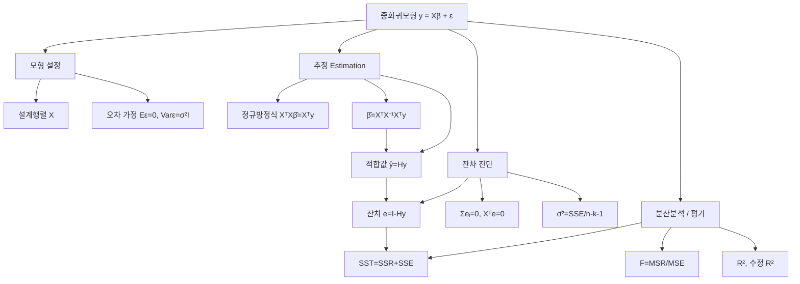

# 03. 회귀모형: 중회귀모형(1)

## 🔗 선수 지식 (Prerequisites)
- [ ] **필수**: [2강. 단순회귀모형](2강.md) — 최소제곱추정, $\hat{\beta}_0,\hat{\beta}_1$, SST·SSR·SSE 분해 이해 완료?
- [ ] **필수**: 행렬 연산 — 전치($X^\top$), 역행렬($A^{-1}$), 행렬 곱, 대칭행렬
- [ ] **권장**: 벡터의 내적·노름·정사영 `→← AI를위한수학의응용 2강`
- [ ] **권장**: 정규분포와 분산분석(ANOVA)의 기본 개념, $F$-분포
- **관련 단원**: [2강. 단순회귀모형](2강.md) `→` [4강. 중회귀모형(2)](4강.md)

---

## 학습 목표
1. 행렬을 이용한 중회귀모형을 이해한다.
2. 중회귀모형 추정방법을 알도록 한다.
3. 잔차의 성질을 알도록 한다.
4. 분산분석표를 이해한다.

---

## 🧠 메타인지 체크 (학습 전/후 자기 평가)

### 학습 전 자기 평가
| 소주제 | 자신감 (1-5) |
| :--- | :--- |
| 중회귀모형의 행렬 표현 $\mathbf{y}=X\boldsymbol{\beta}+\boldsymbol{\epsilon}$ | |
| 최소제곱추정량 $\hat{\boldsymbol{\beta}}=(X^\top X)^{-1}X^\top\mathbf{y}$ 유도 | |
| 햇행렬 $H$ 과 잔차의 성질 | |
| 분산분석표(SST=SSR+SSE)와 $F$-검정, $R^2$ | |

### 학습 후 교정 (학습 완료 후 작성)
| 소주제 | 학습 전 | 학습 후 | 실제 정답률 | 과신/과소 여부 |
| :--- | :--- | :--- | :--- | :--- |
| 행렬 표현 | | | | |
| 최소제곱추정 | | | | |
| 잔차의 성질 | | | | |
| 분산분석표·$F$·$R^2$ | | | | |

> **활용법**: 학습 전 1분 → 자신감 기입, 학습 후 1분 → 나머지 기입. "과신" 영역이 실제 취약점.

---

## 📝 요약 (Summary)
1. 🔴 **중회귀모형**: 종속변수 $y$ 를 두 개 이상의 독립변수 $x_1,\ldots,x_k$ 의 선형함수로 설명하는 모형으로, 행렬을 쓰면 $\mathbf{y}=X\boldsymbol{\beta}+\boldsymbol{\epsilon}$ 으로 간결하게 표현된다.
2. 🔴 **최소제곱추정**: 오차제곱합 $\boldsymbol{\epsilon}^\top\boldsymbol{\epsilon}=\|\mathbf{y}-X\boldsymbol{\beta}\|^2$ 을 최소화하면 정규방정식 $X^\top X\hat{\boldsymbol{\beta}}=X^\top\mathbf{y}$ 가 나오고, 그 해가 $\hat{\boldsymbol{\beta}}=(X^\top X)^{-1}X^\top\mathbf{y}$ 이다.
3. 🟡 **햇행렬과 적합값**: 적합값은 $\hat{\mathbf{y}}=X\hat{\boldsymbol{\beta}}=H\mathbf{y}$ 이고, $H=X(X^\top X)^{-1}X^\top$ 은 $\mathbf{y}$ 를 열공간으로 **정사영**시키는 대칭·멱등 행렬이다.
4. 🔴 **잔차의 성질**: 잔차 $\mathbf{e}=(I-H)\mathbf{y}$ 는 절편이 있을 때 $\sum e_i=0$, $X^\top\mathbf{e}=\mathbf{0}$ (각 설명변수와 직교) 를 만족하며, $\hat{\sigma}^2=\text{SSE}/(n-k-1)$ 로 분산을 추정한다.
5. 🔴 **분산분석표**: 총변동 $\text{SST}=\text{SSR}+\text{SSE}$ 로 분해되고, $F=\text{MSR}/\text{MSE}$ 로 회귀 전체의 유의성을 검정하며, $R^2=\text{SSR}/\text{SST}$ 로 설명력을 측정한다.

---

## 📐 핵심 수식 (Key Formulas)

| 수식명 | 수식 | 의미 |
| :--- | :--- | :--- |
| **중회귀모형(스칼라)** | $y_i=\beta_0+\beta_1 x_{i1}+\cdots+\beta_k x_{ik}+\epsilon_i$ | $k$개 설명변수의 선형결합 + 오차 |
| **중회귀모형(행렬)** | $\mathbf{y}=X\boldsymbol{\beta}+\boldsymbol{\epsilon}$ | $n\times1$, $X$는 $n\times(k+1)$ 설계행렬 |
| **오차 가정** | $E(\boldsymbol{\epsilon})=\mathbf{0},\ \text{Var}(\boldsymbol{\epsilon})=\sigma^2 I_n$ | 평균 0, 등분산·무상관 |
| **정규방정식** | $X^\top X\,\hat{\boldsymbol{\beta}}=X^\top\mathbf{y}$ | 최소화 1계 조건 |
| **최소제곱추정량** | $\hat{\boldsymbol{\beta}}=(X^\top X)^{-1}X^\top\mathbf{y}$ | $X^\top X$가 가역일 때 유일해 |
| **적합값** | $\hat{\mathbf{y}}=X\hat{\boldsymbol{\beta}}=H\mathbf{y}$ | 열공간으로의 정사영 |
| **햇행렬** | $H=X(X^\top X)^{-1}X^\top$ | 대칭·멱등 ($H^\top=H,\ H^2=H$) |
| **잔차** | $\mathbf{e}=\mathbf{y}-\hat{\mathbf{y}}=(I-H)\mathbf{y}$ | 관측값과 적합값의 차 |
| **분산 추정량** | $\hat{\sigma}^2=\text{MSE}=\dfrac{\text{SSE}}{n-k-1}$ | 불편추정량 |
| **추정량 공분산** | $\text{Var}(\hat{\boldsymbol{\beta}})=\sigma^2(X^\top X)^{-1}$ | 표준오차의 근거 |
| **변동 분해** | $\text{SST}=\text{SSR}+\text{SSE}$ | 총=회귀+잔차 |
| **$F$-통계량** | $F=\dfrac{\text{MSR}}{\text{MSE}}=\dfrac{\text{SSR}/k}{\text{SSE}/(n-k-1)}$ | 회귀 전체 유의성 검정 |
| **결정계수** | $R^2=\dfrac{\text{SSR}}{\text{SST}}=1-\dfrac{\text{SSE}}{\text{SST}}$ | 설명된 변동 비율 |
| **수정 결정계수** | $R_a^2=1-\dfrac{\text{SSE}/(n-k-1)}{\text{SST}/(n-1)}$ | 변수 수를 벌점 |

### 주요 정리/정의

**최소제곱추정량의 유도 (정규방정식)**
오차제곱합 $S(\boldsymbol{\beta})$ 를 $\boldsymbol{\beta}$ 에 대해 최소화한다.
$$
S(\boldsymbol{\beta})=\boldsymbol{\epsilon}^\top\boldsymbol{\epsilon}=(\mathbf{y}-X\boldsymbol{\beta})^\top(\mathbf{y}-X\boldsymbol{\beta})
=\mathbf{y}^\top\mathbf{y}-2\boldsymbol{\beta}^\top X^\top\mathbf{y}+\boldsymbol{\beta}^\top X^\top X\boldsymbol{\beta}
$$
$$
\frac{\partial S}{\partial\boldsymbol{\beta}}=-2X^\top\mathbf{y}+2X^\top X\boldsymbol{\beta}=\mathbf{0}
\;\Longrightarrow\; X^\top X\hat{\boldsymbol{\beta}}=X^\top\mathbf{y}
\;\Longrightarrow\; \hat{\boldsymbol{\beta}}=(X^\top X)^{-1}X^\top\mathbf{y}
$$
> **직관적 해석**: $\mathbf{y}$ 에서 $X$ 의 열들이 만드는 평면(열공간)으로 **수직으로 내린 그림자**가 $\hat{\mathbf{y}}$ 이고, 그때 잔차 $\mathbf{e}$ 가 평면에 직교($X^\top\mathbf{e}=\mathbf{0}$)한다. 단순회귀의 $\hat\beta_1=S_{xy}/S_{xx}$ 가 행렬로 일반화된 형태.
> **AI 적용**: 선형회귀의 정규방정식 닫힌해(closed-form)이자, 신경망 최종 선형층의 가중치를 해석적으로 푸는 토대. 단, $X^\top X$ 가 대규모/특이행렬이면 경사하강법이나 의사역행렬(pseudo-inverse), 능형회귀(Ridge)로 대체한다.

**햇행렬 $H$ 의 성질**
$$
H=X(X^\top X)^{-1}X^\top,\quad H^\top=H,\quad H^2=H,\quad (I-H)^2=I-H,\quad HX=X
$$
$$
\text{tr}(H)=\text{rank}(X)=k+1,\qquad \text{SSE}=\mathbf{y}^\top(I-H)\mathbf{y}
$$
> **직관적 해석**: $H$ 는 "정사영 행렬"이라서 한 번 그림자를 내리면($H\mathbf{y}$) 다시 내려도 그대로($H^2=H$)다. 대각원소 $h_{ii}$ 는 관측치 $i$ 의 **지렛대(leverage)** 로, 영향점 진단에 쓰인다.
> **AI 적용**: $\text{tr}(H)=k+1$ 은 모형의 유효 자유도(effective degrees of freedom)를 의미하며, 정규화 강도와 모형 복잡도를 잇는 다리 역할을 한다.

---

## 📊 개념 시각화 (Visual Guide)

### 개념 관계도


### 핵심 도식 (연산 ↔ AI 적용)
| 입력 | 연산 | 출력 | AI 적용 |
| :--- | :--- | :--- | :--- |
| 설계행렬 $X$, 반응 $\mathbf{y}$ | $(X^\top X)^{-1}X^\top\mathbf{y}$ | 계수 $\hat{\boldsymbol{\beta}}$ | 선형회귀 학습(정규방정식) |
| $\hat{\boldsymbol{\beta}}$, 새 $X_*$ | $X_*\hat{\boldsymbol{\beta}}$ | 예측값 $\hat{\mathbf{y}}_*$ | 회귀 예측 추론 |
| $\mathbf{y}$, $H$ | $(I-H)\mathbf{y}$ | 잔차 $\mathbf{e}$ | 잔차 분석·이상치 탐지 |
| SSR, SSE, df | $\text{MSR}/\text{MSE}$ | $F$-통계량 | 모형 유의성 검정, 변수선택 |
| SSE, SST | $1-\text{SSE}/\text{SST}$ | $R^2$ | 모형 성능 지표 |

---

## ✏️ 심화 학습 (Study Subject)

### 1. 가상 시나리오: "어떤 개념을, 언제 사용해야 할까?"
- **상황**: 아파트 가격($y$)을 면적($x_1$), 방 개수($x_2$), 지하철역까지 거리($x_3$)로 예측하는 모형을 만든다. 데이터는 $n=200$ 가구이고, 설명변수가 3개이므로 단순회귀로는 한 번에 처리할 수 없다.
- **문제**: 세 변수를 동시에 고려한 계수 $\hat{\boldsymbol{\beta}}$ 를 어떻게 한 번의 계산으로 구하고, 모형이 통계적으로 의미가 있는지 어떻게 판단할까?
- **해결**: 절편을 위한 1열을 포함한 설계행렬 $X$ ($200\times4$) 를 구성하고, 정규방정식으로
$$
\hat{\boldsymbol{\beta}}=(X^\top X)^{-1}X^\top\mathbf{y}
$$
를 한 번에 계산한다. 이어 분산분석표를 만들어
$$
F=\frac{\text{SSR}/3}{\text{SSE}/(200-3-1)}=\frac{\text{MSR}}{\text{MSE}}
$$
를 $F_{(3,\,196)}$ 임계값과 비교한다. $F$ 가 크면 "세 변수 중 적어도 하나는 가격 설명에 유의하다"는 귀무가설 $H_0:\beta_1=\beta_2=\beta_3=0$ 을 기각한다. 설명력은 $R^2$ 로, 변수 수 보정은 $R_a^2$ 로 본다.
- **AI 학습 포인트**: "면적과 방 개수가 강하게 상관되어 $X^\top X$ 가 거의 특이행렬이 되면(다중공선성) $\hat{\boldsymbol{\beta}}$ 의 분산 $\sigma^2(X^\top X)^{-1}$ 이 어떻게 커지며, 이를 능형회귀(Ridge)가 어떻게 완화하는지 식으로 설명해줘."

### 2. 관점별 비교 및 오개념 분석
- **핵심 비교**:
  - **단순회귀 vs 중회귀**: 설명변수 1개 vs $k$개. 단순회귀의 모든 공식이 행렬로 일반화된다($\hat\beta_1=S_{xy}/S_{xx}\to\hat{\boldsymbol{\beta}}=(X^\top X)^{-1}X^\top\mathbf{y}$).
  - **$R^2$ vs 수정 $R^2$**: $R^2$ 는 변수를 추가하면 항상 증가/유지되지만, $R_a^2$ 는 쓸모없는 변수를 넣으면 오히려 감소한다.
  - **$F$-검정 vs 개별 $t$-검정**: $F$ 는 "회귀 전체"의 유의성, $t$ 는 "개별 계수 $\beta_j$"의 유의성을 본다.
- **오개념 분석**:
    - **오개념 1**: "$R^2$ 가 높으면 항상 좋은 모형이다."
    - **분석**: 틀렸다. $R^2$ 는 변수를 추가하기만 해도 절대 감소하지 않으므로, 무의미한 변수를 넣어 인위적으로 부풀릴 수 있다. 과적합 위험 때문에 변수 수를 벌점하는 $R_a^2$ 또는 검증오차로 판단해야 한다.
    - **오개념 2**: "잔차의 합이 0이므로 잔차의 평균을 계산하는 것은 항상 의미가 없다."
    - **분석**: $\sum e_i=0$ 은 **절편항이 모형에 포함될 때만** 성립한다($X$ 의 1열 $\mathbf{1}$ 과 $\mathbf{e}$ 가 직교, 즉 $\mathbf{1}^\top\mathbf{e}=0$). 절편 없는 모형에서는 잔차합이 0이 아닐 수 있다.
    - **오개념 3**: "$\hat{\boldsymbol{\beta}}=(X^\top X)^{-1}X^\top\mathbf{y}$ 는 언제나 계산할 수 있다."
    - **분석**: $X$ 의 열들이 선형종속(완전 다중공선성)이면 $X^\top X$ 가 특이행렬이라 역행렬이 없다. 이때는 유일한 해가 존재하지 않으며 의사역행렬·정규화가 필요하다.
- **AI 학습 포인트**: "잔차가 설계행렬의 모든 열과 직교($X^\top\mathbf{e}=\mathbf{0}$)한다는 사실이, 정사영의 관점에서 왜 '최적 적합'을 보장하는지 기하학적으로 설명해줘."

---

## ❓ 연습 문제 및 해설

> **블룸 인지 수준 범례**: [기억] 정의·나열 → [이해] 설명·비교 → [적용] 계산·구현 → [분석] 구별·디버그 → [평가] 판단·비평 → [창조] 설계·제안

### 📝 문제

**1. ⭐ [기억] 📌 중회귀모형 $\mathbf{y}=X\boldsymbol{\beta}+\boldsymbol{\epsilon}$ 에서 오차항에 대한 표준 가정으로 옳지 않은 것은?(#prob-1)**
   > ① $E(\boldsymbol{\epsilon})=\mathbf{0}$
   > ② $\text{Var}(\boldsymbol{\epsilon})=\sigma^2 I$ (등분산·무상관)
   > ③ 오차항끼리 강한 양의 상관을 가진다
   > ④ (추론 시) $\boldsymbol{\epsilon}\sim N(\mathbf{0},\sigma^2 I)$

<br>

**2. ⭐ [기억] 📌 설명변수가 $k$개이고 절편을 포함하는 중회귀모형에서 설계행렬 $X$ 의 크기는? (관측치 $n$개)(#prob-2)**
   > ① $n\times k$
   > ② $n\times(k+1)$
   > ③ $(k+1)\times n$
   > ④ $(k+1)\times(k+1)$

<br>

**3. ⭐⭐ [이해] 📌 최소제곱추정량 $\hat{\boldsymbol{\beta}}$ 를 결정하는 정규방정식(normal equation)은?(#prob-3)**
   > ① $X\hat{\boldsymbol{\beta}}=\mathbf{y}$
   > ② $X^\top X\hat{\boldsymbol{\beta}}=X^\top\mathbf{y}$
   > ③ $X X^\top\hat{\boldsymbol{\beta}}=\mathbf{y}$
   > ④ $\hat{\boldsymbol{\beta}}=X^\top\mathbf{y}$

<br>

**4. ⭐⭐ [이해] 📌 햇행렬 $H=X(X^\top X)^{-1}X^\top$ 의 성질로 옳은 것을 모두 고르면?(#prob-4)**
   > <보기>
   >
   > 가. $H$ 는 대칭행렬이다 ($H^\top=H$)
   > 나. $H$ 는 멱등행렬이다 ($H^2=H$)
   > 다. $\text{tr}(H)=k+1$ (절편 포함, $X$가 full rank)

   > ① 가, 나
   > ② 나, 다
   > ③ 가, 다
   > ④ 가, 나, 다

<br>

**5. ⭐⭐ [이해] 📌 절편을 포함한 중회귀모형에서 잔차 $\mathbf{e}$ 의 성질로 옳지 않은 것은?(#prob-5)**
   > ① $\sum_{i=1}^{n} e_i = 0$
   > ② $X^\top\mathbf{e}=\mathbf{0}$ (각 설명변수와 직교)
   > ③ $\hat{\mathbf{y}}^\top\mathbf{e}=0$ (적합값과 직교)
   > ④ $\mathbf{e}=H\mathbf{y}$

<br>

**6. ⭐⭐ [적용] 📌 $n=20$, 설명변수 $k=3$ (절편 포함)인 중회귀에서 SSE의 자유도와 분산추정량의 분모는?(#prob-6)**
   > ① 자유도 $17$, 분모 $17$
   > ② 자유도 $16$, 분모 $16$
   > ③ 자유도 $3$, 분모 $3$
   > ④ 자유도 $19$, 분모 $19$

<br>

**7. ⭐⭐ [적용] 📌 어떤 중회귀에서 $\text{SST}=500$, $\text{SSE}=125$ 일 때 결정계수 $R^2$ 는?(#prob-7)**
   > ① $0.25$
   > ② $0.40$
   > ③ $0.75$
   > ④ $0.80$

<br>

**8. ⭐⭐⭐ [적용] 📌 $n=25$, $k=4$, $\text{SSR}=360$, $\text{SSE}=120$ 일 때 회귀 유의성 검정의 $F$-통계량은?(#prob-8)**
   > ① $F=3.0$
   > ② $F=12.0$
   > ③ $F=15.0$
   > ④ $F=18.0$

<br>

**9. ⭐⭐⭐ [분석] 📌 설명변수 두 개가 거의 완전한 선형관계(다중공선성)를 가질 때 발생하는 문제로 가장 적절한 것은?(#prob-9)**
   > ① $X^\top X$ 가 특이(near-singular)하여 $\hat{\boldsymbol{\beta}}$ 의 분산 $\sigma^2(X^\top X)^{-1}$ 이 매우 커진다
   > ② SST가 음수가 된다
   > ③ 잔차합 $\sum e_i$ 이 0이 아니게 된다
   > ④ $R^2$ 가 반드시 1이 된다

<br>

**10. ⭐⭐⭐ [평가/창조] 📌 최소제곱법으로 $\hat{\boldsymbol{\beta}}=(X^\top X)^{-1}X^\top\mathbf{y}$ 를 유도하고, 이때 잔차 $\mathbf{e}$ 가 $X$ 의 열공간에 직교함($X^\top\mathbf{e}=\mathbf{0}$)을 보이시오.(#prob-10)**

---

### 🔑 정답 및 해설 (먼저 풀어본 후 펼치기)

<details>
<summary>정답 보기 (클릭)</summary>

1. ③
2. ②
3. ②
4. ④
5. ④
6. ②
7. ③
8. ③
9. ①
10. 풀이형 정답 (해설 참조)

</details>

<details>
<summary>해설 보기 (클릭)</summary>

<a id="prob-1"></a>
**1. ⭐ [기억] 오차 가정**
> **정답: ③ 오차항끼리 강한 양의 상관을 가진다**
> **해설**: 표준 가정은 오차의 평균 0, 등분산·**무상관**($\text{Var}(\boldsymbol{\epsilon})=\sigma^2 I$, 비대각원소 0)이다. ③은 무상관 가정을 정면으로 위반한다(자기상관 문제). ④의 정규성은 가설검정·신뢰구간 추론 시 추가되는 가정.

<a id="prob-2"></a>
**2. ⭐ [기억] 설계행렬의 크기**
> **정답: ② $n\times(k+1)$**
> **해설**: 행은 관측치 $n$개, 열은 절편을 위한 1열 + 설명변수 $k$열 = $k+1$열. 따라서 $\boldsymbol{\beta}$ 는 $(k+1)\times1$ 벡터.

<a id="prob-3"></a>
**3. ⭐⭐ [이해] 정규방정식**
> **정답: ② $X^\top X\hat{\boldsymbol{\beta}}=X^\top\mathbf{y}$**
> **해설**: $S(\boldsymbol{\beta})=\|\mathbf{y}-X\boldsymbol{\beta}\|^2$ 를 미분해 0으로 두면 $-2X^\top(\mathbf{y}-X\hat{\boldsymbol{\beta}})=\mathbf{0}$, 정리하면 ②. ①은 일반적으로 해가 없는 과대결정계(overdetermined system)이다.

<a id="prob-4"></a>
**4. ⭐⭐ [이해] 햇행렬 성질**
> **정답: ④ 가, 나, 다**
> **해설**: $H^\top=(X(X^\top X)^{-1}X^\top)^\top=H$ (대칭), $H^2=X(X^\top X)^{-1}X^\top X(X^\top X)^{-1}X^\top=H$ (멱등). 멱등·대칭 정사영행렬의 trace는 rank와 같아 $\text{tr}(H)=\text{rank}(X)=k+1$. 모두 옳다.

<a id="prob-5"></a>
**5. ⭐⭐ [이해] 잔차 성질**
> **정답: ④ $\mathbf{e}=H\mathbf{y}$**
> **해설**: 잔차는 $\mathbf{e}=\mathbf{y}-\hat{\mathbf{y}}=(I-H)\mathbf{y}$ 이다. $H\mathbf{y}$ 는 적합값 $\hat{\mathbf{y}}$. ①②③은 모두 $X^\top\mathbf{e}=\mathbf{0}$ 으로부터 유도되는 옳은 성질(절편이 있으면 1열과 직교 → 잔차합 0).

<a id="prob-6"></a>
**6. ⭐⭐ [적용] 자유도**
> **정답: ② 자유도 $16$, 분모 $16$**
> **해설**: SSE의 자유도는 $n-k-1=20-3-1=16$. 분산추정량 $\hat\sigma^2=\text{SSE}/(n-k-1)$ 의 분모도 16. (여기서 $k=3$ 은 절편을 제외한 설명변수 수.)

<a id="prob-7"></a>
**7. ⭐⭐ [적용] 결정계수**
> **정답: ③ $0.75$**
> **해설**: $R^2=1-\text{SSE}/\text{SST}=1-125/500=1-0.25=0.75$. 또는 $\text{SSR}=\text{SST}-\text{SSE}=375$, $R^2=375/500=0.75$.

<a id="prob-8"></a>
**8. ⭐⭐⭐ [적용] $F$-통계량**
> **정답: ③ $F=15.0$**
> **해설**: $\text{MSR}=\text{SSR}/k=360/4=90$, $\text{MSE}=\text{SSE}/(n-k-1)=120/(25-4-1)=120/20=6$. 따라서 $F=\text{MSR}/\text{MSE}=90/6=15.0$. 자유도는 $(k,\,n-k-1)=(4,\,20)$ 이며, 이를 $F_{(4,20)}$ 임계값과 비교한다.

<a id="prob-9"></a>
**9. ⭐⭐⭐ [분석] 다중공선성**
> **정답: ① $X^\top X$ 가 특이하여 $\hat{\boldsymbol{\beta}}$ 의 분산이 커진다**
> **해설**: 열들이 거의 선형종속이면 $\det(X^\top X)\approx0$ 이라 $(X^\top X)^{-1}$ 의 원소가 폭발하고, $\text{Var}(\hat{\boldsymbol{\beta}})=\sigma^2(X^\top X)^{-1}$ 가 커져 계수 추정이 불안정해진다. ②④는 성립하지 않고, ③은 절편이 있으면 여전히 $\sum e_i=0$.

<a id="prob-10"></a>
**10. ⭐⭐⭐ [평가/창조] 최소제곱 유도와 직교성**
> **정답·해설**:
> 1) **목적함수**: $S(\boldsymbol{\beta})=(\mathbf{y}-X\boldsymbol{\beta})^\top(\mathbf{y}-X\boldsymbol{\beta})=\mathbf{y}^\top\mathbf{y}-2\boldsymbol{\beta}^\top X^\top\mathbf{y}+\boldsymbol{\beta}^\top X^\top X\boldsymbol{\beta}$.
> 2) **1계 조건**: $\dfrac{\partial S}{\partial\boldsymbol{\beta}}=-2X^\top\mathbf{y}+2X^\top X\boldsymbol{\beta}=\mathbf{0}$.
> 3) **정규방정식**: $X^\top X\hat{\boldsymbol{\beta}}=X^\top\mathbf{y}$. $X^\top X$ 가 가역이면 $\hat{\boldsymbol{\beta}}=(X^\top X)^{-1}X^\top\mathbf{y}$.
> 4) **직교성**: 잔차 $\mathbf{e}=\mathbf{y}-X\hat{\boldsymbol{\beta}}$ 에 대해
> $$X^\top\mathbf{e}=X^\top(\mathbf{y}-X\hat{\boldsymbol{\beta}})=X^\top\mathbf{y}-X^\top X\hat{\boldsymbol{\beta}}=X^\top\mathbf{y}-X^\top\mathbf{y}=\mathbf{0}.$$
> 즉 잔차는 $X$ 의 모든 열(열공간)에 직교한다. 기하학적으로 $\hat{\mathbf{y}}$ 는 $\mathbf{y}$ 의 열공간 위 정사영이며, 잔차는 그 평면에 수직 — 이 수직성이 거리 $\|\mathbf{y}-X\boldsymbol{\beta}\|$ 를 최소로 만든다(피타고라스).
> 5) **2계 조건**: 헤시안 $2X^\top X$ 가 양의 준정부호이므로 위 해는 최소점이다.

</details>

---

## ✅ O/X 확인문제 (총 20문)

**1.** 중회귀모형은 종속변수를 두 개 이상의 독립변수의 선형결합으로 설명한다. (#ox-1) **(O / X)**
**2.** 절편을 포함하면 설계행렬 $X$ 의 첫 열은 모두 1인 벡터이다. (#ox-2) **(O / X)**
**3.** 정규방정식은 $X^\top X\hat{\boldsymbol{\beta}}=X^\top\mathbf{y}$ 이다. (#ox-3) **(O / X)**
**4.** $X^\top X$ 가 특이행렬이어도 $\hat{\boldsymbol{\beta}}$ 의 유일한 해가 항상 존재한다. (#ox-4) **(O / X)**
**5.** 적합값은 $\hat{\mathbf{y}}=H\mathbf{y}$ 로 쓸 수 있다. (#ox-5) **(O / X)**
**6.** 햇행렬 $H$ 는 멱등행렬이므로 $H^2=H$ 이다. (#ox-6) **(O / X)**
**7.** 잔차는 $\mathbf{e}=(I-H)\mathbf{y}$ 로 표현된다. (#ox-7) **(O / X)**
**8.** 절편이 포함된 모형에서 잔차의 합은 항상 0이다. (#ox-8) **(O / X)**
**9.** 잔차 벡터는 설계행렬의 모든 열과 직교한다 ($X^\top\mathbf{e}=\mathbf{0}$). (#ox-9) **(O / X)**
**10.** 오차분산의 불편추정량은 $\hat\sigma^2=\text{SSE}/n$ 이다. (#ox-10) **(O / X)**
**11.** 총변동은 $\text{SST}=\text{SSR}+\text{SSE}$ 로 분해된다. (#ox-11) **(O / X)**
**12.** SSR의 자유도는 설명변수의 수 $k$ 이다. (#ox-12) **(O / X)**
**13.** SST의 자유도는 $n-1$ 이다. (#ox-13) **(O / X)**
**14.** 회귀 유의성 검정의 $F$-통계량은 $\text{MSR}/\text{MSE}$ 이다. (#ox-14) **(O / X)**
**15.** $R^2=\text{SSE}/\text{SST}$ 이다. (#ox-15) **(O / X)**
**16.** 설명변수를 추가하면 $R^2$ 는 절대로 감소하지 않는다. (#ox-16) **(O / X)**
**17.** 수정 결정계수 $R_a^2$ 는 무의미한 변수를 추가하면 감소할 수 있다. (#ox-17) **(O / X)**
**18.** 추정량의 공분산행렬은 $\text{Var}(\hat{\boldsymbol{\beta}})=\sigma^2(X^\top X)^{-1}$ 이다. (#ox-18) **(O / X)**
**19.** $F$-검정의 귀무가설은 $H_0:\beta_1=\beta_2=\cdots=\beta_k=0$ 이다. (#ox-19) **(O / X)**
**20.** 햇행렬의 대각원소 $h_{ii}$ 는 해당 관측치의 지렛대(leverage)를 나타낸다. (#ox-20) **(O / X)**

<details>
<summary>O/X 정답 및 해설 보기 (클릭)</summary>

> <a id="ox-1"></a> **1. O** — 중회귀의 정의 그대로.
> <a id="ox-2"></a> **2. O** — 절편 $\beta_0$ 에 대응하는 열이 $\mathbf{1}$ 벡터.
> <a id="ox-3"></a> **3. O** — 최소제곱 1계 조건에서 유도되는 정규방정식.
> <a id="ox-4"></a> **4. X** — $X^\top X$ 가 특이하면 역행렬이 없어 유일해가 존재하지 않는다(의사역행렬·정규화 필요).
> <a id="ox-5"></a> **5. O** — $\hat{\mathbf{y}}=X\hat{\boldsymbol{\beta}}=X(X^\top X)^{-1}X^\top\mathbf{y}=H\mathbf{y}$.
> <a id="ox-6"></a> **6. O** — $H$ 는 정사영행렬로 멱등.
> <a id="ox-7"></a> **7. O** — $\mathbf{e}=\mathbf{y}-\hat{\mathbf{y}}=\mathbf{y}-H\mathbf{y}=(I-H)\mathbf{y}$.
> <a id="ox-8"></a> **8. O** — 절편 열 $\mathbf{1}$ 과 직교하므로 $\mathbf{1}^\top\mathbf{e}=\sum e_i=0$.
> <a id="ox-9"></a> **9. O** — 정규방정식의 직접적 결과.
> <a id="ox-10"></a> **10. X** — 분모는 자유도 $n-k-1$ 이어야 불편추정량이 된다.
> <a id="ox-11"></a> **11. O** — 변동의 직교분해.
> <a id="ox-12"></a> **12. O** — SSR 자유도 = 설명변수 수 $k$.
> <a id="ox-13"></a> **13. O** — 전체 자유도 $n-1$ = $k$(SSR) + $(n-k-1)$(SSE).
> <a id="ox-14"></a> **14. O** — $F=\dfrac{\text{SSR}/k}{\text{SSE}/(n-k-1)}$.
> <a id="ox-15"></a> **15. X** — $R^2=\text{SSR}/\text{SST}=1-\text{SSE}/\text{SST}$. SSE/SST는 설명 안 된 비율.
> <a id="ox-16"></a> **16. O** — 변수를 추가하면 SSE는 늘지 않으므로 $R^2$ 는 단조 비감소.
> <a id="ox-17"></a> **17. O** — $R_a^2$ 는 변수 수를 벌점하므로 쓸모없는 변수에 감소 가능.
> <a id="ox-18"></a> **18. O** — $\hat{\boldsymbol{\beta}}=(X^\top X)^{-1}X^\top\mathbf{y}$ 의 분산 전파 결과.
> <a id="ox-19"></a> **19. O** — 회귀 전체가 무의미하다는 가설(절편 제외 모든 기울기 0).
> <a id="ox-20"></a> **20. O** — $h_{ii}$ 는 관측치 $i$ 가 자신의 적합값에 미치는 영향력(지렛대).

</details>

---

## 🧪 자유 회상 연습 (Free Recall)

> **방법**: 위의 노트를 모두 덮고, 타이머 3분 설정 후 이번 단원에서 배운 내용을 기억나는 대로 자유롭게 적으세요.
> 정확한 문장이 아니어도 됩니다. 키워드, 수식, 관계 등 떠오르는 것을 모두 적습니다.

**자유 회상 작성란:**

```
[여기에 기억나는 내용을 자유롭게 작성]


```

> **회상 후 점검**: 노트를 다시 펼쳐 빠뜨린 내용을 확인하세요. 빠뜨린 부분이 실제 취약점입니다.
> - 회상 못한 핵심 개념: [                ]
> - 회상 못한 수식: [                ]

---

## 💻 코드로 확인하기 (Code Verification)

```python
import numpy as np

# 가상 데이터: y = 2 + 1.5*x1 - 0.8*x2 + 잡음
np.random.seed(0)
n = 50
x1 = np.random.uniform(0, 10, n)
x2 = np.random.uniform(0, 5, n)
eps = np.random.normal(0, 1.0, n)
y = 2 + 1.5*x1 - 0.8*x2 + eps

# 1) 설계행렬 X (절편 1열 포함) → n x 3
X = np.column_stack([np.ones(n), x1, x2])

# 2) 정규방정식으로 beta_hat = (X^T X)^{-1} X^T y
XtX = X.T @ X
beta_hat = np.linalg.solve(XtX, X.T @ y)   # inv보다 solve가 수치적으로 안정
print("beta_hat =", np.round(beta_hat, 4))

# 3) 적합값, 잔차, 햇행렬 성질 확인
H = X @ np.linalg.inv(XtX) @ X.T
y_hat = H @ y
e = y - y_hat
print("sum(e) =", round(e.sum(), 10))           # 절편 있으면 ~0
print("X^T e  =", np.round(X.T @ e, 10))         # 모든 열과 직교 → ~0
print("H idempotent? ", np.allclose(H @ H, H))   # H^2 = H
print("trace(H) =", round(np.trace(H), 4))       # = k+1 = 3

# 4) 분산분석표 (SST = SSR + SSE), R^2, F
k = 2                       # 설명변수 수(절편 제외)
SST = np.sum((y - y.mean())**2)
SSE = np.sum(e**2)
SSR = SST - SSE
R2  = SSR / SST
MSR = SSR / k
MSE = SSE / (n - k - 1)
F   = MSR / MSE
print(f"SST={SST:.2f}, SSR={SSR:.2f}, SSE={SSE:.2f}")
print(f"R^2 = {R2:.4f},  F = {F:.2f} (df=({k},{n-k-1}))")
```

> **실행 결과 (예상)**
> ```
> beta_hat = [ 1.99xx  1.50xx -0.80xx]
> sum(e) = 0.0
> X^T e  = [ 0.  0.  0.]
> H idempotent?  True
> trace(H) = 3.0
> SST=..., SSR=..., SSE=...
> R^2 = 0.99xx,  F = 매우 큼 (df=(2,47))
> ```
> **수학적 해석**: 추정된 계수가 실제 모수 $(2,\,1.5,\,-0.8)$ 에 근접하고, 잔차합과 $X^\top\mathbf{e}$ 가 모두 0 — 정규방정식의 직교성이 코드로 확인된다. $\text{tr}(H)=3=k+1$ 은 모형의 유효 자유도, 큰 $F$ 와 높은 $R^2$ 는 모형이 매우 유의함을 보여준다.

---

## 🤖 AI 연결고리 (Math → AI Application)

| 수학 개념 | AI/ML 적용 분야 | 구체적 사례 |
| :--- | :--- | :--- |
| 정규방정식 $\hat{\boldsymbol{\beta}}=(X^\top X)^{-1}X^\top\mathbf{y}$ | 선형회귀 학습 | scikit-learn `LinearRegression`의 닫힌해 |
| 햇행렬·정사영 | 차원·영향점 진단 | leverage $h_{ii}$, Cook's distance |
| $\text{Var}(\hat{\boldsymbol{\beta}})=\sigma^2(X^\top X)^{-1}$ | 다중공선성 진단 | VIF, 능형회귀(Ridge) 정규화 |
| 변동분해 SST=SSR+SSE | 모형 평가 지표 | $R^2$, 설명분산(explained variance) |
| $F$-검정 / 자유도 | 모형·변수 선택 | ANOVA 기반 변수 선택, 정규화 강도 |
| 최소제곱(손실 $\|\mathbf{y}-X\boldsymbol{\beta}\|^2$) | 손실함수 | MSE 손실, 경사하강법의 목적함수 |

---

## 📖 심화 학습 예시 답안

#### 1. 햇행렬(Hat Matrix)의 내부 동작 원리
햇행렬 $H=X(X^\top X)^{-1}X^\top$ 은 임의의 벡터 $\mathbf{y}$ 를 $X$ 의 **열공간(column space)** 으로 정사영시키는 연산자다.

1. **분해**: $\mathbf{y}=\underbrace{H\mathbf{y}}_{\hat{\mathbf{y}}\,\in\,C(X)}+\underbrace{(I-H)\mathbf{y}}_{\mathbf{e}\,\perp\,C(X)}$ 로 직교분해된다.
2. **멱등성의 의미**: $H^2=H$ 는 "이미 평면 위에 있는 그림자는 다시 투영해도 그대로"라는 뜻 — 정사영의 본질.
3. **직교성**: $(I-H)$ 도 정사영행렬이고 $H(I-H)=0$ 이므로, 적합값과 잔차는 직교한다($\hat{\mathbf{y}}^\top\mathbf{e}=0$). 이로부터 피타고라스 $\|\mathbf{y}\|^2=\|\hat{\mathbf{y}}\|^2+\|\mathbf{e}\|^2$ 이 곧 변동분해 SST=SSR+SSE(평균 보정 후)이다.
4. **진단**: 대각원소 $h_{ii}\in[0,1]$ 이고 $\sum h_{ii}=k+1$. $h_{ii}$ 가 크면 그 관측치가 적합에 과도한 영향(고지렛대)을 준다.

#### 2. $R^2$ vs 수정 $R^2$ 비교표

| 구분 | 결정계수 $R^2$ | 수정 결정계수 $R_a^2$ | 비고 |
| :--- | :--- | :--- | :--- |
| **정의** | $1-\dfrac{\text{SSE}}{\text{SST}}$ | $1-\dfrac{\text{SSE}/(n-k-1)}{\text{SST}/(n-1)}$ | 자유도 보정 여부 |
| **변수 추가 시** | 항상 증가/유지 | 무의미한 변수면 감소 | 과적합 신호 |
| **값 범위** | $[0,1]$ | 음수 가능 | |
| **적용 조건** | 같은 변수 수 모형 비교 | 변수 수 다른 모형 비교 | |
| **AI 활용** | 단일 모형 적합도 보고 | 변수 선택·모형 비교 | 검증오차와 병행 |

#### 3. 최소제곱 계수를 구하는 코드 작성법 (Best Practice)

- **Bad Practice (나쁜 예시)**
  ```python
  # 역행렬을 직접 계산 → 수치적으로 불안정(특히 X^T X가 ill-conditioned일 때)
  beta = np.linalg.inv(X.T @ X) @ X.T @ y
  ```
- **Good Practice (좋은 예시)**
  ```python
  # 1) 선형계 solve (정규방정식, inv 회피)
  beta = np.linalg.solve(X.T @ X, X.T @ y)

  # 2) 더 안정적: 최소제곱 직접 분해(QR/SVD 기반) — rank 결손도 처리
  beta, residuals, rank, sv = np.linalg.lstsq(X, y, rcond=None)
  ```
- **설명**: 정규방정식 $X^\top X$ 는 조건수가 제곱되어 수치오차가 증폭된다. `lstsq`(내부적으로 SVD/QR)는 역행렬을 명시적으로 만들지 않아 다중공선성·rank 결손 상황에서도 안정적이다. 대규모·고차원이면 경사하강법이나 Ridge($\hat{\boldsymbol{\beta}}=(X^\top X+\lambda I)^{-1}X^\top\mathbf{y}$)를 쓴다.

---

## 📚 핵심 용어집 (Glossary)

| 용어 (한) | 용어 (영) | 수식 표현 | 정의 |
| :--- | :--- | :--- | :--- |
| **중회귀모형** | Multiple Regression Model | $\mathbf{y}=X\boldsymbol{\beta}+\boldsymbol{\epsilon}$ | 2개 이상 독립변수로 종속변수 설명 |
| **설계행렬** | Design Matrix | $X\in\mathbb{R}^{n\times(k+1)}$ | 절편 1열 + 설명변수 행렬 |
| **정규방정식** | Normal Equation | $X^\top X\hat{\boldsymbol{\beta}}=X^\top\mathbf{y}$ | 최소제곱의 1계 조건 |
| **최소제곱추정량** | OLS Estimator | $\hat{\boldsymbol{\beta}}=(X^\top X)^{-1}X^\top\mathbf{y}$ | 오차제곱합 최소화 해 |
| **햇행렬** | Hat Matrix | $H=X(X^\top X)^{-1}X^\top$ | 열공간 정사영(대칭·멱등) |
| **적합값** | Fitted Value | $\hat{\mathbf{y}}=H\mathbf{y}$ | 모형이 예측한 $y$ |
| **잔차** | Residual | $\mathbf{e}=(I-H)\mathbf{y}$ | 관측값 − 적합값 |
| **지렛대** | Leverage | $h_{ii}$ | 관측치의 영향력 (햇행렬 대각) |
| **총변동** | Total Sum of Squares | $\text{SST}=\sum(y_i-\bar y)^2$ | $y$ 전체 변동, df $=n-1$ |
| **회귀변동** | Regression SS | $\text{SSR}=\sum(\hat y_i-\bar y)^2$ | 설명된 변동, df $=k$ |
| **잔차변동** | Error SS | $\text{SSE}=\sum(y_i-\hat y_i)^2$ | 설명 안 된 변동, df $=n-k-1$ |
| **결정계수** | Coefficient of Determination | $R^2=\text{SSR}/\text{SST}$ | 설명된 변동 비율 |
| **수정 결정계수** | Adjusted $R^2$ | $R_a^2$ | 변수 수 벌점 결정계수 |
| **$F$-통계량** | F-statistic | $F=\text{MSR}/\text{MSE}$ | 회귀 전체 유의성 검정 `→← 4강` |
| **다중공선성** | Multicollinearity | $\det(X^\top X)\approx0$ | 설명변수 간 강한 선형관계 `→← 4강` |

---

## 🤖 AI 학습 파트너를 위한 추가 자료

### 1. 개념 이해를 위한 심층 질문 프롬프트
> **프롬프트 예시**: "중회귀의 최소제곱추정 $\hat{\boldsymbol{\beta}}=(X^\top X)^{-1}X^\top\mathbf{y}$ 를 '여러 그림자를 동시에 맞추기' 비유로 초등학생도 이해하게 설명해줘. 그리고 단순회귀 공식 $\hat\beta_1=S_{xy}/S_{xx}$ 가 이 행렬식의 특수한 경우($k=1$)임을 식으로 보여줘."

### 2. 문제 해결 능력 강화를 위한 시나리오 프롬프트
> **프롬프트 예시**: "당신은 데이터 사이언티스트입니다. 설명변수 10개 중 두 개가 상관계수 0.98로 강하게 상관된 데이터에서 회귀 계수가 불안정합니다. **변수 제거, 능형회귀(Ridge), 주성분회귀(PCR)** 중 무엇을 선택할지 각각 $\text{Var}(\hat{\boldsymbol{\beta}})=\sigma^2(X^\top X)^{-1}$ 관점에서 장단점을 비교하고 최종 선택 이유를 설명해줘."

### 3. 수식 풀이 검증 프롬프트
> **프롬프트 예시**: "다음 최소제곱 유도를 검증해줘.
> $$S(\boldsymbol{\beta})=\|\mathbf{y}-X\boldsymbol{\beta}\|^2 \;\Rightarrow\; \frac{\partial S}{\partial\boldsymbol{\beta}}=-2X^\top\mathbf{y}+2X^\top X\boldsymbol{\beta}=\mathbf{0} \;\Rightarrow\; \hat{\boldsymbol{\beta}}=(X^\top X)^{-1}X^\top\mathbf{y}$$
> 1. 각 단계가 올바른지, 행렬 미분 규칙이 정확히 적용됐는지 확인해줘.
> 2. 2계 조건(헤시안 $2X^\top X\succeq0$)으로 최소점임을 확인하는 과정을 보충해줘."

---

## 🔄 복습 체크 (Spaced Repetition)
- [ ] 1일 후 복습 (날짜: 2026-05-30)
- [ ] 3일 후 복습 (날짜: 2026-06-01)
- [ ] 7일 후 복습 (날짜: 2026-06-05)
- [ ] 14일 후 복습 (날짜: 2026-06-12)
- [ ] 30일 후 복습 (날짜: 2026-06-28)

### 복습 시 자가 평가
| 회차 | 날짜 | 이해도 (1-5) | 취약 부분 메모 |
| :--- | :--- | :--- | :--- |
| 1차 | | | |
| 2차 | | | |
| 3차 | | | |

---

## 📚 참고 자료 (References)

- 교재: 한국방송통신대학교 『R을 이용한 회귀모형』 3장 — 중회귀모형(1)
- 강의: 회귀모형 3강 (1. 중회귀모형 / 2. 중회귀모형의 추정 / 3. 중회귀 분산분석표)
- Montgomery, Peck & Vining, *Introduction to Linear Regression Analysis* — 행렬 표현·햇행렬·ANOVA 표준 텍스트
- Gilbert Strang, *Introduction to Linear Algebra* — 정사영과 최소제곱의 선형대수적 직관
- [2강. 단순회귀모형](2강.md) — 본 강의 행렬 일반화의 출발점
</content>
</invoke>
