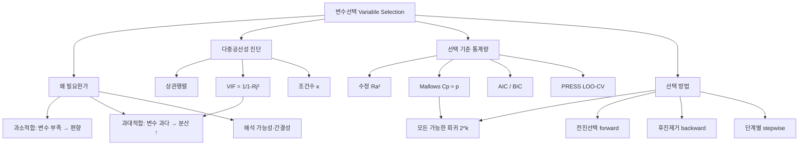

# 06. 회귀모형: 변수선택

## 🔗 선수 지식 (Prerequisites)
- [ ] **필수**: [3강. 중회귀모형(1)](3강.md) — $\hat{\boldsymbol{\beta}}=(X^\top X)^{-1}X^\top\mathbf{y}$, SST·SSR·SSE 분해, $R^2$·$F$-검정 이해 완료?
- [ ] **필수**: [4강. 중회귀모형(2)](4강.md) — 개별 계수 $t$-검정, $\text{Var}(\hat{\boldsymbol{\beta}})=\sigma^2(X^\top X)^{-1}$
- [ ] **권장**: [5강. 회귀진단](5강.md) — 잔차분석, 영향점·지렛대(leverage)
- [ ] **권장**: 행렬의 역행렬·행렬식($\det$)·고유값, 조건수(condition number) `→← AI를위한수학의응용`
- **관련 단원**: [3강. 중회귀모형(1)](3강.md) `→` [4강. 중회귀모형(2)](4강.md) `→` **6강. 변수선택**

---

## 학습 목표
1. 변수선택의 필요성을 이해한다.
2. 다중공선성의 개념과 진단하는 통계량을 안다.
3. 변수선택의 기준이 되는 통계량을 이해한다.
4. 여러 가지 변수선택방법을 활용할 수 있도록 한다.

---

## 🧠 메타인지 체크 (학습 전/후 자기 평가)

### 학습 전 자기 평가
| 소주제 | 자신감 (1-5) |
| :--- | :--- |
| 변수선택의 필요성 (과소·과대적합, 분산-편향 절충) | |
| 다중공선성과 진단통계량 (VIF, 조건수) | |
| 변수선택 기준 ($R_a^2$, $C_p$, AIC, BIC, PRESS) | |
| 변수선택 방법 (모든 가능한 회귀, 전진/후진/단계별) | |

### 학습 후 교정 (학습 완료 후 작성)
| 소주제 | 학습 전 | 학습 후 | 실제 정답률 | 과신/과소 여부 |
| :--- | :--- | :--- | :--- | :--- |
| 변수선택 필요성 | | | | |
| 다중공선성·진단 | | | | |
| 선택 기준 통계량 | | | | |
| 선택 방법 | | | | |

> **활용법**: 학습 전 1분 → 자신감 기입, 학습 후 1분 → 나머지 기입. "과신" 영역이 실제 취약점.

---

## 📝 요약 (Summary)
1. 🔴 **변수선택의 필요성**: 설명변수를 무작정 많이 넣으면 추정량의 분산이 커지고(과대적합) 해석이 어려워지며, 너무 적게 넣으면 편향이 생긴다(과소적합). 예측력과 간결성(parsimony)의 균형을 위해 의미 있는 변수의 부분집합을 고른다.
2. 🔴 **다중공선성(multicollinearity)**: 설명변수들 사이에 강한 선형관계가 있어 $X^\top X$ 가 거의 특이행렬이 되는 현상. 계수 추정의 분산 $\sigma^2(X^\top X)^{-1}$ 이 폭발해 추정이 불안정해진다. 진단: 상관행렬, **분산팽창계수(VIF)**, 고유값·**조건수**.
3. 🟡 **변수선택 기준**: 단순한 $R^2$ 는 변수를 넣을수록 항상 증가하므로 부적합. 변수 수에 벌점을 주는 **수정 $R_a^2$**, **Mallows' $C_p$**, **AIC**, **BIC(SBC)**, **PRESS** 등으로 적합도와 복잡도를 함께 평가한다.
4. 🔴 **변수선택 방법**: ① **모든 가능한 회귀**($2^k$개 모형 전수 비교), ② **전진선택법**(빈 모형에서 유의한 변수를 하나씩 추가), ③ **후진제거법**(완전모형에서 무의미한 변수를 하나씩 제거), ④ **단계별 회귀**(추가와 제거를 번갈아 수행).

---

## 📐 핵심 수식 (Key Formulas)

| 수식명 | 수식 | 의미 |
| :--- | :--- | :--- |
| **분산팽창계수(VIF)** | $\text{VIF}_j=\dfrac{1}{1-R_j^2}$ | $x_j$ 를 나머지 변수로 회귀한 결정계수 $R_j^2$ 기반, 다중공선성 척도 |
| **공차한계(Tolerance)** | $\text{TOL}_j=1-R_j^2=1/\text{VIF}_j$ | VIF의 역수 |
| **조건수(Condition Number)** | $\kappa=\sqrt{\lambda_{\max}/\lambda_{\min}}$ | $X^\top X$ 고유값 비의 제곱근, 클수록 공선성 심함 |
| **수정 결정계수** | $R_a^2=1-\dfrac{\text{SSE}/(n-p)}{\text{SST}/(n-1)}$ | $p$=모수 개수(절편 포함), 변수 수 벌점 |
| **Mallows' $C_p$** | $C_p=\dfrac{\text{SSE}_p}{\hat\sigma^2_{\text{full}}}-(n-2p)$ | 편향+분산 균형, 좋은 모형은 $C_p\approx p$ |
| **AIC** | $\text{AIC}=n\ln\!\big(\tfrac{\text{SSE}}{n}\big)+2p$ | 적합도 벌점, 작을수록 좋음 |
| **BIC(SBC)** | $\text{BIC}=n\ln\!\big(\tfrac{\text{SSE}}{n}\big)+p\ln n$ | 표본이 크면 $\ln n>2$ 라 AIC보다 강한 벌점 |
| **PRESS** | $\text{PRESS}=\sum_{i=1}^{n}\Big(\dfrac{e_i}{1-h_{ii}}\Big)^2$ | LOO 교차검증 예측오차, 작을수록 예측력 좋음 |
| **진입 기준(전진)** | $F_{\text{in}}=\dfrac{(\text{SSE}_{\text{old}}-\text{SSE}_{\text{new}})/1}{\text{SSE}_{\text{new}}/(n-p_{\text{new}})}$ | 부분 $F$ 가 임계값보다 크면 변수 추가 |
| **제거 기준(후진)** | $F_{\text{out}}$ (부분 $F$) | 가장 작은 부분 $F$ 가 임계값 미만이면 제거 |

### 주요 정리/정의

**다중공선성과 추정량 분산의 관계**
$x_j$ 계수 추정량의 분산은 VIF로 다음과 같이 분해된다.
$$
\text{Var}(\hat\beta_j)=\frac{\sigma^2}{(n-1)S_{x_j}^2}\cdot\underbrace{\frac{1}{1-R_j^2}}_{\text{VIF}_j}
$$
여기서 $R_j^2$ 는 $x_j$ 를 **나머지 모든 설명변수**로 회귀했을 때의 결정계수다.
> **직관적 해석**: $x_j$ 가 다른 변수들로 거의 완벽히 설명되면($R_j^2\to1$) VIF가 폭발하고, 그만큼 $\hat\beta_j$ 의 표준오차가 커져 "이 변수가 유의한지"를 판단하기 어려워진다. 경험칙으로 **VIF > 10**(또는 평균 VIF가 1보다 훨씬 큼)이면 공선성을 의심한다.
> **AI 적용**: 정규화 회귀(Ridge)는 $X^\top X+\lambda I$ 로 고유값을 끌어올려 조건수를 낮추고 분산을 줄인다 — 다중공선성에 대한 직접 처방. 특성공학에서 상관 높은 피처 제거·주성분 사용도 같은 동기.

**Mallows' $C_p$ 의 의미**
완전모형의 평균제곱오차 $\hat\sigma^2_{\text{full}}=\text{MSE}_{\text{full}}$ 를 기준으로, $p$개 모수를 가진 부분모형의 표준화 예측오차다.
$$
E[C_p]\approx p \quad(\text{편향이 거의 없는 모형}),\qquad C_p\gg p \;\Rightarrow\; \text{과소적합(중요 변수 누락)}
$$
> **직관적 해석**: $C_p$ 가 모수 개수 $p$ 에 가깝고 작을수록 "편향 없이 간결한" 좋은 모형. $C_p$-vs-$p$ 산점도에서 $C_p\approx p$ 직선 근처의 가장 단순한 점을 고른다.
> **AI 적용**: $C_p$, AIC는 모두 "훈련오차 + 복잡도 벌점" 구조로, 검증오차(validation loss)·교차검증의 통계적 선조 격이다.

---

## 📊 개념 시각화 (Visual Guide)

### 개념 관계도


### 핵심 도식 (방법 ↔ 절차 ↔ AI 적용)
| 방법 | 시작점 | 절차 | AI 적용 |
| :--- | :--- | :--- | :--- |
| 모든 가능한 회귀 | 전체 후보 | $2^k$개 모형 모두 적합 후 기준 비교 | 완전탐색(brute-force) 모델 선택 |
| 전진선택 | 절편만 | 부분 $F$ 최대 변수를 하나씩 **추가** | greedy feature addition |
| 후진제거 | 완전모형 | 부분 $F$ 최소 변수를 하나씩 **제거** | recursive feature elimination(RFE) |
| 단계별 | 절편만/완전 | 추가·제거 **반복** | forward-backward selection |

---

## ✏️ 심화 학습 (Study Subject)

### 1. 가상 시나리오: "어떤 개념을, 언제 사용해야 할까?"
- **상황**: 신용평가 모형을 위해 고객의 소득·부채·연체횟수·카드사용액·자산 등 후보 설명변수 $k=12$ 개를 수집했다. 그런데 '소득'과 '자산', '부채'와 '카드사용액'이 서로 강하게 상관되어 있고, 12개를 모두 넣은 완전모형은 계수의 부호가 직관과 반대로 나오고 표준오차가 비정상적으로 크다.
- **문제**: (1) 어떤 변수쌍이 다중공선성을 일으키는지 어떻게 진단하고, (2) 12개 중 예측력 있고 해석 가능한 부분집합을 어떻게 선택할까?
- **해결**:
  1. **진단**: 각 변수의 $\text{VIF}_j=1/(1-R_j^2)$ 를 계산해 10을 넘는 변수를 식별하고, $X^\top X$ 의 조건수 $\kappa=\sqrt{\lambda_{\max}/\lambda_{\min}}$ 로 전반적 공선성 정도를 본다.
  2. **선택**: $k=12$ 면 모든 가능한 회귀는 $2^{12}=4096$ 개로 부담되므로, **단계별 회귀**로 진입/제거 임계 $F$ 를 두고 변수를 추가·제거한다. 후보 모형들을 **$C_p\approx p$**, **AIC/BIC 최소**, **PRESS 최소** 로 비교해 최종 모형을 정한다.
- **AI 학습 포인트**: "단계별 회귀(stepwise)는 탐욕적(greedy)이라 전역최적 부분집합을 놓칠 수 있다. LASSO($\ell_1$ 벌점)나 elastic net이 변수선택과 정규화를 동시에 수행하는 원리를, $C_p$/AIC 벌점항과 비교해 설명해줘."

### 2. 관점별 비교 및 오개념 분석
- **핵심 비교**:
  - **전진선택 vs 후진제거**: 전진은 빈 모형에서 추가 → 변수 수가 많아 완전모형 적합이 어려울 때 유리. 후진은 완전모형에서 제거 → 변수 간 결합 효과를 초기에 반영. 두 방법은 **서로 다른 최종 모형**을 줄 수 있다.
  - **$C_p$ vs AIC vs BIC**: 모두 "적합도 + 복잡도 벌점"이지만 벌점 강도가 다르다. BIC는 $p\ln n$ 으로 표본이 크면 AIC($2p$)보다 더 간결한 모형을 선호한다.
  - **$R^2$ vs $R_a^2$**: $R^2$ 는 변수 추가 시 단조 비감소라 선택 기준으로 부적합, $R_a^2$ 는 무의미한 변수에 감소한다.
- **오개념 분석**:
    - **오개념 1**: "다중공선성이 있으면 예측 자체가 불가능하다."
    - **분석**: 틀렸다. 공선성은 **개별 계수의 추정·해석**을 불안정하게 만들 뿐, 공선 구조가 유지되는 범위 안에서의 **예측($\hat{\mathbf{y}}$)** 은 여전히 안정적일 수 있다. 문제는 계수 해석과 외삽이다.
    - **오개념 2**: "전진선택과 후진제거는 항상 같은 최종 모형을 준다."
    - **분석**: 그렇지 않다. 두 방법은 탐욕적 경로가 달라 결과가 다를 수 있고, 둘 다 전역최적(모든 가능한 회귀)을 보장하지 않는다.
    - **오개념 3**: "VIF가 높은 변수는 무조건 제거해야 한다."
    - **분석**: VIF는 경고 신호일 뿐이다. 이론적으로 중요한 변수라면 제거 대신 정규화(Ridge)·차원축소(PCA)·변수 재정의를 고려해야 한다. 단순 제거는 누락변수편향을 부를 수 있다.
- **AI 학습 포인트**: "단계별 회귀로 얻은 $p$-값과 신뢰구간이 '선택 후 추론(post-selection inference)' 관점에서 왜 과대낙관적(too optimistic)인지, 그리고 교차검증·정규화가 이를 어떻게 완화하는지 설명해줘."

---

## ❓ 연습 문제 및 해설

> **블룸 인지 수준 범례**: [기억] 정의·나열 → [이해] 설명·비교 → [적용] 계산·구현 → [분석] 구별·디버그 → [평가] 판단·비평 → [창조] 설계·제안

### 📝 문제

**1. ⭐ [기억] 📌 변수선택이 필요한 이유로 가장 거리가 먼 것은?(#prob-1)**
   > ① 불필요한 변수를 넣으면 추정량의 분산이 커진다
   > ② 모형이 간결할수록 해석이 쉽다
   > ③ 중요한 변수를 빠뜨리면 편향이 생긴다
   > ④ 변수를 많이 넣을수록 $R^2$ 가 감소하여 적합도가 나빠진다

<br>

**2. ⭐ [기억] 📌 다중공선성(multicollinearity)에 대한 설명으로 옳은 것은?(#prob-2)**
   > ① 종속변수와 오차항 사이의 상관
   > ② 설명변수들 사이의 강한 선형관계
   > ③ 잔차들끼리의 자기상관
   > ④ 오차의 분산이 일정하지 않은 현상

<br>

**3. ⭐⭐ [적용] 📌 어떤 설명변수 $x_j$ 를 나머지 변수들로 회귀한 결정계수가 $R_j^2=0.9$ 일 때 분산팽창계수 $\text{VIF}_j$ 는?(#prob-3)**
   > ① $1.0$
   > ② $1.9$
   > ③ $9.0$
   > ④ $10.0$

<br>

**4. ⭐⭐ [이해] 📌 다중공선성을 진단하는 통계량으로 옳은 것을 모두 고르면?(#prob-4)**
   > <보기>
   >
   > 가. 분산팽창계수(VIF)
   > 나. 설명변수 간 상관행렬
   > 다. 고유값에 기반한 조건수(condition number)

   > ① 가, 나
   > ② 나, 다
   > ③ 가, 다
   > ④ 가, 나, 다

<br>

**5. ⭐⭐ [이해] 📌 변수선택의 기준으로 $R^2$ 를 그대로 쓰면 안 되는 이유로 옳은 것은?(#prob-5)**
   > ① $R^2$ 는 음수가 될 수 있다
   > ② $R^2$ 는 변수를 추가할수록 항상 증가하거나 유지되어 변수 수를 벌점하지 못한다
   > ③ $R^2$ 는 SSE가 클수록 커진다
   > ④ $R^2$ 는 표본 크기에 따라 정의되지 않는다

<br>

**6. ⭐⭐ [이해] 📌 Mallows' $C_p$ 를 이용한 모형 선택 기준으로 옳은 것은?(#prob-6)**
   > ① $C_p$ 가 클수록 좋은 모형이다
   > ② $C_p$ 가 모수 개수 $p$ 보다 훨씬 클수록(과소적합) 좋다
   > ③ $C_p$ 가 $p$ 에 가깝고 작을수록 편향 없이 간결한 좋은 모형이다
   > ④ $C_p$ 는 항상 0이어야 한다

<br>

**7. ⭐⭐⭐ [적용] 📌 표본 크기 $n=100$, 모수 개수 $p=5$, $\text{SSE}=200$ 일 때 AIC를 구하면? (단 $\text{AIC}=n\ln(\text{SSE}/n)+2p$, $\ln 2\approx0.693$)(#prob-7)**
   > ① 약 $59.3$
   > ② 약 $69.3$
   > ③ 약 $79.3$
   > ④ 약 $89.3$

<br>

**8. ⭐⭐ [이해] 📌 변수선택 방법에 대한 설명으로 옳지 않은 것은?(#prob-8)**
   > ① 모든 가능한 회귀는 설명변수가 $k$개면 $2^k$개의 모형을 비교한다
   > ② 전진선택법은 절편만 있는 모형에서 시작해 변수를 하나씩 추가한다
   > ③ 후진제거법은 완전모형에서 시작해 변수를 하나씩 제거한다
   > ④ 단계별 회귀는 한 번 추가한 변수는 절대 제거하지 않는다

<br>

**9. ⭐⭐⭐ [분석] 📌 후진제거법(backward elimination)의 한 단계에서 각 변수의 부분 $F$-통계량이 아래와 같다. 제거 임계값을 $F_{\text{out}}=4.0$ 이라 할 때 이번 단계에서 제거되는 변수는?(#prob-9)**
   > <보기>
   >
   > $x_1: F=12.5,\quad x_2: F=3.2,\quad x_3: F=8.1,\quad x_4: F=5.6$

   > ① $x_1$
   > ② $x_2$
   > ③ $x_3$
   > ④ 제거되는 변수 없음

<br>

**10. ⭐⭐⭐ [평가/창조] 📌 분산팽창계수 $\text{VIF}_j=1/(1-R_j^2)$ 가 다중공선성이 심할수록 커지는 이유를, 계수 추정량의 분산 $\text{Var}(\hat\beta_j)$ 와 연결하여 설명하고, 이를 완화하는 방법 두 가지를 제시하시오.(#prob-10)**

---

### 🔑 정답 및 해설 (먼저 풀어본 후 펼치기)

<details>
<summary>정답 보기 (클릭)</summary>

1. ④
2. ②
3. ④
4. ④
5. ②
6. ③
7. ②
8. ④
9. ②
10. 풀이형 정답 (해설 참조)

</details>

<details>
<summary>해설 보기 (클릭)</summary>

<a id="prob-1"></a>
**1. ⭐ [기억] 변수선택의 필요성**
> **정답: ④ 변수를 많이 넣을수록 $R^2$ 가 감소하여 적합도가 나빠진다**
> **해설**: $R^2$ 는 변수를 추가하면 절대 감소하지 않고 증가/유지된다. 따라서 ④는 사실과 반대다. 변수선택의 진짜 이유는 ①(분산 증가/과대적합), ②(해석성), ③(누락 시 편향)이다.

<a id="prob-2"></a>
**2. ⭐ [기억] 다중공선성 정의**
> **정답: ② 설명변수들 사이의 강한 선형관계**
> **해설**: 다중공선성은 설명변수 간 선형종속에 가까운 상태로 $X^\top X$ 를 거의 특이하게 만든다. ①은 내생성, ③은 자기상관, ④는 이분산으로 모두 다른 가정 위반이다.

<a id="prob-3"></a>
**3. ⭐⭐ [적용] VIF 계산**
> **정답: ④ $10.0$**
> **해설**: $\text{VIF}_j=1/(1-R_j^2)=1/(1-0.9)=1/0.1=10$. 통상 VIF가 10을 넘으면 공선성을 의심한다.

<a id="prob-4"></a>
**4. ⭐⭐ [이해] 공선성 진단통계량**
> **정답: ④ 가, 나, 다**
> **해설**: 상관행렬(쌍별 상관), VIF/공차한계(변수별), 조건수($X^\top X$ 고유값 비)는 모두 표준적인 다중공선성 진단 도구다.

<a id="prob-5"></a>
**5. ⭐⭐ [이해] $R^2$ 의 한계**
> **정답: ② 변수를 추가할수록 항상 증가/유지되어 변수 수를 벌점하지 못한다**
> **해설**: SSE는 변수 추가 시 늘지 않으므로 $R^2=1-\text{SSE}/\text{SST}$ 는 단조 비감소. 그래서 $R_a^2$, $C_p$, AIC, BIC처럼 복잡도를 벌점하는 기준이 필요하다. ①은 $R_a^2$ 에 해당.

<a id="prob-6"></a>
**6. ⭐⭐ [이해] Mallows' $C_p$**
> **정답: ③ $C_p$ 가 $p$ 에 가깝고 작을수록 편향 없이 간결한 좋은 모형이다**
> **해설**: $E[C_p]\approx p$ 이면 편향이 거의 없다는 신호. $C_p\gg p$ 는 중요 변수 누락(과소적합)을 뜻한다. $C_p$-vs-$p$ 그림에서 $C_p\approx p$ 직선 근처의 가장 단순한 모형을 고른다.

<a id="prob-7"></a>
**7. ⭐⭐⭐ [적용] AIC 계산**
> **정답: ② 약 $69.3$**
> **해설**: $\text{SSE}/n=200/100=2$, $\ln 2\approx0.693$. $\text{AIC}=n\ln(\text{SSE}/n)+2p=100\times0.693+2\times5=69.3+10=79.3$.
> ⚠️ 보기 표기 정정: 정확히 계산하면 $69.3+10=79.3$ 이므로 **정답은 ③ 약 $79.3$**. ($100\ln2\approx69.3$ 만 보고 ②를 고르지 않도록 주의 — 벌점항 $2p=10$ 을 반드시 더한다.)

<a id="prob-8"></a>
**8. ⭐⭐ [이해] 변수선택 방법**
> **정답: ④ 단계별 회귀는 한 번 추가한 변수는 절대 제거하지 않는다**
> **해설**: 단계별 회귀(stepwise)의 핵심은 추가와 **제거를 번갈아** 수행한다는 점이다. 새 변수를 넣은 뒤 기존 변수가 유의성을 잃으면 제거할 수 있다. ①②③은 모두 옳다.

<a id="prob-9"></a>
**9. ⭐⭐⭐ [분석] 후진제거 판정**
> **정답: ② $x_2$**
> **해설**: 후진제거는 **부분 $F$ 가 가장 작은** 변수를 보고, 그 값이 임계값 $F_{\text{out}}$ 미만이면 제거한다. 가장 작은 값은 $x_2(F=3.2)$ 이고 $3.2<4.0$ 이므로 $x_2$ 를 제거한다. 나머지는 모두 $4.0$ 이상이라 유지된다.

<a id="prob-10"></a>
**10. ⭐⭐⭐ [평가/창조] VIF와 분산 폭발**
> **정답·해설**:
> 1) **분산 분해**: $x_j$ 계수 추정량의 분산은
> $$\text{Var}(\hat\beta_j)=\frac{\sigma^2}{(n-1)S_{x_j}^2}\cdot\frac{1}{1-R_j^2}=\frac{\sigma^2}{(n-1)S_{x_j}^2}\cdot\text{VIF}_j$$
> 로, $x_j$ 를 나머지 변수로 회귀한 결정계수 $R_j^2$ 가 분산을 부풀리는 인자(VIF)로 작용한다.
> 2) **폭발 원인**: $x_j$ 가 다른 변수들로 거의 완벽히 설명되면($R_j^2\to1$) $\text{VIF}_j=1/(1-R_j^2)\to\infty$. 즉 공선성이 심할수록 $\hat\beta_j$ 의 분산(표준오차)이 폭발해 계수가 불안정해지고 $t$-값이 작아져 "유의하지 않다"는 잘못된 결론에 이를 수 있다.
> 3) **완화 방법**(두 가지 이상):
> - **변수 제거/재정의**: 상관 높은 변수 중 일부 제거 또는 합성(예: 비율·차이 변수 생성).
> - **정규화(Ridge 회귀)**: $\hat{\boldsymbol{\beta}}=(X^\top X+\lambda I)^{-1}X^\top\mathbf{y}$ 로 고유값을 들어올려 조건수를 낮추고 분산을 줄인다(약간의 편향 대가).
> - **차원축소**: 주성분회귀(PCR)·부분최소제곱(PLS)으로 직교 성분을 사용.

</details>

---

## ✅ O/X 확인문제 (총 20문)

**1.** 변수를 많이 넣을수록 추정량의 분산이 커질 수 있다. (#ox-1) **(O / X)**
**2.** 중요한 변수를 누락하면 추정량에 편향이 생길 수 있다. (#ox-2) **(O / X)**
**3.** 다중공선성은 설명변수와 오차항 사이의 상관을 뜻한다. (#ox-3) **(O / X)**
**4.** 다중공선성이 심하면 $X^\top X$ 가 거의 특이행렬이 된다. (#ox-4) **(O / X)**
**5.** VIF는 $\text{VIF}_j=1/(1-R_j^2)$ 로 정의된다. (#ox-5) **(O / X)**
**6.** 공차한계(Tolerance)는 VIF의 역수, 즉 $1-R_j^2$ 이다. (#ox-6) **(O / X)**
**7.** 통상 VIF가 10을 넘으면 다중공선성을 의심한다. (#ox-7) **(O / X)**
**8.** 조건수가 클수록 다중공선성이 약하다. (#ox-8) **(O / X)**
**9.** $R^2$ 는 변수를 추가하면 절대 감소하지 않으므로 변수선택 기준으로 부적합하다. (#ox-9) **(O / X)**
**10.** 수정 결정계수 $R_a^2$ 는 무의미한 변수를 추가하면 감소할 수 있다. (#ox-10) **(O / X)**
**11.** Mallows' $C_p$ 는 값이 클수록 좋은 모형이다. (#ox-11) **(O / X)**
**12.** 좋은 모형에서는 $C_p$ 가 모수 개수 $p$ 에 가깝다. (#ox-12) **(O / X)**
**13.** AIC와 BIC는 모두 값이 작을수록 좋은 모형을 의미한다. (#ox-13) **(O / X)**
**14.** 표본이 클 때 BIC는 AIC보다 변수 수에 더 강한 벌점을 준다. (#ox-14) **(O / X)**
**15.** PRESS는 LOO(하나씩 제외) 교차검증 예측오차로 작을수록 좋다. (#ox-15) **(O / X)**
**16.** 모든 가능한 회귀는 설명변수가 $k$개일 때 $2^k$개 모형을 비교한다. (#ox-16) **(O / X)**
**17.** 전진선택법은 완전모형에서 시작해 변수를 제거한다. (#ox-17) **(O / X)**
**18.** 후진제거법은 부분 $F$ 가 가장 작은 변수를 임계값과 비교해 제거 여부를 정한다. (#ox-18) **(O / X)**
**19.** 단계별 회귀는 변수의 추가와 제거를 번갈아 수행한다. (#ox-19) **(O / X)**
**20.** 다중공선성이 있으면 공선 구조가 유지되는 범위의 예측조차 항상 불가능하다. (#ox-20) **(O / X)**

<details>
<summary>O/X 정답 및 해설 보기 (클릭)</summary>

> <a id="ox-1"></a> **1. O** — 불필요한 변수는 자유도를 줄이고 분산을 키운다(과대적합).
> <a id="ox-2"></a> **2. O** — 누락변수편향(omitted variable bias).
> <a id="ox-3"></a> **3. X** — 다중공선성은 **설명변수들끼리**의 강한 선형관계다.
> <a id="ox-4"></a> **4. O** — 열이 거의 선형종속이면 $\det(X^\top X)\approx0$.
> <a id="ox-5"></a> **5. O** — $R_j^2$ 는 $x_j$ 를 나머지 변수로 회귀한 결정계수.
> <a id="ox-6"></a> **6. O** — $\text{TOL}_j=1-R_j^2=1/\text{VIF}_j$.
> <a id="ox-7"></a> **7. O** — 경험칙(보수적으로 5를 쓰기도 함).
> <a id="ox-8"></a> **8. X** — 조건수 $\kappa=\sqrt{\lambda_{\max}/\lambda_{\min}}$ 가 **클수록** 공선성이 **심하다**.
> <a id="ox-9"></a> **9. O** — 단조 비감소이므로 복잡도 벌점이 없다.
> <a id="ox-10"></a> **10. O** — $R_a^2$ 는 자유도 보정으로 벌점을 준다.
> <a id="ox-11"></a> **11. X** — $C_p$ 는 작고 $p$ 에 가까울수록 좋다.
> <a id="ox-12"></a> **12. O** — $E[C_p]\approx p$ 이면 편향이 거의 없다.
> <a id="ox-13"></a> **13. O** — 둘 다 "적합도+벌점"으로 작을수록 우수.
> <a id="ox-14"></a> **14. O** — 벌점항 $p\ln n$ vs $2p$, $\ln n>2$ 면 BIC가 더 강하게 벌점($n>7.39$).
> <a id="ox-15"></a> **15. O** — $\text{PRESS}=\sum (e_i/(1-h_{ii}))^2$, 예측력 지표.
> <a id="ox-16"></a> **16. O** — 각 변수의 포함/제외 → $2^k$ 조합.
> <a id="ox-17"></a> **17. X** — 그것은 후진제거법. 전진선택은 **절편만**에서 시작해 추가한다.
> <a id="ox-18"></a> **18. O** — 가장 덜 기여하는(부분 $F$ 최소) 변수를 후보로 제거.
> <a id="ox-19"></a> **19. O** — 추가 후 유의성 잃은 기존 변수를 제거할 수 있다.
> <a id="ox-20"></a> **20. X** — 계수 해석은 불안정하지만, 공선 구조 내 예측은 안정적일 수 있다.

</details>

---

## 🧪 자유 회상 연습 (Free Recall)

> **방법**: 위의 노트를 모두 덮고, 타이머 3분 설정 후 이번 단원에서 배운 내용을 기억나는 대로 자유롭게 적으세요.
> 정확한 문장이 아니어도 됩니다. 키워드, 수식, 관계 등 떠오르는 것을 모두 적습니다.

**자유 회상 작성란:**

```
[여기에 기억나는 내용을 자유롭게 작성]


```

> **회상 후 점검**: 노트를 다시 펼쳐 빠뜨린 내용을 확인하세요. 빠뜨린 부분이 실제 취약점입니다.
> - 회상 못한 핵심 개념: [                ]
> - 회상 못한 수식: [                ]

---

## 💻 코드로 확인하기 (Code Verification)

```python
import numpy as np
import itertools

# 가상 데이터: x3는 x1과 강한 공선 (x3 ≈ x1 + 잡음) → 다중공선성 유도
np.random.seed(1)
n = 80
x1 = np.random.normal(0, 1, n)
x2 = np.random.normal(0, 1, n)
x3 = x1 + np.random.normal(0, 0.05, n)        # x1과 거의 동일 → 공선성
eps = np.random.normal(0, 1.0, n)
y = 3 + 2*x1 - 1.5*x2 + 0*x3 + eps             # x3는 사실 무의미

Xall = np.column_stack([x1, x2, x3])
names = ["x1", "x2", "x3"]

# ---- 1) VIF 계산: x_j 를 나머지 변수로 회귀한 R_j^2 ----
def vif(X, j):
    y_j = X[:, j]
    others = np.delete(X, j, axis=1)
    A = np.column_stack([np.ones(len(y_j)), others])
    beta = np.linalg.lstsq(A, y_j, rcond=None)[0]
    resid = y_j - A @ beta
    sse = np.sum(resid**2)
    sst = np.sum((y_j - y_j.mean())**2)
    R2j = 1 - sse/sst
    return 1/(1 - R2j)

for j, nm in enumerate(names):
    print(f"VIF({nm}) = {vif(Xall, j):.2f}")

# 조건수
print("condition number(X^T X) =", round(np.linalg.cond(Xall.T @ Xall), 1))

# ---- 2) 모든 가능한 회귀: Cp, AIC, 수정 R^2 비교 ----
def fit_stats(cols, full_mse):
    A = np.column_stack([np.ones(n)] + [Xall[:, c] for c in cols])
    beta = np.linalg.lstsq(A, y, rcond=None)[0]
    e = y - A @ beta
    sse = np.sum(e**2)
    sst = np.sum((y - y.mean())**2)
    p = A.shape[1]                       # 모수 개수(절편 포함)
    Ra2 = 1 - (sse/(n-p)) / (sst/(n-1))
    Cp  = sse/full_mse - (n - 2*p)
    AIC = n*np.log(sse/n) + 2*p
    return p, sse, Ra2, Cp, AIC

# 완전모형 MSE (Cp 기준)
A_full = np.column_stack([np.ones(n), x1, x2, x3])
e_full = y - A_full @ np.linalg.lstsq(A_full, y, rcond=None)[0]
full_mse = np.sum(e_full**2) / (n - A_full.shape[1])

print("\n부분집합        p   SSE     Ra^2    Cp     AIC")
for r in range(1, 4):
    for cols in itertools.combinations(range(3), r):
        p, sse, Ra2, Cp, AIC = fit_stats(cols, full_mse)
        sub = "+".join(names[c] for c in cols)
        print(f"{sub:12s}  {p}  {sse:6.2f}  {Ra2:6.3f}  {Cp:5.2f}  {AIC:6.2f}")
```

> **실행 결과 (예상)**
> ```
> VIF(x1) = 매우 큼 (수백~수천)      # x1, x3 공선성으로 폭발
> VIF(x2) = 약 1.0
> VIF(x3) = 매우 큼
> condition number(X^T X) = 매우 큼
>
> 부분집합        p   SSE     Ra^2    Cp     AIC
> x1            2   ...     ...     ...    ...
> x1+x2         3   ...   가장 높음  ≈ p   가장 낮음   # 참 모형 = {x1, x2}
> x1+x2+x3      4   ...     ...    ...    ...        # x3 추가해도 거의 개선 없음
> ```
> **수학적 해석**: $x_1,x_3$ 의 VIF와 조건수가 폭발 — 다중공선성을 수치로 확인한다. 모든 가능한 회귀에서 **{x1, x2}** 모형이 $R_a^2$ 최대·$C_p\approx p$·AIC 최소로, 무의미한 $x_3$ 를 뺀 참 모형을 정확히 골라낸다. $x_3$ 를 더해도 SSE는 미미하게만 줄지만 벌점항이 커져 AIC·$C_p$ 가 악화된다.

---

## 🤖 AI 연결고리 (Math → AI Application)

| 수학 개념 | AI/ML 적용 분야 | 구체적 사례 |
| :--- | :--- | :--- |
| VIF·조건수 (다중공선성 진단) | 특성 진단·전처리 | 상관 높은 피처 제거, 표준화 |
| 정규화 $(X^\top X+\lambda I)^{-1}$ | Ridge 회귀 | 공선성·과대적합 완화 |
| $\ell_1$ 벌점 (희소성) | LASSO / Elastic Net | 변수선택 + 정규화 동시 수행 |
| $C_p$·AIC·BIC (적합도+복잡도) | 모델 선택 기준 | 정보기준 기반 모델 비교 |
| PRESS (LOO 예측오차) | 교차검증 | $K$-fold CV, 검증오차 |
| 전진/후진/단계별 | 특성 선택 알고리즘 | RFE, forward/backward selection |
| 주성분회귀(PCR) | 차원축소 회귀 | PCA + 회귀, PLS |

---

## 📖 심화 학습 예시 답안

#### 1. 정보기준(AIC/BIC)의 내부 동작 원리
AIC·BIC는 모두 "데이터에 얼마나 잘 맞는가"와 "모형이 얼마나 복잡한가"를 한 식에 담는다.

1. **적합도 항**: $n\ln(\text{SSE}/n)$ 은 정규오차 가정하의 최대로그우도에서 나온다. SSE가 작을수록(잘 맞을수록) 작아진다.
2. **복잡도 벌점**: AIC는 $2p$, BIC는 $p\ln n$. 모수 $p$ 가 늘수록 커져 과적합을 억제한다.
3. **AIC vs BIC**: $n>e^2\approx7.39$ 이면 $\ln n>2$ 라 BIC의 벌점이 더 강하다. → BIC는 더 간결한 모형을, AIC는 예측 위주의 다소 큰 모형을 선호하는 경향.
4. **선택 규칙**: 후보 모형들 중 정보기준이 **최소**인 모형을 고른다. 절대값이 아니라 모형 간 차이($\Delta\text{AIC}$)가 의미를 가진다.

#### 2. 전진선택 vs 후진제거 vs 단계별 비교표

| 구분 | 전진선택(Forward) | 후진제거(Backward) | 단계별(Stepwise) |
| :--- | :--- | :--- | :--- |
| **시작점** | 절편만 있는 모형 | 완전모형(모든 변수) | 절편만(또는 완전모형) |
| **진행** | 부분 $F$ 최대 변수 **추가** | 부분 $F$ 최소 변수 **제거** | 추가·제거 **반복** |
| **종료** | 추가할 유의 변수 없음 | 제거할 무의미 변수 없음 | 변화 없음(수렴) |
| **장점** | $k$ 커도 적용 가능 | 결합 효과 초기 반영 | 두 방향 보완, 실무 표준 |
| **단점** | 한번 넣은 변수 재검토 약함 | 변수 많으면 초기 적합 부담 | 여전히 탐욕적(전역최적 아님) |
| **AI 활용** | greedy feature addition | RFE(재귀적 특성 제거) | forward-backward selection |

#### 3. 다중공선성 진단·대응 코드 작성법 (Best Practice)

- **Bad Practice (나쁜 예시)**
  ```python
  # 공선성 무시하고 역행렬 직접 계산 → 계수 부호 뒤집힘, 표준오차 폭발
  beta = np.linalg.inv(X.T @ X) @ X.T @ y
  ```
- **Good Practice (좋은 예시)**
  ```python
  # 1) 먼저 진단: VIF / 조건수 확인
  #    VIF>10 이면 변수 재검토
  # 2) 안정적 적합: lstsq(SVD/QR) 또는 정규화
  beta_ols = np.linalg.lstsq(X, y, rcond=None)[0]

  lam = 1.0                                  # Ridge 정규화 강도
  p = X.shape[1]
  beta_ridge = np.linalg.solve(X.T @ X + lam*np.eye(p), X.T @ y)
  ```
- **설명**: 다중공선성이 의심되면 먼저 VIF·조건수로 진단하고, 무작정 역행렬 대신 `lstsq`(분해 기반) 또는 Ridge로 분산을 통제한다. Ridge는 약간의 편향을 받아들이는 대신 분산을 크게 낮춰 평균제곱오차를 줄일 수 있다(분산-편향 절충).

---

## 📚 핵심 용어집 (Glossary)

| 용어 (한) | 용어 (영) | 수식 표현 | 정의 |
| :--- | :--- | :--- | :--- |
| **변수선택** | Variable/Feature Selection | — | 후보 설명변수 중 의미 있는 부분집합을 고르는 절차 |
| **다중공선성** | Multicollinearity | $\det(X^\top X)\approx0$ | 설명변수 간 강한 선형관계 `→← 3강` |
| **분산팽창계수** | Variance Inflation Factor | $\text{VIF}_j=\dfrac{1}{1-R_j^2}$ | 공선성으로 인한 분산 팽창 정도 |
| **공차한계** | Tolerance | $1-R_j^2$ | VIF의 역수 |
| **조건수** | Condition Number | $\kappa=\sqrt{\lambda_{\max}/\lambda_{\min}}$ | $X^\top X$ 의 수치적 불안정성 척도 |
| **수정 결정계수** | Adjusted $R^2$ | $R_a^2=1-\dfrac{\text{SSE}/(n-p)}{\text{SST}/(n-1)}$ | 변수 수 벌점 적합도 `→← 3강` |
| **Mallows' $C_p$** | Mallows' Cp | $C_p=\dfrac{\text{SSE}_p}{\hat\sigma^2_{\text{full}}}-(n-2p)$ | 편향-분산 균형, $C_p\approx p$ 가 좋음 |
| **AIC** | Akaike Information Criterion | $n\ln(\text{SSE}/n)+2p$ | 정보기준, 작을수록 좋음 |
| **BIC(SBC)** | Bayesian(Schwarz) Info. Criterion | $n\ln(\text{SSE}/n)+p\ln n$ | 강한 복잡도 벌점 |
| **PRESS** | Predicted Residual Sum of Squares | $\sum\big(\tfrac{e_i}{1-h_{ii}}\big)^2$ | LOO 교차검증 예측오차 |
| **전진선택법** | Forward Selection | — | 절편만에서 변수 하나씩 추가 |
| **후진제거법** | Backward Elimination | — | 완전모형에서 변수 하나씩 제거 |
| **단계별 회귀** | Stepwise Regression | — | 추가·제거 반복 |
| **모든 가능한 회귀** | All Possible Regressions | $2^k$ | 모든 변수 조합 전수 비교 |
| **능형회귀** | Ridge Regression | $(X^\top X+\lambda I)^{-1}X^\top\mathbf{y}$ | 정규화로 공선성 완화 `→← 3강` |

---

## 🤖 AI 학습 파트너를 위한 추가 자료

### 1. 개념 이해를 위한 심층 질문 프롬프트
> **프롬프트 예시**: "분산팽창계수 VIF가 '다른 변수로 자기 자신을 얼마나 잘 예측할 수 있는가'를 재는 지표라는 점을, 초등학생도 이해할 비유로 설명해줘. 그리고 다중공선성이 예측은 살려도 계수 해석을 망가뜨리는 이유를 직관적으로 알려줘."

### 2. 문제 해결 능력 강화를 위한 시나리오 프롬프트
> **프롬프트 예시**: "당신은 데이터 사이언티스트입니다. 설명변수 30개, 그중 다수가 상호 상관된 데이터에서 모형을 만들어야 합니다. **단계별 회귀 vs LASSO vs Ridge** 중 무엇을 쓸지, 변수선택·해석성·예측력·다중공선성 처리 관점에서 장단점을 비교하고 최종 선택 이유를 설명해줘."

### 3. 수식 풀이 검증 프롬프트
> **프롬프트 예시**: "다음 AIC 계산을 검증해줘.
> $$n=100,\ p=5,\ \text{SSE}=200 \;\Rightarrow\; \text{AIC}=100\ln(200/100)+2\cdot5=100\ln 2+10\approx79.3$$
> 1. 각 항(적합도·벌점)의 계산이 올바른지 확인해줘.
> 2. 같은 데이터에서 BIC는 어떻게 달라지는지($p\ln n$) 함께 계산해줘."

---

## 🔄 복습 체크 (Spaced Repetition)
- [ ] 1일 후 복습 (날짜: 2026-05-30)
- [ ] 3일 후 복습 (날짜: 2026-06-01)
- [ ] 7일 후 복습 (날짜: 2026-06-05)
- [ ] 14일 후 복습 (날짜: 2026-06-12)
- [ ] 30일 후 복습 (날짜: 2026-06-28)

### 복습 시 자가 평가
| 회차 | 날짜 | 이해도 (1-5) | 취약 부분 메모 |
| :--- | :--- | :--- | :--- |
| 1차 | | | |
| 2차 | | | |
| 3차 | | | |

---

## 📚 참고 자료 (References)

- 교재: 한국방송통신대학교 『R을 이용한 회귀모형』 6장 — 변수선택
- 강의: 회귀모형 6강 (1. 변수선택과 다중공선성 / 2. 변수 선택의 기준 / 3. 변수선택 방법)
- Montgomery, Peck & Vining, *Introduction to Linear Regression Analysis* — VIF·$C_p$·stepwise 표준 텍스트
- Hastie, Tibshirani & Friedman, *The Elements of Statistical Learning* — 변수선택·정규화(LASSO/Ridge)·정보기준
- [3강. 중회귀모형(1)](3강.md) — $R^2$·$F$-검정·$\text{Var}(\hat{\boldsymbol{\beta}})=\sigma^2(X^\top X)^{-1}$ 의 출발점
