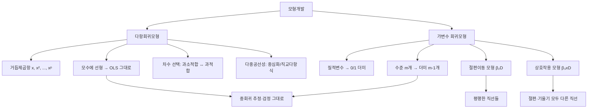

# 07. 회귀모형: 모형개발

## 🔗 선수 지식 (Prerequisites)
- [ ] **필수**: [3강. 중회귀모형(1)](3강.md) — 설계행렬 $X$, 최소제곱추정 $\hat{\boldsymbol{\beta}}=(X^\top X)^{-1}X^\top\mathbf{y}$ 이해 완료?
- [ ] **필수**: [4강. 중회귀모형(2)](4강.md) — 개별 계수 $t$-검정, 부분 $F$-검정 이해 완료?
- [ ] **권장**: 질적변수(범주형 변수)와 수준(level)의 개념
- [ ] **권장**: 상호작용(교호작용, interaction)의 직관
- **관련 단원**: [3강. 중회귀모형(1)](3강.md) `→` [4강. 중회귀모형(2)](4강.md) `→` **7강. 모형개발** `→` [8강. 변수선택](8강.md)

---

## 학습 목표
1. 다항회귀모형과 이 모형의 적합방법을 이해한다.
2. 가변수를 이용하는 회귀모형을 이해한다.
3. R을 이용하여 모형을 적합하고, 분석하는 방법을 안다.

---

## 🧠 메타인지 체크 (학습 전/후 자기 평가)

### 학습 전 자기 평가
| 소주제 | 자신감 (1-5) |
| :--- | :--- |
| 다항회귀모형이 왜 "선형"모형인지 | |
| 다항회귀의 차수 선택과 과적합 | |
| 가변수(더미변수)의 정의와 코딩 방법 | |
| 가변수의 절편이동·기울기변화(상호작용) 해석 | |

### 학습 후 교정 (학습 완료 후 작성)
| 소주제 | 학습 전 | 학습 후 | 실제 정답률 | 과신/과소 여부 |
| :--- | :--- | :--- | :--- | :--- |
| 다항회귀의 선형성 | | | | |
| 차수 선택·과적합 | | | | |
| 가변수 코딩 | | | | |
| 절편이동·상호작용 | | | | |

> **활용법**: 학습 전 1분 → 자신감 기입, 학습 후 1분 → 나머지 기입. "과신" 영역이 실제 취약점.

---

## 📝 요약 (Summary)
1. 🔴 **다항회귀모형**: 설명변수의 거듭제곱항($x,x^2,\ldots,x^p$)을 추가해 곡선 관계를 나타내는 모형 $y=\beta_0+\beta_1 x+\beta_2 x^2+\cdots+\beta_p x^p+\epsilon$ 으로, **모수 $\boldsymbol{\beta}$ 에 대해 선형**이므로 중회귀의 최소제곱법을 그대로 쓴다.
2. 🟡 **다항회귀의 적합**: $x_1=x,\ x_2=x^2,\ldots$ 로 두면 설계행렬 $X$ 의 열만 거듭제곱으로 바뀔 뿐 추정·검정 절차는 중회귀와 동일하다. 차수 $p$ 가 높을수록 다중공선성·과적합 위험이 커진다.
3. 🔴 **가변수(더미변수)**: 질적변수(범주형)를 회귀에 넣기 위해 0/1 값을 갖는 지시변수로 변환한 것. 수준이 $m$ 개면 **$m-1$ 개**의 가변수를 만들고 나머지 하나는 **기준범주(baseline)** 로 삼는다.
4. 🔴 **절편 이동 모형**: 가변수를 더하기만 하면($y=\beta_0+\beta_1 x+\beta_2 D+\epsilon$) 집단별로 **절편만** 다르고 기울기는 같은 평행한 직선들이 된다.
5. 🟡 **상호작용(기울기 변화) 모형**: 가변수와 연속변수의 곱 $x\cdot D$ 를 넣으면($y=\beta_0+\beta_1 x+\beta_2 D+\beta_3 xD+\epsilon$) 집단별로 **절편과 기울기가 모두** 달라진다.

---

## 📐 핵심 수식 (Key Formulas)

| 수식명 | 수식 | 의미 |
| :--- | :--- | :--- |
| **다항회귀모형** | $y_i=\beta_0+\beta_1 x_i+\beta_2 x_i^2+\cdots+\beta_p x_i^p+\epsilon_i$ | $p$차 곡선 적합 |
| **다항회귀 행렬형** | $\mathbf{y}=X\boldsymbol{\beta}+\boldsymbol{\epsilon}$, $X$의 $j$열 $=x^{\,j-1}$ | 중회귀와 동일 구조 |
| **추정량** | $\hat{\boldsymbol{\beta}}=(X^\top X)^{-1}X^\top\mathbf{y}$ | 모수에 선형 → OLS 그대로 |
| **가변수 정의** | $D_i=\begin{cases}1 & \text{범주 해당}\\0 & \text{기준범주}\end{cases}$ | 0/1 지시변수 |
| **수준 수 vs 가변수 수** | 수준 $m$개 → 가변수 $m-1$개 | 기준범주 1개 제외 |
| **절편이동 모형** | $y=\beta_0+\beta_1 x+\beta_2 D+\epsilon$ | 평행이동(기울기 동일) |
| **두 집단 직선** | $D=0:\ \beta_0+\beta_1 x$ / $D=1:\ (\beta_0+\beta_2)+\beta_1 x$ | $\beta_2$=절편 차이 |
| **상호작용 모형** | $y=\beta_0+\beta_1 x+\beta_2 D+\beta_3 xD+\epsilon$ | 절편·기울기 모두 변화 |
| **상호작용 직선** | $D=1:\ (\beta_0+\beta_2)+(\beta_1+\beta_3)x$ | $\beta_3$=기울기 차이 |

### 주요 정리/정의

**다항회귀는 "선형"모형이다**
$$
y=\beta_0+\beta_1 x+\beta_2 x^2+\cdots+\beta_p x^p+\epsilon
\;\xrightarrow{\;x_j:=x^{\,j}\;}\;
y=\beta_0+\beta_1 x_1+\beta_2 x_2+\cdots+\beta_p x_p+\epsilon
$$
> **직관적 해석**: "선형"은 $x$ 에 대한 직선이라는 뜻이 아니라 **계수 $\beta_j$ 에 대해 1차(선형결합)** 라는 뜻이다. $x^2,x^3$ 같은 비선형 항을 써도 그것을 새 변수로 보면 중회귀가 되므로, 정규방정식·분산분석·$t$/$F$-검정이 모두 그대로 적용된다.
> **AI 적용**: 다항 특성공학(polynomial feature engineering)의 토대. `sklearn`의 `PolynomialFeatures`가 $x\to[1,x,x^2,\ldots]$ 로 확장한 뒤 선형회귀를 돌리는 것이 정확히 이 원리이며, 커널 트릭(kernel trick)의 출발점이기도 하다.

**가변수의 의미 (절편이동 vs 상호작용)**
$$
\underbrace{E(y\mid x,D)=\beta_0+\beta_1 x+\beta_2 D}_{\text{절편만 이동}}
\qquad
\underbrace{E(y\mid x,D)=\beta_0+\beta_1 x+\beta_2 D+\beta_3 xD}_{\text{절편·기울기 모두 변화}}
$$
> **직관적 해석**: 가변수 $D$ 의 주효과 $\beta_2$ 는 "집단 간 출발점(절편)의 차이"를, 상호작용 항 $\beta_3$ 는 "집단 간 변화율(기울기)의 차이"를 뜻한다. $\beta_3$ 가 유의하지 않으면 두 직선은 평행하다고 본다.
> **AI 적용**: 범주형 특성의 원-핫 인코딩(one-hot encoding)이 곧 가변수화이며, 상호작용 항은 모델이 "조건부 효과"를 학습하게 한다(예: 트리 모델이 자동으로 잡아내는 교호작용을 선형모형에 명시적으로 넣는 것).

---

## 📊 개념 시각화 (Visual Guide)

### 개념 관계도


### 핵심 도식 (모형 ↔ 해석)
| 모형식 | 집단/형태 | 핵심 계수 의미 | AI 적용 |
| :--- | :--- | :--- | :--- |
| $\beta_0+\beta_1x+\beta_2x^2$ | 한 개의 포물선 | $\beta_2$ 부호=볼록/오목 | 비선형 특성공학 |
| $\beta_0+\beta_1x+\beta_2D$ | 평행한 두 직선 | $\beta_2$=절편 차이 | 범주형 주효과 |
| $\beta_0+\beta_1x+\beta_2D+\beta_3xD$ | 교차/벌어지는 두 직선 | $\beta_3$=기울기 차이 | 교호작용 학습 |
| 수준 3개 $\to D_1,D_2$ | 세 직선(기준 1개) | 각 더미=기준 대비 차 | 원-핫 인코딩 |

---

## ✏️ 심화 학습 (Study Subject)

### 1. 가상 시나리오: "어떤 개념을, 언제 사용해야 할까?"
- **상황**: 자동차의 주행속도($x$)에 따른 연비($y$)를 분석한다. 산점도를 보니 저속·고속에서 연비가 낮고 중속에서 높은 **뒤집힌 U자(포물선)** 모양이며, 추가로 변속기 종류(자동/수동)라는 **질적변수**도 있다.
- **문제**: ① 곡선 관계를 어떻게 회귀로 적합할까? ② 변속기 종류라는 범주형 변수를 어떻게 모형에 넣고, 두 집단의 차이가 "수준 차"인지 "변화율 차"인지 어떻게 구분할까?
- **해결**:
  ① 다항회귀로 $y=\beta_0+\beta_1 x+\beta_2 x^2+\epsilon$ 을 적합한다. $x_1=x,\,x_2=x^2$ 로 두면 중회귀이므로
  $$
  \hat{\boldsymbol{\beta}}=(X^\top X)^{-1}X^\top\mathbf{y},\qquad X=[\mathbf{1}\;\mathbf{x}\;\mathbf{x}^2]
  $$
  로 추정하고, $\beta_2$ 의 $t$-검정으로 곡률의 유의성을 본다($\hat\beta_2<0$ 이면 위로 볼록).
  ② 자동=0(기준), 수동=1 인 가변수 $D$ 를 도입한다. 먼저 절편이동 모형 $y=\beta_0+\beta_1 x+\beta_2 x^2+\beta_3 D+\epsilon$ 로 절편 차이를 보고, 상호작용 모형에 $D\cdot x$(또는 $D\cdot x^2$)를 추가해 기울기/곡률 차이까지 검정한다. 상호작용 계수가 유의하지 않으면 두 곡선은 평행하다고 결론짓는다.
- **AI 학습 포인트**: "다항회귀에서 차수 $p$ 를 무작정 높이면 훈련오차는 줄지만 검증오차가 다시 커진다(과적합). 이 편향-분산 트레이드오프를 $x^2,x^3$ 항이 만드는 다중공선성과 연결해서 설명하고, 직교다항식(orthogonal polynomial)이나 정규화로 어떻게 완화하는지 알려줘."

### 2. 관점별 비교 및 오개념 분석
- **핵심 비교**:
  - **다항회귀 vs 비선형회귀**: 다항회귀는 모수에 **선형**(OLS로 닫힌해)인 반면, $y=\beta_0 e^{\beta_1 x}$ 같은 진짜 비선형회귀는 모수에 비선형이라 수치적 최적화가 필요하다.
  - **절편이동 vs 상호작용**: 전자는 집단 간 평행 직선(기울기 공통), 후자는 기울기까지 다른 직선. 상호작용 항 $\beta_3$ 의 유의성으로 구분.
  - **가변수 vs 직접 범주 인코딩(1,2,3)**: 범주에 1,2,3 같은 숫자를 그냥 넣으면 "순서·등간격"이라는 잘못된 가정이 생긴다. 0/1 가변수만이 범주를 올바르게 표현한다.
- **오개념 분석**:
    - **오개념 1**: "$x^2$ 항이 들어가니 다항회귀는 비선형회귀(선형모형이 아니다)이다."
    - **분석**: 틀렸다. '선형'의 기준은 **계수 $\beta_j$** 다. $x^2$ 을 새 변수 $x_2$ 로 보면 $y=\beta_0+\beta_1 x_1+\beta_2 x_2+\epsilon$ 로 모수에 선형이므로 엄연한 선형모형이며 OLS가 그대로 성립한다.
    - **오개념 2**: "수준이 $m$ 개면 가변수도 $m$ 개 만들어야 한다."
    - **분석**: 절편이 있는 모형에서 $m$ 개의 가변수를 모두 넣으면 그 합이 항상 1(절편 열 $\mathbf{1}$ 과 완전 선형종속) → $X^\top X$ 가 특이행렬이 되는 **가변수 함정(dummy variable trap)**. 그래서 $m-1$ 개만 넣고 하나는 기준범주로 둔다.
    - **오개념 3**: "가변수 회귀는 각 집단을 따로 회귀하는 것과 완전히 다르다."
    - **분석**: 상호작용을 모두 포함한 완전모형(절편·기울기 모두 더미와 곱)은 집단별 개별회귀와 **계수가 동일**하다. 차이는 가변수 모형이 **공통 오차분산 $\sigma^2$ 를 가정·공유**해 검정력을 높인다는 점이다.
- **AI 학습 포인트**: "가변수 함정이 다중공선성의 극단(완전 선형종속) 사례인 이유를 $X^\top X$ 의 가역성 관점에서 설명하고, 원-핫 인코딩에서 `drop_first=True` 가 왜 같은 처방인지 연결해줘."

---

## ❓ 연습 문제 및 해설

> **블룸 인지 수준 범례**: [기억] 정의·나열 → [이해] 설명·비교 → [적용] 계산·구현 → [분석] 구별·디버그 → [평가] 판단·비평 → [창조] 설계·제안

### 📝 문제

**1. ⭐ [기억] 📌 다항회귀모형 $y=\beta_0+\beta_1 x+\beta_2 x^2+\cdots+\beta_p x^p+\epsilon$ 에 대한 설명으로 옳은 것은?(#prob-1)**
   > ① 모수 $\beta_j$ 에 대해 비선형이라 OLS를 쓸 수 없다
   > ② $x_j=x^j$ 로 두면 중회귀가 되어 OLS를 그대로 쓴다
   > ③ 차수 $p$ 를 높일수록 항상 더 좋은 모형이 된다
   > ④ 잔차가 정규분포를 따르지 않으면 적합 자체가 불가능하다

<br>

**2. ⭐ [기억] 📌 질적변수의 수준(범주)이 $m=4$ 개일 때, 절편을 포함한 회귀모형에 넣어야 하는 가변수(더미변수)의 개수는?(#prob-2)**
   > ① $2$
   > ② $3$
   > ③ $4$
   > ④ $5$

<br>

**3. ⭐⭐ [이해] 📌 모형 $y=\beta_0+\beta_1 x+\beta_2 D+\epsilon$ ($D$=0/1 가변수)에서 계수 $\beta_2$ 의 해석으로 옳은 것은?(#prob-3)**
   > ① 두 집단의 기울기 차이
   > ② $x$ 를 고정했을 때 $D=1$ 집단의 평균이 기준집단보다 높/낮은 정도(절편 차이)
   > ③ 곡선의 곡률
   > ④ 오차분산의 차이

<br>

**4. ⭐⭐ [이해] 📌 가변수 회귀에서 "가변수 함정(dummy variable trap)"이 발생하는 상황으로 옳은 것을 모두 고르면?(#prob-4)**
   > <보기>
   >
   > 가. 절편을 포함한 모형에 수준 수 $m$ 만큼의 가변수를 모두 넣었다
   > 나. 모든 가변수의 합이 항상 1이 되어 절편 열과 선형종속이 된다
   > 다. 결과적으로 $X^\top X$ 가 특이행렬이 되어 역행렬이 없다

   > ① 가, 나
   > ② 나, 다
   > ③ 가, 다
   > ④ 가, 나, 다

<br>

**5. ⭐⭐ [이해] 📌 모형 $y=\beta_0+\beta_1 x+\beta_2 D+\beta_3 (xD)+\epsilon$ 에서 상호작용 계수 $\beta_3$ 가 통계적으로 **유의하지 않다**면 내릴 수 있는 결론은?(#prob-5)**
   > ① 두 집단의 회귀직선은 절편도 기울기도 모두 같다
   > ② 두 집단의 회귀직선은 기울기가 같다(평행)
   > ③ 두 집단의 회귀직선은 절편이 같다
   > ④ 가변수 $D$ 자체를 모형에서 반드시 제거해야 한다

<br>

**6. ⭐⭐ [적용] 📌 적합 결과 $\hat y = 5 + 2x - 0.5x^2$ 일 때, 예측값 $\hat y$ 를 최대로 만드는 $x$ 값은?(#prob-6)**
   > ① $x=1$
   > ② $x=2$
   > ③ $x=4$
   > ④ $x=5$

<br>

**7. ⭐⭐ [적용] 📌 모형 $\hat y = 10 + 3x + 4D + 1.5(xD)$ 에서 $D=1$ 집단의 회귀직선은?(#prob-7)**
   > ① $\hat y = 10 + 3x$
   > ② $\hat y = 14 + 3x$
   > ③ $\hat y = 14 + 4.5x$
   > ④ $\hat y = 10 + 4.5x$

<br>

**8. ⭐⭐⭐ [적용/분석] 📌 어떤 자료에서 $x$ 와 $x^2$ 의 표본상관계수가 $0.99$ 로 나타났다. 다항회귀 적합 시 예상되는 문제와 대응으로 가장 적절한 것은?(#prob-8)**
   > ① 다중공선성으로 계수 추정이 불안정 → $x$ 를 중심화($x-\bar x$)하거나 직교다항식 사용
   > ② 잔차합이 0이 아니게 됨 → 절편 제거
   > ③ SST가 음수가 됨 → 변수 변환 불가
   > ④ $R^2$ 가 반드시 0이 됨 → 모형 폐기

<br>

**9. ⭐⭐⭐ [분석] 📌 수준이 3개(A,B,C)인 질적변수를 A를 기준으로 가변수 $D_B,D_C$ 로 코딩하여 $y=\beta_0+\beta_1 D_B+\beta_2 D_C+\epsilon$ 을 적합했다. $\hat\beta_0=20,\ \hat\beta_1=5,\ \hat\beta_2=-3$ 일 때 각 집단의 추정 평균으로 옳은 것은?(#prob-9)**
   > ① A=20, B=25, C=17
   > ② A=20, B=5, C=−3
   > ③ A=0, B=5, C=−3
   > ④ A=25, B=20, C=17

<br>

**10. ⭐⭐⭐ [평가/창조] 📌 다항회귀모형이 "비선형 관계를 적합하면서도 여전히 선형모형(OLS 적용 가능)"인 이유를 설계행렬 $X$ 의 구성과 함께 설명하고, 절편이동 모형과 상호작용 모형을 가변수 $D$ 로 각각 세운 뒤 두 집단의 회귀직선을 명시하시오.(#prob-10)**

---

### 🔑 정답 및 해설 (먼저 풀어본 후 펼치기)

<details>
<summary>정답 보기 (클릭)</summary>

1. ②
2. ②
3. ②
4. ④
5. ②
6. ②
7. ③
8. ①
9. ①
10. 풀이형 정답 (해설 참조)

</details>

<details>
<summary>해설 보기 (클릭)</summary>

<a id="prob-1"></a>
**1. ⭐ [기억] 다항회귀의 선형성**
> **정답: ② $x_j=x^j$ 로 두면 중회귀가 되어 OLS를 그대로 쓴다**
> **해설**: 다항회귀는 모수 $\beta_j$ 에 대해 선형이므로 거듭제곱항을 새 변수로 보면 중회귀이고 정규방정식이 그대로 성립한다(①은 틀림). 차수를 높이면 과적합·다중공선성 위험이 커지므로 ③은 틀리고, 정규성은 적합이 아니라 추론(검정·구간)에서 쓰이는 가정이라 ④도 틀리다.

<a id="prob-2"></a>
**2. ⭐ [기억] 가변수 개수**
> **정답: ② $3$**
> **해설**: 수준 $m$ 개 → 가변수 $m-1=4-1=3$ 개. 나머지 한 수준은 기준범주(baseline)로 절편에 흡수된다. $m$ 개를 모두 넣으면 가변수 함정에 빠진다.

<a id="prob-3"></a>
**3. ⭐⭐ [이해] 절편이동 해석**
> **정답: ② 절편 차이(기준 대비 평균 차)**
> **해설**: $D=0$ 이면 $E(y)=\beta_0+\beta_1 x$, $D=1$ 이면 $E(y)=(\beta_0+\beta_2)+\beta_1 x$. 기울기는 둘 다 $\beta_1$ 로 같고 절편만 $\beta_2$ 만큼 차이 난다. 기울기 차이는 상호작용 항 $\beta_3$ 의 몫이다.

<a id="prob-4"></a>
**4. ⭐⭐ [이해] 가변수 함정**
> **정답: ④ 가, 나, 다**
> **해설**: 절편 열 $\mathbf{1}$ 이 있는데 $m$ 개 가변수를 다 넣으면 $D_1+\cdots+D_m=\mathbf{1}$ 이라 완전 선형종속 → $\det(X^\top X)=0$ → 역행렬 부재. 세 진술 모두 이 현상의 정확한 묘사다. 처방은 가변수를 $m-1$ 개만 넣는 것.

<a id="prob-5"></a>
**5. ⭐⭐ [이해] 상호작용 비유의**
> **정답: ② 기울기가 같다(평행)**
> **해설**: $\beta_3$ 는 집단 간 기울기 차이다. $\beta_3\approx0$ (유의하지 않음)이면 두 직선은 평행하며, 절편 차이는 여전히 $\beta_2$ 로 존재할 수 있다. 따라서 ①③은 과한 결론이고, $D$ 제거 여부는 $\beta_2$ 의 유의성으로 따로 판단하므로 ④도 틀리다.

<a id="prob-6"></a>
**6. ⭐⭐ [적용] 포물선 꼭짓점**
> **정답: ② $x=2$**
> **해설**: $\dfrac{d\hat y}{dx}=2-x=0 \Rightarrow x=2$. 이차항 계수가 $-0.5<0$ 이라 위로 볼록 → 이 점이 최대. (꼭짓점 공식 $x=-b/(2a)=-2/(2\cdot(-0.5))=2$ 로도 동일.)

<a id="prob-7"></a>
**7. ⭐⭐ [적용] 상호작용 직선**
> **정답: ③ $\hat y = 14 + 4.5x$**
> **해설**: $D=1$ 대입 → $\hat y=10+3x+4(1)+1.5x(1)=(10+4)+(3+1.5)x=14+4.5x$. 절편은 $\beta_2=4$ 만큼, 기울기는 $\beta_3=1.5$ 만큼 기준집단($\hat y=10+3x$)에서 변했다.

<a id="prob-8"></a>
**8. ⭐⭐⭐ [적용/분석] 다항항의 다중공선성**
> **정답: ① 중심화 또는 직교다항식 사용**
> **해설**: $x$ 와 $x^2$ 는 흔히 강하게 상관되어 $X^\top X$ 가 ill-conditioned → 계수 분산 $\sigma^2(X^\top X)^{-1}$ 폭증. $x$ 를 평균중심화하면 상관이 크게 줄고, R의 `poly()` 같은 직교다항식을 쓰면 열들이 직교해 수치 안정성이 좋아진다. ②③④는 성립하지 않는다.

<a id="prob-9"></a>
**9. ⭐⭐⭐ [분석] 수준 3개 가변수 평균**
> **정답: ① A=20, B=25, C=17**
> **해설**: 기준 A는 $D_B=D_C=0 \Rightarrow \hat y=\beta_0=20$. B는 $D_B=1 \Rightarrow 20+5=25$. C는 $D_C=1 \Rightarrow 20-3=17$. 즉 $\hat\beta_0$ 는 기준집단 평균, 각 더미 계수는 기준 대비 차이를 나타낸다.

<a id="prob-10"></a>
**10. ⭐⭐⭐ [평가/창조] 다항·가변수 모형 설계**
> **정답·해설**:
> 1) **선형성의 근거**: 다항회귀 $y=\beta_0+\beta_1x+\cdots+\beta_px^p+\epsilon$ 에서 $x_j:=x^j$ 로 치환하면 $y=\beta_0+\beta_1x_1+\cdots+\beta_px_p+\epsilon$. 이는 모수 $\boldsymbol{\beta}$ 의 **선형결합**이므로 선형모형이다. 설계행렬을
> $$X=\begin{bmatrix}1 & x_1 & x_1^2 & \cdots & x_1^p\\ \vdots & & & & \vdots\\ 1 & x_n & x_n^2 & \cdots & x_n^p\end{bmatrix}$$
> 으로 구성하면 $\hat{\boldsymbol{\beta}}=(X^\top X)^{-1}X^\top\mathbf{y}$ 로 똑같이 추정된다. '비선형'은 $x$–$y$ 관계의 모양일 뿐, 추정은 선형.
> 2) **절편이동 모형**: $y=\beta_0+\beta_1 x+\beta_2 D+\epsilon$.
> $$D=0:\ \hat y=\beta_0+\beta_1 x,\qquad D=1:\ \hat y=(\beta_0+\beta_2)+\beta_1 x.$$
> → 두 직선은 **평행**(기울기 공통 $\beta_1$), 절편만 $\beta_2$ 차이.
> 3) **상호작용 모형**: $y=\beta_0+\beta_1 x+\beta_2 D+\beta_3 xD+\epsilon$.
> $$D=0:\ \hat y=\beta_0+\beta_1 x,\qquad D=1:\ \hat y=(\beta_0+\beta_2)+(\beta_1+\beta_3)x.$$
> → 절편은 $\beta_2$, 기울기는 $\beta_3$ 만큼 차이. $\beta_3$ 의 $t$-검정으로 기울기 차이의 유의성을 판단한다.

</details>

---

## ✅ O/X 확인문제 (총 20문)

**1.** 다항회귀모형은 모수 $\beta_j$ 에 대해 선형이므로 선형모형으로 분류된다. (#ox-1) **(O / X)**
**2.** 다항회귀는 $x^2,x^3$ 항 때문에 OLS(최소제곱)로는 추정할 수 없다. (#ox-2) **(O / X)**
**3.** 다항회귀의 차수 $p$ 를 높이면 훈련자료 $R^2$ 는 비감소하지만 과적합 위험이 커진다. (#ox-3) **(O / X)**
**4.** $x$ 와 $x^2$ 는 흔히 강한 상관을 보여 다중공선성을 유발할 수 있다. (#ox-4) **(O / X)**
**5.** $x$ 를 평균중심화하면 $x$ 와 $x^2$ 사이의 상관을 줄이는 데 도움이 된다. (#ox-5) **(O / X)**
**6.** 가변수(더미변수)는 0 또는 1의 값을 갖는 지시변수이다. (#ox-6) **(O / X)**
**7.** 질적변수의 수준이 $m$ 개이면 절편 포함 모형에 가변수를 $m$ 개 넣어야 한다. (#ox-7) **(O / X)**
**8.** 기준범주(baseline)의 효과는 절편 $\beta_0$ 에 흡수된다. (#ox-8) **(O / X)**
**9.** 절편을 포함한 모형에 모든 수준의 가변수를 넣으면 $X^\top X$ 가 특이행렬이 될 수 있다. (#ox-9) **(O / X)**
**10.** 모형 $y=\beta_0+\beta_1 x+\beta_2 D+\epsilon$ 에서 두 집단의 회귀직선은 기울기가 같다. (#ox-10) **(O / X)**
**11.** 위 모형에서 $\beta_2$ 는 두 집단의 기울기 차이를 나타낸다. (#ox-11) **(O / X)**
**12.** 상호작용 항 $xD$ 를 넣으면 집단별로 기울기가 달라질 수 있다. (#ox-12) **(O / X)**
**13.** 상호작용 계수 $\beta_3$ 가 0이면 두 회귀직선은 평행하다. (#ox-13) **(O / X)**
**14.** 범주에 1,2,3 같은 정수를 그대로 부여하면 등간격·순서를 가정하는 왜곡이 생긴다. (#ox-14) **(O / X)**
**15.** 상호작용을 모두 포함한 가변수 완전모형은 집단별 개별회귀와 회귀계수가 같다. (#ox-15) **(O / X)**
**16.** 다항회귀는 모수에 비선형이므로 반복적 수치최적화가 반드시 필요하다. (#ox-16) **(O / X)**
**17.** R에서 `poly(x, 2)` 는 직교다항식을 만들어 수치 안정성을 높인다. (#ox-17) **(O / X)**
**18.** 가변수 모형은 집단들이 공통 오차분산 $\sigma^2$ 를 갖는다고 가정한다. (#ox-18) **(O / X)**
**19.** $\hat y=5+2x-0.5x^2$ 는 위로 볼록한(최댓값을 갖는) 포물선이다. (#ox-19) **(O / X)**
**20.** 가변수 회귀의 추정·검정 절차는 본질적으로 중회귀의 그것과 동일하다. (#ox-20) **(O / X)**

<details>
<summary>O/X 정답 및 해설 보기 (클릭)</summary>

> <a id="ox-1"></a> **1. O** — '선형'의 기준은 계수 $\beta_j$. 거듭제곱항이 있어도 모수에 선형.
> <a id="ox-2"></a> **2. X** — 거듭제곱항을 새 변수로 보면 중회귀라 OLS가 그대로 성립한다.
> <a id="ox-3"></a> **3. O** — 변수를 추가하면 SSE 비증가 → $R^2$ 비감소, 그러나 과적합 위험 증가.
> <a id="ox-4"></a> **4. O** — 같은 부호 범위에서 $x$ 와 $x^2$ 는 강하게 상관되기 쉽다.
> <a id="ox-5"></a> **5. O** — 중심화는 $x$ 와 $x^2$ 의 상관을 크게 낮춘다(수치 안정화).
> <a id="ox-6"></a> **6. O** — 가변수는 0/1 지시변수의 정의 그대로.
> <a id="ox-7"></a> **7. X** — $m-1$ 개만 넣는다. $m$ 개는 가변수 함정.
> <a id="ox-8"></a> **8. O** — 기준범주는 모든 더미가 0인 상태로 절편이 그 평균을 담는다.
> <a id="ox-9"></a> **9. O** — 더미들의 합이 절편 열과 선형종속 → 특이행렬(가변수 함정).
> <a id="ox-10"></a> **10. O** — 상호작용이 없으므로 기울기는 공통 $\beta_1$, 절편만 다르다.
> <a id="ox-11"></a> **11. X** — $\beta_2$ 는 절편(평균) 차이. 기울기 차이는 상호작용 $\beta_3$.
> <a id="ox-12"></a> **12. O** — $xD$ 항이 집단별 기울기 변화를 허용한다.
> <a id="ox-13"></a> **13. O** — $\beta_3=0$ 이면 기울기 차이 없음 → 평행.
> <a id="ox-14"></a> **14. O** — 명목형에 정수를 부여하면 잘못된 등간·순서 가정이 생긴다.
> <a id="ox-15"></a> **15. O** — 완전 상호작용 모형은 집단별 회귀와 계수가 일치(단, 오차분산은 공유).
> <a id="ox-16"></a> **16. X** — 다항회귀는 모수에 선형이라 닫힌해(OLS)가 존재한다.
> <a id="ox-17"></a> **17. O** — `poly()` 의 직교다항식은 열 간 직교로 다중공선성을 제거한다.
> <a id="ox-18"></a> **18. O** — 단일 $\sigma^2$ 를 공유한다고 가정(개별회귀와의 차이점).
> <a id="ox-19"></a> **19. O** — 이차항 계수 $-0.5<0$ → 위로 볼록, 최댓값은 $x=2$.
> <a id="ox-20"></a> **20. O** — 가변수를 추가 열로 둔 중회귀이므로 절차가 동일하다.

</details>

---

## 🧪 자유 회상 연습 (Free Recall)

> **방법**: 위의 노트를 모두 덮고, 타이머 3분 설정 후 이번 단원에서 배운 내용을 기억나는 대로 자유롭게 적으세요.
> 정확한 문장이 아니어도 됩니다. 키워드, 수식, 관계 등 떠오르는 것을 모두 적습니다.

**자유 회상 작성란:**

```
[여기에 기억나는 내용을 자유롭게 작성]


```

> **회상 후 점검**: 노트를 다시 펼쳐 빠뜨린 내용을 확인하세요. 빠뜨린 부분이 실제 취약점입니다.
> - 회상 못한 핵심 개념: [                ]
> - 회상 못한 수식: [                ]

---

## 💻 코드로 확인하기 (Code Verification)

```python
import numpy as np

np.random.seed(0)
n = 120

# ── 1) 다항회귀: y = 5 + 2x - 0.5x^2 + 잡음 ──────────────────
x = np.random.uniform(0, 6, n)
y_poly = 5 + 2*x - 0.5*x**2 + np.random.normal(0, 0.8, n)

# 설계행렬 [1, x, x^2]  (중심화 전)
Xp = np.column_stack([np.ones(n), x, x**2])
beta_poly = np.linalg.lstsq(Xp, y_poly, rcond=None)[0]
print("다항회귀 계수 [b0,b1,b2] =", np.round(beta_poly, 3))
print("x, x^2 상관 =", round(np.corrcoef(x, x**2)[0,1], 3))   # 다중공선성 확인

# 중심화하면 x와 x^2 상관이 줄어든다
xc = x - x.mean()
print("중심화 후 상관 =", round(np.corrcoef(xc, xc**2)[0,1], 3))

# ── 2) 가변수 회귀: 두 집단(D=0,1) ─────────────────────────
D = np.random.binomial(1, 0.5, n)
x2 = np.random.uniform(0, 10, n)
# 참값: 절편차 +4, 기울기차 +1.5 (상호작용 존재)
y_dum = 10 + 3*x2 + 4*D + 1.5*(x2*D) + np.random.normal(0, 1.0, n)

# 절편이동 모형:  [1, x, D]
X_add = np.column_stack([np.ones(n), x2, D])
b_add = np.linalg.lstsq(X_add, y_dum, rcond=None)[0]
print("\n절편이동 모형 [b0,b1(x),b2(D)] =", np.round(b_add, 3))

# 상호작용 모형:  [1, x, D, x*D]
X_int = np.column_stack([np.ones(n), x2, D, x2*D])
b_int = np.linalg.lstsq(X_int, y_dum, rcond=None)[0]
print("상호작용 모형 [b0,b1,b2,b3(xD)] =", np.round(b_int, 3))
print(f"  D=0 직선: y = {b_int[0]:.2f} + {b_int[1]:.2f}x")
print(f"  D=1 직선: y = {b_int[0]+b_int[2]:.2f} + {b_int[1]+b_int[3]:.2f}x")
```

> **실행 결과 (예상)**
> ```
> 다항회귀 계수 [b0,b1,b2] = [ 4.9xx  2.0xx -0.50x]
> x, x^2 상관 = 0.96x          # 강한 다중공선성
> 중심화 후 상관 = 0.0xx        # 크게 감소
> 절편이동 모형 [b0,b1(x),b2(D)] = [ ...  ...  ... ]   # 기울기차 무시 → 편향
> 상호작용 모형 [b0,b1,b2,b3(xD)] = [10.0x  3.0x  4.0x  1.5x]
>   D=0 직선: y = 10.0x + 3.0x
>   D=1 직선: y = 14.0x + 4.5x
> ```
> **수학적 해석**: 다항회귀 계수가 참값 $(5,2,-0.5)$ 에 근접하고, $x$–$x^2$ 의 높은 상관(≈0.96)이 중심화로 거의 0이 됨을 확인 — 다중공선성 완화의 실증이다. 가변수 모형에서는 상호작용 항이 참값 $\beta_2=4,\beta_3=1.5$ 를 정확히 복원해, $D=1$ 집단이 절편 $+4$·기울기 $+1.5$ 만큼 다름을 보여준다(절편이동 모형만 쓰면 기울기 차이를 놓쳐 편향이 생긴다).

---

## 🔬 심층 확장: 가변수 함정(dummy trap)의 수치 시연 — rank로 직접 확인

> 앞의 오개념 2에서 "수준 $m$ 개에 가변수를 $m$ 개 모두 넣으면 절편 열 $\mathbf 1$ 과 완전 선형종속이 되어 $X^\top X$ 가 특이행렬"이라고 설명했다. 여기서는 그것을 **`np.linalg.lstsq`의 `rank` 출력**으로 직접 보고, 해가 **비유일**함을 영공간 벡터로 시연한 뒤, 기준범주 1개를 빼면 **완전계수(full rank)** 로 복구됨을 확인한다.

### 1. 함정: 절편 + 모든 더미 → rank-deficient & 해 비유일

수준이 3개(A, B, C)인 범주를 더미 $D_A, D_B, D_C$ 로 만들고, 절편과 **세 더미를 모두** 설계행렬에 넣는다. 이때 항상 $D_A+D_B+D_C=\mathbf 1$ (절편 열)이 성립하므로 4개 열 중 1개가 잉여다.

```python
import numpy as np

np.random.seed(0)
n = 60
cat = np.random.choice(['A', 'B', 'C'], size=n)
DA = (cat == 'A').astype(float)
DB = (cat == 'B').astype(float)
DC = (cat == 'C').astype(float)
y = 10 + 3*DB - 2*DC + np.random.normal(0, 1.0, n)

# (1) 가변수 함정: 절편 + 모든 더미(DA, DB, DC)  ── 4개 열
X_trap = np.column_stack([np.ones(n), DA, DB, DC])
beta, res, rank, sv = np.linalg.lstsq(X_trap, y, rcond=None)
print("설계행렬 열 수 =", X_trap.shape[1])
print("lstsq rank   =", rank)
print("특이값        =", np.round(sv, 4))
print("DA+DB+DC == 1 ?", np.allclose(DA+DB+DC, 1.0))
print("det(X^T X)   =", np.linalg.det(X_trap.T @ X_trap))

# 해의 비유일성: [절편, -DA, -DB, -DC] 방향이 영공간 (1 - (DA+DB+DC) = 0)
null_vec = np.array([1.0, -1.0, -1.0, -1.0])
print("X @ null_vec 최대 절댓값 =", np.max(np.abs(X_trap @ null_vec)))
fit0 = X_trap @ beta
fit1 = X_trap @ (beta + 5.0*null_vec)            # 전혀 다른 계수
print("두 다른 계수의 적합값이 동일? ", np.allclose(fit0, fit1))
```

> **실행 결과 (실제 출력, `seed=0`)**
> ```
> 설계행렬 열 수 = 4
> lstsq rank   = 3          ← 열 수(4)보다 작음: rank-deficient
> 특이값        = [8.989  4.7428  4.087  0.    ]   ← 마지막 특이값이 0
> DA+DB+DC == 1 ? True
> det(X^T X)   = 0.0        ← 특이행렬: 역행렬 없음
> X @ null_vec 최대 절댓값 = 0.0
> 두 다른 계수의 적합값이 동일?  True
> ```
> **해석**: 설계행렬은 **4개 열인데 `rank`는 3**으로 한 단계 모자란다(rank-deficient). 특이값(singular value) 4개 중 **마지막이 정확히 0** 이라는 것이 같은 사실의 SVD 관점 표현이고, 그래서 $\det(X^\top X)=0$ — $(X^\top X)^{-1}$ 이 존재하지 않으니 정규방정식 $\hat{\boldsymbol\beta}=(X^\top X)^{-1}X^\top\mathbf y$ 를 풀 수 없다. 더 결정적으로, $\mathbf 1-(D_A+D_B+D_C)=\mathbf 0$ 이므로 $\texttt{null\_vec}=[1,-1,-1,-1]$ 은 설계행렬의 **영공간(null space)** 벡터다 — 임의의 해 $\hat{\boldsymbol\beta}$ 에 이 방향을 얼마든지 더해도($\hat{\boldsymbol\beta}+c\cdot\texttt{null\_vec}$) **적합값 $X\hat{\boldsymbol\beta}$ 가 똑같다**. 즉 **계수가 유일하게 정해지지 않는다**(`lstsq`는 그중 최소노름 해 하나만 반환할 뿐). 이것이 가변수 함정의 정체다.

### 2. 처방: 기준범주 1개 제거 → full rank & 유일해

가변수를 $m-1=2$ 개($D_B, D_C$)만 넣고 $A$ 를 기준범주로 두면, 절편 열과의 선형종속이 사라진다.

```python
# (2) 기준범주 A 제거: 절편 + DB, DC  ── 3개 열
X_ok = np.column_stack([np.ones(n), DB, DC])
beta_ok, _, rank_ok, _ = np.linalg.lstsq(X_ok, y, rcond=None)
print("열 수 =", X_ok.shape[1], ", rank =", rank_ok)
print("det(X^T X) =", round(np.linalg.det(X_ok.T @ X_ok), 2))
print("계수 [절편(=A평균), DB(B−A), DC(C−A)] =", np.round(beta_ok, 4))
```

> **실행 결과 (실제 출력, `seed=0`)**
> ```
> 열 수 = 3 , rank = 3            ← 열 수 = rank: full rank(완전계수)
> det(X^T X) = 7590.0            ← 0이 아님: 역행렬 존재 → 유일해
> 계수 [절편(=A평균), DB(B−A), DC(C−A)] = [9.9907  3.54  -2.2]
> ```
> **해석**: 더미를 $m-1$ 개로 줄이자 **`rank`가 열 수(3)와 같아져(full rank)** $\det(X^\top X)=7590\neq0$ — $(X^\top X)^{-1}$ 이 존재해 **계수가 유일하게 결정**된다. 추정값도 깔끔히 해석된다: 절편 $9.99\approx$ 기준집단 $A$ 의 평균, $D_B$ 계수 $3.54\approx$ "B$-$A 차이"(참값 $+3$), $D_C$ 계수 $-2.20\approx$ "C$-$A 차이"(참값 $-2$). 이것이 7강에서 강조한 **"$m$ 개 수준 → $m-1$ 개 더미 + 기준범주 1개"** 규칙의 수치적 근거이며, pandas `pd.get_dummies(..., drop_first=True)` 가 정확히 이 한 열을 자동으로 떨어뜨려 함정을 피한다.

> **요점 정리**
> - `np.linalg.lstsq`의 **`rank`가 열 수보다 작으면** 설계행렬이 rank-deficient = 가변수 함정 신호.
> - 같은 사실의 다른 표현: **특이값 0 / $\det(X^\top X)=0$ / 영공간 존재 / 해 비유일**.
> - 처방은 **기준범주 1개 제거**(더미 $m-1$ 개) 또는 절편 제거 — 둘 다 선형종속을 깬다.
> - `lstsq`(SVD 기반)는 함정에서도 에러 없이 최소노름 해를 주므로, **`rank`를 직접 확인하지 않으면 오류를 눈치채기 어렵다**(반면 `np.linalg.inv`는 특이행렬에서 예외 발생).

---

## 🤖 AI 연결고리 (Math → AI Application)

| 수학 개념 | AI/ML 적용 분야 | 구체적 사례 |
| :--- | :--- | :--- |
| 다항항 $x,x^2,\ldots,x^p$ | 특성공학(feature engineering) | `PolynomialFeatures` → 비선형 경계 학습 |
| 다항회귀의 선형성 | 커널 방법의 직관 | 다항커널 $(x^\top z+c)^d$, 비선형을 선형화 |
| 차수 선택·과적합 | 모델 선택·정규화 | 교차검증, Ridge/Lasso로 고차항 벌점 |
| 가변수(0/1 코딩) | 범주형 인코딩 | 원-핫 인코딩, `drop_first=True` |
| 상호작용 항 $xD$ | 조건부 효과 학습 | 선형모형의 교호작용, 트리의 자동 분기 |
| 가변수 함정 | 다중공선성 회피 | 기준범주 drop, 정규화 회귀 |

---

## 📖 심화 학습 예시 답안

#### 1. 다항회귀가 "선형모형"인 내부 원리
다항회귀가 곡선을 그리면서도 선형모형으로 분류되는 핵심은 **모수에 대한 선형성**이다.

1. **치환의 관점**: $y=\beta_0+\beta_1x+\beta_2x^2+\cdots+\beta_px^p+\epsilon$ 에서 $x_j:=x^j$ 로 두면 변수만 거듭제곱으로 바뀐 중회귀 $y=\beta_0+\sum_j\beta_jx_j+\epsilon$ 이 된다.
2. **추정의 불변성**: 설계행렬 $X=[\mathbf1,\mathbf x,\mathbf x^2,\ldots,\mathbf x^p]$ 만 정의하면 정규방정식 $X^\top X\hat{\boldsymbol\beta}=X^\top\mathbf y$ 가 그대로 성립 — 곡선 적합인데도 닫힌해가 존재한다.
3. **'선형'의 진짜 의미**: 선형/비선형의 기준은 $x$–$y$ 관계의 모양이 아니라 **계수의 진입 방식**이다. $y=\beta_0 e^{\beta_1 x}$ 는 $\beta_1$ 이 지수에 들어가 모수에 비선형 → 수치최적화 필요. 다항은 그렇지 않다.

#### 2. 절편이동 모형 vs 상호작용 모형 비교표

| 구분 | 절편이동 모형 | 상호작용 모형 | 비고 |
| :--- | :--- | :--- | :--- |
| **모형식** | $\beta_0+\beta_1x+\beta_2D$ | $\beta_0+\beta_1x+\beta_2D+\beta_3xD$ | $xD$ 추가 여부 |
| **두 직선 관계** | 평행(기울기 공통) | 절편·기울기 모두 다름 | |
| **핵심 계수** | $\beta_2$=절편 차이 | $\beta_2$=절편차, $\beta_3$=기울기차 | |
| **검정** | $\beta_2$ 의 $t$-검정 | $\beta_3$ 의 $t$-검정으로 기울기차 판정 | |
| **AI 활용** | 범주 주효과(원-핫) | 조건부 효과(교호작용) | 트리계열이 자동 포착 |

#### 3. 가변수·다항회귀 코드 작성법 (Best Practice)

- **Bad Practice (나쁜 예시)**
  ```python
  # 1) 범주에 정수 라벨을 그대로 투입 → 잘못된 순서·등간격 가정
  region_code = {"A":1, "B":2, "C":3}
  X = np.column_stack([np.ones(n), x, [region_code[r] for r in region]])

  # 2) 절편 + 모든 수준의 더미 → 가변수 함정(특이행렬)
  X = np.column_stack([np.ones(n), DA, DB, DC])   # DA+DB+DC = 1
  ```
- **Good Practice (좋은 예시)**
  ```python
  import pandas as pd
  # 1) 원-핫 인코딩 + 기준범주 drop (가변수 함정 회피)
  dummies = pd.get_dummies(region, prefix="reg", drop_first=True)

  # 2) 다항항은 중심화 또는 직교다항식으로 다중공선성 완화
  xc = x - x.mean()
  X = np.column_stack([np.ones(n), xc, xc**2, dummies.values])

  # 3) 수치 안정적 최소제곱(SVD/QR 기반)
  beta, *_ = np.linalg.lstsq(X, y, rcond=None)
  ```
- **설명**: 명목형 범주는 반드시 더미로 바꾸고 기준범주를 빼야 $X^\top X$ 가 가역이다. 다항항은 중심화/직교다항식으로 조건수를 낮추고, 역행렬을 직접 만들기보다 `lstsq`(SVD)로 풀어 수치오차를 줄인다.

---

## 📚 핵심 용어집 (Glossary)

| 용어 (한) | 용어 (영) | 수식 표현 | 정의 |
| :--- | :--- | :--- | :--- |
| **다항회귀모형** | Polynomial Regression | $y=\sum_{j=0}^{p}\beta_j x^{j}+\epsilon$ | 거듭제곱항으로 곡선 적합(모수에 선형) |
| **차수** | Degree | $p$ | 다항식의 최고차수 |
| **직교다항식** | Orthogonal Polynomial | `poly(x,p)` | 열 간 직교로 다중공선성 제거 |
| **중심화** | Centering | $x-\bar x$ | 다항항 상관·조건수 완화 |
| **질적변수** | Qualitative / Categorical Variable | — | 범주(수준)로 측정되는 변수 |
| **가변수** | Dummy / Indicator Variable | $D\in\{0,1\}$ | 범주를 나타내는 0/1 지시변수 |
| **기준범주** | Baseline / Reference Category | $D=0$ | 더미가 모두 0인 비교 기준 수준 |
| **가변수 함정** | Dummy Variable Trap | $\sum_j D_j=\mathbf1$ | 절편과 선형종속 → 특이행렬 `→← 3강` |
| **절편이동 모형** | Intercept-shift Model | $\beta_0+\beta_1x+\beta_2D$ | 평행한 집단별 직선 |
| **상호작용(교호작용)** | Interaction | $\beta_3\,xD$ | 집단별 기울기 차이를 주는 항 |
| **다중공선성** | Multicollinearity | $\det(X^\top X)\approx0$ | 설명변수 간 강한 선형관계 `→← 3강` |
| **특성공학** | Feature Engineering | $x\to[1,x,x^2,\ldots]$ | 비선형 특성 생성 |

---

## 🤖 AI 학습 파트너를 위한 추가 자료

### 1. 개념 이해를 위한 심층 질문 프롬프트
> **프롬프트 예시**: "다항회귀가 곡선을 그리면서도 '선형모형'으로 불리는 이유를 초등학생도 이해하게 비유로 설명해줘. 그리고 '선형/비선형'의 기준이 $x$ 가 아니라 계수 $\beta$ 라는 점을, $y=\beta_0 e^{\beta_1 x}$(진짜 비선형)와 대비해 식으로 보여줘."

### 2. 문제 해결 능력 강화를 위한 시나리오 프롬프트
> **프롬프트 예시**: "당신은 데이터 사이언티스트입니다. 지역(5개 범주)과 광고비($x$)로 매출($y$)을 예측합니다. 지역별로 광고 효과(기울기)가 다를 것 같습니다. **절편이동 모형 vs 상호작용 모형** 중 무엇을 쓸지, 가변수 개수·검정 방법·과적합 위험을 비교해 최종 선택과 근거를 제시해줘."

### 3. 수식 풀이 검증 프롬프트
> **프롬프트 예시**: "다음 상호작용 모형 해석을 검증해줘.
> $$\hat y=10+3x+4D+1.5\,xD \;\Rightarrow\; D{=}1:\ \hat y=14+4.5x$$
> 1. 절편차·기울기차 계산이 맞는지 확인하고, 2. $\beta_3$ 의 $t$-검정이 '두 집단 기울기가 같다'는 귀무가설을 어떻게 검정하는지 설명해줘."

---

## 🔄 복습 체크 (Spaced Repetition)
- [ ] 1일 후 복습 (날짜: 2026-05-30)
- [ ] 3일 후 복습 (날짜: 2026-06-01)
- [ ] 7일 후 복습 (날짜: 2026-06-05)
- [ ] 14일 후 복습 (날짜: 2026-06-12)
- [ ] 30일 후 복습 (날짜: 2026-06-28)

### 복습 시 자가 평가
| 회차 | 날짜 | 이해도 (1-5) | 취약 부분 메모 |
| :--- | :--- | :--- | :--- |
| 1차 | | | |
| 2차 | | | |
| 3차 | | | |

---

## 📚 참고 자료 (References)

- 교재: 한국방송통신대학교 『R을 이용한 회귀모형』 7장 — 모형개발(다항회귀·가변수)
- 강의: 회귀모형 7강 (1. 다항회귀모형 / 2. 가변수 회귀모형)
- Montgomery, Peck & Vining, *Introduction to Linear Regression Analysis* — 다항회귀·지시변수 표준 텍스트
- James et al., *An Introduction to Statistical Learning* — 다항·상호작용·과적합과 편향-분산 트레이드오프
- [3강. 중회귀모형(1)](3강.md) / [4강. 중회귀모형(2)](4강.md) — 본 강의 추정·검정의 기반
</content>
</invoke>
