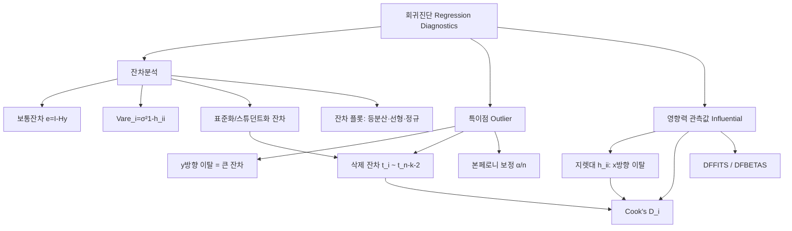

# 08. 회귀모형: 자료의 진단

## 🔗 선수 지식 (Prerequisites)
- [ ] **필수**: [3강. 중회귀모형(1)](3강.md) — 햇행렬 $H=X(X^\top X)^{-1}X^\top$, 잔차 $\mathbf{e}=(I-H)\mathbf{y}$, 지렛대 $h_{ii}$ 이해 완료?
- [ ] **필수**: 잔차의 분산 구조와 $\hat\sigma^2=\text{MSE}=\text{SSE}/(n-k-1)$
- [ ] **권장**: $t$-분포와 가설검정, 본페로니 보정(다중비교)
- [ ] **권장**: 정규분포·분산의 전파 `→← AI를위한수학의응용`
- **관련 단원**: [3강. 중회귀모형(1)](3강.md) `→` [8강. 자료의 진단] `→` [9강. 회귀진단(공선성·변수선택)](9강.md)

---

## 학습 목표
1. 회귀진단의 개념을 안다.
2. 잔차와 잔차의 표준화를 이해한다.
3. 특이점 개념과 검정방법을 안다.
4. 영향력 있는 관측값의 개념과 검출방법을 안다.

---

## 🧠 메타인지 체크 (학습 전/후 자기 평가)

### 학습 전 자기 평가
| 소주제 | 자신감 (1-5) |
| :--- | :--- |
| 회귀진단의 개념과 목적 | |
| 잔차의 표준화(표준화·스튜던트화 잔차) | |
| 특이점(outlier) 검정 | |
| 지렛대·영향력 측도(Cook's D, DFFITS) | |

### 학습 후 교정 (학습 완료 후 작성)
| 소주제 | 학습 전 | 학습 후 | 실제 정답률 | 과신/과소 여부 |
| :--- | :--- | :--- | :--- | :--- |
| 회귀진단 개념 | | | | |
| 잔차의 표준화 | | | | |
| 특이점 검정 | | | | |
| 영향력 측도 | | | | |

> **활용법**: 학습 전 1분 → 자신감 기입, 학습 후 1분 → 나머지 기입. "과신" 영역이 실제 취약점.

---

## 📝 요약 (Summary)
1. 🔴 **회귀진단**: 적합한 회귀모형이 자료에 적절한지, 모형 가정(선형성·등분산·독립성·정규성)이 만족되는지, 그리고 일부 관측값이 결과를 왜곡하지 않는지를 점검하는 절차로, 기본 도구는 **잔차**다.
2. 🔴 **잔차와 표준화**: 보통잔차 $e_i=y_i-\hat y_i$ 는 분산 $\text{Var}(e_i)=\sigma^2(1-h_{ii})$ 로 관측치마다 다르므로, 이를 보정한 **표준화 잔차**·**스튜던트화 잔차**로 비교해야 한다.
3. 🟡 **특이점(outlier)**: 적합된 회귀선에서 $y$ 방향으로 크게 벗어난(잔차가 비정상적으로 큰) 관측값으로, 외적 스튜던트화(삭제) 잔차 $t_i\sim t_{(n-k-2)}$ 로 검정한다.
4. 🔴 **지렛대(leverage)**: 햇행렬 대각원소 $h_{ii}$ 로, $x$ 공간에서 평균으로부터 떨어진 정도를 나타낸다. $\sum h_{ii}=p=k+1$, 평균 $p/n$, 경험적 기준 $h_{ii}>2p/n$.
5. 🔴 **영향력 있는 관측값**: 제거하면 추정 결과가 크게 달라지는 관측값으로, **Cook's distance $D_i$**, **DFFITS**, **DFBETAS** 등으로 검출한다($D_i>1$, $|\text{DFFITS}|>2\sqrt{p/n}$ 가 흔한 기준).

---

## 📐 핵심 수식 (Key Formulas)

| 수식명 | 수식 | 의미 |
| :--- | :--- | :--- |
| **보통잔차** | $e_i=y_i-\hat y_i,\quad \mathbf{e}=(I-H)\mathbf{y}$ | 관측값 − 적합값 |
| **잔차 분산** | $\text{Var}(e_i)=\sigma^2(1-h_{ii})$ | 지렛대가 클수록 잔차 분산은 작아짐 |
| **잔차 공분산** | $\text{Cov}(e_i,e_j)=-\sigma^2 h_{ij}$ | 잔차는 서로 약하게 상관 |
| **표준화 잔차** | $d_i=\dfrac{e_i}{\hat\sigma}=\dfrac{e_i}{\sqrt{\text{MSE}}}$ | 단순 척도 조정(지렛대 미보정) |
| **스튜던트화 잔차(내적)** | $r_i=\dfrac{e_i}{\hat\sigma\sqrt{1-h_{ii}}}$ | 잔차 분산까지 보정한 표준화 |
| **외적 스튜던트화(삭제) 잔차** | $t_i=\dfrac{e_i}{\hat\sigma_{(i)}\sqrt{1-h_{ii}}}\sim t_{(n-k-2)}$ | $i$를 뺀 분산 사용 → 특이점 검정 |
| **지렛대** | $h_{ii}=\mathbf{x}_i^\top(X^\top X)^{-1}\mathbf{x}_i$ | $x$ 공간에서의 이탈도 $(0\le h_{ii}\le1)$ |
| **지렛대 합** | $\sum_{i=1}^n h_{ii}=\text{tr}(H)=p=k+1$ | 평균 $\bar h=p/n$ |
| **Cook's 거리** | $D_i=\dfrac{r_i^2}{p}\cdot\dfrac{h_{ii}}{1-h_{ii}}$ | 잔차 크기 × 지렛대 → 종합 영향력 |
| **DFFITS** | $\text{DFFITS}_i=t_i\sqrt{\dfrac{h_{ii}}{1-h_{ii}}}$ | $i$ 제거 시 적합값 변화량(표준화) |
| **삭제 분산** | $\hat\sigma_{(i)}^2=\dfrac{(n-p)\hat\sigma^2-e_i^2/(1-h_{ii})}{n-p-1}$ | $i$를 뺀 잔차분산 추정 |

### 주요 정리/정의

**잔차의 분산이 일정하지 않은 이유**
$$
\mathbf{e}=(I-H)\mathbf{y}=(I-H)\boldsymbol{\epsilon}
\;\Rightarrow\;
\text{Var}(\mathbf{e})=\sigma^2(I-H)
$$
$$
\therefore\ \text{Var}(e_i)=\sigma^2(1-h_{ii}),\qquad \text{Cov}(e_i,e_j)=-\sigma^2 h_{ij}
$$
> **직관적 해석**: 오차 $\boldsymbol{\epsilon}$ 은 등분산($\sigma^2 I$)이지만, 잔차 $\mathbf{e}$ 는 $(I-H)$ 를 곱한 결과라 등분산이 아니다. 지렛대 $h_{ii}$ 가 큰 점일수록 회귀선이 그 점을 "끌어당겨" 잔차가 작게 나오므로, 보통잔차 크기만으로 이상치를 판단하면 안 된다.
> **AI 적용**: 잔차의 이분산성을 보정하는 발상은 가중최소제곱(WLS), 회귀 진단 플롯, 그리고 이상치에 강건한 손실(Huber loss)·로버스트 회귀의 출발점이다.

**특이점 검정 (외적 스튜던트화 잔차)**
$$
t_i=\frac{e_i}{\hat\sigma_{(i)}\sqrt{1-h_{ii}}}\ \sim\ t_{(n-k-2)}\quad(\text{귀무: }i\text{는 특이점이 아니다})
$$
> **직관적 해석**: 의심되는 점 $i$ 자신을 빼고 추정한 분산 $\hat\sigma_{(i)}^2$ 을 분모에 쓰므로, 큰 잔차가 분산 추정을 부풀려 자신을 가리는 "마스킹"을 피한다. $n$개를 한꺼번에 검정하므로 **본페로니 보정** $\alpha/n$ 을 적용한다.
> **AI 적용**: 모델 학습 데이터의 라벨 오류·이상 샘플 탐지(anomaly detection)에서 표준화된 예측오차를 임계값과 비교하는 방식과 동일한 논리.

---

## 📊 개념 시각화 (Visual Guide)

### 개념 관계도


### 핵심 도식 (이탈 방향 ↔ 진단 측도)
| 입력 | 연산 | 출력(측도) | 판단 기준 / AI 적용 |
| :--- | :--- | :--- | :--- |
| 잔차 $e_i$, $h_{ii}$, $\hat\sigma$ | $e_i/(\hat\sigma\sqrt{1-h_{ii}})$ | 스튜던트화 잔차 $r_i$ | $|r_i|>2$ 의심 / 이상치 탐지 |
| 잔차, 삭제분산 $\hat\sigma_{(i)}$ | $e_i/(\hat\sigma_{(i)}\sqrt{1-h_{ii}})$ | 삭제 잔차 $t_i$ | $t_{(n-k-2)}$ 검정(특이점) |
| 설계행렬 $X$ | $\mathbf{x}_i^\top(X^\top X)^{-1}\mathbf{x}_i$ | 지렛대 $h_{ii}$ | $h_{ii}>2p/n$ 고지렛대 |
| $r_i$, $h_{ii}$ | $\frac{r_i^2}{p}\frac{h_{ii}}{1-h_{ii}}$ | Cook's $D_i$ | $D_i>1$ 영향점 |
| $t_i$, $h_{ii}$ | $t_i\sqrt{h_{ii}/(1-h_{ii})}$ | DFFITS$_i$ | $|\cdot|>2\sqrt{p/n}$ |

---

## ✏️ 심화 학습 (Study Subject)

### 1. 가상 시나리오: "어떤 개념을, 언제 사용해야 할까?"
- **상황**: 광고비($x$)로 매출($y$)을 예측하는 회귀를 적합했더니 $R^2=0.92$ 로 좋아 보인다. 그런데 산점도를 보니 광고비가 유난히 큰 한 점(대형 캠페인)이 회귀선을 거의 혼자 결정하는 듯하다.
- **문제**: 이 한 점이 (1) 단순히 $y$ 방향 이상치인지, (2) $x$ 방향으로 멀리 떨어진 고지렛대인지, (3) 둘 다여서 추정에 **영향력**이 큰지를 어떻게 정량적으로 구별할까?
- **해결**: 세 종류의 측도를 함께 본다.
$$
\underbrace{t_i=\frac{e_i}{\hat\sigma_{(i)}\sqrt{1-h_{ii}}}}_{y\text{방향(특이점)}},\quad
\underbrace{h_{ii}}_{x\text{방향(지렛대)}},\quad
\underbrace{D_i=\frac{r_i^2}{p}\frac{h_{ii}}{1-h_{ii}}}_{\text{종합 영향력}}
$$
만약 $h_{ii}>2p/n$ 이면서 $D_i>1$ 이면, 그 점은 제거 시 계수가 크게 달라지는 **영향력 있는 관측값**이다. 잔차는 작지만($t_i$ 보통) 지렛대가 커서 영향력이 큰 경우도 있으므로, $D_i$ 가 잔차와 지렛대를 곱으로 결합한다는 점이 핵심이다.
- **AI 학습 포인트**: "잔차는 작은데 지렛대 $h_{ii}$ 가 1에 가까운 '고지렛대·저잔차' 점이 왜 위험한지, $\text{Var}(e_i)=\sigma^2(1-h_{ii})$ 와 함께 설명해줘. 또 이런 점을 강건 회귀(robust regression)는 어떻게 다루는지 알려줘."

### 2. 관점별 비교 및 오개념 분석
- **핵심 비교**:
  - **특이점(outlier) vs 지렛대점(leverage point)**: 특이점은 **$y$ 방향**으로 회귀선에서 벗어난 점(큰 잔차), 지렛대점은 **$x$ 방향**으로 설명변수 평균에서 멀리 떨어진 점. 둘은 독립적 개념이며, 둘 다인 점이 가장 영향력이 크다.
  - **표준화 잔차 vs 스튜던트화 잔차 vs 삭제 잔차**: $d_i=e_i/\hat\sigma$(지렛대 미보정) → $r_i=e_i/(\hat\sigma\sqrt{1-h_{ii}})$(내적, 지렛대 보정) → $t_i=e_i/(\hat\sigma_{(i)}\sqrt{1-h_{ii}})$(외적, 자기 자신 제외 분산). 뒤로 갈수록 이상치 검정에 적합.
  - **영향력 측도**: Cook's $D_i$(전체 적합값 변화) vs DFFITS(개별 적합값 $\hat y_i$ 변화) vs DFBETAS(개별 계수 $\hat\beta_j$ 변화).
- **오개념 분석**:
    - **오개념 1**: "잔차가 가장 큰 점이 항상 가장 영향력 있는 점이다."
    - **분석**: 틀렸다. 영향력은 잔차 × 지렛대다($D_i=\frac{r_i^2}{p}\frac{h_{ii}}{1-h_{ii}}$). 잔차가 커도 지렛대가 작으면(평균 부근) 영향력은 작고, 잔차가 작아도 지렛대가 매우 크면 영향력이 클 수 있다.
    - **오개념 2**: "잔차 $e_i$ 는 오차 $\epsilon_i$ 처럼 모두 같은 분산 $\sigma^2$ 을 가진다."
    - **분석**: $\text{Var}(e_i)=\sigma^2(1-h_{ii})$ 로 관측치마다 다르다. 그래서 보통잔차를 직접 비교하지 말고 표준화/스튜던트화해야 한다.
    - **오개념 3**: "이상치로 판정되면 무조건 삭제해야 한다."
    - **분석**: 아니다. 진단은 "검출"이지 "삭제 지시"가 아니다. 입력 오류면 수정, 실제 현상이면 모형(비선형·변수 누락) 재검토가 우선이다. 삭제는 근거를 명시한 최후 수단.
- **AI 학습 포인트**: "Cook's distance가 스튜던트화 잔차 $r_i$ 와 지렛대 $h_{ii}$ 를 어떻게 하나로 결합하는지, $D_i=\frac{r_i^2}{p}\frac{h_{ii}}{1-h_{ii}}$ 의 각 인자가 의미하는 바를 분해해서 설명해줘."

---

## ❓ 연습 문제 및 해설

> **블룸 인지 수준 범례**: [기억] 정의·나열 → [이해] 설명·비교 → [적용] 계산·구현 → [분석] 구별·디버그 → [평가] 판단·비평 → [창조] 설계·제안

### 📝 문제

**1. ⭐ [기억] 📌 회귀진단의 1차적 기본 도구가 되는 통계량으로 가장 적절한 것은?(#prob-1)**
   > ① 결정계수 $R^2$
   > ② 잔차 $e_i=y_i-\hat y_i$
   > ③ $F$-통계량
   > ④ 회귀계수 $\hat\beta_j$

<br>

**2. ⭐ [기억] 📌 보통잔차 $e_i$ 의 분산으로 옳은 것은?(#prob-2)**
   > ① $\sigma^2$
   > ② $\sigma^2 h_{ii}$
   > ③ $\sigma^2(1-h_{ii})$
   > ④ $\sigma^2/(1-h_{ii})$

<br>

**3. ⭐⭐ [이해] 📌 보통잔차 대신 표준화·스튜던트화 잔차를 사용하는 주된 이유는?(#prob-3)**
   > ① 잔차의 평균을 0으로 만들기 위해
   > ② 관측치마다 잔차의 분산 $\sigma^2(1-h_{ii})$ 이 달라 비교가 어렵기 때문
   > ③ 잔차의 합을 0으로 만들기 위해
   > ④ $R^2$ 을 높이기 위해

<br>

**4. ⭐⭐ [이해] 📌 특이점(outlier)과 지렛대(leverage)점에 대한 설명으로 옳은 것을 모두 고르면?(#prob-4)**
   > <보기>
   >
   > 가. 특이점은 $y$ 방향(큰 잔차)으로 회귀선에서 벗어난 점이다.
   > 나. 지렛대점은 $x$ 방향으로 설명변수 평균에서 멀리 떨어진 점이다.
   > 다. 지렛대 $h_{ii}$ 는 항상 0과 1 사이의 값을 가진다.

   > ① 가, 나
   > ② 나, 다
   > ③ 가, 다
   > ④ 가, 나, 다

<br>

**5. ⭐⭐ [이해] 📌 특이점 검정에 쓰이는 외적 스튜던트화(삭제) 잔차 $t_i$ 가 따르는 분포는? (설명변수 $k$개, 절편 포함)(#prob-5)**
   > ① $t_{(n-1)}$
   > ② $t_{(n-k-1)}$
   > ③ $t_{(n-k-2)}$
   > ④ $F_{(k,\,n-k-1)}$

<br>

**6. ⭐⭐ [적용] 📌 $n=50$, 설명변수 $k=4$(절편 포함 $p=5$)일 때, 고지렛대 판정의 경험적 기준 $2p/n$ 값은?(#prob-6)**
   > ① $0.1$
   > ② $0.2$
   > ③ $0.4$
   > ④ $0.5$

<br>

**7. ⭐⭐ [적용] 📌 햇행렬 $H$ 의 대각원소 합 $\sum_{i=1}^n h_{ii}$ 는? (절편 포함 설명변수 $k$개)(#prob-7)**
   > ① $n$
   > ② $k$
   > ③ $k+1$
   > ④ $n-k-1$

<br>

**8. ⭐⭐⭐ [적용] 📌 어떤 관측치의 스튜던트화 잔차 $r_i=2$, 지렛대 $h_{ii}=0.5$, $p=4$ 일 때 Cook's distance $D_i$ 는?(#prob-8)**
   > ① $0.5$
   > ② $1.0$
   > ③ $2.0$
   > ④ $4.0$

<br>

**9. ⭐⭐⭐ [분석] 📌 잔차는 작지만($r_i\approx0$) 지렛대가 매우 큰($h_{ii}\to1$) 관측값에 대한 설명으로 가장 적절한 것은?(#prob-9)**
   > ① 잔차가 작으므로 항상 무시해도 안전하다.
   > ② 회귀선이 그 점을 강하게 끌어당겨 잔차가 작게 나온 것일 수 있어, 영향력을 별도로 점검해야 한다.
   > ③ $h_{ii}>1$ 이므로 계산 오류이다.
   > ④ Cook's distance가 반드시 1보다 크다.

<br>

**10. ⭐⭐⭐ [평가/창조] 📌 잔차의 분산이 $\text{Var}(e_i)=\sigma^2(1-h_{ii})$ 임을 유도하고, 이 결과가 "왜 보통잔차 대신 스튜던트화 잔차를 써야 하는가"를 어떻게 정당화하는지 설명하시오.(#prob-10)**

---

### 🔑 정답 및 해설 (먼저 풀어본 후 펼치기)

<details>
<summary>정답 보기 (클릭)</summary>

1. ②
2. ③
3. ②
4. ④
5. ③
6. ②
7. ③
8. ②
9. ②
10. 풀이형 정답 (해설 참조)

</details>

<details>
<summary>해설 보기 (클릭)</summary>

<a id="prob-1"></a>
**1. ⭐ [기억] 회귀진단의 기본 도구**
> **정답: ② 잔차 $e_i=y_i-\hat y_i$**
> **해설**: 회귀진단은 모형 가정의 위배·이상 관측값을 점검하는 절차이며, 그 출발점이자 핵심 통계량이 잔차다. $R^2$·$F$·$\hat\beta_j$ 는 적합·추론 결과이지 진단의 1차 도구가 아니다.

<a id="prob-2"></a>
**2. ⭐ [기억] 잔차의 분산**
> **정답: ③ $\sigma^2(1-h_{ii})$**
> **해설**: $\mathbf{e}=(I-H)\boldsymbol{\epsilon}$, $\text{Var}(\mathbf{e})=\sigma^2(I-H)$ 이므로 대각원소 $\text{Var}(e_i)=\sigma^2(1-h_{ii})$. 오차의 분산 $\sigma^2$ 과 달리 관측치마다 다르다.

<a id="prob-3"></a>
**3. ⭐⭐ [이해] 표준화의 이유**
> **정답: ② 잔차의 분산이 관측치마다 달라 비교가 어렵기 때문**
> **해설**: $\text{Var}(e_i)=\sigma^2(1-h_{ii})$ 로 일정하지 않으므로, 같은 척도에서 비교하려면 $\sqrt{1-h_{ii}}$ 로 나눠 스튜던트화한다. ①③은 절편이 있으면 보통잔차에서 이미 성립.

<a id="prob-4"></a>
**4. ⭐⭐ [이해] 특이점 vs 지렛대점**
> **정답: ④ 가, 나, 다**
> **해설**: 특이점은 $y$ 방향 이탈(큰 잔차), 지렛대점은 $x$ 방향 이탈. $h_{ii}$ 는 정사영 행렬의 대각원소로 $0\le h_{ii}\le1$. 모두 옳다.

<a id="prob-5"></a>
**5. ⭐⭐ [이해] 삭제 잔차의 분포**
> **정답: ③ $t_{(n-k-2)}$**
> **해설**: 관측치 $i$ 를 제거한 분산 $\hat\sigma_{(i)}^2$ 으로 표준화하면, 자유도가 하나 더 줄어 $t_i\sim t_{(n-p-1)}=t_{(n-k-2)}$ ($p=k+1$). 일반 잔차분산의 자유도 $n-k-1$ 보다 1 작다.

<a id="prob-6"></a>
**6. ⭐⭐ [적용] 고지렛대 기준**
> **정답: ② $0.2$**
> **해설**: $2p/n=2\times5/50=10/50=0.2$. 지렛대의 평균이 $p/n=0.1$ 이므로 그 2배인 0.2를 넘으면 고지렛대로 본다.

<a id="prob-7"></a>
**7. ⭐⭐ [적용] 지렛대 합**
> **정답: ③ $k+1$**
> **해설**: $\sum h_{ii}=\text{tr}(H)=\text{rank}(X)=p=k+1$ (절편 포함). 따라서 평균 지렛대는 $p/n$.

<a id="prob-8"></a>
**8. ⭐⭐⭐ [적용] Cook's distance 계산**
> **정답: ② $1.0$**
> **해설**: $D_i=\dfrac{r_i^2}{p}\cdot\dfrac{h_{ii}}{1-h_{ii}}=\dfrac{2^2}{4}\cdot\dfrac{0.5}{1-0.5}=\dfrac{4}{4}\cdot\dfrac{0.5}{0.5}=1\times1=1.0$. $D_i\ge1$ 이므로 영향력 있는 관측값으로 의심된다.

<a id="prob-9"></a>
**9. ⭐⭐⭐ [분석] 고지렛대·저잔차**
> **정답: ② 회귀선이 끌어당겨 잔차가 작게 나온 것일 수 있어 영향력을 별도 점검**
> **해설**: $\text{Var}(e_i)=\sigma^2(1-h_{ii})\to0$ 이라 고지렛대 점은 구조적으로 잔차가 작게 나온다(회귀선이 그 점을 통과하려는 경향). 잔차만 보면 위험을 놓치므로 $h_{ii}$, $D_i$, DFFITS로 영향력을 확인해야 한다. ③ $h_{ii}\le1$ 이므로 오류 아님, ④는 반드시 성립하지 않음.

<a id="prob-10"></a>
**10. ⭐⭐⭐ [평가/창조] 잔차 분산 유도와 표준화 정당화**
> **정답·해설**:
> 1) **잔차의 표현**: $\mathbf{e}=\mathbf{y}-\hat{\mathbf{y}}=(I-H)\mathbf{y}$. 모형 $\mathbf{y}=X\boldsymbol{\beta}+\boldsymbol{\epsilon}$ 을 대입하면 $(I-H)X\boldsymbol{\beta}=X\boldsymbol{\beta}-HX\boldsymbol{\beta}=X\boldsymbol{\beta}-X\boldsymbol{\beta}=\mathbf{0}$ ($HX=X$) 이므로
> $$\mathbf{e}=(I-H)\boldsymbol{\epsilon}.$$
> 2) **공분산행렬**: $I-H$ 는 대칭·멱등이고 $\text{Var}(\boldsymbol{\epsilon})=\sigma^2 I$ 이므로
> $$\text{Var}(\mathbf{e})=(I-H)\sigma^2 I(I-H)^\top=\sigma^2(I-H)(I-H)=\sigma^2(I-H).$$
> 3) **대각원소**: $\text{Var}(e_i)=\sigma^2(1-h_{ii}),\quad \text{Cov}(e_i,e_j)=-\sigma^2 h_{ij}$.
> 4) **정당화**: 보통잔차의 분산이 $h_{ii}$ 에 따라 달라지므로(이분산), 서로 다른 관측치의 잔차를 같은 척도로 비교할 수 없다. 이를 $\sqrt{1-h_{ii}}$ 로 표준화하면
> $$r_i=\frac{e_i}{\hat\sigma\sqrt{1-h_{ii}}}$$
> 는 근사적으로 등분산(분산 ≈ 1)을 가져 임계값(예: $|r_i|>2$)으로 일관되게 이상치를 판정할 수 있다. 특히 고지렛대 점은 $1-h_{ii}$ 가 작아 보통잔차가 과소평가되는데, 표준화가 이를 복원한다.

</details>

---

## ✅ O/X 확인문제 (총 20문)

**1.** 회귀진단의 가장 기본이 되는 통계량은 잔차이다. (#ox-1) **(O / X)**
**2.** 보통잔차의 분산은 모든 관측치에서 $\sigma^2$ 로 동일하다. (#ox-2) **(O / X)**
**3.** $\text{Var}(e_i)=\sigma^2(1-h_{ii})$ 이다. (#ox-3) **(O / X)**
**4.** 지렛대가 큰 관측치일수록 보통잔차의 분산은 작아진다. (#ox-4) **(O / X)**
**5.** 표준화 잔차 $d_i=e_i/\hat\sigma$ 는 지렛대 $h_{ii}$ 를 보정한 값이다. (#ox-5) **(O / X)**
**6.** 스튜던트화 잔차는 $r_i=e_i/(\hat\sigma\sqrt{1-h_{ii}})$ 로 정의된다. (#ox-6) **(O / X)**
**7.** 외적 스튜던트화(삭제) 잔차는 관측치 $i$ 자신을 제외한 분산 $\hat\sigma_{(i)}$ 를 사용한다. (#ox-7) **(O / X)**
**8.** 삭제 잔차 $t_i$ 는 $t_{(n-k-2)}$ 분포를 따른다(절편 포함, 설명변수 $k$개). (#ox-8) **(O / X)**
**9.** 특이점은 $x$ 방향으로 멀리 떨어진 점을 말한다. (#ox-9) **(O / X)**
**10.** 지렛대 $h_{ii}$ 는 항상 0과 1 사이의 값을 가진다. (#ox-10) **(O / X)**
**11.** 지렛대의 합 $\sum h_{ii}$ 은 $k+1$ 과 같다. (#ox-11) **(O / X)**
**12.** 지렛대의 평균은 $p/n$ 이며, 흔히 $2p/n$ 을 고지렛대 기준으로 쓴다. (#ox-12) **(O / X)**
**13.** 잔차가 가장 큰 관측치가 항상 가장 영향력 있는 관측치이다. (#ox-13) **(O / X)**
**14.** Cook's distance는 $D_i=\frac{r_i^2}{p}\cdot\frac{h_{ii}}{1-h_{ii}}$ 로 잔차와 지렛대를 결합한다. (#ox-14) **(O / X)**
**15.** Cook's distance가 1보다 크면 영향력 있는 관측값으로 의심한다. (#ox-15) **(O / X)**
**16.** DFFITS는 한 관측치를 제거했을 때 적합값 $\hat y_i$ 의 변화를 표준화한 측도이다. (#ox-16) **(O / X)**
**17.** DFBETAS는 한 관측치 제거 시 개별 회귀계수 $\hat\beta_j$ 의 변화를 측정한다. (#ox-17) **(O / X)**
**18.** 특이점으로 판정되면 반드시 자료에서 삭제해야 한다. (#ox-18) **(O / X)**
**19.** $n$개 관측치를 동시에 특이점 검정할 때는 본페로니 보정 $\alpha/n$ 을 적용할 수 있다. (#ox-19) **(O / X)**
**20.** 잔차가 작아도 지렛대가 매우 크면 영향력 있는 관측값일 수 있다. (#ox-20) **(O / X)**

<details>
<summary>O/X 정답 및 해설 보기 (클릭)</summary>

> <a id="ox-1"></a> **1. O** — 잔차는 모형 가정·이상치 진단의 출발점.
> <a id="ox-2"></a> **2. X** — $\text{Var}(e_i)=\sigma^2(1-h_{ii})$ 로 관측치마다 다르다.
> <a id="ox-3"></a> **3. O** — $\text{Var}(\mathbf{e})=\sigma^2(I-H)$ 의 대각원소.
> <a id="ox-4"></a> **4. O** — $h_{ii}$ 가 클수록 $1-h_{ii}$ 가 작아 잔차 분산 감소.
> <a id="ox-5"></a> **5. X** — $d_i=e_i/\hat\sigma$ 는 척도만 조정할 뿐 지렛대 미보정. 보정은 $r_i$.
> <a id="ox-6"></a> **6. O** — 내적 스튜던트화 잔차의 정의.
> <a id="ox-7"></a> **7. O** — 자기 자신을 빼 마스킹을 방지.
> <a id="ox-8"></a> **8. O** — 분산 자유도가 하나 더 줄어 $t_{(n-k-2)}$.
> <a id="ox-9"></a> **9. X** — 특이점은 $y$ 방향 이탈(큰 잔차). $x$ 방향은 지렛대점.
> <a id="ox-10"></a> **10. O** — 정사영행렬 대각원소로 $0\le h_{ii}\le1$.
> <a id="ox-11"></a> **11. O** — $\text{tr}(H)=p=k+1$.
> <a id="ox-12"></a> **12. O** — 평균 $p/n$, 경험적 기준 $2p/n$(또는 $3p/n$).
> <a id="ox-13"></a> **13. X** — 영향력 = 잔차 × 지렛대. 잔차만으로 판단 불가.
> <a id="ox-14"></a> **14. O** — Cook's distance의 정의식.
> <a id="ox-15"></a> **15. O** — $D_i>1$ 이 흔한 임계 기준(또는 $4/n$).
> <a id="ox-16"></a> **16. O** — DFFITS$_i=t_i\sqrt{h_{ii}/(1-h_{ii})}$, 적합값 변화의 표준화.
> <a id="ox-17"></a> **17. O** — DFBETAS는 계수별 영향력 측도.
> <a id="ox-18"></a> **18. X** — 진단은 검출이지 삭제 지시가 아니다. 원인 확인이 먼저.
> <a id="ox-19"></a> **19. O** — 다중검정이므로 유의수준을 $\alpha/n$ 으로 보수적으로.
> <a id="ox-20"></a> **20. O** — 고지렛대·저잔차 점도 영향력이 클 수 있다.

</details>

---

## 🧪 자유 회상 연습 (Free Recall)

> **방법**: 위의 노트를 모두 덮고, 타이머 3분 설정 후 이번 단원에서 배운 내용을 기억나는 대로 자유롭게 적으세요.
> 정확한 문장이 아니어도 됩니다. 키워드, 수식, 관계 등 떠오르는 것을 모두 적습니다.

**자유 회상 작성란:**

```
[여기에 기억나는 내용을 자유롭게 작성]


```

> **회상 후 점검**: 노트를 다시 펼쳐 빠뜨린 내용을 확인하세요. 빠뜨린 부분이 실제 취약점입니다.
> - 회상 못한 핵심 개념: [                ]
> - 회상 못한 수식: [                ]

---

## 💻 코드로 확인하기 (Code Verification)

```python
import numpy as np

# 가상 데이터: y = 1 + 2x + 잡음, 마지막 한 점을 영향점으로 조작
np.random.seed(1)
n = 30
x = np.random.uniform(0, 10, n)
y = 1 + 2*x + np.random.normal(0, 1.0, n)
x[-1] = 20.0       # x 방향으로 멀리 (고지렛대)
y[-1] = 10.0       # 회귀선에서 아래로 (큰 잔차) → 영향점

X = np.column_stack([np.ones(n), x])     # 절편 포함, p = 2
p = X.shape[1]

# 적합 및 햇행렬
XtX_inv = np.linalg.inv(X.T @ X)
H = X @ XtX_inv @ X.T
h = np.diag(H)                            # 지렛대 h_ii
beta = XtX_inv @ X.T @ y
e = y - X @ beta                          # 보통잔차
SSE = e @ e
sigma2 = SSE / (n - p)                    # MSE

# 스튜던트화(내적) 잔차
r = e / np.sqrt(sigma2 * (1 - h))

# 삭제 분산과 외적 스튜던트화(삭제) 잔차
sigma2_i = ((n - p) * sigma2 - e**2 / (1 - h)) / (n - p - 1)
t = e / np.sqrt(sigma2_i * (1 - h))       # t_(n-k-2)

# Cook's distance, DFFITS
D = (r**2 / p) * (h / (1 - h))
dffits = t * np.sqrt(h / (1 - h))

print(f"마지막 점  h={h[-1]:.3f} (기준 2p/n={2*p/n:.3f})")
print(f"           r={r[-1]:.2f}, t={t[-1]:.2f}")
print(f"           Cook's D={D[-1]:.2f} (기준 1),  DFFITS={dffits[-1]:.2f} (기준 {2*np.sqrt(p/n):.2f})")
print("sum(h_ii) =", round(h.sum(), 3), " (= p =", p, ")")
```

> **실행 결과 (예상)**
> ```
> 마지막 점  h=0.4xx (기준 2p/n=0.133)
>            r=-4.xx, t=-8.xx
>            Cook's D=1.xx (기준 1),  DFFITS=-3.xx (기준 0.37)
> sum(h_ii) = 2.0  (= p = 2 )
> ```
> **수학적 해석**: 조작한 마지막 점은 지렛대 $h$ 가 기준 $2p/n$ 을 크게 넘고, 삭제 잔차 $t$ 도 매우 커서 $y$·$x$ 양방향으로 이탈한 **영향력 있는 관측값**임이 모든 측도(Cook's $D>1$, $|\text{DFFITS}|>2\sqrt{p/n}$)에서 일관되게 검출된다. $\sum h_{ii}=p$ 도 코드로 확인된다.

---

## 🤖 AI 연결고리 (Math → AI Application)

| 수학 개념 | AI/ML 적용 분야 | 구체적 사례 |
| :--- | :--- | :--- |
| 잔차 분석 $e_i=y_i-\hat y_i$ | 모델 진단·오차 분석 | residual plot, 학습곡선 잔차 점검 |
| 표준화/스튜던트화 잔차 | 이상치 탐지(anomaly detection) | 표준화 예측오차 임계값 판정 |
| 지렛대 $h_{ii}$ | 영향력·대표성 분석 | 데이터 중요도, 영향함수(influence function) |
| Cook's distance / DFFITS | 데이터 정제·디버깅 | 학습 데이터 영향도 분석, 라벨 노이즈 제거 |
| 삭제 분산·LOO | 교차검증 | Leave-One-Out CV, 영향 기반 데이터 셰이플리 |
| 강건 손실(이상치 둔감) | 로버스트 회귀 | Huber loss, RANSAC |

---

## 📖 심화 학습 예시 답안

#### 1. Cook's Distance의 내부 동작 원리
Cook's distance $D_i$ 는 "관측치 $i$ 를 빼고 다시 적합했을 때 **모든 적합값**이 얼마나 달라지는가"를 하나의 숫자로 요약한다.

1. **정의의 기원**: $D_i=\dfrac{(\hat{\boldsymbol{\beta}}-\hat{\boldsymbol{\beta}}_{(i)})^\top X^\top X(\hat{\boldsymbol{\beta}}-\hat{\boldsymbol{\beta}}_{(i)})}{p\,\hat\sigma^2}=\dfrac{\sum_j(\hat y_j-\hat y_{j(i)})^2}{p\,\hat\sigma^2}$. 즉 계수 변화(또는 적합값 변화)의 표준화된 제곱합.
2. **계산 가능한 형태**: 한 번의 적합만으로 $D_i=\dfrac{r_i^2}{p}\cdot\dfrac{h_{ii}}{1-h_{ii}}$ 로 환원된다. $n$번 재적합할 필요가 없다는 것이 핵심.
3. **두 인자의 역할**: 앞의 $r_i^2$ 은 **$y$ 방향 이탈**(특이점 성분), 뒤의 $\frac{h_{ii}}{1-h_{ii}}$ 은 **$x$ 방향 이탈**(지렛대 성분). 둘의 곱이 커야 영향력이 크다.
4. **판정**: 흔히 $D_i>1$ 또는 $D_i>4/n$ 을 임계로 본다.

#### 2. 특이점 vs 영향점 비교표

| 구분 | 특이점 (Outlier) | 영향점 (Influential point) | 비고 |
| :--- | :--- | :--- | :--- |
| **정의** | $y$ 방향 이탈(큰 잔차) | 제거 시 추정 결과가 크게 변함 | 별개 개념 |
| **측도** | 삭제 잔차 $t_i\sim t_{(n-k-2)}$ | Cook's $D_i$, DFFITS, DFBETAS | |
| **지렛대와 관계** | 지렛대 무관 가능 | 지렛대 $h_{ii}$ 가 핵심 성분 | |
| **항상 위험?** | 지렛대 작으면 영향 작을 수 있음 | 잔차 작아도 위험할 수 있음 | 둘 다인 점이 최악 |
| **AI 활용** | 라벨 오류 탐지 | 학습 데이터 영향도/정제 | |

#### 3. 영향력 진단 코드 작성법 (Best Practice)

- **Bad Practice (나쁜 예시)**
  ```python
  # 보통잔차 절댓값만 보고 이상치 판정 → 지렛대로 인한 잔차 축소를 놓침
  outliers = np.where(np.abs(e) > 2 * np.std(e))[0]
  ```
- **Good Practice (좋은 예시)**
  ```python
  import statsmodels.api as sm
  model = sm.OLS(y, X).fit()
  infl = model.get_influence()
  student_resid = infl.resid_studentized_external   # 삭제 잔차 t_i
  cooks_d = infl.cooks_distance[0]                   # Cook's D
  leverage = infl.hat_matrix_diag                    # h_ii
  dffits = infl.dffits[0]                            # DFFITS
  # 잔차·지렛대·영향력을 함께 보고 종합 판단
  ```
- **설명**: 이상치는 $y$·$x$·영향력의 세 축을 함께 봐야 한다. `statsmodels`의 `get_influence()` 는 삭제 잔차·Cook's D·지렛대·DFFITS·DFBETAS를 한 번에 제공해 마스킹·스왐핑 위험을 줄인다. 잔차 단독 판정은 고지렛대 점을 놓친다.

---

## 📚 핵심 용어집 (Glossary)

| 용어 (한) | 용어 (영) | 수식 표현 | 정의 |
| :--- | :--- | :--- | :--- |
| **회귀진단** | Regression Diagnostics | — | 모형 가정·이상 관측값 점검 절차 |
| **잔차** | Residual | $e_i=y_i-\hat y_i$ | 관측값 − 적합값 `→← 3강` |
| **표준화 잔차** | Standardized Residual | $d_i=e_i/\hat\sigma$ | 척도만 조정(지렛대 미보정) |
| **스튜던트화 잔차** | (Internally) Studentized Residual | $r_i=\dfrac{e_i}{\hat\sigma\sqrt{1-h_{ii}}}$ | 잔차 분산까지 보정 |
| **삭제 잔차** | Externally Studentized / Deleted Residual | $t_i=\dfrac{e_i}{\hat\sigma_{(i)}\sqrt{1-h_{ii}}}$ | 자기 제외 분산, $t_{(n-k-2)}$ |
| **특이점** | Outlier | $|t_i|$ 큼 | $y$ 방향으로 벗어난 관측값 |
| **지렛대** | Leverage | $h_{ii}=\mathbf{x}_i^\top(X^\top X)^{-1}\mathbf{x}_i$ | $x$ 방향 이탈도 $(0\le h_{ii}\le1)$ `→← 3강` |
| **영향점** | Influential Observation | $D_i,\ \text{DFFITS}$ | 제거 시 추정이 크게 변하는 점 |
| **쿡의 거리** | Cook's Distance | $D_i=\dfrac{r_i^2}{p}\dfrac{h_{ii}}{1-h_{ii}}$ | 종합 영향력 측도 |
| **DFFITS** | DFFITS | $t_i\sqrt{\dfrac{h_{ii}}{1-h_{ii}}}$ | 적합값 변화의 표준화 측도 |
| **DFBETAS** | DFBETAS | — | 개별 계수 변화 측도 |
| **본페로니 보정** | Bonferroni Correction | $\alpha/n$ | 다중 특이점 검정의 유의수준 보정 |

---

## 🤖 AI 학습 파트너를 위한 추가 자료

### 1. 개념 이해를 위한 심층 질문 프롬프트
> **프롬프트 예시**: "회귀에서 '특이점(outlier)'과 '지렛대점(leverage point)'과 '영향점(influential point)'의 차이를, 시소(seesaw)에 추를 올리는 비유로 초등학생도 이해하게 설명해줘. 그리고 세 개념이 어떻게 겹치고 어떻게 다른지 벤다이어그램처럼 정리해줘."

### 2. 문제 해결 능력 강화를 위한 시나리오 프롬프트
> **프롬프트 예시**: "당신은 데이터 사이언티스트입니다. 한 관측치의 Cook's distance가 5로 매우 크지만, 그 점이 실제 발생 가능한 정상 데이터로 확인됐습니다. **(a) 삭제, (b) 강건 회귀(Huber), (c) 비선형 항 추가** 중 무엇을 선택할지 각각의 장단점을 $\text{Var}(\hat{\boldsymbol{\beta}})$ 와 모형 가정 관점에서 비교하고 최종 선택 이유를 설명해줘."

### 3. 수식 풀이 검증 프롬프트
> **프롬프트 예시**: "다음 잔차 분산 유도를 검증해줘.
> $$\mathbf{e}=(I-H)\boldsymbol{\epsilon}\ \Rightarrow\ \text{Var}(\mathbf{e})=\sigma^2(I-H)\ \Rightarrow\ \text{Var}(e_i)=\sigma^2(1-h_{ii})$$
> 1. $(I-H)$ 가 대칭·멱등임을 이용한 각 단계가 올바른지 확인해줘.
> 2. 이로부터 Cook's distance가 $D_i=\frac{r_i^2}{p}\frac{h_{ii}}{1-h_{ii}}$ 로 표현되는 과정을 보충해줘."

---

## 🔄 복습 체크 (Spaced Repetition)
- [ ] 1일 후 복습 (날짜: 2026-05-30)
- [ ] 3일 후 복습 (날짜: 2026-06-01)
- [ ] 7일 후 복습 (날짜: 2026-06-05)
- [ ] 14일 후 복습 (날짜: 2026-06-12)
- [ ] 30일 후 복습 (날짜: 2026-06-28)

### 복습 시 자가 평가
| 회차 | 날짜 | 이해도 (1-5) | 취약 부분 메모 |
| :--- | :--- | :--- | :--- |
| 1차 | | | |
| 2차 | | | |
| 3차 | | | |

---

## 📚 참고 자료 (References)

- 교재: 한국방송통신대학교 『R을 이용한 회귀모형』 8장 — 자료의 진단
- 강의: 회귀모형 8강 (1. 회귀진단 / 2. 잔차분석 / 3. 특이점 / 4. 관측값의 영향)
- Montgomery, Peck & Vining, *Introduction to Linear Regression Analysis* — 잔차·영향력 진단 표준 텍스트
- Cook, R. D. (1977), "Detection of Influential Observations in Linear Regression," *Technometrics* — Cook's distance 원논문
- Belsley, Kuh & Welsch, *Regression Diagnostics* — DFFITS·DFBETAS·지렛대 진단의 고전
- [3강. 중회귀모형(1)](3강.md) — 햇행렬·지렛대의 출발점
</content>
</invoke>
