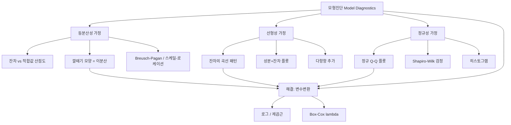

# 09. 회귀모형: 모형의 진단

## 🔗 선수 지식 (Prerequisites)
- [ ] **필수**: [8강. 자료의 진단](8강.md) — 잔차 $e_i=y_i-\hat y_i$, 표준화·스튜던트화 잔차, 지렛대 $h_{ii}$ 이해 완료?
- [ ] **필수**: 회귀모형의 4대 가정 — 선형성·등분산성·독립성·정규성($\epsilon_i\overset{iid}{\sim}N(0,\sigma^2)$)
- [ ] **권장**: 정규 Q-Q 플롯, 분산안정화·로그변환 개념
- [ ] **권장**: 기댓값·분산의 변환 `→← AI를위한수학의응용`
- **관련 단원**: [8강. 자료의 진단](8강.md) `→` [9강. 모형의 진단] `→` [10강. 다중공선성·변수선택](10강.md)

---

## 학습 목표
1. 오차의 등분산성, 회귀모형의 선형성, 오차의 정규성을 이해한다.
2. 등분산성, 회귀모형의 선형성, 오차의 정규성 가정의 진단 방법을 안다.
3. 변수변환을 통해 이분산성, 비선형성, 비정규성 문제를 해결한다.
4. R을 이용한 모형의 진단 방법을 안다.

---

## 🧠 메타인지 체크 (학습 전/후 자기 평가)

### 학습 전 자기 평가
| 소주제 | 자신감 (1-5) |
| :--- | :--- |
| 모형진단의 개념과 목적 | |
| 오차의 등분산성 진단(잔차 산점도) | |
| 회귀모형의 선형성 진단 | |
| 오차의 정규성 진단(Q-Q 플롯) | |
| 변수변환(로그·제곱근·Box-Cox) | |

### 학습 후 교정 (학습 완료 후 작성)
| 소주제 | 학습 전 | 학습 후 | 실제 정답률 | 과신/과소 여부 |
| :--- | :--- | :--- | :--- | :--- |
| 모형진단 개념 | | | | |
| 등분산성 | | | | |
| 선형성 | | | | |
| 정규성 | | | | |
| 변수변환 | | | | |

> **활용법**: 학습 전 1분 → 자신감 기입, 학습 후 1분 → 나머지 기입. "과신" 영역이 실제 취약점.

---

## 📝 요약 (Summary)
1. 🔴 **모형진단**: 적합한 회귀모형이나 그 **가정(선형성·등분산성·독립성·정규성)**에 어떤 문제가 있는지를 점검하는 절차. 8강이 *개별 관측값*(이상치·영향점)을 진단했다면, 9강은 *모형 가정 전체*를 진단한다. 주된 도구는 여전히 **잔차 그림(residual plot)** 이다.
2. 🔴 **오차의 등분산성(homoscedasticity)**: 모든 관측치에서 오차의 분산이 $\text{Var}(\epsilon_i)=\sigma^2$ 로 일정하다는 가정. **잔차 vs 적합값 산점도**에서 점들이 0을 중심으로 폭이 일정한 띠를 이루면 만족, 깔때기(fan/funnel) 모양이면 **이분산성(heteroscedasticity)** 을 의심한다.
3. 🟡 **회귀모형의 선형성(linearity)**: $E(y)=\beta_0+\beta_1 x_1+\cdots+\beta_k x_k$ 가 옳다는 가정. 잔차 산점도에서 **곡선(U자·역U자) 패턴**이 보이면 선형성이 위배된 것으로, 다항항·변수변환이 필요하다.
4. 🔴 **오차의 정규성(normality)**: $\epsilon_i\sim N(0,\sigma^2)$ 가정. **정규 Q-Q 플롯**의 점들이 직선 위에 놓이면 만족, 양 끝이 휘면 두꺼운 꼬리·치우침을 의심한다. 검정으로 **Shapiro–Wilk**, 점근적으로 검정·신뢰구간의 타당성에 영향.
5. 🟡 **변수변환(transformation)**: 이분산·비선형·비정규 문제를 **$y$ 또는 $x$ 의 변환**으로 완화한다. 분산이 평균에 비례해 커지면 **로그·제곱근**, 일반적으로는 **Box–Cox 변환** $y^{(\lambda)}$ 으로 최적 $\lambda$ 를 찾는다.

---

## 📐 핵심 수식 (Key Formulas)

| 수식명 | 수식 | 의미 |
| :--- | :--- | :--- |
| **회귀모형 가정** | $y_i=\beta_0+\sum_j\beta_j x_{ij}+\epsilon_i,\ \ \epsilon_i\overset{iid}{\sim}N(0,\sigma^2)$ | 선형성·독립·등분산·정규성 |
| **잔차 그림 축** | $(\hat y_i,\ e_i)$ 또는 $(\hat y_i,\ r_i)$ | 가정 위배 패턴 진단의 기본 도구 |
| **표준화 잔차** | $r_i=\dfrac{e_i}{\hat\sigma\sqrt{1-h_{ii}}}$ | 분산 보정 후 패턴 비교 `→← 8강` |
| **정규 Q-Q 좌표** | $\big(\Phi^{-1}\!\big(\tfrac{i-0.5}{n}\big),\ r_{(i)}\big)$ | 이론분위수 vs 표본분위수 |
| **Breusch–Pagan 검정** | $e_i^2$ 를 $x$ 에 회귀, $\ nR^2_{\text{aux}}\sim\chi^2_{(k)}$ | 이분산성 검정 |
| **분산안정화(로그)** | $\text{Var}(y)\propto\mu^2\Rightarrow \log y$ | 분산이 평균제곱에 비례할 때 |
| **분산안정화(제곱근)** | $\text{Var}(y)\propto\mu\Rightarrow \sqrt{y}$ (포아송형) | 분산이 평균에 비례할 때 |
| **Box–Cox 변환** | $y^{(\lambda)}=\begin{cases}\dfrac{y^\lambda-1}{\lambda},&\lambda\neq0\\[2mm]\ln y,&\lambda=0\end{cases}$ | 최적 $\lambda$ 를 최대가능도로 추정 |
| **WLS 가중치** | $w_i=\dfrac{1}{\sigma_i^2},\quad \hat\beta_{\text{WLS}}=(X^\top W X)^{-1}X^\top W\mathbf y,\ \ W=\text{diag}(w_i)$ | 분산 큰 관측치에 작은 가중치 → 등분산화 |
| **이분산-강건(White/HC) SE** | $\widehat{\text{Var}}(\hat\beta)=(X^\top X)^{-1}\Big(\sum_i e_i^2\,x_i x_i^\top\Big)(X^\top X)^{-1}$ | 계수는 OLS 그대로, **표준오차만** 이분산에 견고하게 보정 |

### 주요 정리/정의

**잔차 그림으로 읽는 가정 위배**
$$
e_i=y_i-\hat y_i \quad\text{vs}\quad \hat y_i
$$
> **직관적 해석**: 잔차는 "모형이 설명하지 못하고 남긴 것"이다. 모형이 옳다면 이 나머지에는 **아무 구조도 없어야** 한다(평균 0, 일정한 폭, 무작위 산포). 따라서 잔차 그림에 **곡선**이 보이면 선형성 위배, **깔때기**가 보이면 등분산 위배, **Q-Q의 휨**이 보이면 정규성 위배로 읽는다.
> **AI 적용**: 딥러닝/머신러닝에서도 *residual analysis*는 모델이 놓친 패턴(편향, 누락 특성)을 찾는 진단 도구다. 예측오차를 입력 특성·시간에 대해 그려 체계적 잔차 구조가 없는지 점검한다.

**분산안정화 변환의 원리 (델타 방법)**
$$
\text{Var}\big(g(y)\big)\approx \big[g'(\mu)\big]^2\,\text{Var}(y)
$$
> **직관적 해석**: 분산이 평균 $\mu$ 에 의존해 $\text{Var}(y)=h(\mu)$ 일 때, $g'(\mu)\propto 1/\sqrt{h(\mu)}$ 가 되도록 변환 $g$ 를 고르면 $\text{Var}(g(y))$ 가 상수에 가까워진다. $h(\mu)=\mu$ 면 $g=\sqrt{\cdot}$, $h(\mu)=\mu^2$ 면 $g=\log(\cdot)$ 가 자연스럽게 유도된다.
> **AI 적용**: 타깃 로그변환(`log1p`), 카운트 데이터의 제곱근/안스컴 변환, 이미지·오디오의 로그-스케일 전처리 모두 같은 분산안정화 사고에서 출발한다.

**이분산 대응: WLS와 강건(White/HC) 표준오차**
$$
w_i=\frac{1}{\sigma_i^2}\quad(\text{분산 큰 관측에 작은 가중치}),\qquad
\widehat{\text{Var}}_{\text{HC}}(\hat\beta)=(X^\top X)^{-1}\Big(\sum_i e_i^2\,x_i x_i^\top\Big)(X^\top X)^{-1}
$$
> **직관적 해석**: 변환으로 이분산을 없애기 어려울 때 두 갈래로 대응한다. (1) **WLS**는 분산 $\sigma_i^2$ 이 큰(불확실한) 관측치일수록 가중치 $w_i=1/\sigma_i^2$ 를 작게 주어 $\sum w_i e_i^2$ 을 최소화함으로써 **추정 자체**를 등분산 상황으로 되돌린다. (2) **이분산-강건(White/HC) 표준오차**는 OLS **계수는 그대로 두고 표준오차(SE)만** 보정해 $t$·$p$값을 신뢰할 수 있게 만든다(계수의 점추정은 바꾸지 않음). 분산구조를 안다면 WLS가 더 효율적이고, 모른다면 HC SE가 간편하고 안전하다.
> **AI 적용**: 샘플별 신뢰도가 다른 학습에서 `sample_weight`(WLS의 직접적 대응)와, 표준오차만 견고하게 바꾸는 `cov_type='HC0~HC3'`(statsmodels)·sandwich estimator가 모두 같은 사고다.

---

## 📊 개념 시각화 (Visual Guide)

### 개념 관계도


### 핵심 도식 (위배 증상 ↔ 진단 ↔ 처방)
| 위배 가정 | 잔차 그림에서의 증상 | 검정/도구 | 처방(변환) |
| :--- | :--- | :--- | :--- |
| 등분산성 | 깔때기(폭이 점점 커짐) | Breusch–Pagan, 스케일-로케이션 | $\log y$, $\sqrt y$, WLS |
| 선형성 | U자/역U자 곡선 | 성분+잔차(편회귀) 플롯 | 다항항, $\log x$, 스플라인 |
| 정규성 | Q-Q 양끝 휨, 치우침 | 정규 Q-Q, Shapiro–Wilk | Box–Cox, $\log y$ |
| 독립성 | 잔차의 시간적 추세·주기 | Durbin–Watson | 시계열항, GLS |

---

## ✏️ 심화 학습 (Study Subject)

### 1. 가상 시나리오: "어떤 진단을, 언제 사용해야 할까?"
- **상황**: 가구 소득($x$)으로 월 소비지출($y$)을 단순회귀로 적합했다. $R^2=0.88$ 로 양호하지만, **잔차 vs 적합값** 그림을 보니 적합값이 커질수록 잔차의 산포가 부채처럼 넓어진다.
- **문제**: 이 그림은 (1) 선형성 위배인가, (2) 등분산성 위배인가, (3) 정규성 위배인가? 그리고 어떤 변수변환으로 해결할 수 있을까?
- **해결**: 잔차의 *평균*은 0 근처를 유지하므로 선형성 자체보다는 **분산이 적합값에 따라 커지는 이분산성**이 핵심 문제다. 소비·소득처럼 양수이고 분산이 평균제곱에 비례하는 데이터는 로그변환이 정석이다.
$$
\text{Var}(y)\propto \mu^2 \ \Rightarrow\ g(y)=\log y \ \Rightarrow\ \text{Var}(\log y)\approx \frac{\sigma_y^2}{\mu^2}=\text{const}
$$
$\log y$ 를 종속변수로 다시 적합하면 깔때기가 사라지고 잔차의 띠가 평평해진다. 확신이 서지 않으면 **Box–Cox**로 최적 $\lambda$ 를 추정하는데, $\hat\lambda\approx 0$ 이면 로그변환이 정당화된다.
- **AI 학습 포인트**: "잔차의 *평균*에 곡선이 있는 것과 잔차의 *분산*이 깔때기처럼 변하는 것은 각각 어떤 가정 위배인지, 두 증상이 동시에 나타나면 변환 순서를 어떻게 정하는지 설명해줘."

### 2. 관점별 비교 및 오개념 분석
- **핵심 비교**:
  - **선형성 위배 vs 등분산성 위배**: 전자는 잔차의 **평균(중심선)**이 0에서 곡선으로 벗어남, 후자는 잔차의 **산포(폭)**가 적합값에 따라 변함. 잔차 그림에서 "중심"을 볼지 "폭"을 볼지가 갈림길.
  - **잔차 vs 적합값 ($\hat y$) plot vs 잔차 vs 설명변수 ($x_j$) plot**: 전자는 등분산·전반적 비선형 진단, 후자는 어떤 **특정 변수**에 비선형이 있는지 짚어준다.
  - **종속변수 변환 vs 설명변수 변환**: $y$ 변환은 주로 **이분산·비정규**를, $x$ 변환은 주로 **비선형(곡선)**을 겨냥한다(머스텔러–튜키의 "bulging rule").
- **오개념 분석**:
    - **오개념 1**: "$R^2$ 가 높으면 모형 가정도 만족된 것이다."
    - **분석**: 틀렸다. $R^2$ 는 설명력의 크기일 뿐, 등분산·선형·정규성과 무관하다. 깔때기 모양 이분산이 있어도 $R^2$ 는 높을 수 있다. 가정 점검은 반드시 **잔차 그림**으로 한다.
    - **오개념 2**: "정규성 가정은 $y$ 자체가 정규분포를 따라야 한다는 뜻이다."
    - **분석**: 아니다. 정규성은 **오차 $\epsilon$(또는 잔차)**에 대한 가정이지 $y$ 의 주변분포가 아니다. $x$ 가 강하게 영향을 주면 $y$ 의 주변분포는 정규가 아니어도 조건부 오차는 정규일 수 있다.
    - **오개념 3**: "정규성이 조금만 위배돼도 회귀를 쓸 수 없다."
    - **분석**: 과장이다. 큰 표본에서 계수 추정·검정은 중심극한정리로 정규성에 비교적 **강건(robust)**하다. 정규성은 *작은 표본의 정확한 $t$·$F$ 추론*과 *예측구간*에서 더 중요하다.
- **AI 학습 포인트**: "Box–Cox 변환에서 최적 $\lambda$ 가 0.5, 0, -1 로 나올 때 각각 어떤 변환($\sqrt{y}$, $\log y$, $1/y$)을 의미하는지, 로그가능도가 $\lambda$ 에 대해 어떻게 최대화되는지 식으로 설명해줘."

---

## ❓ 연습 문제 및 해설

> **블룸 인지 수준 범례**: [기억] 정의·나열 → [이해] 설명·비교 → [적용] 계산·구현 → [분석] 구별·디버그 → [평가] 판단·비평 → [창조] 설계·제안

### 📝 문제

**1. ⭐ [기억] 📌 회귀 모형진단에서 가정 위배를 점검하는 가장 기본적인 도구는?(#prob-1)**
   > ① 결정계수 $R^2$
   > ② 잔차 그림(residual plot)
   > ③ 회귀계수의 부호
   > ④ 표본 크기 $n$

<br>

**2. ⭐ [기억] 📌 회귀모형 $y_i=\beta_0+\beta_1x_i+\epsilon_i$ 의 오차에 대한 표준 가정이 아닌 것은?(#prob-2)**
   > ① 평균이 0이다.
   > ② 분산이 $\sigma^2$ 로 일정하다.
   > ③ 서로 독립이다.
   > ④ 설명변수 $x$ 와 완전한 양의 상관을 가진다.

<br>

**3. ⭐⭐ [이해] 📌 "잔차 vs 적합값" 산점도가 적합값이 커질수록 폭이 넓어지는 깔때기 모양이라면 위배가 의심되는 가정은?(#prob-3)**
   > ① 선형성
   > ② 등분산성
   > ③ 정규성
   > ④ 독립성

<br>

**4. ⭐⭐ [이해] 📌 오차의 정규성 진단에 대한 설명으로 옳은 것을 모두 고르면?(#prob-4)**
   > <보기>
   >
   > 가. 정규 Q-Q 플롯의 점들이 직선에 가까우면 정규성을 지지한다.
   > 나. Shapiro–Wilk 검정은 정규성을 검정하는 방법이다.
   > 다. 정규성 가정은 종속변수 $y$ 의 주변분포가 아니라 오차 $\epsilon$ 에 대한 것이다.

   > ① 가, 나
   > ② 나, 다
   > ③ 가, 다
   > ④ 가, 나, 다

<br>

**5. ⭐⭐ [이해] 📌 잔차 그림에서 잔차의 평균이 U자(또는 역U자) 곡선 패턴을 보일 때 가장 먼저 의심해야 할 위배는?(#prob-5)**
   > ① 등분산성 위배
   > ② 정규성 위배
   > ③ 회귀모형의 선형성 위배
   > ④ 다중공선성

<br>

**6. ⭐⭐ [적용] 📌 종속변수 $y$ 의 분산이 평균 $\mu$ 에 비례($\text{Var}(y)\propto\mu$, 포아송형)할 때 분산을 안정화하는 변환으로 가장 적절한 것은?(#prob-6)**
   > ① $\log y$
   > ② $\sqrt{y}$
   > ③ $y^2$
   > ④ $1/y$

<br>

**7. ⭐⭐ [적용] 📌 Box–Cox 변환 $y^{(\lambda)}=\dfrac{y^\lambda-1}{\lambda}\,(\lambda\neq0)$ 에서 $\lambda\to 0$ 의 극한에 해당하는 변환은?(#prob-7)**
   > ① $y$ (변환 없음)
   > ② $\sqrt{y}$
   > ③ $\ln y$
   > ④ $1/y$

<br>

**8. ⭐⭐⭐ [적용] 📌 $\text{Var}(y)\propto\mu^2$ 일 때 델타 방법 $\text{Var}(g(y))\approx[g'(\mu)]^2\text{Var}(y)$ 으로 분산을 일정하게 만드는 $g$ 를 유도하면?(#prob-8)**
   > ① $g(y)=\sqrt{y}$
   > ② $g(y)=\log y$
   > ③ $g(y)=y^2$
   > ④ $g(y)=\arcsin\sqrt{y}$

<br>

**9. ⭐⭐⭐ [분석] 📌 다음 진단 결과의 해석으로 옳지 않은 것은?(#prob-9)**
   > ① 잔차 그림의 깔때기 모양 → 이분산성, 로그·제곱근 변환 고려
   > ② Q-Q 플롯의 양끝이 S자로 휨 → 정규성 위배(두꺼운 꼬리)
   > ③ $R^2$ 가 0.9로 높으므로 등분산·정규성 가정도 자동으로 만족된다.
   > ④ 잔차의 곡선 패턴 → 선형성 위배, 다항항·$\log x$ 고려

<br>

**10. ⭐⭐⭐ [평가/창조] 📌 분산이 평균에 의존하는 양수 데이터에서 로그변환 $g(y)=\log y$ 가 등분산성을 회복시키는 이유를, 델타 방법을 이용해 단계별로 유도하고, 이때 $\text{Var}(y)$ 가 어떤 형태여야 변환이 가장 효과적인지 논하시오.(#prob-10)**

---

### 🔑 정답 및 해설 (먼저 풀어본 후 펼치기)

<details>
<summary>정답 보기 (클릭)</summary>

1. ②
2. ④
3. ②
4. ④
5. ③
6. ②
7. ③
8. ②
9. ③
10. 풀이형 정답 (해설 참조)

</details>

<details>
<summary>해설 보기 (클릭)</summary>

<a id="prob-1"></a>
**1. ⭐ [기억] 모형진단의 기본 도구**
> **정답: ② 잔차 그림(residual plot)**
> **해설**: 모형 가정(선형·등분산·정규·독립) 위배는 잔차에 남는 구조로 드러나므로, 잔차 그림이 진단의 1차 도구다. $R^2$·계수 부호·표본 크기는 가정 충족 여부를 알려주지 못한다.

<a id="prob-2"></a>
**2. ⭐ [기억] 오차의 표준 가정**
> **정답: ④ 설명변수와 완전한 양의 상관**
> **해설**: 표준 가정은 $E(\epsilon_i)=0$, $\text{Var}(\epsilon_i)=\sigma^2$(등분산), 독립, 정규성이다. 오히려 오차는 설명변수와 **무관(독립)**해야 한다. ④는 가정이 아니라 위배 상황(외생성 위배)에 가깝다.

<a id="prob-3"></a>
**3. ⭐⭐ [이해] 깔때기 모양의 의미**
> **정답: ② 등분산성**
> **해설**: 적합값이 커질수록 잔차의 *산포*가 넓어지는 부채/깔때기 모양은 분산이 일정하지 않다는 이분산성의 전형적 증상이다. 잔차의 *중심*이 휘면 선형성 문제이지만, 여기서는 폭이 변한다.

<a id="prob-4"></a>
**4. ⭐⭐ [이해] 정규성 진단**
> **정답: ④ 가, 나, 다**
> **해설**: Q-Q 플롯의 직선성은 정규성을 지지하고, Shapiro–Wilk는 정규성 검정이며, 정규성은 $y$ 의 주변분포가 아니라 오차 $\epsilon$(실무에서는 잔차)에 대한 가정이다. 모두 옳다.

<a id="prob-5"></a>
**5. ⭐⭐ [이해] 곡선 패턴**
> **정답: ③ 회귀모형의 선형성 위배**
> **해설**: 잔차의 평균(중심선)이 0에서 체계적으로 휘어 U자/역U자를 그리면, 선형항만으로 평균구조를 다 설명하지 못한 것이다. 다항항·$\log x$·스플라인으로 보완한다.

<a id="prob-6"></a>
**6. ⭐⭐ [적용] 분산안정화(포아송형)**
> **정답: ② $\sqrt{y}$**
> **해설**: $\text{Var}(y)\propto\mu$ 이면 $g'(\mu)\propto\mu^{-1/2}$ 이어야 하고, 이를 적분하면 $g(\mu)\propto\sqrt{\mu}$. 따라서 제곱근 변환이 분산을 안정화한다(카운트 데이터의 표준 처방).

<a id="prob-7"></a>
**7. ⭐⭐ [적용] Box–Cox 극한**
> **정답: ③ $\ln y$**
> **해설**: $\lim_{\lambda\to0}\dfrac{y^\lambda-1}{\lambda}=\ln y$ (로피탈 또는 $y^\lambda=e^{\lambda\ln y}\approx1+\lambda\ln y$). 그래서 Box–Cox는 $\lambda=0$ 을 로그변환으로 정의한다.

<a id="prob-8"></a>
**8. ⭐⭐⭐ [적용] 분산안정화(비례-제곱형)**
> **정답: ② $g(y)=\log y$**
> **해설**: $\text{Var}(y)\propto\mu^2$ 이면 $[g'(\mu)]^2\mu^2=\text{const}\Rightarrow g'(\mu)\propto1/\mu\Rightarrow g(\mu)\propto\log\mu$. 변동계수(CV)가 일정한 데이터는 로그변환이 정답이다.

<a id="prob-9"></a>
**9. ⭐⭐⭐ [분석] 잘못된 해석 찾기**
> **정답: ③ $R^2$ 가 높으면 가정이 자동 만족된다 — 틀린 해석**
> **해설**: $R^2$ 는 설명력의 크기일 뿐 등분산·정규성과 무관하다. 이분산이 심해도 $R^2$ 는 높을 수 있다. ①②④는 각각 이분산·정규성 위배·선형성 위배에 대한 올바른 진단·처방이다.

<a id="prob-10"></a>
**10. ⭐⭐⭐ [평가/창조] 로그변환의 등분산 회복 유도**
> **정답·해설**:
> 1) **델타 방법**: 매끄러운 변환 $g$ 에 대해 $\mu=E(y)$ 근방에서 1차 테일러 전개하면
> $$g(y)\approx g(\mu)+g'(\mu)(y-\mu)\ \Rightarrow\ \text{Var}(g(y))\approx[g'(\mu)]^2\,\text{Var}(y).$$
> 2) **분산 모형 대입**: 데이터가 $\text{Var}(y)=c\,\mu^2$ (변동계수 $\sqrt{c}$ 가 일정)인 경우,
> $$\text{Var}(g(y))\approx[g'(\mu)]^2\,c\,\mu^2.$$
> 3) **상수화 조건**: 이를 $\mu$ 와 무관한 상수로 만들려면 $[g'(\mu)]^2\mu^2=\text{const}$, 즉 $g'(\mu)\propto 1/\mu$. 적분하면
> $$g(\mu)\propto \log\mu \ \Rightarrow\ g(y)=\log y.$$
> 그러면 $\text{Var}(\log y)\approx c=\text{const}$ 로 적합값과 무관해져 깔때기가 사라진다.
> 4) **가장 효과적인 형태**: 변환은 **분산이 평균의 거듭제곱 $\text{Var}(y)=c\,\mu^{2\theta}$** 형태일 때 가장 깔끔하게 작동한다. $\theta=1$(분산∝평균²)이면 로그, $\theta=1/2$(분산∝평균)이면 제곱근이 정확히 분산을 안정화한다. 일반적으로는 Box–Cox로 $\lambda=1-\theta$ 에 해당하는 최적값을 가능도로 추정한다.

</details>

---

## ✅ O/X 확인문제 (총 20문)

**1.** 모형진단은 회귀모형이나 그 가정에 문제가 없는지 점검하는 절차이다. (#ox-1) **(O / X)**
**2.** 잔차 그림은 모형 가정 위배를 진단하는 기본 도구이다. (#ox-2) **(O / X)**
**3.** 등분산성은 모든 관측치에서 오차 분산이 $\sigma^2$ 로 일정하다는 가정이다. (#ox-3) **(O / X)**
**4.** "잔차 vs 적합값" 그림이 깔때기 모양이면 등분산성이 잘 지켜진 것이다. (#ox-4) **(O / X)**
**5.** 잔차의 평균이 곡선 패턴을 보이면 회귀모형의 선형성 위배를 의심한다. (#ox-5) **(O / X)**
**6.** 정규성 가정은 종속변수 $y$ 자체가 정규분포를 따라야 한다는 뜻이다. (#ox-6) **(O / X)**
**7.** 정규 Q-Q 플롯의 점들이 직선에 가까우면 정규성을 지지한다. (#ox-7) **(O / X)**
**8.** Shapiro–Wilk 검정은 오차(잔차)의 정규성을 검정하는 방법이다. (#ox-8) **(O / X)**
**9.** $R^2$ 가 높으면 등분산성·정규성 가정도 자동으로 만족된다. (#ox-9) **(O / X)**
**10.** 분산이 평균에 비례($\text{Var}(y)\propto\mu$)할 때는 제곱근 변환이 분산을 안정화한다. (#ox-10) **(O / X)**
**11.** 분산이 평균의 제곱에 비례($\text{Var}(y)\propto\mu^2$)할 때는 로그변환이 적절하다. (#ox-11) **(O / X)**
**12.** Box–Cox 변환에서 $\lambda=0$ 은 로그변환에 해당한다. (#ox-12) **(O / X)**
**13.** Box–Cox 변환에서 $\lambda=1$ 은 사실상 변환을 하지 않는 것과 같다(위치 이동 제외). (#ox-13) **(O / X)**
**14.** 설명변수 $x$ 의 변환은 주로 비선형(곡선) 문제를 다루는 데 쓰인다. (#ox-14) **(O / X)**
**15.** 종속변수 $y$ 의 변환은 이분산성·비정규성을 완화하는 데 자주 쓰인다. (#ox-15) **(O / X)**
**16.** 이분산성이 있으면 OLS 계수 추정량은 편향되어 사용할 수 없다. (#ox-16) **(O / X)**
**17.** 큰 표본에서는 정규성 위배가 있어도 계수 검정이 비교적 강건하다. (#ox-17) **(O / X)**
**18.** Breusch–Pagan 검정은 이분산성을 검정하는 방법이다. (#ox-18) **(O / X)**
**19.** 잔차의 시간적 추세·주기 패턴은 독립성(자기상관) 위배의 신호이다. (#ox-19) **(O / X)**
**20.** 가중최소제곱(WLS)은 이분산성에 대응하는 한 가지 방법이다. (#ox-20) **(O / X)**

<details>
<summary>O/X 정답 및 해설 보기 (클릭)</summary>

> <a id="ox-1"></a> **1. O** — 모형진단의 정의 그대로.
> <a id="ox-2"></a> **2. O** — 가정 위배는 잔차에 구조로 남는다.
> <a id="ox-3"></a> **3. O** — 등분산성(homoscedasticity)의 정의.
> <a id="ox-4"></a> **4. X** — 깔때기는 이분산성(분산이 일정치 않음)의 증상이다.
> <a id="ox-5"></a> **5. O** — 중심선의 곡선은 선형성 위배 신호.
> <a id="ox-6"></a> **6. X** — 정규성은 $y$ 의 주변분포가 아니라 오차 $\epsilon$ 에 대한 가정.
> <a id="ox-7"></a> **7. O** — 이론분위수와 표본분위수가 직선이면 정규.
> <a id="ox-8"></a> **8. O** — Shapiro–Wilk는 대표적 정규성 검정.
> <a id="ox-9"></a> **9. X** — $R^2$ 는 설명력일 뿐 가정 충족과 무관.
> <a id="ox-10"></a> **10. O** — $\text{Var}\propto\mu$ → $\sqrt{y}$ (포아송형).
> <a id="ox-11"></a> **11. O** — $\text{Var}\propto\mu^2$ → $\log y$ (변동계수 일정형).
> <a id="ox-12"></a> **12. O** — $\lim_{\lambda\to0}(y^\lambda-1)/\lambda=\ln y$.
> <a id="ox-13"></a> **13. O** — $\lambda=1$ 이면 $y-1$ 로 선형(위치만 이동), 적합엔 영향 없음.
> <a id="ox-14"></a> **14. O** — $x$ 변환은 평균구조(곡선)를 펴는 데 유효.
> <a id="ox-15"></a> **15. O** — $y$ 변환은 분산·분포 형태를 바꿔 이분산·비정규 완화.
> <a id="ox-16"></a> **16. X** — 이분산에서도 OLS 추정량은 **불편**(편향 없음). 다만 더 이상 최소분산이 아니고 표준오차가 왜곡되어 검정이 부정확해진다.
> <a id="ox-17"></a> **17. O** — 중심극한정리로 큰 표본 추론은 정규성에 강건.
> <a id="ox-18"></a> **18. O** — BP 검정은 이분산성 검정의 표준.
> <a id="ox-19"></a> **19. O** — 잔차의 시간적 패턴은 자기상관(독립성 위배) 신호.
> <a id="ox-20"></a> **20. O** — 분산을 알면(또는 추정하면) 가중치로 보정하는 WLS 사용.

</details>

---

## 🧪 자유 회상 연습 (Free Recall)

> **방법**: 위의 노트를 모두 덮고, 타이머 3분 설정 후 이번 단원에서 배운 내용을 기억나는 대로 자유롭게 적으세요.
> 정확한 문장이 아니어도 됩니다. 키워드, 수식, 관계 등 떠오르는 것을 모두 적습니다.

**자유 회상 작성란:**

```
[여기에 기억나는 내용을 자유롭게 작성]


```

> **회상 후 점검**: 노트를 다시 펼쳐 빠뜨린 내용을 확인하세요. 빠뜨린 부분이 실제 취약점입니다.
> - 회상 못한 핵심 개념: [                ]
> - 회상 못한 수식: [                ]

---

## 💻 코드로 확인하기 (Code Verification)

```python
import numpy as np

# 이분산 데이터 생성: y = 2 + 3x + 잡음, 잡음의 표준편차가 x에 비례(분산∝평균²)
np.random.seed(7)
n = 200
x = np.random.uniform(1, 10, n)
mu = 2 + 3 * x
y = mu + np.random.normal(0, 0.25 * mu, n)   # sd ∝ mu  →  Var ∝ mu²

def ols_resid(X, y):
    beta = np.linalg.lstsq(X, y, rcond=None)[0]
    e = y - X @ beta
    return beta, e

X = np.column_stack([np.ones(n), x])

# (1) 원자료 적합 → 적합값 구간별 잔차 표준편차(깔때기 확인)
_, e_raw = ols_resid(X, y)
yhat_raw = X @ np.linalg.lstsq(X, y, rcond=None)[0]
lo, hi = yhat_raw < np.median(yhat_raw), yhat_raw >= np.median(yhat_raw)
print("원자료  잔차 SD  (적합값 작은쪽 / 큰쪽):",
      round(e_raw[lo].std(), 2), "/", round(e_raw[hi].std(), 2))

# (2) 로그변환 후 적합 → 깔때기 완화 확인
yl = np.log(y)
_, e_log = ols_resid(X, yl)
yhat_log = X @ np.linalg.lstsq(X, yl, rcond=None)[0]
lo2, hi2 = yhat_log < np.median(yhat_log), yhat_log >= np.median(yhat_log)
print("로그변환 잔차 SD (적합값 작은쪽 / 큰쪽):",
      round(e_log[lo2].std(), 3), "/", round(e_log[hi2].std(), 3))
```

> **실행 결과**
> ```
> 원자료  잔차 SD  (적합값 작은쪽 / 큰쪽): 3.23 / 5.37
> 로그변환 잔차 SD (적합값 작은쪽 / 큰쪽): 0.306 / 0.267
> ```
> **수학적 해석**: 원자료에서는 적합값이 큰 구간의 잔차 표준편차(5.37)가 작은 구간(3.23)보다 **약 1.66배** 커서 전형적 이분산(깔때기)을 보인다(분산은 그 제곱인 약 2.8배 차이). $\text{Var}(y)\propto\mu^2$ 형태이므로 로그변환 후에는 두 구간의 잔차 SD가 0.306/0.267 로 거의 같아져 **등분산성이 회복**된다. 이는 델타 방법으로 유도한 $\text{Var}(\log y)\approx\text{const}$ 와 일치한다.

---

## 🤖 AI 연결고리 (Math → AI Application)

| 수학 개념 | AI/ML 적용 분야 | 구체적 사례 |
| :--- | :--- | :--- |
| 잔차 분석·등분산 진단 | 모델 진단·편향 점검 | 예측오차 vs 특성 그림으로 누락 패턴 탐지 |
| 선형성 진단 | 특성공학(feature engineering) | 다항·교호작용·스플라인 항 추가 판단 |
| 정규성·Q-Q | 불확실성 추정 | 예측구간·베이지안 사후분포 점검 |
| 로그/제곱근 변환 | 타깃·특성 전처리 | `log1p` 타깃, 카운트 데이터 변환 |
| Box–Cox / Yeo–Johnson | 자동 전처리 파이프라인 | `sklearn.PowerTransformer` |
| 분산안정화·WLS | 가중 손실·이분산 대응 | 샘플 가중치, 헤테로 견고 표준오차 |

---

## 📖 심화 학습 예시 답안

#### 1. Box–Cox 변환의 내부 동작 원리
Box–Cox는 "데이터를 가장 정규·등분산에 가깝게 만드는 멱변환의 지수 $\lambda$ 를 데이터가 스스로 고르게 하는" 방법이다.

1. **변환족 정의**: $y^{(\lambda)}=\dfrac{y^\lambda-1}{\lambda}\,(\lambda\neq0),\ \ \ln y\,(\lambda=0)$. $\lambda$ 한 모수로 $1/y,\ \log y,\ \sqrt y,\ y$ 등을 연속적으로 잇는다.
2. **연속성**: $\lambda\to0$ 에서 $(y^\lambda-1)/\lambda\to\ln y$ 이므로 변환족이 끊김 없이 이어진다(상수 $-1$ 과 분모 $\lambda$ 는 이 연속성을 위한 정규화).
3. **추정 원리**: 변환된 $y^{(\lambda)}$ 가 정규 선형모형을 따른다고 가정하고, **프로파일 로그가능도** $\ell(\lambda)$ 를 $\lambda$ 에 대해 최대화한다. 야코비안 $\prod y_i^{\lambda-1}$ 항이 포함되어 서로 다른 $\lambda$ 의 우도를 공정하게 비교한다.
4. **판정**: $\hat\lambda$ 의 신뢰구간이 0을 포함하면 로그변환, 1을 포함하면 변환 불필요로 해석한다.

#### 2. 등분산성 위배 vs 선형성 위배 비교표

| 구분 | 등분산성 위배(이분산) | 선형성 위배(비선형) | 비고 |
| :--- | :--- | :--- | :--- |
| **잔차 그림 증상** | 폭(산포)이 적합값 따라 변함(깔때기) | 중심선이 곡선(U/역U) | "폭" vs "중심" |
| **OLS 영향** | 추정량은 불편, 표준오차 왜곡 | 추정량 자체가 편향 | 후자가 더 심각 |
| **검정/도구** | Breusch–Pagan, 스케일-로케이션 | 성분+잔차 플롯 | |
| **처방** | $\log y,\sqrt y$, WLS, 견고 SE | 다항항, $\log x$, 스플라인 | |
| **AI 활용** | 샘플 가중치, 견고 손실 | 특성공학, 비선형 모델 | |

#### 3. 모형진단 코드 작성법 (Best Practice)

- **Bad Practice (나쁜 예시)**
  ```python
  # R²만 보고 "모형 OK"라고 판단 → 가정 위배를 전혀 점검하지 않음
  r2 = model.score(X, y)
  print("R^2:", r2)   # 높아도 이분산·비선형·비정규일 수 있다
  ```
- **Good Practice (좋은 예시)**
  ```python
  import statsmodels.api as sm
  from statsmodels.stats.diagnostic import het_breuschpagan
  from scipy import stats

  m = sm.OLS(y, sm.add_constant(X)).fit()
  resid, fitted = m.resid, m.fittedvalues

  # 1) 등분산성: Breusch-Pagan + 잔차 vs 적합값 (육안)
  bp = het_breuschpagan(resid, m.model.exog)      # (LM stat, LM p, F, F p)
  # 2) 정규성: Shapiro-Wilk + 정규 Q-Q
  sw = stats.shapiro(resid)
  sm.qqplot(resid, line='45', fit=True)
  # 3) 선형성: 잔차 vs 적합값에 곡선 패턴 확인 / 성분+잔차 플롯
  print("BP p =", round(bp[1], 4), " | Shapiro p =", round(sw.pvalue, 4))
  ```
- **설명**: 진단은 **검정(수치)과 그림(육안)을 함께** 봐야 한다. 검정은 표본이 크면 사소한 위배도 유의하게, 작으면 큰 위배도 놓치므로, Q-Q·잔차 그림으로 패턴을 직접 확인하는 것이 안전하다. 위배가 확인되면 변수변환→WLS/견고 표준오차→모델 교체 순으로 처방한다.

---

## 🔬 심층 확장 (2차)

### 1. Box–Cox → Yeo–Johnson 확장 (음수·0을 포함하는 변환)

Box–Cox 변환 $y^{(\lambda)}=\dfrac{y^\lambda-1}{\lambda}$ 는 **$y>0$ 일 때만 정의**된다($y^\lambda$ 가 음수에서 실수로 정의되지 않거나 로그가 발산하기 때문). 그래서 잔차·수익률·기온 편차처럼 **음수·0을 포함하는 변수**에는 적용할 수 없다. 이때의 표준 대안이 **Yeo–Johnson 변환(2000)** 으로, 양수 영역에서는 $(y+1)$ 에 대한 Box–Cox를, 음수 영역에서는 $(-y+1)$ 에 대한 **거울상(mirrored) Box–Cox(지수 $2-\lambda$)** 를 이어 붙여 **실수 전체에서 매끄럽게(0에서 연속·미분가능)** 정의한다.

| 구분 | Box–Cox | Yeo–Johnson |
| :--- | :--- | :--- |
| **정의역** | $y>0$ 만 | 실수 전체($y\le 0$ 허용) |
| **$y\ge 0,\ \lambda\neq 0$** | $\dfrac{y^\lambda-1}{\lambda}$ | $\dfrac{(y+1)^\lambda-1}{\lambda}$ |
| **$y\ge 0,\ \lambda= 0$** | $\ln y$ | $\ln(y+1)$ |
| **$y< 0,\ \lambda\neq 2$** | (정의 안 됨) | $-\dfrac{(-y+1)^{2-\lambda}-1}{2-\lambda}$ |
| **$y< 0,\ \lambda= 2$** | (정의 안 됨) | $-\ln(-y+1)$ |

> **직관적 해석**: Yeo–Johnson은 "양의 절반은 $y+1$ 에 Box–Cox, 음의 절반은 $-y+1$ 에 **지수 $2-\lambda$ 의 거울상 Box–Cox**"를 붙인 것이다. $+1$ 평행이동으로 0을 정의역에 넣고, 음수 쪽 지수를 $2-\lambda$ 로 잡아 **$y=0$ 에서 두 조각의 값·기울기가 일치**(연속·$C^1$)하도록 설계되었다. 데이터가 모두 양수면 Box–Cox와 사실상 같은 역할을 하지만, 음수가 섞이면 Box–Cox가 못 하는 일을 대신한다.

**한 줄 사용법** — scipy는 최적 $\lambda$ 를 가능도로 추정해 변환값을 반환하고, sklearn은 파이프라인용 변환기다.
```python
from scipy.stats import yeojohnson;        yj, lam = yeojohnson(y)              # 음수 포함 y OK, lam=추정된 λ
from sklearn.preprocessing import PowerTransformer
PowerTransformer(method='yeo-johnson').fit_transform(y.reshape(-1,1))            # 기본 standardize=True
# (양수 전용) PowerTransformer(method='box-cox') / scipy.stats.boxcox(y)
```

> **실행 결과** (`c:\tmp\yeojohnson.py`, 음수가 섞인 정규난수 $y\sim N(5,3^2),\ n=1000$)
> ```
> data min = -6.698 (negatives present)
> Box-Cox error: Data must be positive.
> Yeo-Johnson lambda = 1.0531
> post-transform Shapiro p = 0.3638
> ```
> **해석**: 같은 데이터에 `scipy.stats.boxcox` 는 `Data must be positive.` 로 **예외를 던지지만**, `yeojohnson` 은 정상 동작해 $\hat\lambda\approx 1.05$(≈1, 즉 거의 변환 불필요 — 원래 정규에 가까운 데이터이므로 타당)를 추정하고 변환 후 Shapiro $p=0.36>0.05$ 로 정규성을 유지한다. 음수가 단 하나라도 있으면 Box–Cox 대신 Yeo–Johnson을 써야 함을 코드로 확인한 것이다.
> **AI 적용**: `sklearn.preprocessing.PowerTransformer` 의 기본값이 `'yeo-johnson'` 인 이유가 바로 이 일반성이다. 표준화 전처리 파이프라인에서 음수 특성(차분·로그수익률·중심화된 값)을 만나도 안전하게 작동한다.

### 2. 분산안정화 변환 대응표 (분산함수 → 변환 → Box–Cox $\lambda$)

분산안정화 변환의 일반식은 델타 방법 $\text{Var}(g(y))\approx[g'(\mu)]^2\text{Var}(y)$ 에서 $\text{Var}(y)=V(\mu)$ 일 때
$$
g(\mu)=\int \frac{d\mu}{\sqrt{V(\mu)}}\quad\text{이고, 특히 }V(\mu)\propto\mu^{2\theta}\text{ 이면 } g(\mu)=\int \mu^{-\theta}\,d\mu
$$
가 된다. $\int\mu^{-\theta}d\mu$ 는 $\theta\neq1$ 이면 $\propto\mu^{1-\theta}$(멱변환), $\theta=1$ 이면 $\log\mu$ 가 되어 **Box–Cox의 멱지수 $\lambda=1-\theta$** 와 정확히 대응한다. 즉 분산이 평균의 몇 제곱에 비례하는지($2\theta$)만 알면 안정화 변환과 그에 대응하는 Box–Cox $\lambda$ 가 곧바로 결정된다.

| 분포(데이터 형태) | 분산함수 $V(\mu)=\text{Var}(y)$ | $\theta$ | 안정화 변환 $g(y)$ | Box–Cox $\lambda=1-\theta$ |
| :--- | :--- | :---: | :--- | :---: |
| 정규(가법 잡음) | $\sigma^2$ (상수, $\propto\mu^0$) | $0$ | $y$ (변환 불필요) | $\lambda=1$ |
| **포아송**(카운트) | $\mu$ $(\propto\mu^1)$ | $1/2$ | $\sqrt{y}$ | $\lambda=1/2$ |
| **이항**(비율 $p$) | $p(1-p)/n$ | — | $\arcsin\sqrt{p}$ (각변환) | — (분산함수가 멱형 아님) |
| **감마 / 로그정규**(CV 일정) | $\propto\mu^2$ | $1$ | $\log y$ | $\lambda=0$ |
| 역가우스형(강한 비대칭) | $\propto\mu^3$ | $3/2$ | $1/\sqrt{y}$ | $\lambda=-1/2$ |

> **직관적 해석**: 표의 핵심은 **분산함수 $V(\mu)\propto\mu^{2\theta}$ 의 지수 절반 $\theta$ 가 변환을 결정**한다는 것이다. $\theta=1/2$(분산∝평균, 포아송)면 $\int\mu^{-1/2}d\mu\propto\sqrt\mu$ 라서 제곱근, $\theta=1$(분산∝평균², 변동계수 일정)이면 $\int\mu^{-1}d\mu=\log\mu$ 라서 로그가 자연스럽게 나온다. Box–Cox는 이 멱변환족을 $\lambda=1-\theta$ 한 모수로 연속적으로 잇고, 데이터에서 $\hat\lambda$ 를 추정해 적절한 $\theta$ 를 **자동으로 고른다**.
> **이항의 각변환($\arcsin\sqrt p$)이 표에서 예외인 이유**: 이항 비율의 분산 $p(1-p)/n$ 은 단순 멱형 $\mu^{2\theta}$ 가 아니라 $p$ 와 $1-p$ 의 곱이므로, $g'(p)\propto[p(1-p)]^{-1/2}$ 를 적분하면 $\int\frac{dp}{\sqrt{p(1-p)}}=2\arcsin\sqrt p$ 가 되어 **각변환(angular/variance-stabilizing transform)** 이라는 별도 형태로 귀결된다. Box–Cox 멱변환족에는 속하지 않는다.
> **AI 적용**: 카운트 타깃에 $\sqrt{\cdot}$/안스컴 변환, 비율·확률 타깃에 로짓 또는 $\arcsin\sqrt p$, 양수·우편향 타깃에 `log1p` 를 쓰는 전처리 관행이 모두 이 한 장의 대응표(분산함수 → $\theta$ → 변환)에서 나온다. GLM의 분산함수 선택(`family=Poisson/Gamma/Binomial`)도 같은 $V(\mu)$ 사고의 모형 측 대응이다.

---

## 📚 핵심 용어집 (Glossary)

| 용어 (한) | 용어 (영) | 수식 표현 | 정의 |
| :--- | :--- | :--- | :--- |
| **모형진단** | Model Diagnostics | — | 모형·가정의 문제점 점검 절차 |
| **등분산성** | Homoscedasticity | $\text{Var}(\epsilon_i)=\sigma^2$ | 오차 분산이 일정 |
| **이분산성** | Heteroscedasticity | $\text{Var}(\epsilon_i)=\sigma_i^2$ | 오차 분산이 관측치마다 다름 |
| **선형성** | Linearity | $E(y)=X\boldsymbol{\beta}$ | 평균구조가 선형 |
| **정규성** | Normality | $\epsilon_i\sim N(0,\sigma^2)$ | 오차가 정규분포 |
| **잔차 그림** | Residual Plot | $(\hat y_i,e_i)$ | 가정 위배 진단 도구 `→← 8강` |
| **정규 Q-Q 플롯** | Normal Q-Q Plot | $(\Phi^{-1},r_{(i)})$ | 정규성 시각 진단 |
| **Breusch–Pagan 검정** | Breusch–Pagan Test | $nR^2_{\text{aux}}\sim\chi^2_{(k)}$ | 이분산성 검정 |
| **변수변환** | Variable Transformation | $g(y),\ g(x)$ | 가정 회복을 위한 변환 |
| **Box–Cox 변환** | Box–Cox Transformation | $\dfrac{y^\lambda-1}{\lambda}$ | 멱변환족, 최적 $\lambda$ 추정 |
| **분산안정화 변환** | Variance-Stabilizing Transform | $g'(\mu)\propto h(\mu)^{-1/2}$ | 분산을 일정하게 만드는 변환 |
| **가중최소제곱** | Weighted Least Squares | $\min\sum w_i e_i^2$ | 이분산 대응 추정법 |

---

## 🤖 AI 학습 파트너를 위한 추가 자료

### 1. 개념 이해를 위한 심층 질문 프롬프트
> **프롬프트 예시**: "회귀모형의 '잔차 그림' 하나에서 등분산성·선형성·정규성 위배를 각각 어떤 시각적 신호로 구별하는지, 깔때기/곡선/Q-Q 휨을 그림 묘사와 함께 초보자도 알 수 있게 설명해줘. 세 증상이 동시에 나타날 때 어디부터 손봐야 하는지도 알려줘."

### 2. 문제 해결 능력 강화를 위한 시나리오 프롬프트
> **프롬프트 예시**: "당신은 데이터 사이언티스트입니다. 매출 예측 회귀에서 잔차가 깔때기 모양이고 Q-Q 플롯 오른쪽 꼬리가 위로 휘었습니다. **(a) 로그변환, (b) Box–Cox, (c) 견고 표준오차(HC), (d) WLS** 중 무엇을 어떤 순서로 시도할지, 각 방법이 어떤 가정 위배를 겨냥하는지 비교하고 최종 추천을 정당화해줘."

### 3. 수식 풀이 검증 프롬프트
> **프롬프트 예시**: "다음 분산안정화 유도를 검증해줘.
> $$\text{Var}(g(y))\approx[g'(\mu)]^2\text{Var}(y),\quad \text{Var}(y)\propto\mu^2 \ \Rightarrow\ g(y)=\log y$$
> 1. 델타 방법의 1차 테일러 전개가 올바른지 확인해줘.
> 2. $\text{Var}(y)\propto\mu$ 인 경우로 바꾸면 왜 $\sqrt{y}$ 가 나오는지 같은 절차로 유도해줘."

---

## 🔄 복습 체크 (Spaced Repetition)
- [ ] 1일 후 복습 (날짜: 2026-05-30)
- [ ] 3일 후 복습 (날짜: 2026-06-01)
- [ ] 7일 후 복습 (날짜: 2026-06-05)
- [ ] 14일 후 복습 (날짜: 2026-06-12)
- [ ] 30일 후 복습 (날짜: 2026-06-28)

### 복습 시 자가 평가
| 회차 | 날짜 | 이해도 (1-5) | 취약 부분 메모 |
| :--- | :--- | :--- | :--- |
| 1차 | | | |
| 2차 | | | |
| 3차 | | | |

---

## 📚 참고 자료 (References)

- 교재: 한국방송통신대학교 『R을 이용한 회귀모형』 9장 — 모형의 진단
- 강의: 회귀모형 9강 (1. 모형진단이란 / 2. 오차의 등분산성 / 3. 회귀모형의 선형성 / 4. 오차의 정규성 / 5. 변수변환)
- Montgomery, Peck & Vining, *Introduction to Linear Regression Analysis* — 잔차·변환·진단 표준 텍스트
- Box, G. E. P. & Cox, D. R. (1964), "An Analysis of Transformations," *JRSS-B* — Box–Cox 변환 원논문
- Breusch, T. & Pagan, A. (1979), "A Simple Test for Heteroscedasticity," *Econometrica* — 이분산성 검정
- [8강. 자료의 진단](8강.md) — 잔차·표준화·지렛대의 출발점
</content>
</invoke>
