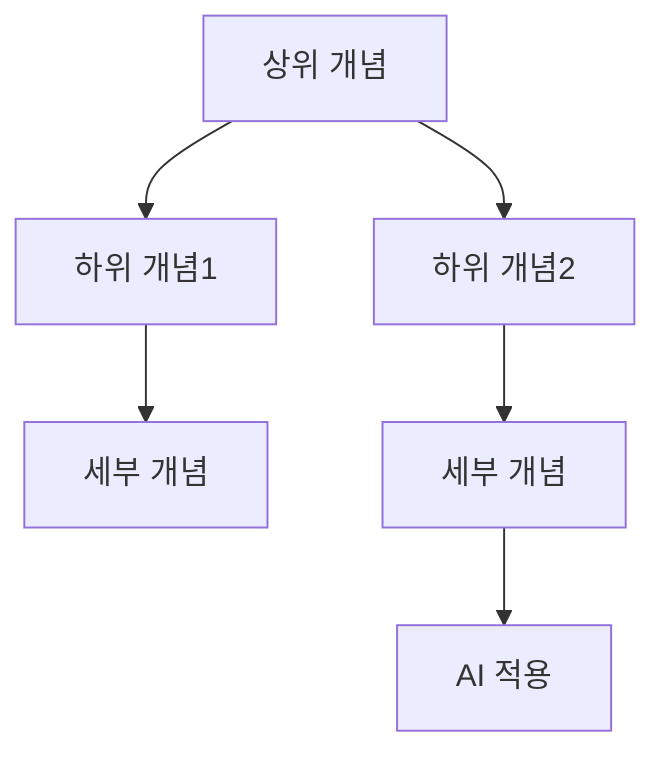

# XX. 과목명: 소단원 제목

## 🔗 선수 지식 (Prerequisites)
- [ ] **필수**: [이전 단원/개념] - 이해 완료?
- [ ] **권장**: [관련 배경지식]
- **관련 단원**: [XX장 제목](링크)

---

## 학습 목표
1. [이번 학습을 통해 달성하고자 하는 구체적인 목표를 '...설명할 수 있다', '...수행할 수 있다'와 같이 행동 동사 형태로 작성합니다.]
2. [두 번째 학습 목표를 서술합니다.]
3. [필요에 따라 학습 목표를 추가합니다.]

---

## 📝 요약 (Summary)
1.  **[핵심 개념 1]**: [핵심 개념 1에 대한 1-2 문장의 간결한 정의 및 요약]
2.  **[핵심 개념 2]**: [핵심 개념 2에 대한 1-2 문장의 간결한 정의 및 요약]
3.  **[핵심 개념 3]**: [핵심 개념 3에 대한 1-2 문장의 간결한 정의 및 요약]

---

## 📐 핵심 수식 (Key Formulas)

| 수식명 | 수식 | 의미 |
| :--- | :--- | :--- |
| **[수식명1]** | $수식$ | [이 수식이 의미하는 것] |
| **[수식명2]** | $수식$ | [이 수식이 의미하는 것] |

### 주요 정리/정의

**[정리/정의 이름]**
$$
\text{수식 블록}
$$
> **직관적 해석**: [이 수식을 일상 언어로 풀어서 설명]
> **AI 적용**: [이 수식이 머신러닝/딥러닝에서 어떻게 사용되는지]

---

## 📊 개념 시각화 (Visual Guide)

### 개념 관계도


### 핵심 도식
| 입력 | 연산 | 출력 | AI 적용 |
| :--- | :--- | :--- | :--- |
| [입력 데이터] | [수학적 연산] | [결과] | [ML/DL에서의 활용] |

---

## ✏️ 심화 학습 (Study Subject)

### 1. 가상 시나리오: "어떤 개념을, 언제 사용해야 할까?"
- **상황**: [학습한 수학 개념이 사용될 법한 구체적인 AI/ML 문제 상황을 제시합니다. 예: '고차원 이미지 데이터에서 핵심 특징만 추출해야 하는 상황']
- **문제**: [이 상황에서 발생하는 수학적 과제를 기술합니다. 예: '어떤 행렬 분해 방법을 사용해야 효율적으로 차원을 축소할 수 있을까?']
- **해결**: [학습한 수학 개념을 적용하여 문제를 해결하는 과정을 수식과 함께 설명합니다.]
- **AI 학습 포인트**: [이 시나리오를 바탕으로 AI 학습 도우미에게 던질 수 있는 심화 질문을 작성합니다. 예: "만약 데이터에 비선형 구조가 있다면, 선형 차원 축소 대신 어떤 접근법을 고려할 수 있을까?"]

### 2. 관점별 비교 및 오개념 분석
- **핵심 비교**: [서로 관련 있거나 혼동하기 쉬운 수학 개념을 비교표로 명확하게 대조합니다. 예: '고유값 분해 vs SVD', '확률 vs 가능도(likelihood)']
- **오개념 분석**: [학습자들이 흔히 잘못 이해하기 쉬운 수학적 오개념을 제시하고, 왜 그것이 잘못되었는지 수식과 함께 분석합니다.]
    - **오개념 1**: "[흔히 발생하는 오개념 문장]"
    - **분석**: [왜 이 생각이 잘못되었는지에 대한 논리적 설명과 올바른 개념 제시]
- **AI 학습 포인트**: [오개념과 관련하여 AI에게 검증을 요청하거나, 두 개념의 근본적인 차이를 다른 비유를 들어 설명해달라고 요청하는 프롬프트를 작성합니다.]

---

## ❓ 연습 문제 및 해설

### 📝 문제

**1. ⭐ [학습 내용을 확인하는 기초 객관식 문제](#prob-1)**
   > ① 선택지 1
   > ② 선택지 2
   > ③ 선택지 3
   > ④ 선택지 4

<br>

**2. ⭐⭐ [개념의 적용을 묻는 중급 문제 (보기 활용)](#prob-2)**
   > <보기>
   >
   > 가. 내용
   > 나. 내용

   > ① 가
   > ② 나
   > ③ 가, 나
   > ④ 해당 없음

<br>

**3. ⭐⭐⭐ [수식 풀이나 증명을 요구하는 심화 문제](#prob-3)**

---

### 🔑 정답

1. ①
2. ③
3. [풀이형 정답]

---

### 🧐 해설

<a id="prob-1"></a>
**1. ⭐ 문제 제목**
> **정답: ① 선택지 1**
> **해설**: [정답에 대한 상세한 해설을 작성합니다. 오답인 선택지가 왜 틀렸는지도 간략하게 설명하면 이해에 도움이 됩니다.]

<a id="prob-2"></a>
**2. ⭐⭐ 문제 제목**
> **정답: ③ 가, 나**
> **해설**: [<보기>의 각 항목이 왜 정답에 해당하거나 해당하지 않는지 설명합니다.]

<a id="prob-3"></a>
**3. ⭐⭐⭐ 문제 제목**
> **정답: [풀이형 정답]**
> **해설**: [풀이 과정을 수식과 함께 단계별로 설명합니다.]

---

## ✅ O/X 확인문제 (연습문항 개수의 2배 권장)

**1.** [핵심 개념에 대한 참/거짓을 묻는 문장](#ox-1) **(O / X)**
**2.** [혼동하기 쉬운 수학 개념에 대한 참/거짓을 묻는 문장](#ox-2) **(O / X)**
**3.** [수식의 성질이나 정리의 적용에 대한 참/거짓을 묻는 문장](#ox-3) **(O / X)**


> <a id="ox-1"></a>
> **1. 정답**: [O 또는 X]
> **해설**: [정답에 대한 간결하고 명확한 해설]

> <a id="ox-2"></a>
> **2. 정답**: [O 또는 X]
> **해설**: [정답에 대한 간결하고 명확한 해설]

> <a id="ox-3"></a>
> **3. 정답**: [O 또는 X]
> **해설**: [정답에 대한 간결하고 명확한 해설]

---

## 💻 코드로 확인하기 (Code Verification)

```python
import numpy as np

# [수학 개념] 코드 예시
# 예: 고유값 분해
A = np.array([[2, 1], [1, 3]])
eigenvalues, eigenvectors = np.linalg.eig(A)
print(f"고유값: {eigenvalues}")
print(f"고유벡터:\n{eigenvectors}")
```

> **실행 결과**: [실행 결과 붙여넣기]
> **수학적 해석**: [코드 결과가 수학적으로 무엇을 의미하는지 설명]

---

## 🤖 AI 연결고리 (Math → AI Application)

| 수학 개념 | AI/ML 적용 분야 | 구체적 사례 |
| :--- | :--- | :--- |
| [수학 개념1] | [적용 분야] | [사례] |
| [수학 개념2] | [적용 분야] | [사례] |

---

## 📖 심화 학습 예시 답안

#### 1. [주요 수학 개념]의 내부 동작 원리
[정의를 넘어, 이 수학 개념이 왜 성립하는지 직관적으로 단계별 설명합니다. 예: 'SVD가 행렬을 세 개의 행렬로 분해하는 기하학적 의미']

1.  **[단계 1]**: [설명]
2.  **[단계 2]**: [설명]

#### 2. [개념 A] vs [개념 B] 비교표
[혼동하기 쉬운 수학 개념을 특정 기준에 따라 비교합니다.]

| 구분 | [개념 A] | [개념 B] | 비고 |
| :--- | :--- | :--- | :--- |
| **정의** | [수식 포함 정의] | [수식 포함 정의] | |
| **적용 조건** | [언제 사용 가능한지] | [언제 사용 가능한지] | |
| **AI 활용** | [ML/DL에서의 사용처] | [ML/DL에서의 사용처] | |

#### 3. [개념]을 활용한 코드 작성법 (Best Practice)
[학습한 수학 개념을 NumPy/SciPy 등으로 구현하는 올바른 방법을 예시와 함께 제시합니다.]

- **Bad Practice (나쁜 예시)**
  ```python
  # [비효율적이거나 수학적으로 부정확한 구현]
  ```
- **Good Practice (좋은 예시)**
  ```python
  # [효율적이고 수학적으로 올바른 구현]
  ```
- **설명**: [왜 좋은 예시가 더 나은지에 대한 수학적/성능적 근거]

---

## 📚 핵심 용어집 (Glossary)

| 용어 (한) | 용어 (영) | 수식 표현 | 정의 |
| :--- | :--- | :--- | :--- |
| **[핵심 용어 1]** | [English term] | $수식$ | [명확한 정의와 간단한 예시] |
| **[핵심 용어 2]** | [English term] | $수식$ | [명확한 정의와 간단한 예시] |
| **[핵심 용어 3]** | [English term] | $수식$ | [명확한 정의와 간단한 예시] |

---

## 🤖 AI 학습 파트너를 위한 추가 자료

### 1. 개념 이해를 위한 심층 질문 프롬프트
> **프롬프트 예시**: "[X 개념]의 핵심 원리를 초등학생도 이해할 수 있도록 쉬운 비유를 들어 설명해 줘. 그리고 이 개념이 존재하지 않았을 때 어떤 문제들이 있었는지 역사적 배경도 함께 알려줘."

### 2. 문제 해결 능력 강화를 위한 시나리오 프롬프트
> **프롬프트 예시**: "당신은 [직무, 예: 데이터 사이언티스트]입니다. [가상 시나리오] 상황에서 [Y 개념]과 [Z 개념] 중 어떤 것을 사용하는 것이 더 적합할지, 각각의 장단점을 비교하고 최종 선택에 대한 기술적인 이유를 설명해 줘."

### 3. 수식 풀이 검증 프롬프트
> **프롬프트 예시**: "다음 수식 풀이 과정을 검증해 줘.
> $$[풀이 과정 수식]$$
> 1. 각 단계가 수학적으로 올바른지 확인하고, 틀린 부분이 있다면 지적해 줘.
> 2. 더 간결하거나 효율적인 풀이 방법이 있다면 제시해 줘."

---

## 🔄 복습 체크 (Spaced Repetition)
- [ ] 1일 후 복습 (날짜: )
- [ ] 3일 후 복습 (날짜: )
- [ ] 7일 후 복습 (날짜: )
- [ ] 14일 후 복습 (날짜: )
- [ ] 30일 후 복습 (날짜: )

### 복습 시 자가 평가
| 회차 | 날짜 | 이해도 (1-5) | 취약 부분 메모 |
| :--- | :--- | :--- | :--- |
| 1차 | | | |
| 2차 | | | |
| 3차 | | | |

---

## 📚 참고 자료 (References)

- 자료 제목 (예: 교재 - AI를위한수학의응용 해당 챕터)
- 자료 제목 (예: 3Blue1Brown - Essence of Linear Algebra)
- 자료 제목 (예: 관련 논문 또는 기술 블로그 포스트)