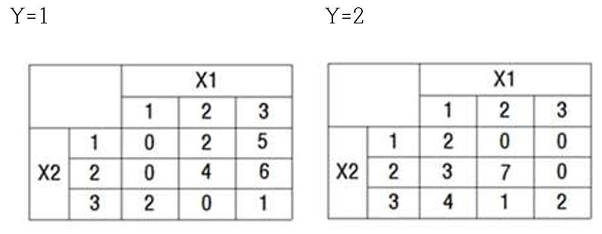

### 1. 최근 생성형 AI 발전에 따라 데이터 분석에 종사하는 전문가들의 역할에 대한 다양한 의견이 제시되고 있다. 
① 통계적 학습(Statistical learning) 또는 기계학습(Machine learning) 방법을 이용하는 데이터마이닝 전문가
의 입장에서 생성형 AI의 발전이 향후 데이터마이닝 영역에 미치게 될 영향에 대해 논하고 ② AI 시대 데이터 
분석 전문가의 생존 전략에 대해 자신의 견해를 기술하시오. (8점)
### 2. 목표변수가  범주형  변수인  형태의  데이터에  선형모형을  적합하고자  한다.  R에  내장되어  있는  iris데이터를 
이용하여  다음을  실행하시오.  ①  iris  데이터의  Species변수  값이  setosa인  50개  관측치와  virginica인  50개 
관측치를 합하여 100개의 관측치로 구성된 새로운 데이터세트 iris2를 생성하시오. (setosa를 1로, virginica를 
0으로 바꾸어 생성) ② iris2 데이터에 Species가 종속변수이고 나머지 모든 수치형 변수가 독립변수인 다중선
형회귀모형을 적합하는 코드를 작성하고 실행하시오(코드와 주석문은 텍스트로 기술). R 실행 결과를 캡쳐하여 
넣고 이를 해석하고 특징을 기술하시오. 이 데이터에 로지스틱 회귀모형을 적합하였을 때, R 실행 결과를 캡쳐
하여 넣고 이를 해석하고 특징을 기술하시오. ③ 위 두 가지 모형의 차이점을 밝히시오. 또한 분석 결과를 바탕
으로 어느 모형이 타당한지 쓰고 그 이유를 기술하시오. (8점)
### 3. 입력변수와 목표변수가 모두 범주형인 어떤 데이터의 두 입력 변수 X1과 X2는 1, 2, 3 등 세 가지 값을 갖
고, 목표변수는 Y=1, Y=2의 2개의 범주를 갖는다고 할 때, 각 집단별로 X1과 X2에 대하여 분할표를 아래와 
같이 생성하였다. 물음에 답하시오. (8점) 

① 분할표를 보고 이 데이터의 원형을 유추하여 생성하시오. 단, 데이터 세트의 첫째 줄에는 변수명 X1, X2, 
Y를 명시하시오. (2점)
② 지니지수를 이용하여 최초 분할 시 최적의 분리점을 찾으시오. (2점)
③ 뿌리노드가 한번 분할된 분류의사결정나무를 생성하고, 두 자식노드에서 관찰치들의 집단별 빈도를 밝히시오. (2점)
 ④ 위에서 생성된 분류의사결정나무(한 번만 분할)의 불순도 감소분을 계산하시오. (2점)
### 4. 배깅, 부스팅, 랜덤포레스트에 관하여 다음에 답하시오. (6점) (교재에 명시된 알고리즘(p.116∼122) 참조)
① 각 알고리즘의 수식을 기술하시오. (2점)
② 각 알고리즘에 명시되어 있는 수식을 비교하여 타 알고리즘과 구별되는 특징적인 부분을 지목하여 설명하시오. (2점)
③ 이를 바탕으로 극단값에 더 예민하게 반응할 수 있는 앙상블 방법이 무엇인지 쓰고, 그 근거를 밝히시오. (2점)
[작성 시 지시사항] : 작성서식, 분량, 지시사항 등 기술
### ※유의사항
1.과제는문제를제외하고답안만기술하십시오.
2.문제1번에대한답안은아래아한글기준글자크기11pt,줄간격160%로,MSword기준글자크기11pt,
줄간격1.5로하여공백을제외하고1,300자이상으로작성하십시오.표절로판정되지않도록조사내용및
자신의주장을독창적으로각색,기술하십시오.
*참고문헌을표기하여도문헌이나인터넷,또는기타자료상의내용을그대로옮기는경우에는유사도에근거
하여표절로판정되니유의하시기바랍니다.
3.프로그램코드 및 주석은 텍스트로 제시하고 실행 결과는 화면 캡쳐를 통해그림으로 붙여넣으십시오. 반드시
결과에대한설명을함께기술하셔야합니다.