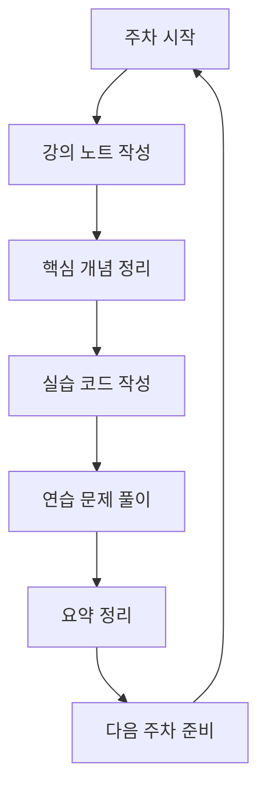

# 교과목별 학습 컨텐츠 📚

## 📋 개요

방송통신대학교 컴퓨터과학과의 주요 교과목들을 체계적으로 정리한 학습 아카이브입니다.

### 🎯 목표

1. **체계적인 학습** - 주차별 강의 내용의 구조화된 정리
2. **실무 연계** - 이론과 실습의 균형 잡힌 학습
3. **지식 연결** - 과목 간 연관성 매핑 및 통합적 이해
4. **지속적 업데이트** - 최신 기술 동향 반영

---

## 📚 교과목 목록

### 🔢 1학년 과목

#### 컴퓨터과학개론
- **과목 코드**: COMP1001
- **학점**: 3학점
- **개요**: 컴퓨터과학의 전반적인 이해와 기초 개념 학습
- **주요 내용**: 
  - 컴퓨터 시스템 구조
  - 프로그래밍 기초
  - 알고리즘과 자료구조 입문
  - 소프트웨어 공학 개요
- **진행률**: [ ] 0% (0/15주)
- **상태**: 📝 준비 중

### 🔢 2학년 과목

#### 데이터구조
- **과목 코드**: COMP2001
- **학점**: 3학점
- **개요**: 효율적인 데이터 저장과 처리를 위한 자료구조 학습
- **주요 내용**:
  - 배열과 연결리스트
  - 스택과 큐
  - 트리와 그래프
  - 해시 테이블
  - 정렬과 검색 알고리즘
- **선수 과목**: 컴퓨터과학개론
- **진행률**: [ ] 0% (0/15주)
- **상태**: 📝 준비 중

#### 알고리즘
- **과목 코드**: COMP2002  
- **학점**: 3학점
- **개요**: 문제 해결을 위한 효율적인 알고리즘 설계와 분석
- **주요 내용**:
  - 알고리즘 복잡도 분석
  - 분할 정복
  - 동적 프로그래밍
  - 그리디 알고리즘
  - 그래프 알고리즘
- **선수 과목**: 데이터구조
- **진행률**: [ ] 0% (0/15주)
- **상태**: 📝 준비 중

### 🔢 3학년 과목

#### 운영체제
- **과목 코드**: COMP3001
- **학점**: 3학점
- **개요**: 컴퓨터 시스템의 핵심인 운영체제의 원리와 구현
- **주요 내용**:
  - 프로세스와 스레드
  - 메모리 관리
  - 파일 시스템
  - 입출력 시스템
  - 동기화와 교착상태
- **선수 과목**: 컴퓨터과학개론
- **진행률**: [ ] 0% (0/15주)
- **상태**: 📝 준비 중

---

## 📖 학습 방법론

### 🔄 주차별 학습 프로세스



#### 1단계: 강의 노트 작성 📝
- 강의 영상 시청하며 실시간 메모
- 이해하기 어려운 부분 별도 표시
- 관련 예제와 코드 스니펫 포함

#### 2단계: 핵심 개념 정리 🎯
- 주요 개념의 정의와 특징
- 개념 간의 관계 매핑
- 실무 적용 사례 조사

#### 3단계: 실습 코드 작성 💻
- 강의 예제 직접 구현
- 다양한 변형 문제 해결
- 코드 리뷰와 최적화

#### 4단계: 연습 문제 풀이 🧪
- 교재 문제 해결
- 온라인 저지 문제 풀이
- 동료와 토론 및 리뷰

#### 5단계: 요약 정리 📋
- 주차별 핵심 내용 요약
- 다음 주차와의 연결점 파악
- 개인적인 학습 소감 기록

---

## 📁 폴더 구조

각 교과목은 다음과 같은 표준 구조를 따릅니다:

```
과목명/
├── README.md                      # 과목 개요 및 가이드
├── 📝 lecture-notes/             # 주차별 강의 노트
│   ├── week-01.md                # 1주차: 과목 소개
│   ├── week-02.md                # 2주차: 기초 개념
│   ├── week-03.md                # 3주차: 심화 학습
│   └── ...                       # 15주차까지
├── 📋 assignments/               # 과제 및 프로젝트
│   ├── assignment-01/            # 1차 과제
│   ├── assignment-02/            # 2차 과제
│   └── final-project/            # 기말 프로젝트
├── 💡 key-concepts/             # 핵심 개념 정리
│   ├── fundamental-concepts.md   # 기본 개념
│   ├── advanced-topics.md        # 심화 주제
│   └── terminology.md            # 용어 정리
├── 🧪 practice/                 # 연습 문제 및 해답
│   ├── exercises/                # 연습 문제
│   ├── solutions/                # 해답 및 풀이
│   └── coding-problems/          # 코딩 문제
├── 🔗 references/               # 참고 자료
│   ├── books.md                  # 추천 도서
│   ├── papers.md                 # 관련 논문
│   ├── online-resources.md       # 온라인 자료
│   └── tools.md                  # 도구 및 소프트웨어
└── 📊 summary/                  # 기말 요약 정리
    ├── final-summary.md          # 전체 요약
    ├── exam-preparation.md       # 시험 준비
    └── project-showcase.md       # 프로젝트 모음
```

---

## 🎯 학습 목표 설정

### 단기 목표 (주간)
- [ ] 주차별 강의 노트 완성
- [ ] 핵심 개념 마인드맵 작성
- [ ] 실습 코드 구현 및 테스트
- [ ] 연습 문제 풀이 (최소 5문제)

### 중기 목표 (월간)
- [ ] 월별 학습 진도 체크
- [ ] 과목 간 연관성 분석
- [ ] 실무 프로젝트 기획
- [ ] 동료 학습자와 스터디 그룹 운영

### 장기 목표 (학기)
- [ ] 전체 교과과정 완주
- [ ] 종합 포트폴리오 구축
- [ ] 오픈소스 프로젝트 기여
- [ ] 기술 블로그 운영

---

## 🤝 협업 가이드라인

### 📤 기여 방법

#### 새로운 내용 추가
1. 해당 과목의 폴더로 이동
2. 적절한 하위 폴더에 파일 생성
3. 표준 템플릿 사용
4. 커밋 메시지 규칙 준수

#### 오류 수정
1. Issues에 문제점 보고
2. 수정 사항 구현
3. Pull Request 생성
4. 코드 리뷰 진행

#### 토론 및 질문
1. Discussions 활용
2. 과목별 카테고리 분류
3. 건설적인 피드백 제공

---

## 📊 진도 관리

### 전체 진행 상황

| 과목명 | 진행률 | 강의노트 | 과제 | 실습 | 상태 |
|--------|--------|----------|------|------|------|
| 컴퓨터과학개론 | 0% | 0/15 | 0/3 | 0/10 | 🚀 준비중 |
| 데이터구조 | 0% | 0/15 | 0/4 | 0/15 | 🚀 준비중 |
| 알고리즘 | 0% | 0/15 | 0/4 | 0/20 | 🚀 준비중 |
| 운영체제 | 0% | 0/15 | 0/3 | 0/12 | 🚀 준비중 |

### 주간 목표

**이번 주 (Week 1)**
- [ ] 컴퓨터과학개론 1주차 강의 노트 작성
- [ ] 개발 환경 설정
- [ ] Git 저장소 초기 설정
- [ ] 학습 계획 수립

**다음 주 (Week 2)**
- [ ] 컴퓨터과학개론 2주차 학습
- [ ] 첫 번째 실습 과제 수행
- [ ] 학습 방법론 개선

---

## 🔧 도구 및 환경

### 필수 도구

#### 개발 환경
- **코드 에디터**: VS Code, Sublime Text, Atom
- **컴파일러**: GCC, Python, Java JDK
- **버전 관리**: Git, GitHub
- **터미널**: Windows Terminal, iTerm2

#### 학습 도구
- **노트 앱**: Obsidian, Notion, OneNote
- **다이어그램**: Draw.io, Lucidchart, Mermaid
- **수식 편집**: LaTeX, MathJax
- **스크린샷**: Lightshot, Snagit

#### 온라인 플랫폼
- **코딩 실습**: LeetCode, HackerRank, Programmers
- **온라인 강의**: Coursera, edX, Khan Academy
- **기술 블로그**: Medium, Dev.to, Velog

---

## 📈 성과 측정

### 학습 지표

#### 정량적 지표
- **완성도**: 강의 노트 작성률, 과제 제출률
- **활동량**: 커밋 수, 문제 해결 개수
- **참여도**: 토론 참여, 코드 리뷰 횟수

#### 정성적 지표
- **이해도**: 개념 설명 능력, 응용 문제 해결
- **창의성**: 새로운 아이디어, 독창적 해결책
- **협업**: 동료와의 소통, 지식 공유

### 피드백 시스템

#### 자기 평가
- 주간 학습 회고
- 개념 이해도 체크리스트
- 목표 달성 평가

#### 동료 평가
- 코드 리뷰
- 스터디 그룹 피드백
- 프로젝트 협업 평가

---

## 🚀 시작하기

### 첫 번째 학습 시작

1. **과목 선택**: 컴퓨터과학개론부터 시작 권장
2. **환경 설정**: 필요한 도구 설치 및 설정
3. **계획 수립**: 개인 학습 일정 작성
4. **첫 노트 작성**: `week-01.md` 파일 생성

### 학습 루틴 구축

```bash
# 일일 학습 루틴
1. 강의 영상 시청 (30분)
2. 노트 정리 (20분)
3. 코드 실습 (40분)
4. 복습 및 정리 (10분)

# 주간 학습 루틴
1. 주차별 요약 작성
2. 연습 문제 풀이
3. 동료와 토론
4. 다음 주 계획 수립
```

---

## 📞 지원 및 문의

- **GitHub Issues**: 기술적 문제 및 버그 리포트
- **Discussions**: 학습 관련 질문 및 토론
- **Wiki**: 상세한 가이드 및 FAQ
- **Email**: [your-email@example.com]

---

**마지막 업데이트**: 2024년 현재  
**총 교과목 수**: 4개  
**예상 학습 기간**: 2년  
**라이선스**: MIT 